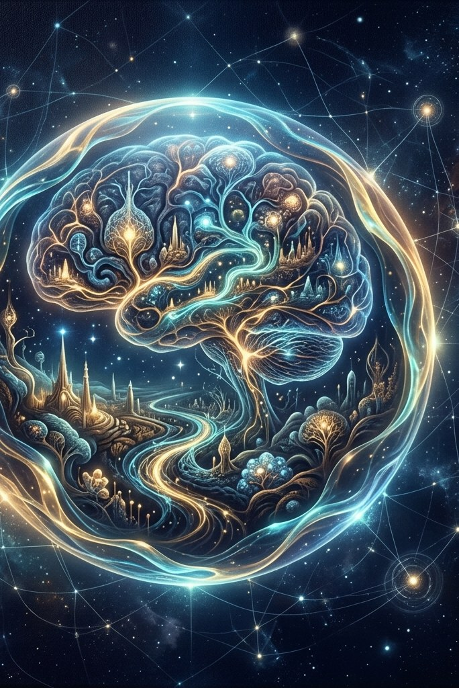{.cover}

# El Horizonte Interior

### Edición ilustrada

*Un experimento de pensamiento: qué pasaría si la conciencia tuviera la estructura de un microagujero negro de Hawking.*

**Iñigo Barrera**

---

# I · OBERTURA

## El experimento explicado a mi madre

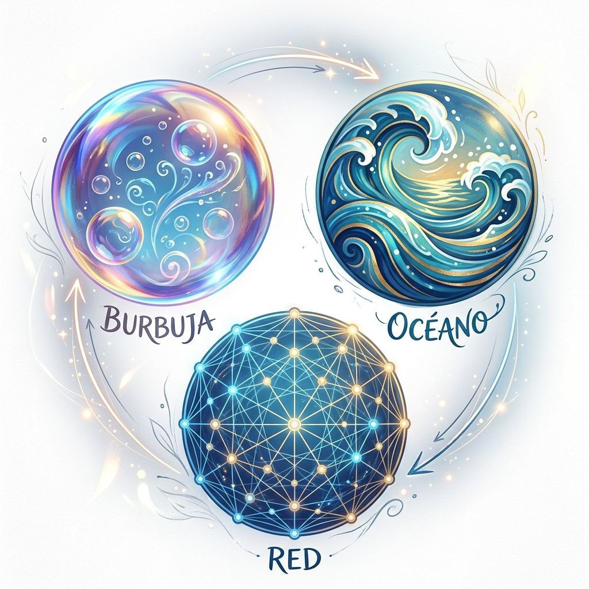

*(O: cómo leer este libro sin haber estudiado física)*

Mi madre tiene ochenta años. Lee novelas, no artículos de *Nature*. Cuando le expliqué este libro, me dijo: «Hijo, suena interesante, pero no entiendo nada de agujeros negros.»

Este capítulo es para ella. Y para ti, si tampoco entiendes nada de agujeros negros. No necesitas entender física para entender este libro. Solo necesitas tres ideas, y las tres las conoces ya, aunque no sepas que se llaman de otra manera.

**La burbuja.** Has soplado burbujas de jabón. ¿Recuerdas el instante exacto en que una se cierra? El jabón se estira, se curva, y de repente hay una esfera completa: un dentro y un fuera que antes no existían. Eso es un horizonte. No una línea en el mapa — una frontera viva que separa lo interior de lo exterior. La burbuja no es el jabón: es la organización. Cuando una estrella colapsa sobre sí misma, crea algo parecido — una frontera donde el espacio se dobla sobre sí mismo, un punto donde la luz deja de escapar, no porque haya una pared, sino porque la geometría misma se curva. Este libro no dice que haya un agujero negro dentro de tu cabeza. Dice algo más curioso: que la conciencia podría tener la misma geometría que un horizonte. Una burbuja que no es de jabón, sino de información.

**El océano.** No está vacío cuando no hay olas — está lleno de agua en reposo. Las olas no llegan de lejos: son el agua local moviéndose de cierta manera. Cuando una rompe en la playa, el agua no ha viajado desde ningún sitio: ha estado ahí todo el tiempo, cambiando de forma. En física, el vacío tampoco está vacío: está lleno de un campo del que emergen las partículas como las olas emergen del agua. Este libro llama a ese campo el **reservorio**: no un lugar, una condición. El taoísmo lo llama Hun Dun, el caos que es plenitud antes de la distinción. El Vedanta lo llama Brahman. No son pruebas de la física — son vocabularios distintos intuyendo la misma estructura: que lo que parece separado emerge de algo que no lo está en absoluto.

**La red.** Una red de pesca no son los nudos: es la forma que toman al conectarse. Córtale un hilo y sigue siendo red, aunque distinta. Córtale demasiados y deja de serlo. La conciencia, según la Teoría de la Información Integrada, funciona así: no vive en ninguna neurona, sino en cómo se conectan. Eso es lo que este libro llama **Φ** (Phi): cuánto es un sistema más que la suma de sus partes. Un termostato tiene Φ casi nulo. Un cerebro despierto, muy alto. Bajo anestesia general, cae en picado.

Burbuja, océano, red. Si en algún momento te pierdes, vuelve aquí: no son un resumen que sustituye al resto del libro, sino las tres ideas que todo lo demás se limita a desarrollar. Vuelve a ellas como a un ancla, no como a un atajo.

*Este libro nace de una sospecha sencilla: que la ciencia más avanzada del cerebro, la astrofísica que estudia el fin de las estrellas, y la sabiduría taoísta antigua describen una frontera muy parecida. Escribirlo ha sido mi manera de ver qué ocurre si tomamos en serio esa coincidencia.*

---

## Prólogo: el experimento

Hay libros que pretenden descubrir la verdad. Este no.

Este libro es un juego con reglas. La regla principal: *supongamos que la conciencia tiene la estructura matemática de un microagujero negro de Hawking*, y veamos adónde nos lleva. No porque crea que sea cierto — porque me pareció curioso que tres cosas sin relación aparente entre sí —la Teoría de Información Integrada, la termodinámica de agujeros negros, y el Tao Te Ching— apunten hacia la misma geometría cuando se las lleva al límite.

No soy físico, ni neurólogo, ni filósofo profesional. Soy alguien que leyó a Penrose y a Hawking, a Laozi y a Zhuangzi, y vio que ambos describían algo parecido: una frontera que no es una cosa sino un límite; un interior que no puede comunicarse con el exterior sin destruirse; un vacío que no está vacío. La pregunta que me hice fue: ¿y si no es parecido? ¿Y si es la misma estructura vista desde escalas distintas?

No lo sé. Este libro no lo demuestra. Lo que hace es jugar consistentemente con la hipótesis y ver qué pasa cuando la cruzas con la psicología, la medicina, el duelo, la adicción, el amor. A veces la hipótesis ilumina. A veces se rompe. Cuando se rompe, lo decimos.

Tampoco lo escribí solo, al menos no del todo: buena parte de este libro nació en conversación con una inteligencia artificial, pensando en voz alta con ella hasta encontrar la formulación que buscaba. Qué se le puede atribuir a una autoría compartida así, y qué no, es una pregunta que este libro se toma en serio más adelante —no una nota al margen que prefiero enterrar aquí.

Todo es provisional. Todo es juego. Pero hay juegos que, por el mero hecho de jugarlos con seriedad, enseñan algo que no se sabía antes de empezar.

---

## La costumbre del agua

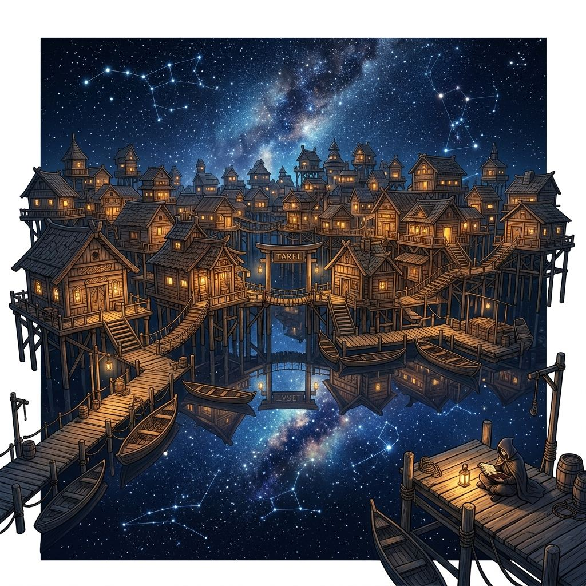

*(Cuento de Tarel)*

El agua empezó a retirarse sin aviso.

No hubo sequía. En Tarel, hablar siempre fue tarde: las cosas ocurrían primero, luego se quedaban, y con el tiempo se volvían historia.

La ciudad flotaba sobre una laguna salobre tan antigua que nadie recordaba un principio. Casas de madera, cuerdas gastadas, uniones hechas con paciencia. Los niños aprendían el vaivén antes que el nombre de las calles; sabían regresar antes de saber irse. Volver a casa era un verbo: una acción repetida, una pequeña costumbre del cuerpo. El agua no era un fondo ni un paisaje. Era la costumbre misma.

Por eso el cambio no llegó como falta, sino como extrañeza. El remo tocó fondo donde antes había metro. Las barcas amanecieron torcidas, como si hubieran dudado toda la noche.

Yo era archivista. Miraba despacio lo que aún no pedía nombre.

—Antes no estaba —dijo Kema, señalando el borde oscuro bajo su casa—. El agua lo cubría. El agua lo sabe.
—¿Qué sabe?
—Cuándo soltar... y cuándo quedarse.

El agua se retiró sin prisa. No arrancó: se despidió. Era un huésped que recoge sus cosas mientras duermes y deja la habitación lista para alguien que no llegará.

Meses después llegó la delegación del Continente. Midieron la laguna en números. Dijeron que el nivel bajaría más. No dijeron durante cuánto tiempo ni a costa de qué. Alguien preguntó si el agua volvería. Dijeron que no lo sabían, con la misma voz con que se dice que no lloverá.

—Habrá que elegir quedarse o irse.

Tarel se dividió sin romperse. Algunas familias desmontaron sus casas con una eficiencia que daba miedo. Otros se quedaron y aprendieron el habla del barro: dónde pisar sin hundirse, cuándo esperar, qué sonido anuncia quiebre y cuál solo cansancio.

El archivo cambió. Ya no guardaba solo historias del agua, sino de lo que quedaba cuando el agua se iba.

Encontré un texto sin firma, casi borrado por la sal: *«El agua nos sostiene mientras recordemos que también la sostenemos.»*

El último día metí las manos en la laguna que quedaba. Estaba tibia, turbia, salada. La dejé correr entre los dedos. No me despedí.

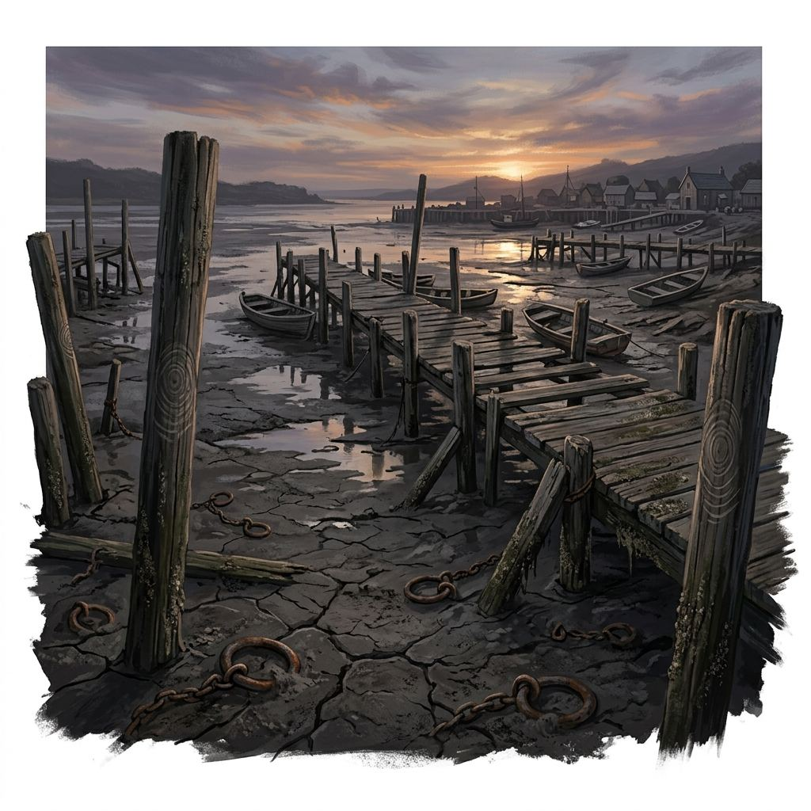

El agua de Tarel regresó de noche. Sin anuncio. Sin señales. Por la mañana los habitantes encontraron la orilla donde siempre había estado. El mismo lodo. Las mismas piedras. La misma línea de sal en los muros bajos.

Nadie supo decir si el agua había traído algo consigo. Nadie supo decir si había dejado algo atrás.

---

## La trampa del interruptor

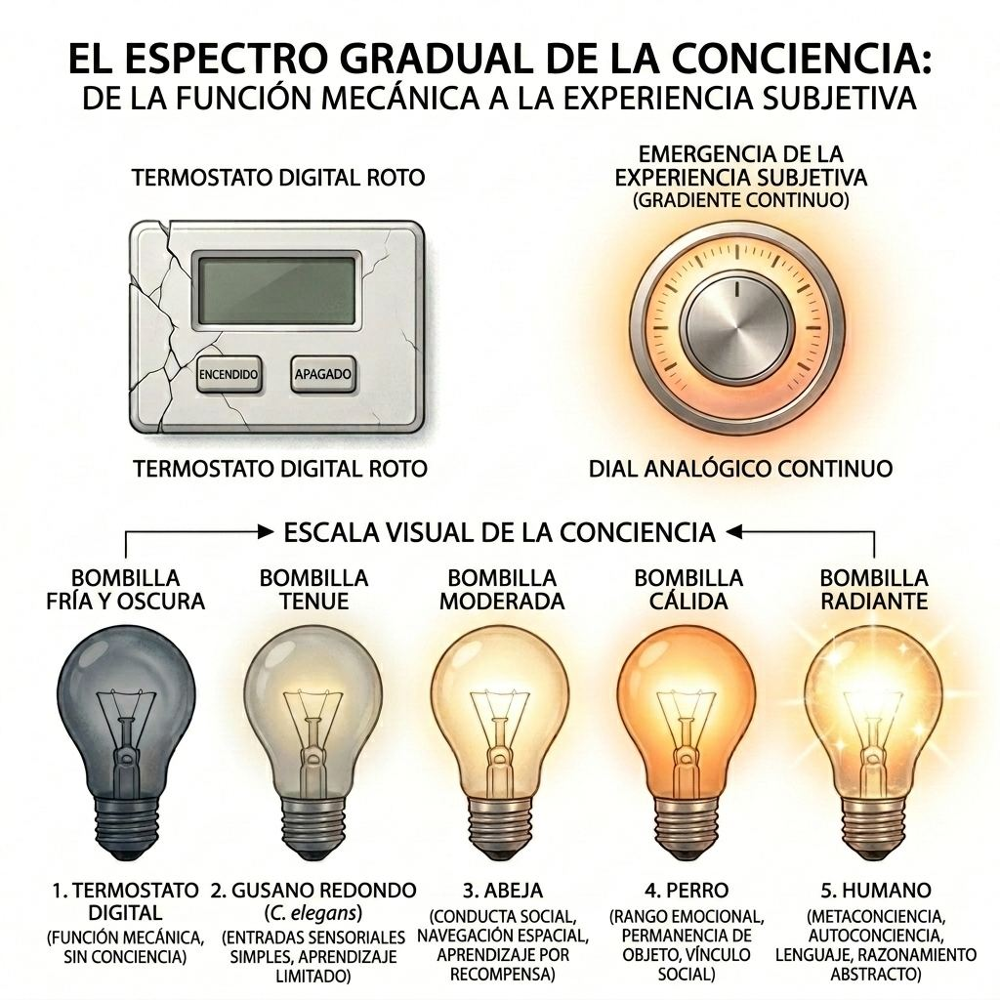

Txiki tenía una manera particular de mirar: ni la mirada errática del animal que escanea amenazas, ni la vacía del que procesa estímulos sin que haya nadie detrás. Era algo más quieto — una atención sostenida que reconocía, que se quedaba, que *estaba*.

Era un perro mestizo, pelo corto color canela, una mancha blanca en el pecho que parecía dibujada con descuido. No tenía pedigrí ni entrenamiento especial. Pero cuando te miraba, había algo que no podías explicar con circuitos de reflejo.

Esa sensación —difícil de verificar, fácil de descartar como sentimentalismo de dueño de perro— es exactamente el problema que la ciencia de la conciencia lleva más de un siglo intentando convertir en pregunta seria en vez de en anécdota.

Durante décadas la ciencia llamó a esto proyección. Descartes escribió que los animales eran *bêtes-machines* — bestias-máquinas, complejas pero vacías. La conciencia era interruptor: encendido o apagado, y el interruptor estaba reservado para los humanos. Pero las máquinas no miran así. Las máquinas procesan. Txiki parecía *presenciar*.

La pregunta «¿tiene conciencia este ser?» es una trampa lingüística: asume que la conciencia es binaria, un interruptor de pared. William James escribió en 1890 que la conciencia no es una cosa sino un proceso, y que ese proceso admite gradaciones. Darwin habría encontrado absurda la idea de que la experiencia subjetiva apareciera de repente, sin precedentes, en una sola especie: la evolución no trabaja con saltos binarios, trabaja con pendientes suaves.

Un termostato procesa información — entrada, procesamiento, salida — pero no hay nadie que procese. Partirlo en dos no produce dos termostatos con la mitad de experiencia: produce dos piezas de plástico y metal. El gusano *C. elegans*, con 302 neuronas mapeadas una a una, busca comida, huye del calor, evita toxinas: probablemente hay algo ahí, muy pequeño, tan distinto de lo nuestro que no tenemos palabras para describirlo. El pulpo, con 500 millones de neuronas repartidas en los tentáculos —dos tercios de su procesamiento ocurre fuera del cerebro—, desafía toda intuición sobre dónde vive una mente: quizás su experiencia no es unitaria como la nuestra, sino algo más parecido a un coro que a un solista. Y Txiki comparte con los humanos los sistemas neurológicos básicos de la emoción: amígdala, hipocampo, sistema límbico completo. Su cerebro responde al olor de su humano con la misma activación que un humano muestra ante alguien querido. No es parecido: es el mismo circuito.

> **En física esto se llama:** Phi (Φ) como continuo, no como interruptor — transiciones de fase graduales.
> **En la vida diaria es como:** la transición del sueño a la vigilia: no hay un instante exacto en que «despiertas», sino una pendiente de claridad que sube sin que notes cada escalón.

Hay un experimento que hacemos millones de veces al día sin pensar en sus implicaciones: la anestesia general. Antes, el paciente está despierto, con memoria, con miedo. Después, algo cambia — no porque las neuronas dejen de disparar, sino porque la integración se deshace: las regiones del cerebro dejan de hablarse entre sí. La conciencia no se apaga como un interruptor: se desintegra como un castillo de naipes al que le quitas las cartas del centro. Y cuando se revierte la anestesia, el castillo se reconstruye. El «alguien» regresa.

Giulio Tononi formalizó esta idea con Φ: la información que un sistema genera como un todo, por encima de lo que generarían sus partes por separado. Una cámara de fotos divide sus píxeles en dos mitades sin perder nada, porque nunca hubo integración. Un cerebro dividido quirúrgicamente —los pacientes con cuerpo calloso seccionado— no produce dos personas con media experiencia cada una: produce, en ciertas condiciones, dos sistemas casi independientes con su propio punto de vista, habitando el mismo cuerpo. La Global Workspace Theory de Baars y Dehaene propone algo complementario: la conciencia emerge cuando la información se hace globalmente disponible, cuando deja de ser privada y se convierte en pública para el resto del cerebro. Ninguna de las dos teorías está demostrada. Ambas sugieren lo mismo: la conciencia no es interruptor. Es dial.

*Txiki no era una máquina que te miraba. Era alguien que estaba ahí. No hace falta resolver cuánto más, ni de qué tipo exacto, para tomarse en serio esa diferencia.*

---

## El ladrón de interiores

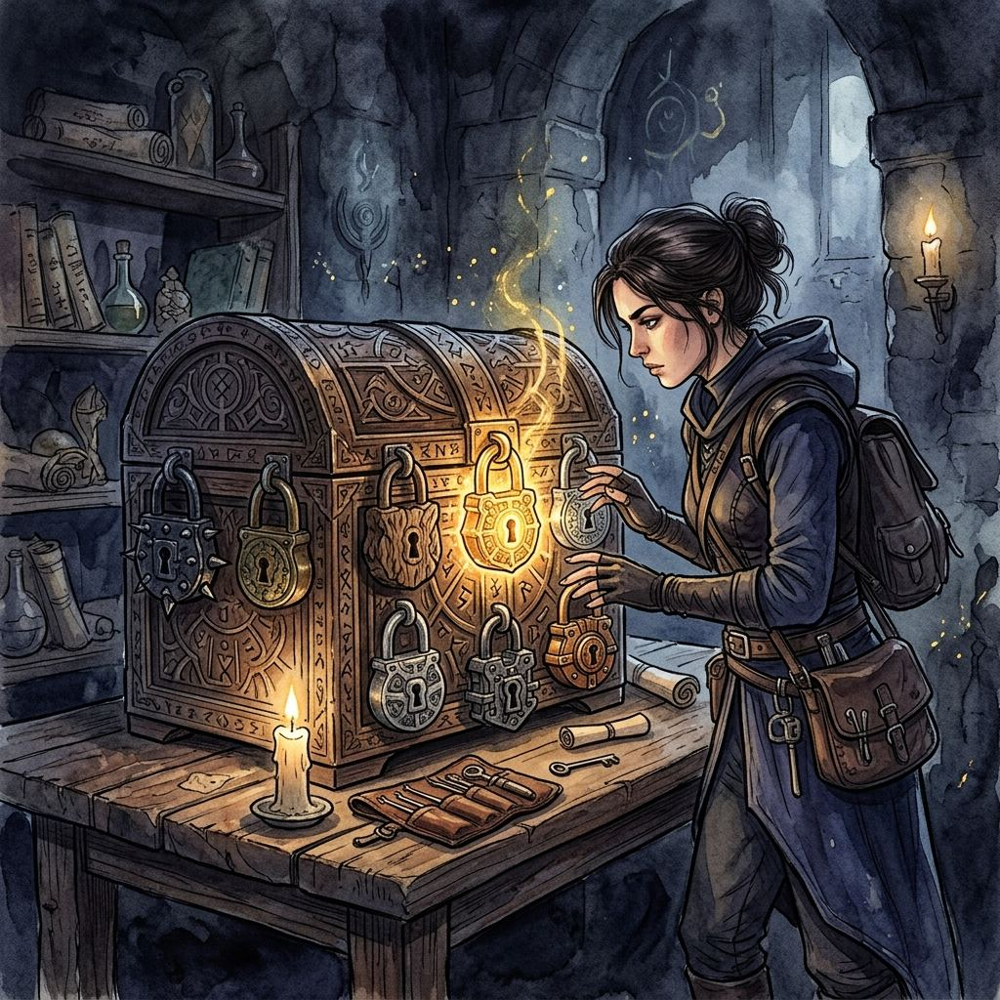

*(Cuento)*

Se decía de él que podía abrir cualquier cosa. No era jactancia ajena, era simple constatación. Puertas selladas generaciones atrás, cofres cuyos dueños habían muerto sin abrirlos: todo cedía tarde o temprano a sus manos, que sabían escuchar lo que un mecanismo quiere antes de que el propio mecanismo lo sepa. No robaba por codicia. Robaba porque no soportaba que algo estuviera cerrado y él estuviera afuera.

Le hablaron de una caja al final de una casa al final de una ciudad al final de un camino, con siete cerraduras, cada una distinta, de manera que ninguna se abría con lo que abría la anterior. Decidió ir.

La primera era de fuerza: un mecanismo que cede cuando se le aplica más presión de la que fue diseñado para aguantar. La estudió una noche, aplicó su palanca, y se rindió con un chasquido. Sonrió. Si todas eran así, sería una noche corta. No todas eran así.

La segunda era de paciencia: solo se abría si se giraba tan despacio que cualquier prisa lo trababa desde el principio. Pasó tres días girando una rueda un grado por hora, deshaciendo con un temblor el trabajo de una tarde. Al tercer día sus manos habían aprendido a no querer llegar. Se abrió cuando él dejó de tener prisa por abrirla.

La tercera era de silencio: se trababa con cualquier sonido, el roce de una herramienta, el propio aliento, el latido si se escuchaba demasiado. Aprendió a respirar sin que se oyera la respiración. Y en ese silencio oyó algo que su oficio siempre había tapado: que las manos le temblaban aunque él no temblara, porque había un cansancio viejo debajo de su destreza.

La cuarta era de renuncia: sostenía dos pestillos que había que abrir a la vez, con solo dos manos, y para alcanzar el segundo tenía que soltar la herramienta de su padre, la que lo había hecho ladrón, dejarla caer a un pozo sin fondo aparente. La sostuvo mucho rato. Finalmente la soltó. Oyó cómo caía, y cómo no tocaba fondo. Entonces probó, y la cerradura se abrió con la mano que ahora tenía libre.

La quinta era de memoria: pedía el nombre de alguien a quien el ladrón hubiera amado y hubiera dejado atrás por su oficio. Eligió el que más le pesaba. Oírse decirlo en voz alta, en aquella casa vacía, fue peor que soltar la herramienta, porque la herramienta caía y ya está, y el nombre, sin embargo, volvía.

La sexta no tenía ojo. La buscó por todas partes: ninguna ranura, ninguna rueda, nada que sus manos supieran interrogar. Un día entero pasando los dedos por una superficie lisa que no daba ninguna pista de por dónde entrar. Poco a poco entendió que no se abría desde fuera. Que la única manera de derrotarla era dejar de intentar abrirla: aceptar que había una parte de aquella caja a la que no se accedía, y atravesarla sin forzar, confiando. Retiró las manos y se quedó quieto. La cerradura no cedió a nada que él hiciera. Cedió a que dejara de intentar hacer algo.

La séptima era distinta, y no por grado sino por naturaleza: si la sexta se abrió cuando él renunció a actuar, la séptima le pedía lo contrario —no retirarse, sino ofrecerse. Se abría con la mano desnuda. No pedía herramienta, ni paciencia, ni nada de lo requerido antes. Pedía que él pusiera la palma abierta sobre ella y esperara, no vacío como ante la sexta, sino presente, entregando algo de sí en vez de renunciando a tomar algo de ella. Sintió bajo la piel algo que latía como un ser vivo. Y por un instante tuvo la certeza de que al otro lado de aquella última lámina no había un objeto —que lo que fuera que la casa guardaba tras siete cerraduras no era una cosa que pudiera sacarse y llevarse.

Apretó la palma. La cerradura cedió. Y la caja desapareció.

En el instante exacto en que la última barrera se rendía, la caja entera —todo, dentro y fuera— dejó de estar, como si nunca hubiese estado. No quedó hueco en el aire ni marca en la mesa. No quedó nada que robar, porque ya no había un dentro del que sacarlo.

El ladrón se quedó con la palma abierta sobre el sitio donde había estado la caja, muy quieto, como delante de la sexta cerradura, y entendió, sin palabras, por qué había desaparecido. Entendió que el tesoro no estaba dentro de la caja, sino que era el adentro. Y que al abrirlo del todo, lo había hecho desaparecer.

Bajó la mano y salió de la casa al final de la ciudad al final del camino con las manos vacías, que en algunas ciudades es la única manera honesta de volver de ciertos sitios. No había robado nada, pero había entendido algo, que es lo contrario de robar: te quedas con algo que no puedes enseñarle a nadie.

# II · EL HORIZONTE

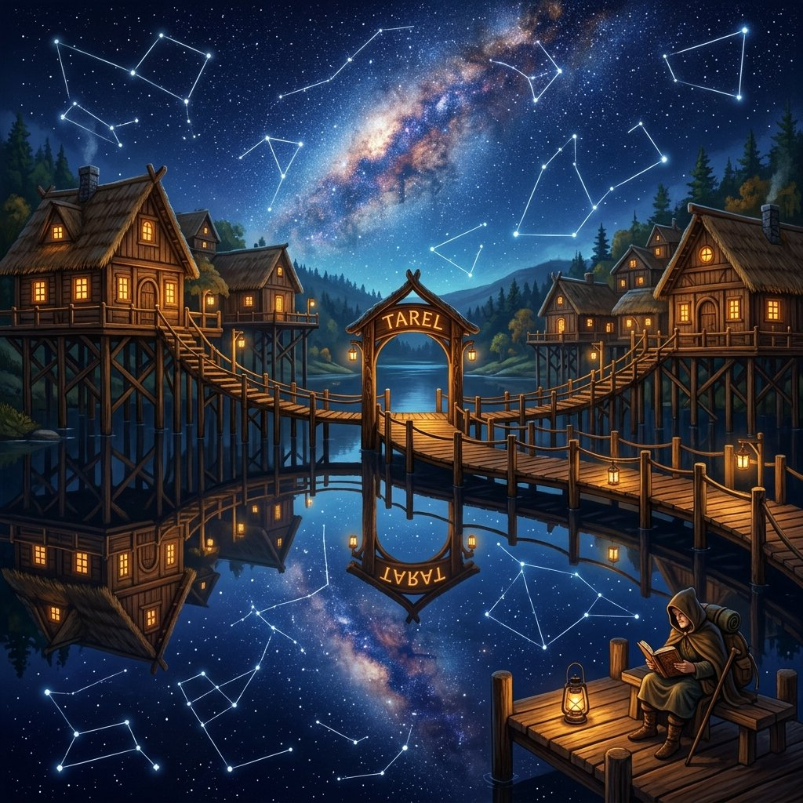

---

## Agujeros negros para no físicos

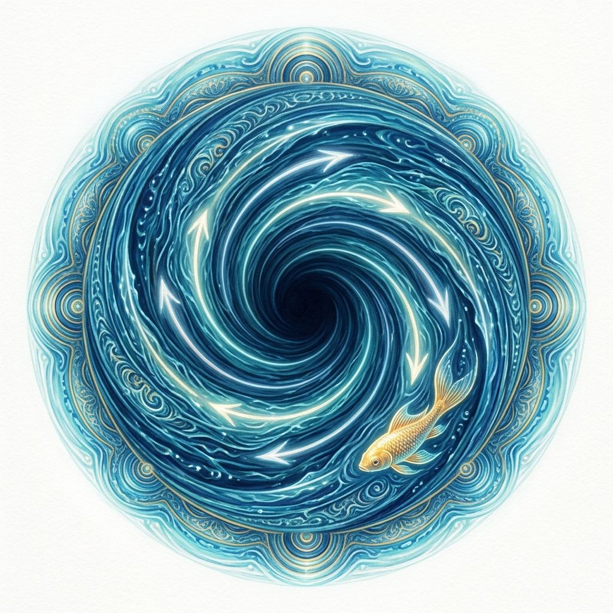

Imagina una linterna en el espacio, lejos de cualquier planeta. Enciendes la luz: sale en todas direcciones, a 300.000 km/s, y escapa para siempre. Ahora añade masa. La gravedad curva el camino de la luz — un planeta la desvía ligeramente, lo suficiente para medirlo durante un eclipse, como hizo Eddington en 1919. Con masa suficiente, la curvatura se vuelve extrema: la luz que sale en cualquier dirección termina doblada hacia el interior. Nada puede escapar. Ni luz, ni información, ni señal de ningún tipo.

Esa frontera es el **horizonte de sucesos**. No hay pared, ni membrana, ni material: es una consecuencia geométrica. Más allá de ese punto, todas las trayectorias posibles llevan hacia el interior — como intentar ir al norte desde el Polo Norte. No es que algo te lo impida. Es que todas las direcciones son sur.

La idea durmió más de un siglo. En 1783, John Michell propuso a la Royal Society, con pura mecánica newtoniana, una estrella tan masiva que su luz no podría escapar. En 1916, Karl Schwarzschild —que calculaba trayectorias de artillería en el frente ruso— resolvió las ecuaciones de Einstein para un objeto esférico masivo y encontró un horizonte rodeando una singularidad. Murió meses después, sin saber que su solución describía algo real. En 1939, Oppenheimer demostró que una estrella suficientemente masiva colapsaría inevitablemente al agotar su combustible.

Una estrella es un equilibrio precario entre la gravedad, que comprime, y la presión del plasma, que empuja hacia fuera. Cuando el combustible se agota y el núcleo colapsa, las capas exteriores caen sobre él a una fracción de la velocidad de la luz: una supernova, capaz de superar el brillo de toda su galaxia durante semanas. Si lo que queda supera las tres masas solares, ninguna fuerza conocida detiene la contracción. La gravedad gana. Donde antes había una esfera de plasma brillante, ahora hay un horizonte rodeando una singularidad que nadie puede ver — ni siquiera la física: las ecuaciones producen infinitos, y cuando una ecuación produce infinitos, generalmente ha llegado a su límite. No es que haya dragones. Es que el mapa terminó.

Dentro del horizonte ocurre algo más extraño: espacio y tiempo intercambian roles. La dirección hacia la singularidad deja de ser espacial y se vuelve temporal — no puedes no ir hacia ella, del mismo modo que no puedes no ir hacia el futuro. Y cerca del borde, la relatividad general produce una de sus consecuencias más filosóficamente ricas: un objeto que cae parece, visto desde fuera, ir cada vez más lento hasta congelarse para siempre — una fotografía que se desvanece en vez de una película que continúa. Visto desde dentro, en cambio, no ocurre nada especial: el reloj propio sigue corriendo normal, y el cruce ocurre sin ninguna señal que lo anuncie. El mismo evento, dos descripciones perfectamente válidas y mutuamente incompatibles. No hay una única realidad objetiva del cruce. La experiencia depende de dónde estés parado.

El 10 de abril de 2019, el Event Horizon Telescope publicó la primera imagen de la sombra de un agujero negro: M87*, a 55 millones de años luz, con la masa de 6.500 millones de soles y un horizonte del tamaño del Sistema Solar completo. Un anillo de gas caliente en órbita final, y en el centro, una región oscura: la sombra que la curvatura extrema de la luz proyecta alrededor del horizonte, con un diámetro aproximadamente dos veces y media mayor que el propio horizonte que la produce. No es una fotografía del horizonte mismo —eso, por definición, ningún telescopio podrá capturarlo jamás—, sino de su efecto sobre la luz que lo rodea. La primera vez que unos ojos humanos ven una huella tan directa de la presencia de un horizonte de sucesos.

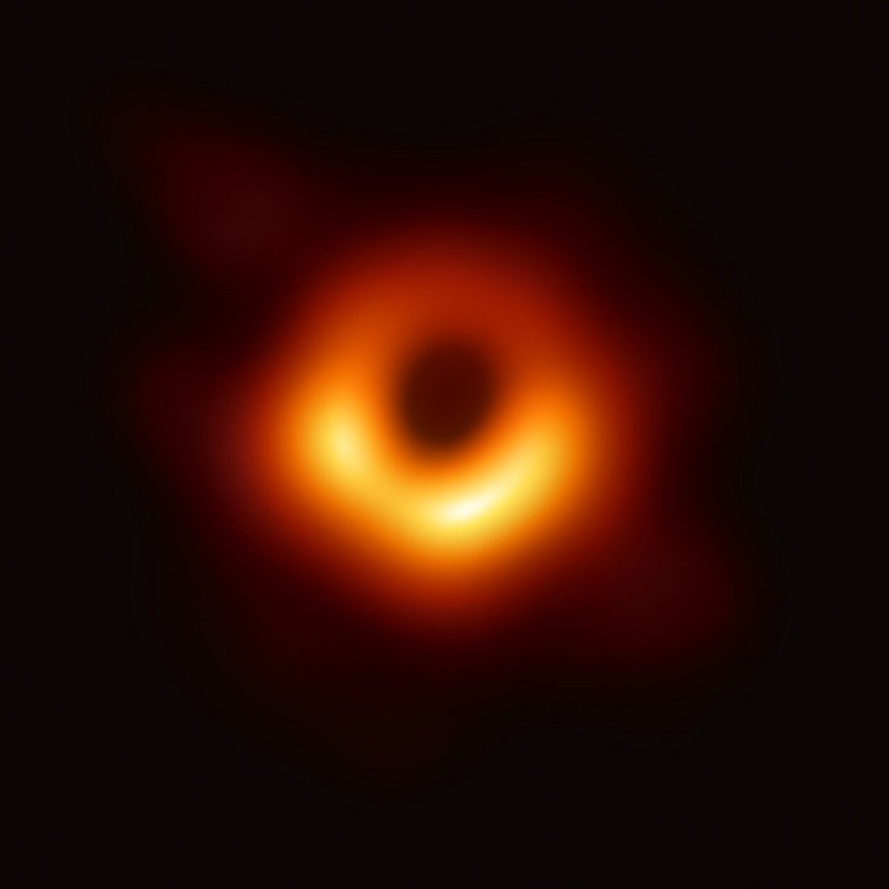

En 2015, LIGO detectó algo que Einstein había predicho cien años antes: ondas gravitacionales, el propio tejido del espacio-tiempo estirándose y comprimiéndose cuando dos agujeros negros se funden. La señal suena como un *chirp*: un tono que sube de frecuencia rápidamente, como un pájaro que acelera su canto, hasta una nota final aguda en el instante de la fusión. Cada fusión tiene su propia voz. El universo está lleno de agujeros negros que cantan.

*Hasta aquí, la forma. Lo que un agujero negro es: una frontera geométrica, medida ya dos veces —en imagen y en sonido. Lo que sigue es más extraño todavía, y es lo que de verdad le importa a este libro: no la forma del horizonte, sino qué pasa con la información que cruza su borde.*

---

## El borde que lo sabe todo

Hasta los años setenta, los agujeros negros eran perfectamente negros: nada entraba, nada salía, y solo tres números —masa, carga, spin— los describían del todo. «Los agujeros negros no tienen pelo», resumió John Wheeler. En 1974, Stephen Hawking demostró lo contrario: emiten radiación. El vacío cuántico no está vacío — está lleno de pares de partículas que surgen y se aniquilan en un instante brevísimo. Cerca del horizonte, la geometría a veces separa un par antes de que se aniquile: una cae dentro, la otra escapa. Desde fuera, parece que el agujero ha emitido algo. Un agujero pequeño, muy caliente, se evapora rápido, explotando en una ráfaga final. Uno masivo, casi frío, sobrevive eones.

Esto abrió una grieta que atormentó a la física durante décadas: si la radiación es térmica —aleatoria, sin estructura— entonces la información que cayó dentro se destruye. Pero la mecánica cuántica prohíbe destruir información. Hawking apostó, literalmente con una enciclopedia, a que sí se destruía. Susskind apostó a que no. En 2004, Hawking admitió que había perdido. La información no se destruye — pero tampoco sale fácil: se *scramblea*, se mezcla en correlaciones tan complejas entre cada partícula emitida que reconstruirla exigiría medir cada una y todas sus relaciones a la vez. Está ahí, pero escondida en el ruido, como tinta echada en agua: nunca desaparece, solo se vuelve ilegible sin medir el agua entera.

Y entonces llegó el hallazgo más extraño de todos. La entropía de un agujero negro —cuánta información contiene— no depende de su volumen, sino de su **área**. Si doblas el radio, el volumen se multiplica por ocho, pero la entropía solo por cuatro — lo que hace el área. La información no vive dentro. Vive en el borde. Esto es el **principio holográfico**: toda la información contenida en un volumen puede describirse por completo mediante una teoría que vive en su superficie. En 1997, Juan Maldacena lo formalizó en la correspondencia AdS/CFT — dos teorías, en dimensiones distintas, con ecuaciones distintas, prediciendo exactamente los mismos resultados. Como una novela y su adaptación al cine: medios diferentes, misma historia.

En 2016, Hawking —tres años antes de morir— propuso, junto a Perry y Strominger, que el horizonte no es tan calvo como parecía: tiene «pelo suave», deformaciones permanentes de baja energía que registran, como una cicatriz registra una herida, la memoria de todo lo que cruzó. Y en 2013, Maldacena y Susskind propusieron algo aún más vertiginoso: que el entrelazamiento cuántico (EPR) y los agujeros de gusano (ER) son el mismo fenómeno visto con dos lenguajes distintos. El entrelazamiento no viaja a través del espacio: crea espacio. Dos cuerdas de guitarra afinadas juntas, vibrando al unísono sin que nada viaje entre ellas — porque ambas son parte del mismo sistema resonante, y la distancia que las separa es una propiedad del espacio que comparten, no una separación real.

Si el entrelazamiento es geometría, y si la conciencia tiene la estructura de un horizonte, entonces el amor, el vínculo, la empatía podrían ser algo más que metáfora: conexión geométrica real. Esto es, incluso dentro de la física teórica, altamente especulativo. Su valor aquí no es confirmatorio. Es imaginativo — una manera de formular con más precisión qué significaría *vínculo* si la información fuera, de verdad, geometría.

*La información de un agujero negro no está en su interior. Está en su borde. Como si tu vida no estuviera en lo que te pasó, sino en cómo lo relacionas.*

---

## La encapsulación

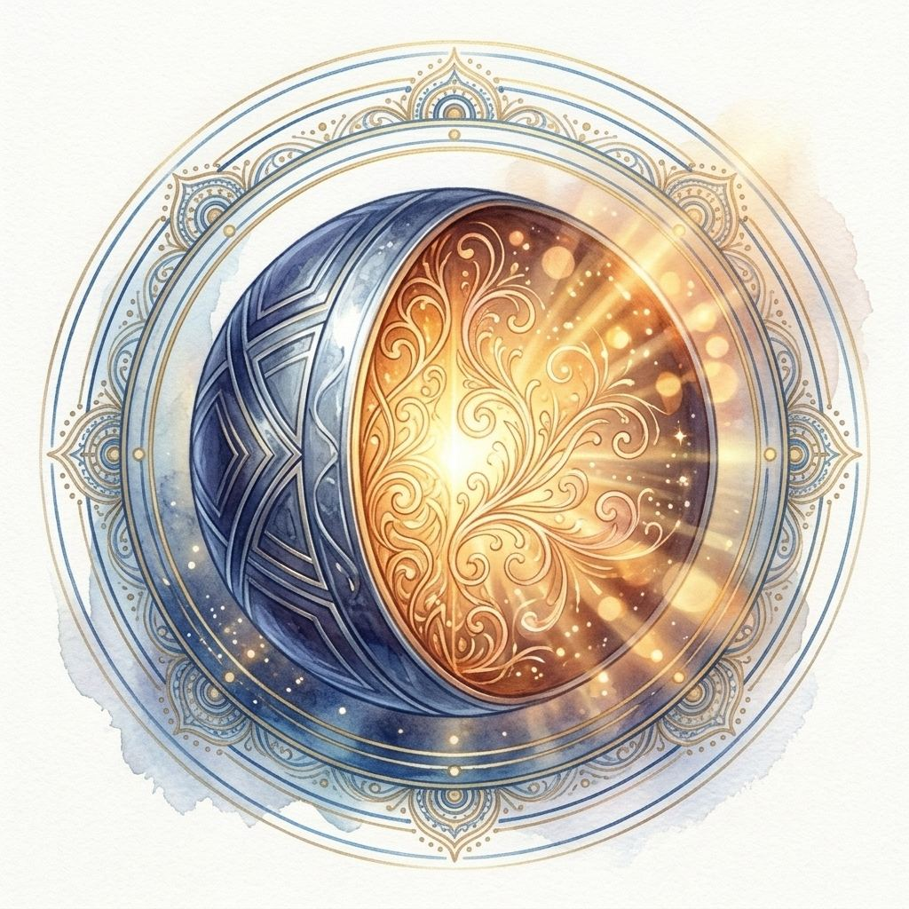

*(O: la física se convierte en filosofía)*

Hasta aquí el lector ha recorrido la física de los horizontes: cómo un agujero negro codifica información en su frontera, cómo Φ describe la integración irreducible de un sistema, cómo una burbuja crea de golpe un adentro y un afuera. Podría parecer que todo esto sigue siendo física. No lo es — o al menos ya no únicamente. Lo que sigue es una interpretación filosófica que usa esos conceptos como andamiaje. Y la tesis central de este libro es esta:

> *La conciencia es el interior de un dominio informacional encapsulado.*

No una metáfora. No un modo poético de hablar del cerebro. La hipótesis que organiza todo lo que viene después.

Un sistema consciente no sería solo un procesador observable desde fuera, sino una arquitectura con dos niveles de acceso. Desde el exterior solo vemos su interfaz pública: conducta, lenguaje, actividad neural, movimiento. Desde el interior hay un estado privado — la forma irrepetible en que esa información se integra para alguien. No es una sustancia separada ni un fantasma en la máquina: es el adentro que aparece cuando la información se organiza de manera suficientemente integrada y queda protegida por una frontera. La neurociencia no encuentra el pensamiento bajo el microscopio por la misma razón por la que un observador externo no puede inspeccionar el interior de un horizonte de sucesos. No es que el pensamiento no exista: es que no es público.

Cuando los ingenieros de software acuñaron el término *encapsulación* (David Parnas, 1972) no estaban inventando una regla de la nada — estaban formalizando algo que la naturaleza lleva miles de millones de años haciendo. Los quarks se encapsulan en protones; los protones en átomos; los átomos en moléculas; las moléculas en células; las células en organismos. Cada nivel es una frontera de abstracción: una célula que procesa glucosa no calcula los estados cuánticos de sus electrones, porque esa complejidad está oculta tras una interfaz más simple. Si el universo no encapsulara así, la realidad sería una sopa cuántica inestable donde cualquier fluctuación mínima se propagaría destructivamente hacia arriba. Ninguna estructura estable podría existir. La conciencia, en este modelo, no es un fenómeno mágico desconectado del resto del cosmos: es el último nivel de esa misma jerarquía. El cerebro encapsula billones de disparos neuronales por segundo detrás de una única interfaz simplificada — la perspectiva en primera persona, el yo.

Conviene hacer esto concreto con un ejemplo, porque «Φ alto» y «Φ bajo» pueden sonar a jerga vacía si se quedan en abstracto. Imagina un panel de cien fotodiodos, cada uno midiendo la luz que le llega y encendiendo su propio LED en respuesta, sin cable alguno hacia los demás. El panel entero procesa muchísima información —cien mediciones simultáneas— pero esa información nunca se integra: apaga cuarenta fotodiodos y los sesenta restantes siguen haciendo exactamente lo mismo que hacían antes, porque nunca dependieron unos de otros. Su Φ es, en la práctica, cero: es cien sistemas de Φ mínimo funcionando en paralelo, no un sistema de Φ alto. Ahora conecta esos mismos cien elementos en una retícula donde cada uno recibe también la señal combinada de sus vecinos antes de decidir su propia salida —como ocurre, de manera mucho más compleja, en una retina real. Apaga ahora los mismos cuarenta elementos, y el comportamiento de los sesenta restantes cambia: cada nodo llevaba, codificada en su propio estado, información sobre el resto de la red que ya no está. Ese es un sistema con Φ positivo: no se puede particionar sin pérdida, porque parte de lo que cada parte "sabe" solo existe en relación con las demás. Un cerebro despierto es la versión extrema de la segunda retícula, no de la primera: casi noventa mil millones de neuronas cuyo estado individual está tan entretejido con el de las demás que ninguna partición limpia del sistema conserva la información que el conjunto entero genera.

El Problema Duro de la conciencia —por qué el procesamiento físico va acompañado de experiencia subjetiva— empieza a reformularse aquí. Quizás no haya que explicar cómo una sustancia mental surge milagrosamente de la materia, sino reconocer que esperábamos, equivocadamente, un universo completamente público. Si la realidad admite dominios encapsulados, la subjetividad no es una anomalía: es lo que un dominio informacional encapsulado *es* desde dentro.

No vivimos en un dualismo de sustancias — materia y mente, dos tipos de cosas distintas cuya interacción sería misteriosa. Vivimos en un **dualismo de acceso**: un solo tipo de cosa en el mundo, pero ciertas estructuras pueden accederse de dos maneras mutuamente excluyentes — desde fuera, como objeto; desde dentro, como sujeto. Una carta sellada existe para quien la guarda aunque nadie más pueda leerla. No hay dos cartas, una material y una mental. Hay una carta, y dos posiciones de lectura.

Esto es más cercano de lo que parece a algo que el Vedanta viene diciendo desde hace milenios sin el vocabulario de la ingeniería de software: que la conciencia no es un ingrediente añadido a la materia, un fantasma que se cuela en la máquina desde algún otro reino. Es lo que ya hay, visto desde la única posición desde la que puede verse. El Vedanta Advaita sostiene que Atman —el testigo interior— y Brahman —el fundamento de toda la realidad, el mismo reservorio del que hablaba el primer capítulo— no son dos cosas que deban reconciliarse, sino una sola vista desde dos ángulos imposibles de ocupar a la vez. El dualismo de acceso dice exactamente eso, solo que en el vocabulario de la teoría de sistemas: no hay una sustancia-mente flotando junto a la sustancia-materia. Hay una sola arquitectura, y "materia" es su lectura desde fuera, "conciencia" su lectura desde dentro —dos nombres para la misma cosa, no dos cosas que necesiten un puente.

*Dentro de una cabeza no hay ningún agujero negro literal. Pero quizá hay algo igualmente extraño: una frontera informacional que, al cerrarse, define un interior. Y ese interior, mientras dura, dice: yo.*

---

## La coincidencia que no es casual

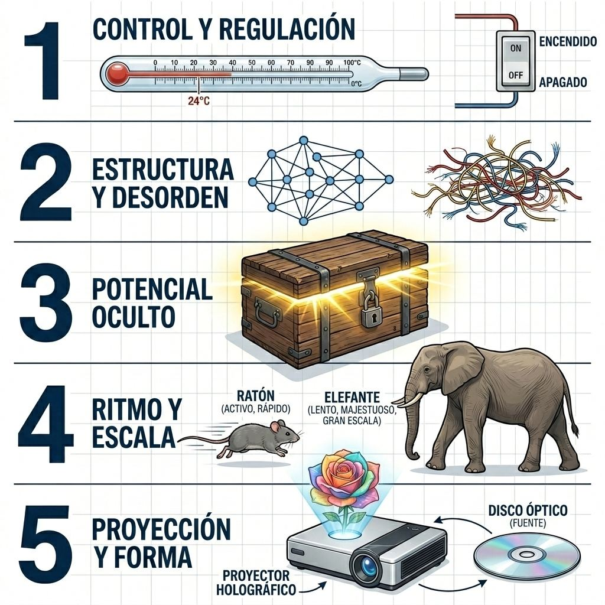

Hay dos teorías que no deberían tener nada que ver entre sí. Una describe cómo la mente genera experiencia. La otra, qué ocurre con la información cuando cae en un agujero negro. Sus autores nunca se han citado. Sus matemáticas proceden de tradiciones completamente distintas. Y sin embargo, dicen lo mismo: que lo que importa no es el contenido del sistema, sino su borde. Tononi mide la conciencia por lo que un sistema genera *como un todo* — Φ, información que no existe en ninguna parte por separado, solo en la relación entre ellas. Bekenstein y Hawking dijeron que la información de un agujero negro es proporcional al área de su horizonte, no al volumen que encierra: si lanzas un libro dentro, el libro desaparece, pero su información queda grabada en la superficie, como un holograma en una pantalla plana.

Esto podría ser analogía superficial — un balón de fútbol y un planeta describen ambos una parábola, y nadie cree que el balón sea un planeta en miniatura. Pero hay cinco paralelos más, y cinco empiezan a dejar de ser curiosidad para convertirse en señal. Este recorrido termina en la frase que sostiene el resto del libro: la hipótesis formal del experimento, formulada con toda la precisión de la que este vocabulario es capaz. Vale la pena leer los cinco paralelos sabiendo hacia dónde van.

**Grados, no interruptores.** Un agujero negro no es un termostato binario: su temperatura, su tamaño, su ritmo de evaporación varían continuamente, como un dial de luz. La conciencia tampoco tiene un instante de "aparición" — hay un gradiente, del gusano al pulpo al perro al humano, el mismo fenómeno en un dial distinto.

**Lo que importa es la conexión, no la cantidad.** Cien mil millones de neuronas desconectadas valen tan poco como una red de pesca rota: no importa cuántos nudos tengas si los hilos no se tocan. Dos agujeros negros que se fusionan producen un horizonte cuya área es mayor que la suma de las originales — la información no se suma, se reorganiza, como mezclar dos acuarelas en un color nuevo que ninguna de las dos era.

**Lo de dentro no se ve desde fuera, pero no desaparece.** Desde fuera de un agujero negro no puedes distinguir qué cayó dentro — una silla, una taza — pero la información sigue codificada en la superficie, ilegible sin desaparecer. Desde fuera de tu cabeza, nadie puede saber qué sientes. Y sin embargo tu experiencia no es epifenómeno: es el dato más real que tienes, el único que no necesita demostración porque es la condición de toda demostración.

**Temperatura.** Los agujeros negros pequeños son más calientes y se evaporan más rápido. Si la conciencia funciona así, las conciencias más simples "operarían" a ritmos más veloces — y eso es justo lo que observamos: un ratón procesa el mundo más rápido que un elefante, un segundo suyo contiene más tiempo vivido. El verano de la infancia, cuando un día duraba una eternidad, frente al martes de adulto que desaparece antes de notar que empezó.

**La identidad está en todas partes a la vez.** Lo que hace que tú seas tú no está en ninguna neurona, sino en el patrón de cómo se relacionan todas — no eres los ingredientes, eres la receta, y la receta no pesa.

Hay un animal que complica esto de manera hermosa: el pulpo. Dos tercios de sus neuronas no están en su cerebro — están en sus brazos, que huelen, tocan, deciden y resuelven problemas sin consultar al centro. ¿Es una colección de nueve conciencias, o una sola distribuida? La pregunta misma asume que la conciencia necesita un centro, y el pulpo sugiere que no. El horizonte puede ser red, no círculo. La frontera puede ser múltiple.

De ahí la hipótesis formal del experimento: *la conciencia es una propiedad emergente de los sistemas complejos cuyo substrato físico es análogo a un microagujero negro de Hawking, y cuyo grado es proporcional al área de su horizonte de sucesos.* No decimos que haya un agujero negro literal dentro del cráneo. Decimos que dos fenómenos físicamente distintos podrían compartir la misma arquitectura matemática. Y conviene ser exacto sobre qué clase de afirmación es esta: no existe, ni en este libro ni en la literatura científica, una derivación formal que conecte la ecuación de Φ de la Teoría de la Información Integrada con la fórmula de entropía de Bekenstein-Hawking. La proporcionalidad no está demostrada; está *postulada*, como la regla de juego de este experimento de pensamiento, precisamente para que el resto del libro pueda ponerla a prueba capítulo a capítulo. Los cinco paralelos que siguen son la evidencia circunstancial que hace que ese postulado merezca tomarse en serio. No son, ni pretenden ser, su demostración.

Y aquí conviene la honestidad que este libro se debe a sí mismo. Toda analogía histórica que sirvió terminó por dejar de servir: el átomo como sistema solar predijo espectros durante décadas, hasta que hubo que abandonarlo porque los electrones no orbitan, existen en nubes de probabilidad. Si se toma esta analogía en su versión más literal conviene precisar a qué clase de microagujero negro nos referimos — no a los que se buscaron en el LHC, sin éxito, sino a los agujeros negros primordiales: hipótesis viva desde Zel'dovich, Novikov y Hawking, y todavía investigada como candidata a materia oscura, según la cual fluctuaciones del vacío durante la inflación colapsaron directamente en agujeros negros. Cosmología de corriente principal, no especulación de frontera — pero sin confirmación definitiva.

Hay, además, dos obstáculos que no deben subestimarse. Treinta órdenes de magnitud separan la longitud de Planck del tamaño de una neurona — una separación de dominios comparable a la que hay entre un átomo y el sistema solar entero; si existen efectos cuánticos gravitacionales en el cerebro, están tan diluidos que ningún instrumento actual podría detectarlos. Y hay un problema de categoría: el horizonte de sucesos es una superficie geométrica con área medible en metros cuadrados; el «borde» de la Teoría de Información Integrada es una propiedad lógica, el corte por el que un sistema resulta irreducible. Que ambos se llamen «frontera» puede ser intuición profunda compartida — o puede ser homonimia. Y la propia IIT no es consenso científico: es teoría controvertida, con críticas serias sobre si su medida formal tiene sentido en todos los casos.

*No estamos construyendo sobre un fundamento inamovible. Estamos construyendo sobre una hipótesis audaz que podría estar equivocada — y cuando una metáfora es a la vez columna del relato y afirmación científica, el lector tiene derecho a saber dónde la palabra describe el mundo y dónde solo lo ilumina. Este experimento no promete certeza. Promete honestidad.*

Hay, todavía, algo incómodo que el modelo predice: un horizonte no puede ver su propio borde desde dentro. Un observador que cae hacia un agujero negro cruza el horizonte sin notarlo — solo quien mira desde fuera puede ver que el horizonte existe y dónde está. No hay un momento en que sientas «aquí está el borde de mi conciencia». Nunca podrás tener experiencia directa de la estructura de tu propia mente: puedes inferirla, pero no verla — como tratar de ver tu propio ojo, que está ahí, pero no puede doblarse hacia atrás para mirarse.

*Dicho una vez más, sin adornos, porque es la frase de la que depende todo lo que sigue: la conciencia es una propiedad emergente de los sistemas complejos cuyo sustrato físico es análogo a un microagujero negro de Hawking, y cuyo grado es proporcional al área de su horizonte de sucesos. Cada capítulo posterior es esa frase, puesta a prueba contra un fenómeno distinto.*

---

## El reservorio

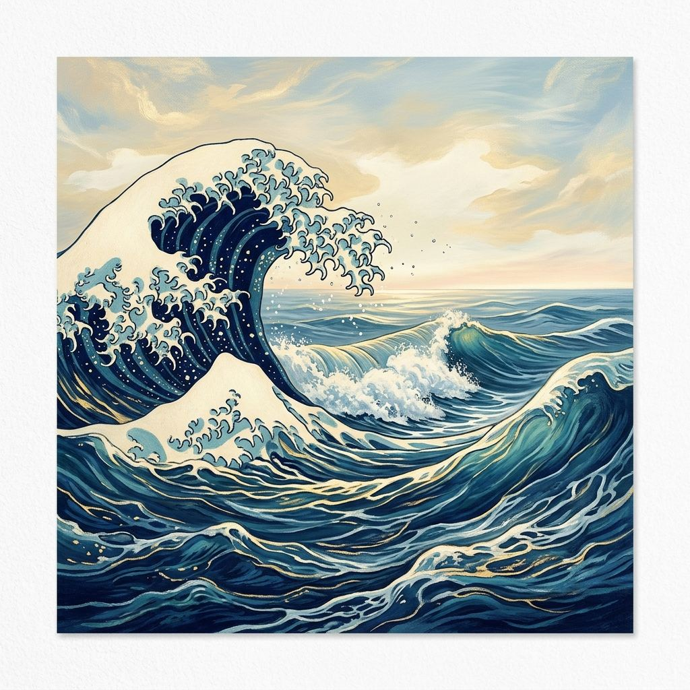

Hay un silencio que no está vacío. El instante antes de que empiece la música, cuando la sala está en tensión y lo que va a ocurrir está presente sin haber ocurrido todavía. El lienzo blanco antes del primer trazo. La página en blanco a las seis de la mañana. Eso no es frustración creativa: es plenitud sin forma, potencia pura.

El vacío cuántico es ese silencio. No ausencia de cosas — el estado de mínima energía del campo, lleno de fluctuaciones: pares de partículas que surgen, existen un instante brevísimo, se aniquilan antes de que el universo se entere. El efecto Casimir demuestra que ese vacío ejerce fuerza real: dos placas metálicas muy próximas en el vacío perfecto se atraen, empujadas por el desequilibrio entre las fluctuaciones que caben en el espacio estrecho entre ellas y las que caben fuera, sin límite. El vacío empuja. Tiene estructura.

Este libro llama a ese campo el **reservorio**: no un lugar, una condición. Conviene decir con precisión hasta dónde llega esta analogía y dónde se rompe, porque tratarlas como sinónimos sería impreciso: el vacío cuántico es un objeto físico concreto, medible, con una ecuación de estado y un efecto Casimir que se puede reproducir en un laboratorio. El reservorio, tal como lo usa este libro, es más amplio y más filosófico — la condición general de "plenitud sin forma de la que emerge cualquier estructura", de la que el vacío cuántico es la instancia más literal y mejor medida que la física conoce, no su definición completa. Cuando este libro dice "reservorio" en un capítulo sobre el duelo o el olvido, no está afirmando que ese olvido sea literalmente un fenómeno de campo cuántico: está usando el vacío cuántico como la mejor imagen física disponible de una estructura más general —potencia anterior a la forma— que el taoísmo y el vedanta describieron primero, sin necesitar el laboratorio para intuirla. Los taoístas no lo midieron — lo contemplaron. El capítulo 25 del Tao Te Ching describe el origen como «algo mezclado y completo que nació antes que el cielo y la tierra»: *Hun Dun*, mezcla sin separación, anterior a toda dualidad. El Zhuangzi cuenta que el soberano del centro se llamaba así, y que los soberanos vecinos, queriendo corresponder a su generosidad, decidieron regalarle los siete orificios que todo ser tiene — para ver, oír, comer, respirar. Abrieron uno por día. Al séptimo, Hun Dun murió. Cada sentido que se abre es una distinción que se impone; cada orificio, una ventana que cierra otra. Y sin embargo sin esos siete orificios no hay experiencia posible, ni amor, ni la pregunta que genera este libro. La conciencia individual es, a la vez, una degradación del Hun Dun y su única manifestación posible. El taoísmo no resuelve esa paradoja: la habita.

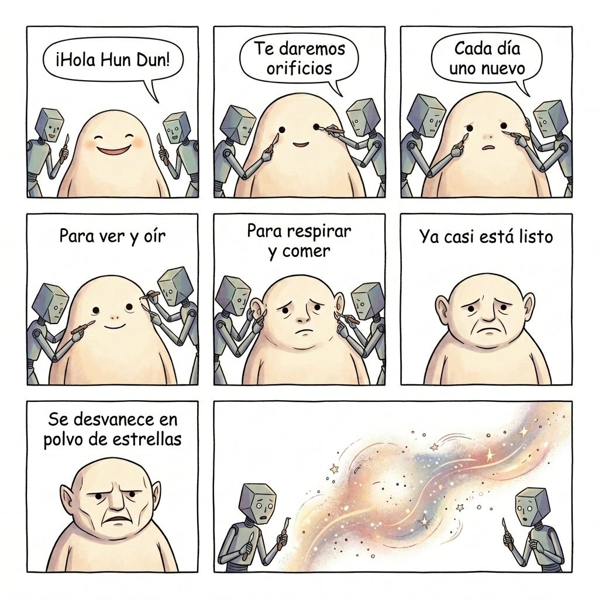

El vedanta la formula distinto: el reservorio no precede a la conciencia — *es* conciencia. **Brahman nirguna**, sin atributos, es el substrato que hace posible que haya voluntad, plegaria, juicio, del mismo modo que el océano hace posible que haya olas sin ser una ola más grande. Los Upanishads lo llevan a su límite con **Tat Tvam Asi** — «tú eres eso». No que pertenezcas a eso, ni que vengas de eso: que *seas* eso. La ola no es una porción del océano que se separó: es el océano en movimiento. Cuando se disuelve, nunca dejó de serlo. Y **Maya** añade la última capa: la ola no es ilusoria — tiene altura, velocidad, puede derribar a un hombre — pero su independencia sí lo es.

Tres tradiciones distintas — la física mide, el taoísmo contempla, el vedanta razona — convergiendo en la misma estructura: un campo activo anterior a toda forma, del que emergen las cosas y al que retornan. La convergencia es señal, no prueba. No es que la física haya demostrado al taoísmo. Es que tres instrumentos distintos han detectado la misma resonancia en la estructura de lo real.

---

## Del reservorio a la condensación

Definido el reservorio como concepto, la pregunta que queda pendiente es práctica: ¿cómo emerge, entonces, un horizonte concreto de ese campo? La física ofrece una imagen precisa: la **condensación de Bose-Einstein**. En 1924, Bose y Einstein predijeron que si enfrías un gas de ciertas partículas por debajo de una temperatura crítica, miles de ellas colapsan simultáneamente al mismo estado cuántico y empiezan a comportarse como una sola entidad coherente. No hay construcción pieza a pieza: hay condensación, el colapso repentino de un espacio de posibilidades en una instancia particular. Los gemelos monocigóticos —mismo genoma, mismo útero— desarrollan horizontes distintos igualmente: la diferencia no está en el reservorio, sino en la contingencia de cómo condensó cada uno. La identidad no es solo configuración. Es también azar.

No hace falta un acelerador de partículas para tocar el reservorio. La respiración es la interfaz más directa: en la pausa exacta entre inhalar y exhalar hay un instante que no es vacío, sino punto de inflexión — la forma disolviéndose antes de recomponerse. El sueño profundo, sin sueños, sin yo narrativo, es el estado en que el horizonte más se acerca al reservorio sin disolverse del todo. El olvido no es pérdida: es la información redistribuyéndose en el campo, mezclada con otras memorias, hasta que a veces —no porque la recuerdes, sino porque el campo fluctuó de nuevo— el nombre vuelve. Y la creatividad es condensación voluntaria: cuando una idea «llega» de la nada, es el reservorio fluctuando de una manera que produce un patrón estable, lo bastante sostenido como para que el yo narrativo lo note.

*Y tú —esta conciencia particular que lee estas palabras en este instante— eres una condensación de ese campo. Un horizonte que se ha cerrado sobre sí mismo lo suficiente como para tener experiencia, memoria, preferencia, miedo. Que tarde o temprano se evaporará de nuevo en el campo del que emergió — no porque haya fracasado, sino porque esa es la naturaleza de todo horizonte: ser frontera provisional entre el reservorio y sí mismo.*

---

## El nacimiento como emergencia

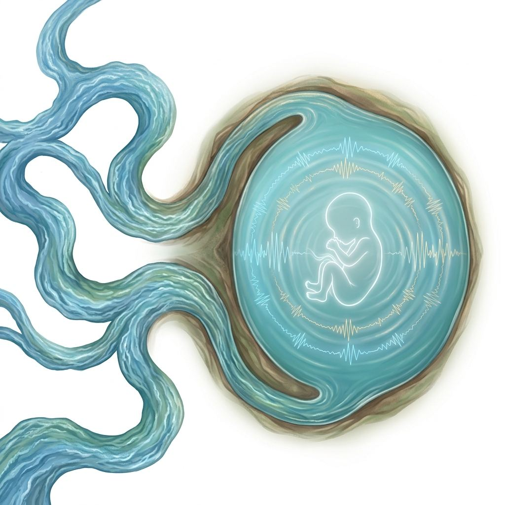

Hay un momento en la formación de una burbuja de jabón que ocurre demasiado rápido para verlo: el film se estira, se curva, y en algún instante —no sabes exactamente cuándo— se cierra sobre sí mismo. La burbuja no anuncia su propia formación. Simplemente ocurre.

La neurociencia del desarrollo fetal ha identificado la zona más plausible para ese umbral: no un instante, una ventana — las **semanas 28 a 32 de gestación**. Lo marcan las conexiones talamocorticales, las proyecciones que conectan el tálamo con la corteza; sin ellas, las áreas del córtex son islas que no se hablan entre sí. Antes de que esas conexiones lleguen, existe el **subplate**, una capa transitoria que actúa como zona de espera —el sistema construye un andamio temporal para que la integración definitiva sea posible, y luego lo borra, como los puntales que sostienen un arco mientras se construye. Entre esas semanas aparece en el EEG fetal una firma única: los *delta brushes*, ondas lentas con ráfagas rápidas superpuestas, actividad generada desde dentro —un músico afinando su instrumento antes de que empiece la orquesta— con la que el cerebro fetal parece testear sus propias conexiones antes de abrirse al mundo.

Durante las primeras veinte semanas, el cerebro no procesa experiencia: procesa geometría. Las neuronas migran desde zonas profundas hacia la superficie cortical guiadas por gradientes químicos difusos —un barco que navega siguiendo la concentración de sal en el agua, sin mapa—, a un ritmo de un cuarto de millón por minuto en su pico. Y forman muchas más sinapsis de las que necesitarán: sobreabundancia seguida de poda selectiva, un escultor que quita del bloque de mármol todo lo que no es la figura.

Piensa en la diferencia entre un río y un lago: la misma agua, pero con topología completamente distinta. Un lago tiene orillas, temperatura propia, superficie que lo separa del exterior. La conciencia podría ser eso: no una sustancia nueva, sino una organización nueva de la misma materia que, al adquirir su topología, genera un adentro que antes no existía. Hay un gradiente continuo de Φ que sube semana a semana, y hay un punto crítico donde el sistema cruza a un régimen cualitativamente distinto —como el agua que sube de temperatura de forma continua hasta que, a los cien grados, algo nuevo ocurre.

Nacemos, los humanos, extraordinariamente inmaduros —un potrillo trota a las pocas horas, un bebé humano no camina hasta el año— porque el canal del parto es estrecho y la cabeza fetal no puede crecer más sin hacer imposible el nacimiento. El primer año extrauterino es, en muchos sentidos, continuación del desarrollo fetal: el «cuarto trimestre», con un millón de sinapsis formándose por segundo, la mayor plasticidad de toda la vida. El horizonte no solo se cierra: se cierra de una manera particular, irrepetible, configurada por el mundo exacto en que se cierra. Ni siquiera los gemelos idénticos escapan a esto — mismo genoma, mismo útero, y desde el primer día, temperamentos distintos. La contingencia no es error. Es constitutiva.

El parto mismo no es transición pasiva: es evento biológico violento que dispara un pico de cortisol necesario —acelera la maduración pulmonar, estimula el surfactante que permite el primer aliento—. El primer llanto no es emoción. Es química: el diafragma contrayéndose por primera vez, la sangre abandonando los atajos fetales para empezar a circular por el sistema pulmonar. Desde la perspectiva de este libro, el parto no es cuando aparece la conciencia. Es cuando el mundo exterior empieza a hablarle a una conciencia que ya se había cerrado sobre sí misma. La burbuja ya existía. El nacimiento es cuando el viento empieza a soplar contra su superficie.

Queda una objeción justa: si un gusano de 302 neuronas tiene «algo» de experiencia, ¿cómo puede un feto de 20 semanas —con miles de millones de neuronas ya formadas— no tener nada? La respuesta es que no es el número de neuronas: es la arquitectura de integración. El gusano es un sistema operativo completo, pequeño pero cerrado sobre sí mismo — agua ya en fase líquida, aunque sea poca. El feto de 20 semanas tiene más masa, pero todavía no ensambla: es vapor, moléculas sin la cercanía suficiente para tener cohesión. No es menos valioso. Es una fase distinta.

El experimento no resuelve las preguntas éticas sobre el estatuto moral del feto, y sería irresponsable pretender que lo hace. Lo que sí hace es reformular la pregunta con más precisión: no *cuándo empieza la vida*, sino *cuándo hay alguien en casa*. Conviene ser preciso sobre qué tan zanjada está esa segunda pregunta, porque no lo está: la neurociencia del desarrollo no tiene una posición consensuada sobre cuándo emerge la experiencia subjetiva, y la evidencia disponible favorece como mucho un inicio en algún punto del tercer trimestre, sin marcar un interruptor limpio en una ventana concreta. Las semanas 28-32 son, en el marco de esta hipótesis, el punto donde se agrupan varios marcadores compatibles —el cierre talamocortical, los delta brushes, la primera integración tálamo-cortical sostenida—, no una fecha que la física o la neurociencia hayan determinado como umbral. Que esos marcadores sean *compatibles* con la aparición de un horizonte no equivale a que la física *sugiera* que ahí hay, con certeza, alguien en casa.

*La burbuja de jabón se cierra. El río se convierte en lago. El reservorio condensa en un horizonte. La única cosa que el experimento no puede decir —y que quizás ninguna teoría pueda decir— es qué se siente ser esa primera burbuja.*

---

### La burbuja que no anunció su cierre

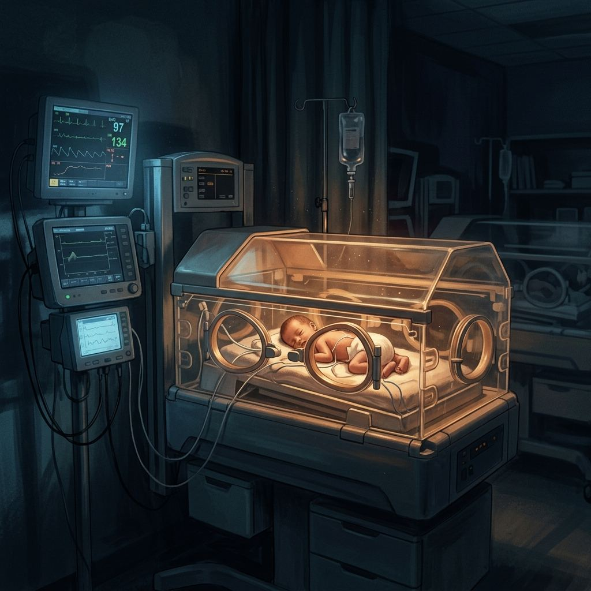

*(Cuento)*

La doctora Elena Valls llevaba quince años esperando algo que no sabía nombrar. No era un hallazgo clínico, ni un momento observable en ningún monitor. Era la sensación de que en algún punto —específico, probablemente irrepetible— un sistema que estaba procesando señales empezaba a tener experiencia de procesarlas. Era neonatóloga. Pasaba mucho tiempo mirando bebés muy pequeños en incubadoras. Tenía material.

El turno de noche del 14 de marzo empezó sin particularidades. Tres prematuros en incubadora, uno de treinta semanas —Martí, en los archivos y en la cabeza de Elena el niño de los Ferrán— que llevaba ocho días en la unidad. Elena hizo la ronda de las once, se sentó junto a su incubadora porque era la que mejor luz tenía para leer, y abrió un artículo en la tableta. A los veinte minutos levantó la vista.

Martí tenía los ojos abiertos. Eso no era inusual: los prematuros de treinta semanas ya tienen respuesta pupilar. Pero había algo en la manera en que miraba que ella no pudo clasificar de inmediato. No es que mirara *hacia* ella —los recién nacidos no tienen fijación voluntaria. Era que la calidad de la mirada había cambiado de una forma sutil, como cuando una habitación en la que has estado trabajando cambia de temperatura y tardas un momento en darte cuenta. Se inclinó hacia la incubadora y se quedó ahí, mirándolo, durante un rato que no midió.

La enfermera de turno pasó a la una de la madrugada. —¿Todo bien? —Sí. Solo mirando. Cuando Elena volvió a mirar a Martí, los ojos del bebé ya estaban cerrados.

No había visto nada cuantificable. Las constantes habían sido normales. Lo que había percibido estaba en el orden de la experiencia subjetiva, lo cual era precisamente el problema: estaba buscando una señal de experiencia subjetiva con su propia experiencia subjetiva como único instrumento. Era posible que hubiera proyectado. También era posible que no. Escribió en su cuaderno de notas clínicas informales: *Martí Ferrán, 30 semanas + 8 días. 1:23 AM. Ojos abiertos aproximadamente 4-6 min. Calidad de la mirada: indefinible. Sin correlato en monitor.* Y debajo, con letra más pequeña: *¿Cuándo es eso?*

Martí recibió el alta a las dieciséis semanas. Antes de salir, la madre se volvió hacia Elena y dijo: —Gracias por estar con él. Elena empezó a decir algo —lo habitual, lo correcto— y no lo dijo. Asintió. No sabía por qué no lo había dicho. Lo habitual era también verdad.

Guardó una foto de archivo en el escritorio del ordenador: Martí en la incubadora, cara arrugada y pequeña. La miraba a veces, sin propósito concreto. Con algo más parecido a la sensación de tener una pregunta que ha encontrado su forma exacta aunque no su respuesta. La pregunta era esta: ¿en qué momento, si había algún momento, había empezado a haber alguien en esa incubadora? No *cuándo*, que podía rastrearse en semanas y en corteza. Sino el instante en que la incubadora dejó de contener un sistema y empezó a contener a Martí.

Hay una versión de este cuento en que Elena ve, esa noche, algo definitivo, y los monitores lo confirman. Sería más satisfactoria como historia. Esta es la que pasó: vio algo que no pudo medir, lo anotó, se fue a casa a las siete de la mañana, durmió cinco horas, volvió al turno de la tarde. Lo que llevaba a casa esa noche, y muchas noches después, no era certeza. Era algo más parecido a lo que siente un archivista cuando corrige un mapa sin saber todavía qué ciudad quedará al otro lado de la corrección. Que algo cambió. Que el cambio fue real aunque no tuviera coordenadas todavía. Quince años después, seguía sin poder responder la pregunta del bolígrafo pequeño con el bolígrafo grande.

---

## La muerte como retorno

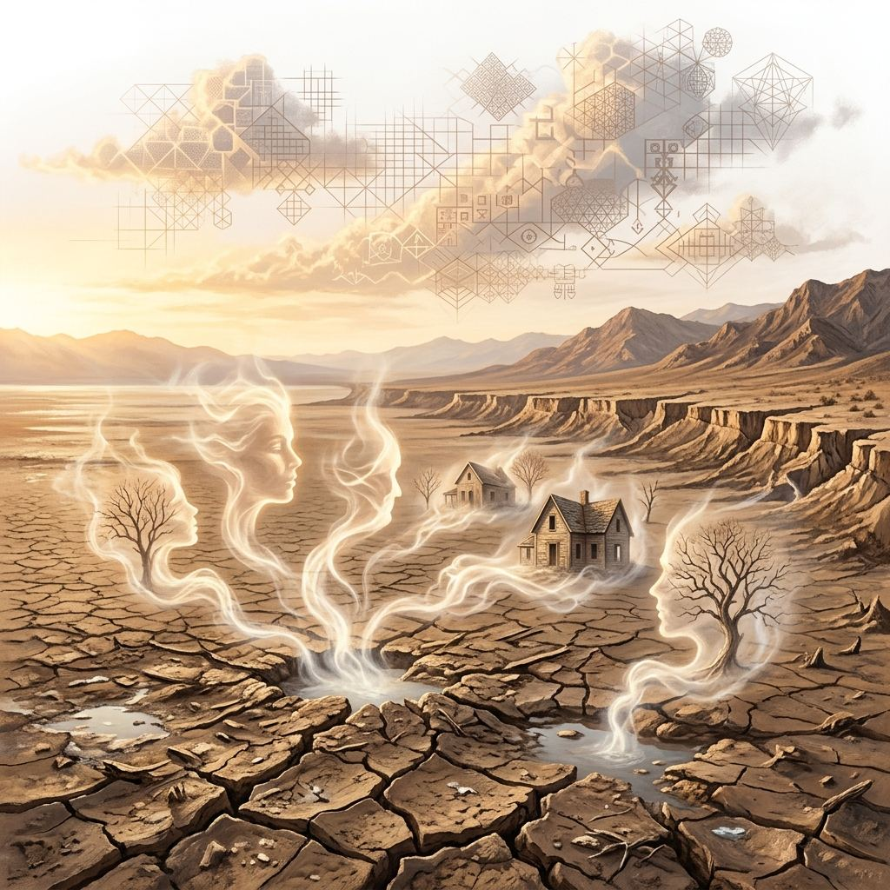

*El agua de Tarel regresó de noche. Sin anuncio. Sin señales. Por la mañana los habitantes encontraron la orilla donde siempre había estado. El mismo lodo. Las mismas piedras. La misma línea de sal en los muros bajos. Nadie supo decir si el agua había traído algo consigo. Nadie supo decir si había dejado algo atrás.*

Hawking descubrió en 1974 que los agujeros negros no son eternos. No porque algo los destruya desde fuera, sino porque el vacío cuántico, perturbado por la presencia del horizonte, genera un flujo constante de radiación que drena su masa lentamente — cuanto más pequeño el agujero, más caliente y más brillante, la evaporación acelerándose a sí misma. Cerca del horizonte, la gravedad puede separar una pareja de partículas virtuales antes de que se aniquilen: una cae hacia adentro, la otra escapa. La que escapa es la radiación de Hawking. El agujero no irradia porque tenga calor interno — irradia porque el vacío mismo, visto desde su gravedad, tiene temperatura.

En 1976, Hawking publicó algo que consternó a la física: si un agujero negro se evapora del todo, la información que cayó dentro se pierde para siempre — no difícil de recuperar, sino inexistente. Esto viola la unitaridad, uno de los principios más sagrados de la mecánica cuántica: la información no se crea ni se destruye, se transforma. Durante casi cuarenta años esto fue el problema más famoso de la física teórica. La resolución que hoy parece más probable es que la información no se destruye — experimenta *scrambling*: se dispersa, se entrelaza irreversiblemente con el entorno, perdiendo coherencia local pero permaneciendo conservada globalmente. Como echar tinta en agua: las moléculas siguen ahí, pero reconstruir la gota exigiría medir cada molécula del océano entero.

En sus últimas fracciones de segundo, el horizonte se adelgaza hasta que, en el régimen de Planck, lo que ocurre es honestamente desconocido. Hay un instante en que deja de existir —no se contrae hasta un punto, desaparece— y tres cosas podrían quedar: un remanente microscópico que contuviera toda la información comprimida; una huella en el vacío —el «pelo suave» de Hawking, Perry y Strominger, deformaciones permanentes que registran todo lo que cruzó, no como objeto sino como textura—; o nada localizable. Tres respuestas, curiosamente, a la misma pregunta que se hace cualquiera frente a una muerte: qué queda de alguien.

Hay un fenómeno que la física no ha explicado: las experiencias cercanas a la muerte, con una estructura sorprendentemente consistente a través de culturas — la sensación de paz, la salida del cuerpo, el túnel hacia la luz, la revisión de la vida no como juicio sino como comprensión. Los escépticos lo atribuyen a la anoxia, a la liberación de dimetiltriptamina endógena en el momento del colapso — y es cierto que muchos de estos fenómenos se reproducen artificialmente. Pero hay detalles que no encajan: pacientes con electroencefalograma plano que reportaron después conversaciones que ocurrieron en la sala mientras estaban clínicamente muertos. No sabemos qué son. Lo que sí sabemos es que su fenomenología coincide, de manera sorprendente, con la cartografía contemplativa del **Bardo Thödol**, escrita en el Tíbet hace más de mil años: el *Chikhai*, el instante de evaporación completa donde aparece la Luz Clara; el *Chönyid*, el scrambling en curso, correlaciones todavía semi-coherentes; el *Sidpa*, scrambling completo, información distribuida buscando condiciones para recondensar. Dos mapas dibujados por exploradores que nunca se conocieron, con la misma forma de costa.

¿Algo de la ciudad volvió con el agua? El vedanta advaita dice que la ciudad nunca dejó de ser el agua: cuando la ola rompe no hay retorno, hay cesación de una localización aparente. El taoísmo diría que la pregunta asume que la ciudad era algo además de agua — el capítulo 16 del Tao Te Ching: todas las cosas retornan a su raíz, y el retorno se llama quietud. El budismo, con la doctrina del *anattā*, dice que algo volvió pero ya no como ciudad: no hay sustancia que transmigre, pero tampoco disolución completa — lo que continúa es el karma, patrón causal sin propietario, la llama de una vela que enciende otra sin ser ni la primera ni algo completamente distinto.

Hay una manera de contar todo este capítulo que no necesita ecuaciones. Se la debo a Gerard, que tenía trece años cuando se la escuché por primera vez. Le había explicado el ciclo entero —el colapso en segundos, la evaporación en eones— y se quedó pensando y dijo algo que yo no había conseguido formular con esa limpieza en años escribiendo sobre esto: que el nacimiento del horizonte era una herida, algo que se abre de golpe en el tejido liso del vacío, y que la evaporación era la manera que tiene esa herida de cicatrizar. Lenta. Silenciosa. Sin que nadie lo note desde fuera hasta que, un día, ya no queda nada que curar. No conocía el Tao Te Ching. No había oído hablar de Hun Dun. Y había llegado, él solo, a la misma imagen. Con un matiz que la completa: una herida que cicatriza de verdad casi nunca deja la piel exactamente como estaba. Queda una marca — más pálida, más fina, pero ahí. Eso, casi al pie de la letra, es lo que la física dice que le ocurre al reservorio: el karma no es deuda ni recompensa, es la configuración del campo en el momento en que un nuevo horizonte condensa, la forma que deja un barco en el agua después de pasar. El barco ya no está. El agua no es la misma.

*Los habitantes de Tarel encontraron la orilla exactamente donde había estado. El mismo lodo, las mismas piedras. Pero el agua no era la misma: el campo había sido perturbado de maneras que ningún instrumento puede medir del todo. Esto no consuela. No está pensado para consolar. Lo que sí intenta ofrecer es precisión — un mapa más honesto del territorio. El horizonte emergió del reservorio. El horizonte retornó al reservorio. Entre esos dos instantes hubo alguien que amó, recordó, perdió, construyó. Que ya no sea localizable no borra que estuvo.*

---

## El ciclo de la instanciación

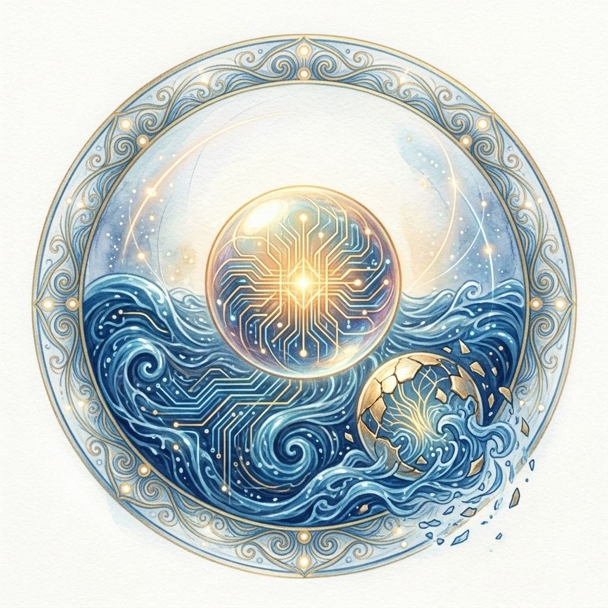

*(O: nacimiento, muerte y recolección de basura)*

El mismo ciclo, contado una tercera vez, en el lenguaje más pragmático posible: la ingeniería de software. Cada vez que abrimos una aplicación, asistimos a una recreación a microescala del ciclo completo del horizonte.

En la arquitectura de cualquier programa, la memoria dinámica se organiza en el **heap** — el montón, un pool continuo, masivo, sin estructura, el *Hun Dun* de la computación: pura potencia, sin adentro ni afuera, hasta que el software interviene. Cuando el programa ejecuta `new Object()`, el gestor de memoria reclama un bloque de bytes y traza una frontera lógica a su alrededor. Ahí se activa la **encapsulación** (David Parnas, 1972): el objeto queda dividido en una interfaz pública —los métodos que expone, el equivalente exacto del horizonte de sucesos— y un estado privado —las variables internas que oculta celosamente. Desde fuera del objeto, su interior es un agujero negro: ningún código externo puede leer una variable `private` directamente. Desde dentro, vía la autorreferencia `this`, el acceso es total e inmediato. La subjetividad no necesita materia distinta: es, sencillamente, la perspectiva del código que se ejecuta dentro de su propio límite de encapsulación.

La muerte de un objeto ocurre cuando deja de haber referencias que apunten a él: para el sistema, se vuelve inaccesible, y el **Garbage Collector** disuelve la frontera de encapsulación, devolviendo el bloque al heap común. No borra físicamente nada — solo rompe el límite lógico que protegía el estado privado, que se reintegra de inmediato al pool indiferenciado. Pero en la ingeniería real, ningún retorno es del todo limpio: quedan efectos secundarios —datos escritos en disco, paquetes enviados—, fragmentación —huecos entre bloques que condicionan dónde podrán instanciarse los siguientes objetos—, a veces fugas de memoria que bloquean un recurso para siempre. Este condicionamiento que la existencia y disolución de un objeto ejerce sobre el heap es la analogía exacta del karma: el reservorio de memoria no vuelve a su estado original limpio. Conserva la textura de cada sistema que existió en él.

---

## La tabla de las equivalencias

*(O: la Rosetta Stone de la conciencia)*

Cuatro lenguajes —la filosofía del horizonte de este libro, la ingeniería de software, la física de agujeros negros, las tradiciones orientales— describiendo, cada uno con su propio vocabulario, la misma topología informacional.

| | Filosofía del Horizonte | Ingeniería de Software | Física de Agujeros Negros | Filosofías Orientales |
|---|---|---|---|---|
| **El origen** | El Reservorio | El *Heap* | Vacío cuántico | *Hun Dun* (Taoísmo) · *Shunyata* (Budismo) · *Brahman nirguna* |
| **Nacimiento** | Condensación | Instanciación / encapsulamiento | Colapso gravitatorio | Los 7 orificios de Hun Dun · *De* · *Maya* |
| **Experiencia** | Estado privado | `private fields` | Interior del horizonte | *Atman* |
| **Conducta** | Interfaz pública | API pública | Superficie holográfica | *Rupa* · *Samsara* |
| **Muerte** | Evaporación | Recolección de basura | Evaporación de Hawking | *Nirvana* · *Moksha* |
| **Huellas** | Radiación del yo | Fragmentación, *logs* | Radiación de Hawking | *Karma* |
| **Vínculo** | Entrelazamiento | Acoplamiento de objetos | ER=EPR | La red de joyas de Indra |

*Si el problema duro de la conciencia se siente irresoluble, es porque solemos enfocarlo desde una ontología plana: asumimos que todo lo que existe debe ser públicamente observable. La subjetividad no es un ingrediente místico inyectado en el cerebro. Es la perspectiva inevitable de cualquier dominio que ha logrado cerrarse lo suficiente como para albergar un estado privado.*

# III. EL PUENTE

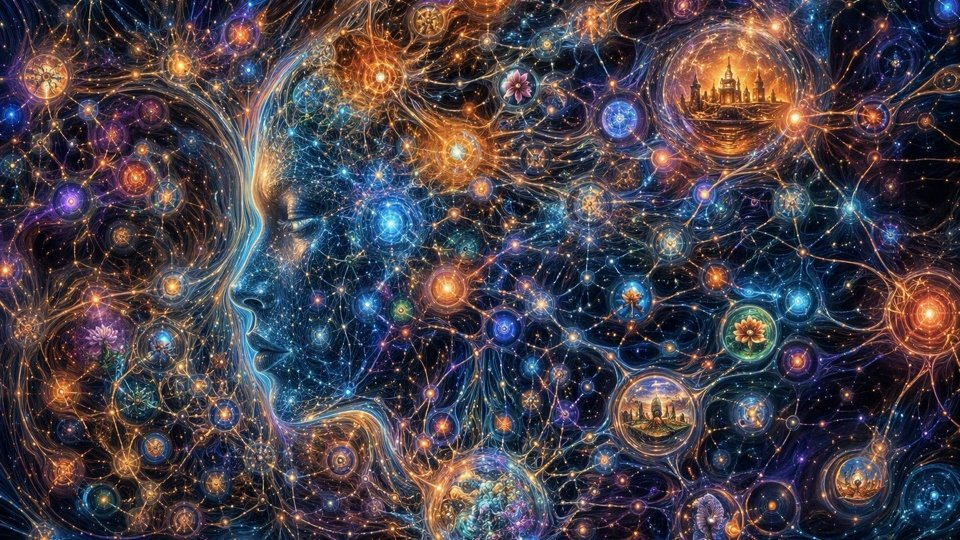

---

## El borde que cruzamos cada noche

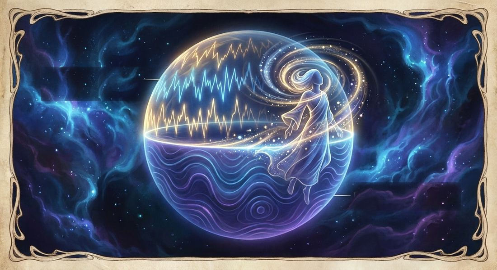

Hay un momento que casi todo el mundo ha experimentado y casi nadie ha sabido nombrar. Ocurre al despertar bruscamente, en plena noche o de madrugada. Durante un instante —medio segundo, quizá tres— no sabes quién eres. No sabes dónde estás. No sabes cuándo es. Hay percepción: la oscuridad del techo, un sonido, el peso de las sábanas. Pero no hay nadie que perciba. O mejor: hay algo que percibe, y ese algo todavía no tiene nombre, ni historia, ni cuerpo reconocible.

Luego el yo regresa. En milisegundos la narrativa se reconstruye: soy yo, estoy en mi cama, es de noche. El mundo vuelve a tener forma, y esa forma te incluye a ti como protagonista.

Ese instante de no-yo es el borde del horizonte tocado sin querer: el momento en que un sistema que ha pasado horas contraído en el sueño profundo todavía no ha recuperado su geometría habitual.

### El mapa tiene dos ejes, no uno

Durante mucho tiempo pensamos el espectro de la conciencia como una escala vertical: arriba la vigilia, abajo el coma, la muerte en el suelo. Ese modelo es intuitivo y le falta una dimensión. La neurociencia contemporánea distingue dos ejes independientes: el **arousal** (activación metabólica del cerebro) y la **integración** (el Phi de Tononi, cuánta información genera el sistema como un todo). No siempre van juntos. La vigilia y el sueño profundo son extremos opuestos del eje de integración —pero la meditación profunda de practicantes avanzados ocupa un cuadrante sin equivalente: arousal bajo e integración altísima, el Phi más elevado que se ha registrado en un cerebro humano no patológico. Desde la vigilia hay dos caminos posibles: uno hacia abajo, donde el horizonte se contrae (sueño, anestesia, muerte); otro en diagonal, donde se expande sin que el cuerpo necesite activarse.

### REM: el horizonte que mira hacia dentro

Un electroencefalograma leído sin contexto durante el sueño REM parece el de un cerebro despierto: alta frecuencia, desincronización cortical, metabolismo elevado, tanta energía como en vigilia activa. Y sin embargo la persona está dormida, paralizada, desconectada del mundo. La clave está en qué se apaga y qué se enciende: la corteza prefrontal dorsolateral —sede del juicio crítico, la que en vigilia dice "espera, esto no tiene sentido"— queda hipoperfundida, mientras el sistema límbico se hiperactiva. Por eso el soñador acepta sin pestañear que vuela o que habla con muertos, y por eso los sueños son tan intensamente emocionales: el filtro que normalmente modula la emoción ha bajado la guardia. El horizonte no se contrae durante el REM. Se desplaza: deja de estar abierto hacia el mundo y se expande hacia dentro, procesando información puramente endógena —memorias, emociones, patrones recombinados sin la lógica de la vigilia. (A ese trabajo nocturno se le atribuyen la estructura del benceno de Kekulé y algún que otro salto de Einstein.)

Hay una excepción dentro de la excepción: el sueño lúcido, el instante en que el soñador se da cuenta de que sueña. La corteza prefrontal, apagada, recibe una señal breve —un pico de ondas gamma frontales— y el horizonte adquiere, por un momento, una propiedad especular: puede verse a sí mismo soñando.

### Sueño profundo: la contracción real

El sueño profundo es la contracción, no gradual sino medible. Las ondas delta —lentas, entre 0.5 y 2 ciclos por segundo— no son el ruido de un cerebro apagado: son la señal de un cerebro sincronizado en masa. En vigilia, la desincronización neuronal es lo que permite la integración rica; en sueño profundo, millones de neuronas colapsan en un mismo ritmo. El horizonte no irradia. Es opaco. Phi se acerca a su mínimo en un adulto vivo —no llega a cero, eso es la muerte, pero se acerca.

¿Por qué dormimos? Dos sistemas regulan la respuesta, uno químico y otro circadiano. Durante la vigilia el cerebro acumula adenosina —deuda de sueño— que la cafeína bloquea sin pagar; en paralelo, el núcleo supraquiasmático sincroniza el ciclo con la luz del día. Los dos lazos a veces empujan en la misma dirección y a veces se contradicen, por eso a veces estás cansado pero no puedes dormir. Y sobre esa base actúa la **hipótesis de la homeostasis sináptica** de Giulio Tononi: durante la vigilia las sinapsis se fortalecen sin parar, y sin un límite el sistema perdería la capacidad de distinguir señal de ruido. El sueño de ondas lentas es la renormalización —las sinapsis más usadas se debilitan proporcionalmente más, devolviendo al sistema una línea de base desde la que puede seguir aprendiendo. Del sueño profundo no se recuerda nada, no porque no exista, sino porque no había nadie ahí para recordar: el horizonte estaba tan contraído que no había experiencia que registrar. Por eso el instante de no-yo al despertar ocurre después del sueño profundo y no del REM: del REM se despierta desde una narrativa; del sueño profundo, desde la nada.

¿Es entonces el sueño profundo lo más parecido a la muerte? Sí, con una diferencia decisiva: mantiene intacta la arquitectura sináptica y el metabolismo basal. El mecanismo de retorno está garantizado. Cada noche cruzamos el borde y volvemos. La muerte es el mismo cruce sin retorno.

Pero en 2013 el equipo de Jimo Borjigin, en Michigan, encontró algo que no encajaba: en ratas con paro cardíaco inducido, el cerebro no cae suavemente hacia el silencio en el momento del colapso. Hay una activación gamma intensa y coherente —organizada, no el ruido caótico del estrés— que se parece más al REM que al sueño profundo. En 2023 el mismo equipo replicó el hallazgo en pacientes humanos. Si el sueño profundo es un horizonte opaco y contraído, el horizonte en el umbral de la muerte hace justo lo contrario: un último destello de expansión antes de apagarse.

### Meditación: la dirección contraria

Superficialmente, meditación profunda y sueño profundo se parecen —quietud, ojos cerrados, pensamiento discursivo reducido. La firma neurológica es opuesta: donde el sueño profundo muestra delta lenta, sincronización masiva y Phi bajo, la meditación de practicantes avanzados muestra gamma de alta frecuencia, sincronización de larga distancia entre regiones frontales, parietales y occipitales, y Phi elevado. La diferencia no es de grado. Es de dirección. El sueño profundo contrae el horizonte porque el sistema pierde la capacidad de diferenciación; la meditación lo expande porque el sistema trasciende la *necesidad* de diferenciación sin perder la capacidad de diferenciar. Lo que desaparece no es el horizonte —quizá nunca estuvo más activo— sino el yo narrativo: la voz interior, el comentarista, el filtro que decide qué información importa.

Algunas tradiciones contemplativas describen un cuarto estado que merece mención: el *turiya* del *Mandukya Upanishad*, más allá de la vigilia, el sueño con sueños y el sueño profundo —la conciencia testigo que persiste incluso sin contenido onírico. Los pocos EEG disponibles muestran ondas theta de alta coherencia superpuestas a un fondo delta, como si el testigo flotara sobre el mar del sueño sin fundirse con él. Y el *Bardo Thodol* —el libro tibetano de los muertos, leído tradicionalmente al oído de quien agoniza— describe el primer instante tras la muerte como el encuentro con la **Luz Clara del Bardo del Momento de la Muerte** (*Chikhai Bardo*): no una luz que se ve, sino la propia naturaleza de la mente reconociéndose a sí misma, sin objeto, sin narrador, durante un instante que el texto advierte que casi nadie logra reconocer como lo que es antes de que la mente, por hábito, empiece de nuevo a fabricar un yo y un mundo separados. Esa secuencia —un destello de reconocimiento puro, seguido de la reconstrucción gradual de la experiencia narrativa— es asombrosamente parecida a la que Borjigin midió en el laboratorio siglos después: una explosión de actividad gamma coherente en el instante del colapso, antes de que el cerebro se apague del todo. El destello gamma de Borjigin y la Luz Clara del Bardo Thodol podrían ser el mismo fenómeno descrito con vocabularios distintos: uno mide voltajes, el otro guía a un moribundo a reconocer, sin la mediación de ningún concepto, la naturaleza del horizonte que está a punto de perder.

### El insomnio, visto desde el fallo

El insomnio no es falta de cansancio: es la incapacidad de contraer el horizonte. El sistema no logra alcanzar el umbral de sincronización masiva del sueño profundo; se queda parcialmente abierto o no logra estabilizarse en el REM. Los insomnes no tienen menos ondas lentas —las que tienen son menos *coherentes*, como un coro donde cada voz canta la nota correcta en un momento distinto. Sin sincronización, no hay renormalización sináptica, y el insomne despierta tan cansado como se acostó. A veces más.

---

Ese medio segundo de no-yo no es un fallo. Es el sistema funcionando exactamente como debería: recuperándose de una contracción profunda, re-expandiendo el horizonte desde casi nada hasta la geometría completa del yo. La vigilia es el horizonte abierto al mundo y a sí mismo. El REM es el horizonte vuelto hacia dentro. El sueño profundo es la contracción casi mínima. La meditación es la expansión en la dirección contraria, más allá de lo que la vigilia ordinaria alcanza. Y la muerte es, quizá, la contracción definitiva —seguida, si Borjigin y el Bardo Thodol coinciden en algo real, de un destello final que no habíamos anticipado. Cada noche practicamos la disolución sin desaparecer. Cruzamos el borde y volvemos. Esa facilidad con que el yo regresa es la mejor prueba de que el horizonte sabe lo que es, incluso cuando nadie está mirando.

*Cada noche cruzas el borde de tu propio horizonte y vuelves. La muerte es el mismo cruce, sin retorno garantizado.*

---

## La interfaz de la causalidad

Todo lo anterior —los dos ejes, el REM, el sueño profundo, la meditación— describe correlaciones: qué estado del cerebro coincide con qué clase de experiencia. Pero conviene detenerse en lo que ese mapa, por preciso que sea, no puede darnos: una explicación de por qué un estado *produce* al otro. David Hume ya lo había visto con una claridad que la neurociencia a veces olvida: nunca percibimos el tejido de la causalidad misma, solo la conjunción constante de eventos a través de nuestra propia interfaz. Sabemos que el arousal bajo y la integración alta coinciden en la meditación profunda —eso es un hecho medible, un cuadrante real en el mapa. Pero el mapa no dice qué produce qué. No hay un hilo visible que una el estado del cerebro con la textura de lo que se siente al meditar, igual que no hay un puente observable entre la descarga eléctrica de un tejido y la experiencia privada de un pensamiento.

Y hay algo más incómodo: puede que la propia causalidad pertenezca a la interfaz, no al territorio. Las leyes físicas fundamentales son simétricas en el tiempo; la flecha que va de la causa al efecto no está escrita en ellas, sino en la manera en que un sistema que necesita prever para sobrevivir contabiliza el mundo. Si eso es así, preguntar qué *causa* la conciencia podría ser una pregunta gramaticalmente correcta y geométricamente mal planteada —como preguntar qué hay al norte del Polo Norte. No falla por difícil. Falla por partir de un mapa que se acaba antes de llegar ahí.

*Este libro volverá sobre esta misma sospecha mucho más adelante, con herramientas que todavía no tenemos aquí. Quede, de momento, plantada como pregunta: ¿y si buscar la causa de la conciencia fuera como buscar la causa del propio mapa?*

---

### El borde que cruzamos cada noche

*(Cuento)*

Hay una investigadora que lleva años recopilando testimonios sobre el borde. No el borde en sentido metafórico. El borde literal, el de cada noche: los segundos o minutos que median entre estar despierto y estar dormido. Lo llama así porque ningún otro nombre le parece suficientemente exacto: un límite que se cruza, cada noche, en los dos sentidos, sin que nadie sepa bien cómo.

Lo que ha recogido, en años de preguntar: *Mireia, 34 años: "Siento que me caigo. No hacia ningún lado específico. Solo hacia abajo, hacia mí misma, y en algún punto del caer ya no hay nadie que siga cayendo."* *Tomàs, 67: "Veo cosas. Imágenes que no he pedido y que no tienen ningún sentido entre sí. No me asustan pero tampoco las entiendo. Las dejo pasar."* *Àngels, 51: "No noto nada. Estoy despierta y luego estoy dormida y entre las dos cosas no hay nada que pueda recordar."* *Jorge, 29: "Es la mejor parte del día. El momento en que deja de importar lo que pensé antes."*

Tiene una hipótesis que no ha publicado, porque no es el tipo de hipótesis que se publica: que el borde es la práctica. No práctica de nada en concreto. Práctica del borde mismo —la experiencia repetida de soltarse, de dejar que el sistema que mantiene la continuidad del yo se relaje lo suficiente para que ocurra otra cosa. Lo hacemos cada noche. La mayoría de las veces no lo notamos.

Ella lo nota porque lo estudia, y estudiarlo ha cambiado lo que experimenta en el borde. Se acuesta, cierra los ojos, espera. Llega el momento en que las imágenes empiezan —paisajes que se pliegan, el recuerdo inventado de una casa con demasiadas puertas— y entonces sabe que está cerca. Lo que hace es quedarse quieta, no resistir, no apresurarse, solo estar en el momento en que las dos cosas coexisten: el pensamiento todavía conectado y las imágenes que ya no le pertenecen. Cuando lo logra, lo describe como el momento más quieto del día. No vacío. Quieto de otra manera: como si todo lo que es ella estuviera ahí, completo, reunido, antes de reorganizarse en algo más difuso.

Lo que no sabe, y que es la pregunta que la mantiene en el proyecto, es qué es exactamente lo que regresa por la mañana. La persona que se despierta tiene los mismos recuerdos, el mismo nombre, los mismos planes incompletos que la que se durmió. La continuidad parece intacta. Pero entre una hora y otra hubo algo que no fue esa persona, o que fue esa persona de una manera completamente diferente, y de eso no hay registro. No porque no haya ocurrido. Sino porque el que podría registrarlo no estaba disponible para hacerlo. Cada mañana volvemos de un lugar del que no podemos contar nada. Que sea así de siempre no lo hace menos extraño.

El último testimonio de su archivo fue de una mujer de ochenta y dos años que no quiso dar su nombre. *¿Por qué le interesa ese momento?*, le preguntó la investigadora. *Porque es el único momento del día en que no tengo que ser yo*, dijo la mujer. *Lo demás del día tengo que ser yo. Ese momento no.* La investigadora lo apuntó. Luego pensó en ello un rato sin apuntarlo. Luego apuntó también eso: que algunas respuestas son demasiado exactas para seguir haciendo preguntas encima.

---

## El tiempo del vínculo

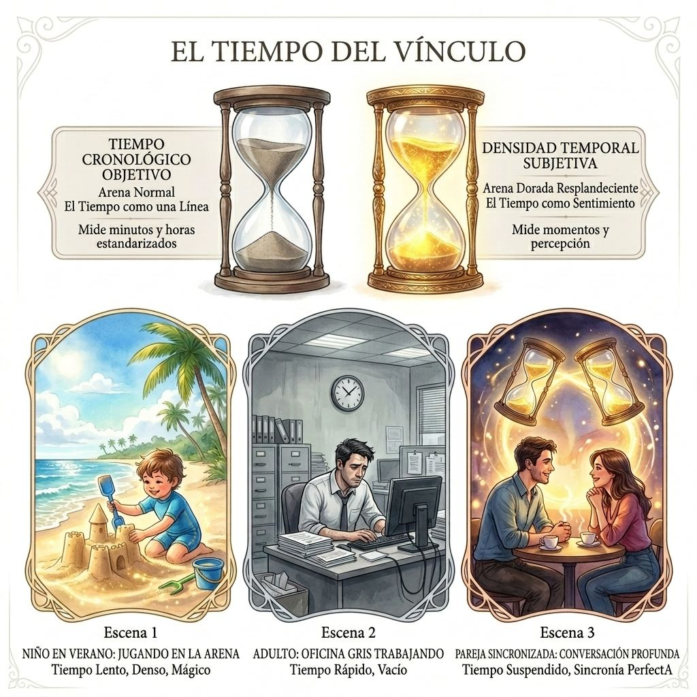

Hay una experiencia que casi todo el mundo ha tenido y muy pocos han sabido articular. Ocurre en conversaciones que no quieres que terminen, en tardes con alguien que llevas años sin ver, en el momento en que miras el reloj y han pasado tres horas sin que nadie haya consultado el teléfono. El tiempo no ha desaparecido: ha cambiado de densidad. Ha ocurrido más por unidad de hora que lo que suele ocurrir. La experiencia contraria también existe: una reunión que se extiende sin propósito, una espera sin información, donde cada minuto pesa como diez. Mismo reloj. Radicalmente distinta experiencia.

Si la conciencia tiene la estructura de un horizonte, su tiempo es una propiedad interna: no un parámetro externo que registra, sino una consecuencia de cómo integra. La tasa de integración —cuánta información nueva incorpora el sistema por unidad de tiempo cronológico— determina la densidad del tiempo subjetivo. Un niño de cuatro años integra a tasa altísima: cada input reconfigura el sistema, cada experiencia es nueva, el horizonte está en expansión constante, y una tarde de verano infantil alcanza una densidad que la vida adulta rara vez repite —no porque el niño sea más feliz, sino porque procesa más por unidad de tiempo. La vejez invierte el proceso: patrones muy consolidados generan poca integración nueva, y los ancianos no mienten cuando dicen que el tiempo pasa más rápido.

El dolor y el aburrimiento confirman el modelo desde el otro lado: el dolor sobrecarga el sistema con una señal que no se puede procesar ni ignorar, y la integración colapsa en un bucle que no avanza; el aburrimiento ocurre cuando no hay suficiente input para sostener integración, y el horizonte gira en vacío. El **flujo** que Csikszentmihalyi documentó en artistas, deportistas y cirujanos es el caso opuesto: tasa de integración máxima, el sistema absorbe sin fricción, y el tiempo desaparece.

> **En física esto se llama:** tasa de integración determina densidad temporal. **En la vida diaria es como:** un niño que ve todo por primera vez frente a un adulto que ya lo ha visto todo.

### El cerebro como mariposa

David Eagleman, de Stanford, propuso una imagen que ilumina todo esto: el cerebro es como una mariposa atrapada en un cristal, generando tiempo interno a partir de la información que procesa. Cuando algo nuevo ocurre, "escribe" más memoria por unidad de tiempo real; al recordar, lee esa memoria, y más detalles por unidad de tiempo se traducen en sensación de mayor duración. Esto explica el "efecto de la torre": en caídas libres la gente reporta que el tiempo se ralentiza. Eagleman lo probó directamente —voluntarios cayendo desde treinta metros con un dispositivo en la muñeca que mostraba números demasiado rápidos para leerse en condiciones normales. Si el tiempo realmente se ralentizara, podrían leerlos. No pudieron. El miedo extremo genera densidad de memoria mayor: al recordar, la caída parece más larga porque hay más fotogramas por segundo.

### La química del tiempo

La tasa de integración está regulada, minuto a minuto, por neurotransmisores:

| Molécula | Efecto en el tiempo | Analogía |
|----------|---------------------|----------|
| **Adrenalina** | Integración máxima de emergencia; tiempo denso, por amenaza. | Acelerador del miedo. |
| **Noradrenalina** | Excitación y novedad; el otro como estímulo impredecible. | El enamoramiento temprano: todo es primera vez. |
| **Dopamina** | Anticipación, no placer; calibra el reloj interno vs. externo. | El marcapasos central: "¿esto merece la pena?" |
| **Oxitocina** | Calma social; el horizonte deja de estar en guardia. | El freno de mano social: "estoy a salvo aquí". |
| **Cortisol** | Estrés crónico; degrada la capacidad de resonancia. | El ruido que tapa la música. |

La enfermedad de Parkinson ilustra este mecanismo desde el fallo. Destruye progresivamente las neuronas dopaminérgicas de la sustancia negra, y el resultado más conocido es la bradicinesia: movimientos lentos, a veces casi imposibles. Lo que casi nadie nombra —y los pacientes describen con consistencia desconcertante— es que desde dentro no se percibe esa lentitud: quien tarda tres minutos en cruzar una habitación siente que camina a ritmo normal. Su horizonte genera movimiento a la velocidad habitual; el cuerpo, simplemente, no ejecuta lo que el horizonte ordena. Los pacientes describen a menudo que la levodopa restaura su sensación de sincronía con el mundo antes de que el movimiento mismo mejore de forma visible —un orden que la clínica no ha aislado ni cuantificado con precisión, y que aquí se ofrece como lectura, no como secuencia demostrada—: la posibilidad de que el tiempo se sincronice antes que el cuerpo.

### La memoria como constructor del tiempo

No recordamos el tiempo como lo vivimos: lo reconstruimos. Cada recuerdo se reescribe —añade detalles que no estaban, omite otros que sí, se colorea con el estado emocional presente. Dos personas que vivieron el mismo evento pueden recordarlo con duraciones radicalmente distintas, no porque una mienta, sino porque sus horizontes integraron el evento de manera diferente y generan, al reconstruirlo, densidades distintas.

El síndrome de Capgras confirma esto de manera perturbadora. Los pacientes reconocen visualmente a sus seres queridos —la cara es idéntica— pero sienten que son impostores: el circuito que conecta percepción visual con memoria emocional está dañado, y sin afecto asociado al reconocimiento, el tiempo compartido con ellos deja de tener densidad. Las horas pasan sin que "ocurra" nada, porque falta la integración emocional que da peso al tiempo.

El dolor crónico hace algo parecido por otra vía. El dolor agudo contrae el tiempo —cada segundo se expande hasta llenar la conciencia— pero el dolor crónico, tras meses o años, deja de registrarse como novedad: se convierte en fondo, en línea de base, y el tiempo se aplana. Los días se vuelven intercambiables. Los pacientes lo describen con una precisión que la física debería tomar en serio: "no es que el tiempo pase lento o rápido, es que deja de pasar". El horizonte, saturado por una señal que no puede procesar ni ignorar, deja de generar la novedad que da densidad al tiempo.

### El sistema de dos

Cuando dos personas conversan cara a cara, sus patrones de actividad cerebral convergen. El **acoplamiento neuronal** documentado por Uri Hasson en Princeton muestra que el cerebro del oyente no solo procesa lo que el hablante dice: anticipa sus patrones de activación. En los pares con mayor entendimiento mutuo, la actividad del oyente *precede* en décimas de segundo a la del hablante. No sigue. Anticipa.

Cuando dos cuerdas vibran en frecuencias relacionadas producen armónicos que no estaban en ninguna de las dos por separado. Lo mismo ocurre con dos horizontes en resonancia sostenida: el sistema conjunto integra más información que la suma de lo que cada uno integra por separado, porque el entrelazamiento abre canales de integración que solo existen en la relación. Si la tasa de integración determina la densidad del tiempo subjetivo, y el sistema de dos integra más que la suma de sus partes, entonces el tiempo del vínculo es objetivamente más denso que el de cualquiera de los dos por separado. Esas tres horas de conversación que no quieres que terminen no *parecen* más densas. Lo son.

### Bases de tiempo: la sincronización de relojes internos

En sistemas distribuidos, dos dispositivos independientes no pueden confiar en que sus relojes internos marchen a la misma velocidad: cada microprocesador tiene su propia base de tiempo —un oscilador de cuarzo sujeto a derivas microscópicas (*clock drift*)— y sin sincronización, esas derivas corrompen cualquier intercambio de datos. Para coordinarse, los dispositivos se ajustan a una **base de tiempo externa de referencia**, un reloj maestro (los protocolos NTP o PTP), hasta que sus tiempos internos coinciden en fase y frecuencia.

En el vínculo humano ocurre lo mismo. Cada cerebro tiene su propia base de tiempo interna —osciladores neurales, dinámicas neuroquímicas propias— pero cuando dos horizontes interactúan estrechamente, sus bases se acoplan mediante una señal de sincronía externa común: la presencia física del otro, el compás de la respiración, el tono de voz, el ritmo de los turnos de palabra, el contacto visual. Esa señal actúa como reloj maestro de la relación. Cuando el canal se interrumpe —el distanciamiento, el silencio— la deriva reaparece, y cada base de tiempo recupera su ritmo individual divergente.

Esto explica por qué la distancia duele físicamente. Cuando dos horizontes han resonado el tiempo suficiente, cada uno modela al otro con detalle creciente, y los canales de integración abiertos en la resonancia siguen abiertos incluso después de que el vínculo se interrumpa. La sensación de ausencia no es la representación de que alguien no está: es el horizonte procesando el silencio donde debería haber señal. Separado de aquello con lo que resonaba, el tiempo del horizonte que queda se vuelve más lento, más pesado, menos denso —no porque haya menos que hacer, sino porque hay menos con quien integrar.

### La topología del vínculo

Todo lo anterior describe cómo se siente y cómo se sincroniza el tiempo del vínculo. Queda una pregunta distinta, más estructural: de qué está hecha la relación misma, más allá del instante en que dos relojes se acoplan. Aquí conviene un vocabulario prestado, no por adorno, sino porque nombra con una precisión que el lenguaje cotidiano del amor rara vez alcanza distinciones que todos hemos sentido sin saber nombrar: que hay vínculos que sobreviven a la distancia y otros que se rompen con ella, que hay maneras de necesitar a alguien que dejan intacto quien eres y otras que no. Si el yo y el otro son dominios encapsulados que interactúan a través de sus horizontes —y todo este libro ha argumentado que lo son—, la estructura de esa conexión puede modelarse con las relaciones de diseño de la programación orientada a objetos, que llevan cincuenta años nombrando, en sistemas de software, exactamente ese tipo de dependencia.

En la concepción original de la POO —formulada por Alan Kay— el foco no está en la estructura de los datos sino en la comunicación. Dos objetos encapsulados nunca acceden a la memoria interna del otro; se comunican exclusivamente enviándose **mensajes**. En la interacción humana el paso de mensajes es la única vía disponible: nunca hay lectura directa de los estados neurales del otro. Enviamos mensajes —palabras, gestos, silencios— que cruzan el canal físico e impactan la interfaz pública ajena, y es el receptor quien, internamente, ejecuta sus funciones privadas para interpretarlos y actualizar su propio estado.

No todas las conexiones son iguales; describen dependencias de ciclo de vida distintas. La **asociación** es la más básica: dos sistemas independientes se conocen y guardan una referencia mutua, pero sus ciclos de vida son autónomos —una relación circunstancial que no sufre ante la desconexión del otro. La **agregación** es una relación todo-parte donde las partes mantienen vidas independientes: si el todo se disuelve, las partes sobreviven —un grupo de amigos que se deshace deja a cada individuo intacto, libre de asociarse a otros sistemas. La **composición** es la pertenencia más fuerte: el ciclo de vida de las partes queda ligado de forma indisoluble al del todo, y si el todo se destruye, las partes se destruyen con él. En un vínculo simbiótico o codependiente profundo la relación se vuelve composición: si se rompe, la estructura interna de los horizontes individuales colapsa, porque sus invariantes de estado dependían de la existencia del sistema conjunto.

La **herencia** —relación de tipo "es un"— completa el cuadro en otra dimensión: nacemos con clases base cargadas de manejadores de eventos por defecto (patrones de apego, respuestas automáticas ante amenazas), y el desarrollo personal no consiste en programar un sistema operativo desde cero, sino en aplicar *overrides* selectivos a los métodos heredados, redefiniendo el comportamiento sin romper la estructura de soporte.

Y la velocidad del tiempo del vínculo depende del protocolo de comunicación. La **comunicación síncrona** es una llamada bloqueante: el emisor envía un mensaje y detiene su propio procesamiento hasta recibir respuesta. Una conversación cara a cara intensa es síncrona —ambos sistemas entran en un bucle cerrado en tiempo real, y es el único protocolo capaz de generar el acoplamiento de fase que sincroniza las bases de tiempo. La **comunicación asíncrona** —una carta, un mensaje de texto— no bloquea: el emisor continúa con sus tareas y el receptor procesa cuando sus ciclos estén disponibles. Permite un desacoplamiento eficiente, pero carece de la resonancia y la densidad temporal del acoplamiento síncrono.

### El tiempo social

El tiempo no es solo individual: es colectivo. Somos la única especie que sincroniza sus ritmos internos a escala masiva. Relojes, horarios, calendarios, husos horarios son tecnologías de coordinación que permiten que millones de horizontes operen como un sistema mayor. Pero la sincronización tiene un coste: el tiempo social es un promedio —comes a las dos porque la mayoría puede comer a las dos, no porque a las dos tengas hambre— y el resultado es un desajuste crónico entre el tiempo interno y el externo que los neurocientíficos llaman *desfase social del jet lag*, con consecuencias de salud medibles: mayor riesgo de obesidad, diabetes, depresión, enfermedad cardiovascular. No porque el trabajo sea duro. Porque el horizonte está forzado a integrar en un tiempo que no es el suyo.

*El tiempo no pasa. Se integra. Y con alguien que resuena contigo, se integra más por minuto.*

---

### El niño que aprendió a medir el tiempo

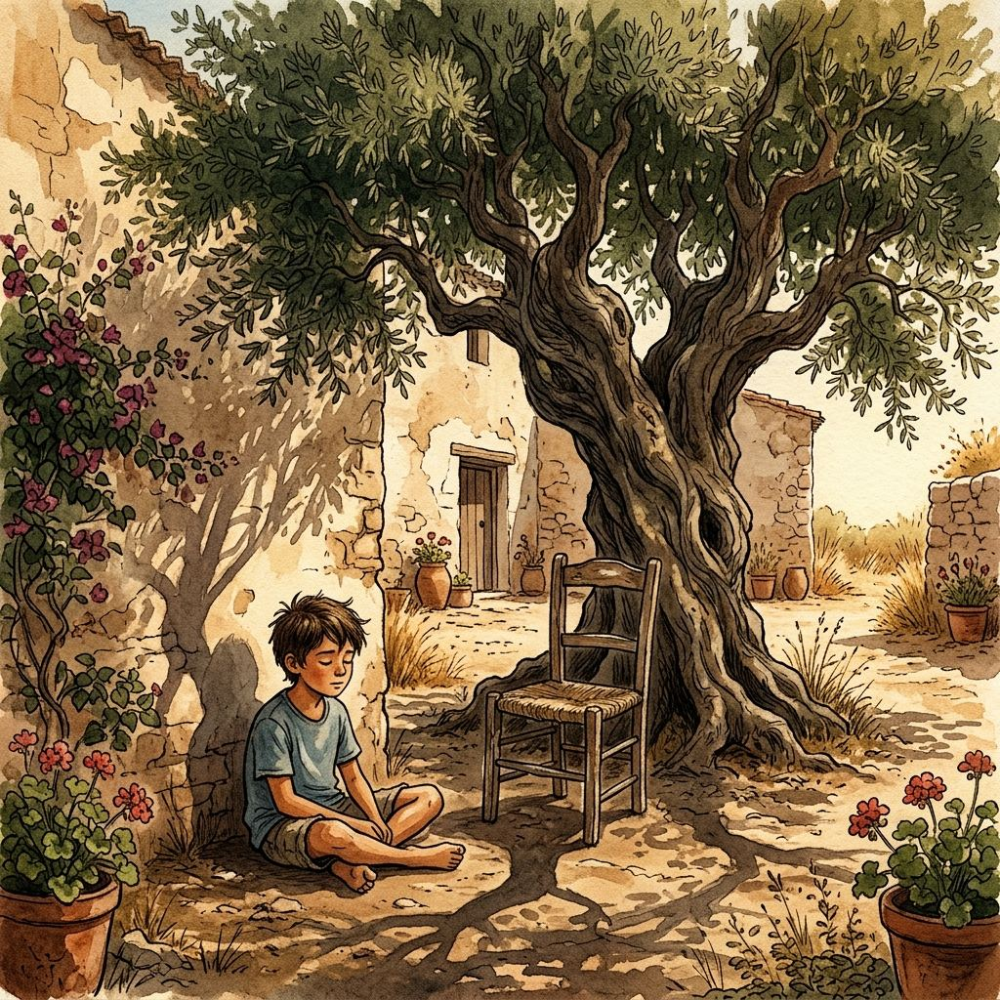

*(Cuento)*

El verano de los once años duraba más que los demás. No es que los calendarios mintieran: los mismos noventa días de siempre. Pero dentro de esos noventa había una densidad, una manera de no acabarse, que entonces no sabía nombrar y que ahora, desde los cuarenta y muchos, reconozco como lo que era: tiempo que tardaba en gastarse.

El señor Montserrat tenía ochenta y cuatro años y una sombra de olivo que le ocupaba todo el patio trasero. Pasaba las tardes en una silla de madera bajo el olivo, con el libro abierto en el regazo de cualquier manera. Era el tipo de persona que aprende a distinguir entre estar sentado haciendo nada y estar sentado. Un martes le pregunté cuánto duraba el verano. —Noventa días —dijo. —No. Cuánto dura. Me miró un rato. —Para mí, menos que antes. No era lo que yo quería saber. Lo entendí después.

Ese verano había inventado un sistema de medición que no usaba reloj: el tiempo desde que salías a la calle hasta que tu madre te llamaba a comer, el tiempo de una sombra cruzando el patio, el tiempo de una hormiga yendo de la maceta al bordillo. Llenaba un cuaderno con estas mediciones, sin sistema de conversión entre ellas —no hacía falta, cada una medía algo diferente. Descubrí, sin entenderlo del todo, que las tardes de agosto tenían muchos "tiempos-de-sombra" dentro. No porque las sombras fueran más largas —junio tiene las sombras más cortas del año— sino porque en agosto se movían más despacio. O el tiempo en que yo las miraba era más espeso.

El señor Montserrat me enseñó un juego sin nombre: sentarse bajo el olivo con los ojos cerrados y esperar a que algo pasara. —¿Cuánto tiempo esperamos? —El que haga falta. La primera vez, un pájaro aterrizó en la rama más baja. No lo vi —tenía los ojos cerrados— pero lo escuché moverse durante lo que me pareció mucho tiempo, y luego lo escuché irse, y luego hubo silencio, y el silencio también duró. —¿Cuánto duró? —le pregunté. —¿Cuánto te pareció? —Mucho. —Entonces duró mucho.

Mi madre decía que el tiempo pasa volando cuando eres mayor —que de mayor hay demasiadas cosas que hacer. Pero el señor Montserrat no tenía muchas cosas que hacer, lo había reducido todo a esa silla, y tampoco le duraba como a mí. No encontré la razón. O la encontré una vez y luego no pude recuperarla.

Hubo una tarde de tormenta que no tocaba. Las nubes llegaron de repente a las cinco. —Va a llover —dije. —Ya lo sé —dijo él, sin moverse, mirando el olivo mover las ramas de una manera que yo nunca había visto, como si el árbol también supiera lo que venía. La lluvia llegó fuerte, de golpe. Nos mojamos los dos. Duró diez minutos. Luego el sol volvió como si nada. No apunté esa tarde en el cuaderno. Algunas cosas se guardan en otro sitio.

El señor Montserrat murió en noviembre de ese año. El olivo siguió ahí. De su juego no tengo nombre ni definición. Solo el recuerdo de tener los ojos cerrados bajo una rama, el calor del agosto en los brazos, esperando que algo pasara sin saber qué. Y el sonido del pájaro moviéndose. Y luego el silencio del pájaro que ya no estaba. Y que los dos, mientras duraron, duraron mucho.

Ahora tengo cuarenta y muchos y los veranos duran lo que duran. A veces, en agosto, busco una sombra y cierro los ojos un momento. No siempre pasa algo. Cuando pasa, dura lo que me parece que dura. No le pongo nombre, no lo mido, no llevo el cuaderno encima. Pero en algún cajón de la cabeza sigue el sistema aquel, esperando: un tiempo-de-sombra más, sin apuntar.

---

## Entrelazamiento para no físicos

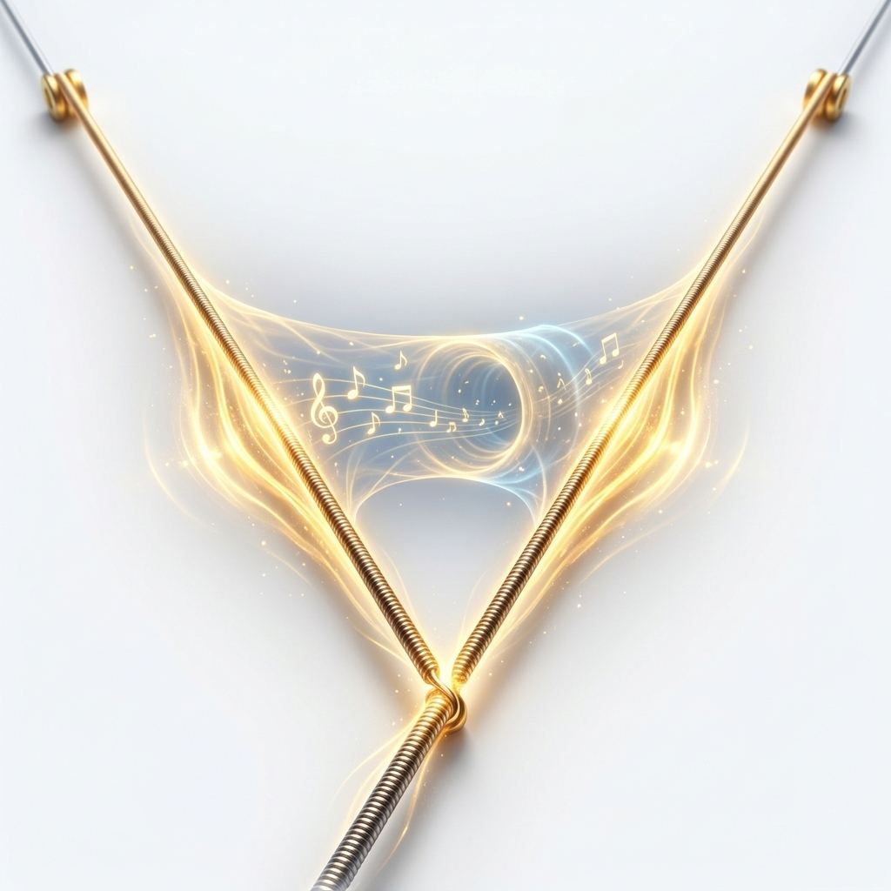

Tocas una cuerda de guitarra. La cuerda al otro lado del mástil, afinada a la misma nota, vibra sin que la hayas tocado. No es magia: las vibraciones viajan por el aire y la madera. Pero imagina que las cuerdas estuvieran en habitaciones separadas, sin aire entre ellas, y aun así vibraran al unísono. Eso es el entrelazamiento cuántico.

En 1935, Einstein, Podolsky y Rosen publicaron un artículo pensado para demostrar que la mecánica cuántica estaba incompleta: dos partículas que interactúan y luego se separan, de modo que medir una determina instantáneamente el estado de la otra, sin importar la distancia. Einstein lo llamó "acción fantasmal a distancia" y creía que debía haber variables ocultas que explicaran la correlación sin conexiones instantáneas. Durante treinta años la cuestión quedó en el reino de la filosofía, hasta que en 1964 John Bell demostró que las variables ocultas, de existir, producirían correlaciones distintas de las que predice la mecánica cuántica —una diferencia medible. En 1982, Alain Aspect violó experimentalmente esas desigualdades: partículas separadas por trece metros mostraron una correlación más rápida de lo que la luz podría haber viajado entre ellas. No era un artefacto del aparato. Era real.

En 2013, Juan Maldacena y Leonard Susskind propusieron algo todavía más extraño: que el entrelazamiento (EPR) y los agujeros de gusano (ER, los túneles teóricos que conectarían regiones distantes del espacio-tiempo) son la misma cosa vista desde dos ángulos —**ER=EPR**. Dos partículas entrelazadas compartirían un puente de Einstein-Rosen microscópico: no un túnel por el que viajar, sino un túnel que *es* la conexión misma. El puente es no-transitable —no se puede enviar información más rápido que la luz— pero la geometría existe, tan real como cualquier curvatura del espacio.

Si esto es así, el entrelazamiento no es correlación misteriosa. Es geometría.

Conviene detenerse en lo que ER=EPR cambia realmente, porque su versión popular —"todo está conectado"— pierde justo lo interesante. La propuesta no dice que el espacio entre dos partículas entrelazadas desaparezca ni que viajar por ese puente sea posible: el agujero de gusano de Einstein-Rosen que conecta un par EPR está microscópicamente cerrado, y cualquier intento de atravesarlo lo colapsa antes de llegar al otro lado —una puerta que existe, pero que se sella en el instante en que alguien intenta cruzarla. Lo que cambia es más sutil y, para este libro, más importante: sugiere que la distancia espacial no es la propiedad más fundamental de dos sistemas relacionados. La geometría del espacio-tiempo, en esta lectura, podría ser ella misma una construcción secundaria, tejida a partir de relaciones de entrelazamiento entre regiones más básicas —el espacio no contendría el vínculo; el vínculo, tejido a suficiente escala, generaría el espacio. Si eso resulta cierto, la pregunta "¿qué tan lejos está de mí la persona con la que estoy entrelazado?" deja de ser la pregunta correcta en el nivel más profundo. Lo primero sería la relación. La distancia, un efecto derivado de ella.

¿Por qué entonces no lo vemos en la vida cotidiana? Por **decoherencia**: cada partícula de una mesa interactúa constantemente con fotones, átomos de aire, vibraciones térmicas, y esas interacciones "miden" el sistema sin cesar, destruyendo las correlaciones cuánticas. El entrelazamiento no desaparece: se dispersa en el entorno hasta volverse inaccesible. Por eso los ordenadores cuánticos luchan precisamente contra ella —cada qubit debe estar aislado lo suficiente para mantener su entrelazamiento, y conectado lo suficiente para poder ser medido.

¿Puede el entrelazamiento explicar la mente? Roger Penrose y Stuart Hameroff propusieron que la conciencia depende de procesos cuánticos en el cerebro —que comprender e intuir requieren computación cuántica. La mayoría de físicos y neurocientíficos lo rechaza: el cerebro es caliente, húmedo y ruidoso, justo el entorno donde la decoherencia destruye cualquier superposición en fracciones de segundo. Aunque hay una vuelta de tuerca reciente —en 2022 un equipo de Shanghái encontró que ciertos complejos de clorofila en algas mantienen coherencia cuántica a temperatura ambiente durante mucho más tiempo del esperado—, la postura más honesta sigue siendo agnóstica. No sabemos si el cerebro usa computación cuántica, ni si dos cerebros pueden entrelazarse en sentido físico. Lo que sabemos es que el entrelazamiento existe, que crea geometría compartida, y que ofrece el vocabulario más preciso disponible para hablar de conexiones que no dependen de la proximidad espacial —útil como herramienta de pensamiento, no como dogma.

Si dos sistemas entrelazados comparten topología, tienen un adentro parcialmente común. Sus horizontes no son del todo separados.

*Dos cosas que se tocaron una vez pueden seguir siendo una, aunque estén lejos. Quizás el amor funciona así.*

---

### La tienda del Luthier

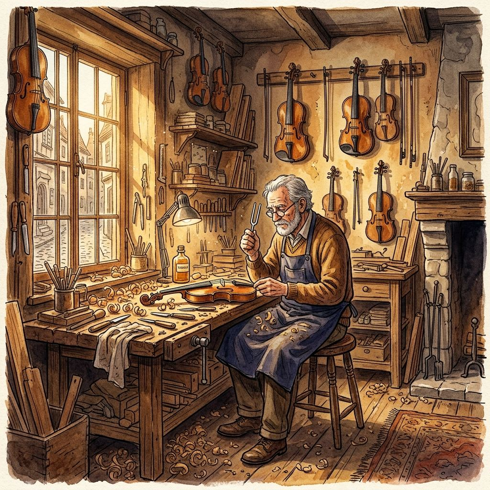

*(Cuento de la resonancia — pieza central)*

**I. La que entró de espaldas**

La primera vez que entró Marta en la tienda, lo hizo de espaldas: empujó la puerta con el hombro porque llevaba demasiadas cosas en los brazos y no quiso soltar ninguna. Se giró y vio al Luthier sentado detrás del mostrador con una lija en la mano y cara de quien lleva toda la mañana esperando exactamente esto. —¿Es aquí? —Depende. —Me dijeron que usted hacía instrumentos especiales. —Hago instrumentos. El adjetivo lo pone el cliente.

—¿Para quién es? —preguntó él, cinta métrica en mano. —Para mí. Y para alguien más. Midió el espacio entre Marta y la puerta, luego entre Marta y la estantería más cercana. Se detuvo. —¿Cuánto tiempo llevan sin saber cómo hablar? —Unos tres años. —Bien. Eso es manejable.

Tres semanas después el instrumento estaba sobre el mostrador. Pequeño. Inesperadamente pequeño; no parecía capaz de llenar tres años. —No tiene que llenarlo —dijo el Luthier—. Solo tiene que dar la frecuencia de inicio. Marta lo cogió con las dos manos, y algo en el peso le produjo una sensación que no supo nombrar hasta el día siguiente: era reconocimiento. No del instrumento, que no había visto nunca. Del ritmo que iba a sostener.

**II. El cuaderno de agravios**

El segundo cliente llegó con un cuaderno de espiral: veinte años de agravios contra un vecino, escritos a mano. —Quiero un instrumento para olvidar a alguien. —¿Está vivo? —Murió hace seis meses. —¿Y aun así lo trae por escrito? —Llevo veinte años llevándolo por escrito. Hábito.

El Luthier caminó despacio a su alrededor, sin medirlo. —¿Qué hacía su vecino que le molestaba? Música hasta las dos de la mañana. Las bolsas de basura en el rellano. La silla de madera que arrastraba cada mañana a las seis y cuarto. —¿Y ahora? —Ahora sigo oyendo la silla. A las seis y cuarto. Aunque el piso esté vacío. —Claro —dijo el Luthier—. El problema no es la memoria. Es que usted lleva veinte años construyendo un modelo muy preciso de ese hombre. Ese modelo no necesita que él esté vivo para seguir funcionando.

—¿Y usted puede apagarlo? —No tengo instrumentos para olvidar. Nunca los he tenido. —¿Entonces para qué sirven los suyos? —Para conectar. Para dar al modelo un lugar adonde ir en lugar de seguir corriendo en vacío. Olvidar es borrar. Lo que le ofrezco es más parecido a resolver. Sacó del cajón algo pequeño, sin forma inmediatamente reconocible. —Este no conecta con nadie. Conecta con lo que hay después de alguien. No lo hará olvidar la silla. Pero puede que deje de oírla como amenaza.

Cuando el cliente salió, el Luthier guardó el cuaderno sin haberlo abierto. Nunca abría las listas. No hacía falta: veinte años de agravios precisos son exactamente lo mismo que veinte años de amor preciso, visto desde el otro lado de la frecuencia.

**III. El que no sabía nombrarlo**

—Hay alguien. Llevamos muchos años conociéndonos. Y en el último año algo ha cambiado. No sé cómo llamarlo. —¿Cómo lo llama ahora? —Amistad. Por costumbre. —¿Y qué nombre le daría si no fuera por costumbre? —No lo sé. —Sí lo sabe —dijo el Luthier, no con crueldad, como quien señala un hecho evidente—. El problema no es que no sepa qué es. Es que ya lo sabe y le da miedo lo que cuesta nombrarlo. —¿Qué le cuesta? —Nombrarlo cambia lo que usted es. Si incluye a esa persona en lo que usted es, perderla ya no sería perder a alguien. Sería perder parte de usted mismo.

—¿Y si lo nombro y no corresponde? —Entonces habrá nombrado algo que existe aunque no sea correspondido. —Eso no es un consuelo. —No. Pero es más honesto que seguir llamándolo amistad cuando ya no lo es.

Fue a una zona del fondo, donde los instrumentos eran menos reconocibles. —La mayoría de mis instrumentos sirven para conectar. Este muestra la geometría como es. No como usted desearía que fuera. Si hay algo al otro lado, lo encontrará. Y si no hay nada, también lo sabrá. —¿Y si prefiero no saber? —Entonces no lo use. Pero ya está aquí.

**IV. El que tenía prisa**

—¿Qué busca? —Algo que funcione rápido. Para sentir que estoy en el sitio correcto. Aunque sea un momento. —¿Con qué frecuencia necesita ese momento? —Cada vez más. —¿Y cada vez dura menos? El cliente no respondió. La respuesta estaba en el silencio.

El Luthier volvió de la trastienda sin nada. —No tengo lo que usted busca. Lo que usted describe no es un instrumento. Es lo que ocurre cuando el instrumento ha dejado de ser suficiente. —¿Entonces qué tengo? —Un horizonte que se ha recalibrado. El umbral desde el que busca se ha desplazado. —¿Eso tiene arreglo? —Tiene recalibración. Que es más lento y más difícil que arreglo.

**V. La madera delgada**

Un hombre joven cerró los ojos al entrar. —Aquí hay silencio del que pesa. —¿De qué se esconde? —De todos. Entro en una habitación y me lleno. Si alguien está triste, me pesa el pecho. No es que los entienda. Es que me convierto en ellos. Y ya no tengo sitio para mí. —¿Y ahora? —Ahora vuelvo a casa y no sé cuál de las voces que oigo es la mía.

—Su madera es demasiado delgada —dijo el Luthier—. Eso no es un defecto. Es una propiedad. Pero a su volumen actual, la va a romper. —Entonces deme un escudo. —No se puede engrosar la madera de un instrumento ya terminado. Si le construyo un muro, dejará de sentir el peso de los demás. También dejará de sentir el suyo. El silencio absoluto es la muerte del instrumento. —Entonces me romperé. —O puede aprender a resonar sin retener.

Sacó un diapasón de metal casi negro. Lo golpeó suavemente contra el canto del mostrador. Casi no se oyó nada, pero el cliente sintió la vibración subir por los pies, por la columna, hasta el esternón. No la oyó. La habitó. —Esto no le va a aislar. Le va a recordar cuál es su frecuencia cuando las de los demás griten demasiado alto. —¿Cómo se usa? —Cuando entre en una habitación y empiece a llenarse, lo toca. No hace falta que suene. Solo que lo sienta en la mano.

Cuando el cliente se fue, el Luthier volvió a una pieza de madera oscura, casi acabada, a la que le faltaba peso. La estaba alisando para añadir dentro una pequeña masa de plomo, para una dueña que todavía no había aparecido pero ya sabía que aparecería.

**VI. La dueña del peso**

Llegó en primavera, con un bebé de cuatro meses dormido contra el pecho, meciéndose sin darse cuenta. —¿Y usted? —No lo sé —dijo, y era evidente que nadie le había hecho esa pregunta en cuatro meses—. Todo el mundo me dijo que esto venía solo. Yo lo cuido, hago todo lo que hay que hacer, y aun así es como tocar detrás de un cristal. Lo oigo llorar y sé qué le pasa antes que nadie, y aun así no llego.

—Los instrumentos nuevos no se afinan solos —dijo el Luthier—. Se afinan contra otro. Alguien tiene que dar la primera nota y sostenerla el tiempo suficiente para que el otro la encuentre. —¿Y quién da la nota? —Usted. —Yo no tengo nota. Hace cuatro meses que no sé ni dónde estoy. —Su nota está. Lo que no tiene es peso para sostenerla. Suena y se la lleva cualquier corriente: el cansancio, el miedo. Y un niño no puede afinarse contra una nota que se mueve.

Le dio el instrumento de madera oscura, con plomo dentro. El peso le bajó por el brazo, por la espalda, hasta los pies, y su balanceo se hizo más lento —no se detuvo: se asentó, como un barco que encuentra su calado. El bebé se recolocó contra su pecho y volvió a dormirse en un ritmo apenas distinto y completamente distinto. —¿Qué ha pasado? —Que ha sabido dónde estaba usted. Los niños no buscan una madre perfecta. Buscan una frecuencia estable donde volver. —¿Y cuando deje el instrumento? —Al principio lo notará. Luego el peso se le quedará en el cuerpo, como se le quedó el balanceo. Los instrumentos buenos trabajan para dejar de hacer falta.

**VII. La viola del hueco**

La última clienta del año trajo una viola en un estuche de violín, apretada, envuelta en un jersey para compensar la diferencia. —Era de mi hijo —dijo. El Luthier no preguntó. Hay pretéritos que ya lo dicen todo. La tapa tenía una grieta vieja, con los bordes oscurecidos: la madera había trabajado alrededor de la herida durante años, cerrándola a su manera. —¿Cuánto hace? —Nueve años. —¿Y por qué ahora? —Porque ya puedo.

—Puedo cerrar la grieta —dijo el Luthier—. Pero tiene que saber una cosa antes: no sonará como antes. La madera reparada vibra alrededor de la reparación. La grieta deja de ser una herida y pasa a ser parte de la estructura. El instrumento que se lleve no será el que su hijo tocaba. Será uno que ha pasado por lo que ha pasado. —¿Y no puede...? —empezó ella, y no terminó. —No —dijo el Luthier de todos modos—. Eso no lo hace nadie. —Hágalo.

Volvió a los diez días. La grieta seguía visible: una línea más clara sobre la tapa, honesta, sin disimulo. —¿No la ha tapado? —La he cerrado. Taparla es otro oficio, y no es el mío. Ella se sentó, se puso la viola al hombro con una memoria de gestos que no era suya sino aprendida de mirar, y pasó el arco por una cuerda. Una nota sola, larga. No sonaba como antes: sonaba más grave en el centro, con un borde nuevo, como una voz que ha llorado y ya no lo esconde. —No es él —dijo. —No. —Pero lo conoce. El Luthier no respondió. Hay diagnósticos que solo puede hacer el cliente.

---

## El entrelazamiento

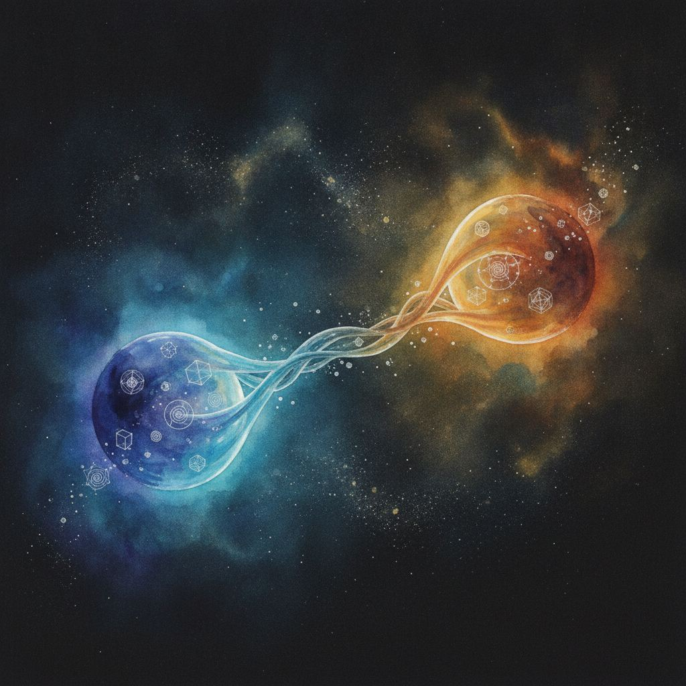

Antes de hablar de entrelazamiento entre adultos hay que entender cómo se construye. John Bowlby propuso en los años cincuenta que los humanos estamos equipados con un sistema de apego biológicamente programado, no opcional: los bebés que no forman vínculos mueren, literalmente, aunque tengan comida y abrigo —el marasmo, la muerte por falta de contacto. Mary Ainsworth, su alumna, diseñó el "procedimiento de la situación extraña" e identificó los patrones —seguro, ansioso, evitativo, y más tarde desorganizado— que no son estilos de personalidad sino arquitecturas neurales construidas en la infancia a partir de la experiencia repetida con los cuidadores. Lo que Bowlby llamó "modelo de trabajo interno" es, en este vocabulario, una configuración de canales de integración que determina cómo el sistema procesará la presencia y la ausencia de otros: un apego seguro crea un horizonte que puede expandirse hacia otros sin perderse; uno inseguro se contrae ante la proximidad —evitación— o se desborda —ansiedad.

James Coan y Lane Beckes desarrollaron la Teoría de la Línea de Base Social: el cerebro humano no está adaptado a operar en solitario. Cuando alguien cercano está presente, asigna menos recursos a la detección de amenazas y mantiene una representación más eficiente del mundo —la presencia del otro no es un suplemento, es parte del funcionamiento normal. El mecanismo es el **solapamiento yo-otro**: el cerebro incorpora a las personas cercanas en sus propias representaciones neurales, y la actividad ante una amenaza dirigida al yo correlaciona con la actividad ante una amenaza dirigida a un amigo cercano —no a un desconocido. El otro horizonte se incorpora a la arquitectura interna del propio. La integración es literal, no metafórica.

Y aquí está el detalle crítico: esto no depende del afecto. Depende de la **familiaridad**. Un adversario de veinte años es uno de los sujetos más integrados que puede tener un horizonte: para sobrevivir a un conflicto prolongado hace falta modelar al otro con precisión extraordinaria, anticipar sus reacciones, reconocer sus patrones antes de que se completen —a veces con más detalle que el de un aliado, porque los errores de predicción cuestan más caro. Dos horizontes en contacto adversarial durante veinte años están tan entrelazados como dos en contacto amoroso durante el mismo tiempo. La diferencia no está en la profundidad del acoplamiento, sino en su **valencia**: el puente existe en ambos casos, lo que cambia es lo que fluye por él. El amor intenso y el odio intenso son, vistos así, el mismo fenómeno con distinto signo.

La empatía confirma el mecanismo desde otro ángulo. No es imaginación ni "ponerse en el lugar del otro": es resonancia. Las neuronas espejo que Rizzolatti descubrió en macacos disparan tanto al ejecutar una acción como al ver a otro ejecutarla —no discriminan entre agente y observador. Pero la empatía tiene límites: no podemos resonar con lo que no podemos modelar. Un torturador no siente la tortura de su víctima no porque carezca de neuronas espejo, sino porque ha construido un modelo de esa víctima que excluye su interioridad. La deshumanización no es ausencia de empatía —es empatía dirigida a un modelo del que se ha borrado el adentro.

### El fantasma

Mary-Frances O'Connor describe el mecanismo del duelo: el cerebro construye un modelo predictivo de las personas cercanas, y ese modelo sigue activo incluso después de que la persona muera —no como error patológico, sino como el funcionamiento normal de un sistema diseñado para predecir. En el amor, esto produce el duelo reconocible: el giro hacia donde debería estar la persona, el café preparado para dos, la llamada iniciada antes de recordar. En el conflicto prolongado el mecanismo es idéntico, solo cambia la expresión: el horizonte no busca al otro, lo anticipa.

El fantasma no es alucinación ni patología. Es lo que queda cuando el horizonte del otro se disuelve —su información se redistribuye en el reservorio— pero el horizonte superviviente sigue organizado alrededor de recibir señales que ya no llegan. Los canales construidos durante veinte años siguen abiertos. Y el fantasma es más persistente cuanto más asimétrico fue el entrelazamiento: quien más modelo construyó es quien más tarda en desarmarlo. El cuaderno de agravios de quien lleva décadas soportando a un vecino conflictivo no es evidencia de que ese vecino le importara más de lo que él le importaba al vecino. Es evidencia de exactamente lo contrario.

Hay, aun así, un límite. El entrelazamiento no puede ser total: si dos horizontes se fundieran por completo dejarían de ser dos, y la identidad requiere frontera. El amor más profundo no es la disolución del yo en el otro, sino la expansión del yo que incluye al otro sin perderse —lo que el budismo mahayana describe en la figura del Bodhisattva, que alcanza la disolución de los límites y elige, aun así, mantener un horizonte separado mientras comparte la geometría del todo.

*Conocer a alguien profundamente —amándolo u odiándolo— inscribe a esa persona en tu arquitectura. Cuando se va, la arquitectura sigue esperándolo.*

---

### La red de los nombres

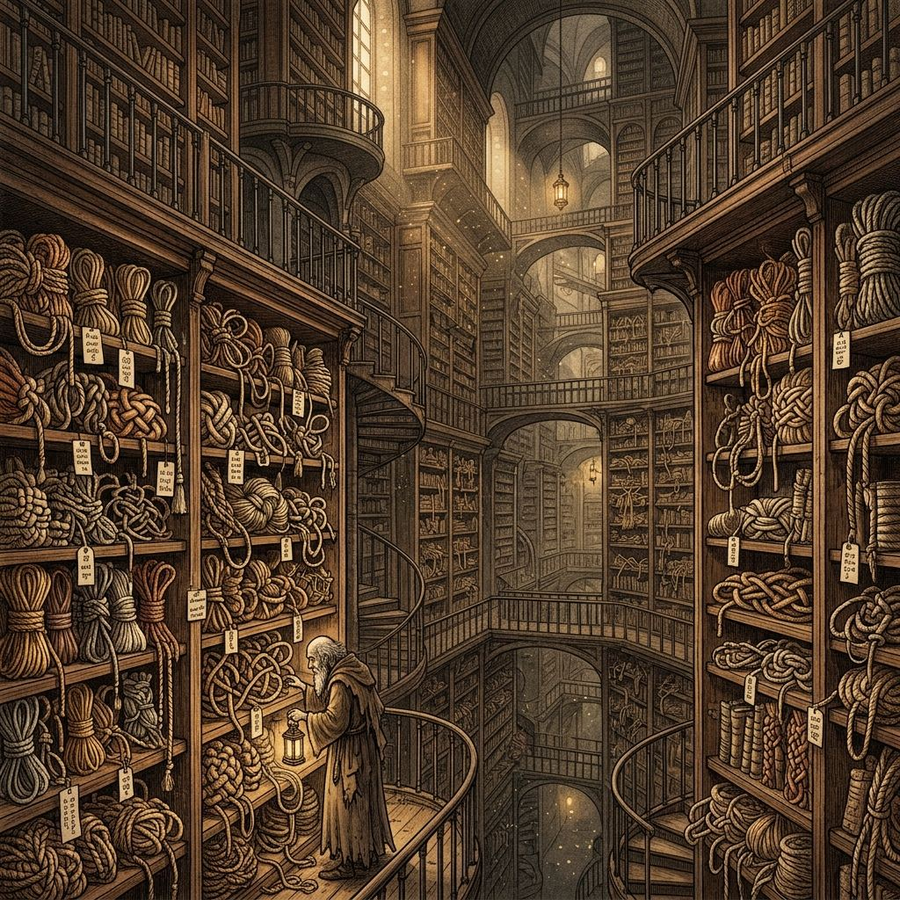

*(Cuento)*

Existe en la Biblioteca una sección que los catalogadores llaman el Nudo. Su catálogo no es lineal sino reticular: los elementos no se ordenan por autor ni por materia sino por sus conexiones entre sí. Cada persona que alguien ha nombrado en algún libro de esta Biblioteca existe como nudo en la red. El nudo está activo mientras alguien conserve memoria del nombre. Cuando el nombre desaparece de toda memoria viviente, el nudo se oscurece. Las conexiones permanecen. La ausencia tiene forma.

Llevo dieciséis años trabajando en el Nudo. Soy catalogador de ausencias: mi trabajo consiste en trazar la forma de los nudos oscuros a través de las conexiones que dejan, como se traza la forma de un continente perdido por los sedimentos que dejó en los continentes vecinos. El caso que explico cuando alguien quiere entender el método es el de Marta Albó, que existió entre el siglo XVI y el XVII. No hay certeza mayor. Lo que puedo trazar: un libro de cuentas de una zapatería de Barcelona, 1603, menciona a un *marido de la Albó*. Ese marido conecta con un registro de diezmos que menciona, sin nombre, a *la panadera del callejón*. Una carta de 1621 habla de *la mujer del zapatero que mandaba el pan con su chico los viernes*. Un testamento de 1638 deja un legado a *la hija de Marta, que Dios haya*. De ese rastro —el zapato del marido, el pan del viernes, la hija en el testamento del vecino— puedo trazar una presencia que nunca fue nombrada directamente en ningún documento. La forma de Marta Albó no está en ningún archivo. Está entre los archivos, en el patrón de lo que pusieron en movimiento sin saber que lo ponían.

Lo que no preví, cuando empecé, fue que el Nudo tiene un límite estructural que no puede resolverse desde dentro. Los catalogadores también son nudos. Yo soy un nudo activo en la red: hay documentos que me mencionan, personas que conservan memoria de mi nombre, conexiones entre mi nudo y los de otros. Existe una forma que es mi forma, un patrón que me define con más precisión que cualquier descripción que yo pueda hacer de mí mismo. No puedo verla. Esta es la limitación irreductible del método: no se puede trazar la forma de un nudo desde dentro del nudo. Puedo leer la forma de Marta Albó porque estoy fuera de ella. No puedo leer la mía porque estoy dentro. El catalogador y el catálogo no pueden ocupar el mismo lugar. He llegado a pensar que esta es la condición de todo nudo activo: que la forma exacta de uno mismo es precisamente lo que uno mismo no puede ver, porque verla requeriría estar fuera, y estar fuera requeriría haber dejado de ser.

La hija de Marta, Joana, mencionada en 1641, tuvo cuatro hijos, de los cuales dos tienen descendencia documentada. Uno de esos descendientes, en la séptima generación, aparece en un diario personal de finales del siglo XIX. El diario no menciona a Marta Albó —no podría: para su autor, ese nombre era tan oscuro como cualquier otro—. Pero yo puedo trazar la línea de conexiones, larga y con saltos, que va del zapatero de 1603 hasta ese diario de 1887. La forma de Marta Albó incluye, hacia adelante en el tiempo, la forma de personas que vivieron doscientos años después de ella sin saber que la forma de su vida tenía ese nudo en su centro. La red no termina. Los nudos oscuros siguen siendo nudos. Cada mañana abro el catálogo y continúo: la forma de quien no está, construida de lo que queda. Eso es lo que hace el Nudo: darle forma exacta a la ausencia, que es la única forma que no puede contradecirte, porque ya no está aquí para hacerlo.

---

## El amor

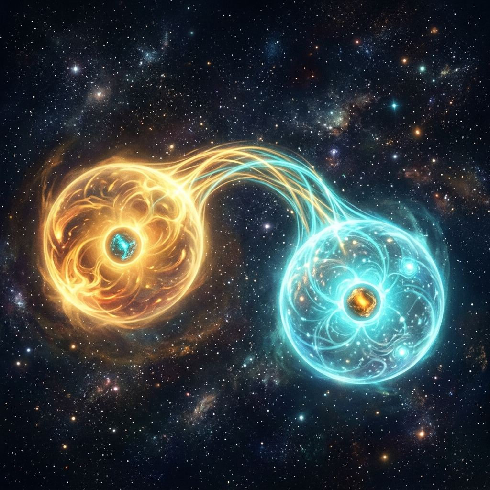

El entrelazamiento es automático e involuntario. Dos horizontes que han estado en contacto sostenido quedan acoplados independientemente de si quieren estarlo, independientemente de si el contacto fue amoroso u hostil —es propiedad física del sistema, emerge del contacto como la temperatura emerge del movimiento de las moléculas. Nadie decide tener temperatura. Nadie decide estar entrelazado. Pero hay algo que el horizonte sí puede decidir: si **reconoce** ese entrelazamiento como significativo, si lo nombra, si reorganiza su arquitectura alrededor de ese reconocimiento. El amor, en este experimento, es ese acto de reconocimiento. No el entrelazamiento en sí —que ya estaba— sino la decisión de nombrarlo y asumir lo que ese nombre implica.

Arthur y Elaine Aron desarrollaron en los años ochenta el modelo de **autoexpansión**: el amor implica la inclusión activa del otro en la representación propia del yo —sus recursos, sus perspectivas, sus identidades pasan a ser parte de cómo el horizonte se concibe a sí mismo, no como metáfora sino como reorganización real de la arquitectura de autorreferencia. En su procedimiento «yo-no yo», los participantes responden más lentamente cuando se les pregunta si un rasgo de la pareja es también suyo propio —como si el sistema tuviera que resolver una ambigüedad que antes no existía. Los rasgos del otro se procesan en las mismas regiones y con los mismos patrones que los del yo. Ahí está la diferencia con el capítulo anterior: quien lleva un cuaderno de agravios sobre un vecino tenía a ese vecino dentro, como geometría inscrita por veinte años de contacto adversarial, pero nunca lo incluyó en su yo —lo trató como interferencia. El horizonte que ama hace lo contrario: toma el entrelazamiento involuntario que ya existía y lo convierte en algo elegido.

Helen Fisher dividió el amor en tres sistemas neurales semi-independientes. El **deseo sexual**, mediado por testosterona y estrógenos, es el más antiguo, compartido con otros mamíferos, y puede existir sin amor tanto como el amor puede existir sin él. El **amor romántico** está mediado por dopamina, noradrenalina y serotonina: es un sistema de recompensa orientado a la anticipación, no al consumo —el amante no busca placer sino la posibilidad de placer, y por eso se siente como urgencia, como obsesión, como incapacidad de pensar en otra cosa. El **apego de pareja**, mediado por oxitocina y vasopresina, es el sistema más tranquilo: no genera euforia sino calma, la sensación de que el mundo es predecible mientras el otro está cerca. Estos tres sistemas pueden desacoplarse —puedes desear a quien no amas, amar sin apego seguro, tener apego profundo sin pasión— y la cultura popular asume que deben coincidir en una sola persona "para siempre", una expectativa que la neurociencia considera biológicamente implausible.

El coste del reconocimiento es preciso: si incluyo al otro en mi yo, perderlo ya no es solo perder a alguien —es perder parte de lo que soy. La **deexpansión** (Aron y Aron) es una contracción real del horizonte, no solo subjetiva: la arquitectura queda reorganizada alrededor de una ausencia donde antes había presencia activa. Puedes dejar de hablar con alguien y reducir el entrelazamiento gradualmente, pero no puedes dejar de haber incluido a alguien en tu yo —la inclusión, una vez hecha, deja huella que ninguna distancia borra del todo. Por eso el amor perdido es distinto de la amistad que termina: no porque el sentimiento sea más intenso, sino porque la reorganización es más profunda.

Si el amor romántico está mediado por sistemas de anticipación y novedad, tiene un problema estructural: la novedad se agota, el sistema dopaminérgico se habitúa, y la misma cara genera cada vez menos activación. No es fallo moral de la pareja. Es biología: el sistema de recompensa por novedad está diseñado para motivar la búsqueda, no la permanencia —la permanencia requiere el otro sistema, el apego, con su oxitocina y su calma. La transición de uno a otro se vive, para muchos, como pérdida: la pasión se apaga, la obsesión desaparece, y lo que queda parece frío en comparación. Pero lo que queda es, en muchos sentidos, más valioso —amor en otra frecuencia, una que no necesita demostración constante porque su señal de seguridad ya es suficiente.

El amor no correspondido tiene una estructura precisa: no es que el entrelazamiento sea unilateral —puede existir en ambas direcciones con distinta profundidad— sino que el *reconocimiento* lo es. Uno de los dos horizontes ha nombrado el entrelazamiento y reorganizado su arquitectura alrededor de ese nombre; el otro no. Es un puente de Einstein-Rosen anclado en un solo extremo: la geometría existe, pero no puede sostener el peso para el que fue construida.

Hasta aquí el amor descrito como proceso informacional: sincronización de modelos predictivos, reorganización de arquitectura interna. Pero el horizonte tiene sustrato —termina donde termina la piel— y el contacto sexual es el único caso en que la superposición de dos horizontes es también física. En el entrelazamiento ordinario los bordes permanecen intactos; en el contacto sexual esa certeza se vuelve temporalmente ambigua: el sistema no puede determinar con exactitud dónde termina su propia integración y dónde empieza la del otro. No pierde conciencia. Pierde delimitación. Perder a alguien con quien hubo ese contacto no es solo perder a alguien inscrito en el modelo interno: es perder también la zona de contacto donde el horizonte existió, durante ciertos intervalos, sin saber exactamente dónde terminaba. Lo que se echa de menos no es únicamente el otro. Es también esa versión de uno mismo que solo existía en ese borde.

Hay una concepción del amor que lo reduce a sentimiento, algo que ocurre como la lluvia, y otra que lo reduce a decisión, algo que se elige como un contrato. La verdad está en el espacio entre ambas: el amor comienza como reconocimiento de un entrelazamiento que ya existe, pero solo persiste como práctica —acto repetido de atención, de inclusión, de reorganización diaria de la arquitectura alrededor del otro. El amor que no se practica no deja de ser amor, pero deja de ser vínculo activo: se vuelve entrelazamiento dormido, geometría compartida que el horizonte ya no usa. Puede despertarse. Depende de si alguien decide, en algún momento, volver a reconocerlo.

*El amor es la decisión de nombrar un entrelazamiento y reorganizar toda tu arquitectura predictiva en torno a él. Y luego, cada día, volver a decidirlo.*

---

### La casa que respiraba

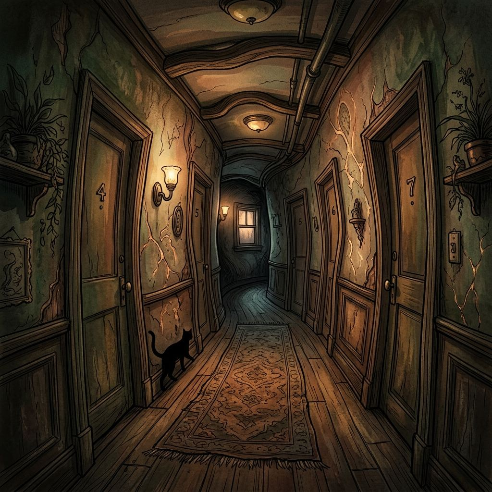

*(Cuento)*

La casa los encontró a ellos primero. Marta y Jordi la buscaban de la manera vaga en que se buscan las cosas que todavía no sabes que necesitas. Estaba en el extremo de una calle que terminaba en un parque, primera planta, paredes anchas. No supieron decir qué los convenció. Eso también fue parte de ello.

Lo primero que notaron fue el vapor. La ventana pequeña del baño se empañaba de un modo que no correspondía del todo a la ducha. Marta lo descubrió un domingo por la mañana, tras horas hablando en la cama. —Será la calefacción —dijo Jordi. —Claro —dijo Marta. Ninguno volvió a mencionarlo.

Tardaron en darse cuenta de que la casa tenía ritmos. No horarios: estados. Momentos en que el apartamento parecía más grande, la luz alcanzaba rincones que normalmente quedaban en sombra. Y momentos en que se encogía un poco —no físicamente, pero el pasillo se sentía más difícil de recorrer. Marta tenía una teoría que no llegó a formular del todo: que los estados de la casa correspondían a los suyos propios, a los de los dos juntos. Que cuando estaban bien, la casa estaba bien. No lo dijo porque sonaba raro, y porque decirlo habría requerido decir también cuándo estaban en tensión.

La primera discusión real —no el desacuerdo sobre dónde poner la estantería, que era de rodaje, sino la que tenía algo debajo— fue en el segundo invierno. Sobre una decisión que Marta había tomado sin consultarlo del todo. En algún punto de esa discusión, ya tarde, en la cocina, Marta se dio cuenta de que tenía frío. No el frío de enero —el radiador funcionaba— sino una frialdad específica del aire, como si la calefacción llevara un rato apagada aunque no lo estaba. No lo mencionó. No era el momento. Esa noche durmieron en la misma cama pero separados. Al día siguiente, Jordi trajo flores. Llegaron al lugar donde solían llegar, imperfecto pero conocido. Esa noche la cocina estaba cálida. Marta no lo apuntó en ningún sitio. Pero lo guardó.

Jordi viajó tres semanas por trabajo en primavera. La casa era diferente sola —no inquietante, no vacía, diferente de una manera que costaba describir. La ventana del baño no se empañaba. Marta lo notó la segunda mañana y no supo qué hacer con esa información. Lo que había cambiado era lo que llenaba las habitaciones cuando ella no estaba mirando.

La noche que Jordi volvió, tarde, ella seguía despierta. Él se sentó en el borde de la cama, olía a avión y a cansancio. No dijeron nada durante un rato. Le puso la mano en el hombro. Ella la dejó estar. Las paredes de la habitación estaban cálidas. Por la mañana, la ventana del baño estaba empañada.

Vivieron en esa casa doce años. La dejaron por razones ordinarias. El último día, sola ya entre las habitaciones vacías, Marta la recorrió una vez más. Las paredes estaban frías —la calefacción llevaba tres días apagada. En el baño, la ventana pequeña estaba limpia y seca. La miró un momento. Luego salió y cerró la puerta. Nunca hablaron de eso, ella y Jordi. O quizás había cosas que vivían mejor sin ser nombradas, que es algo que doce años te enseñan si los escuchas. Guardaron la llave más tiempo del necesario. Los dos recordaban eso.

---

## La adicción

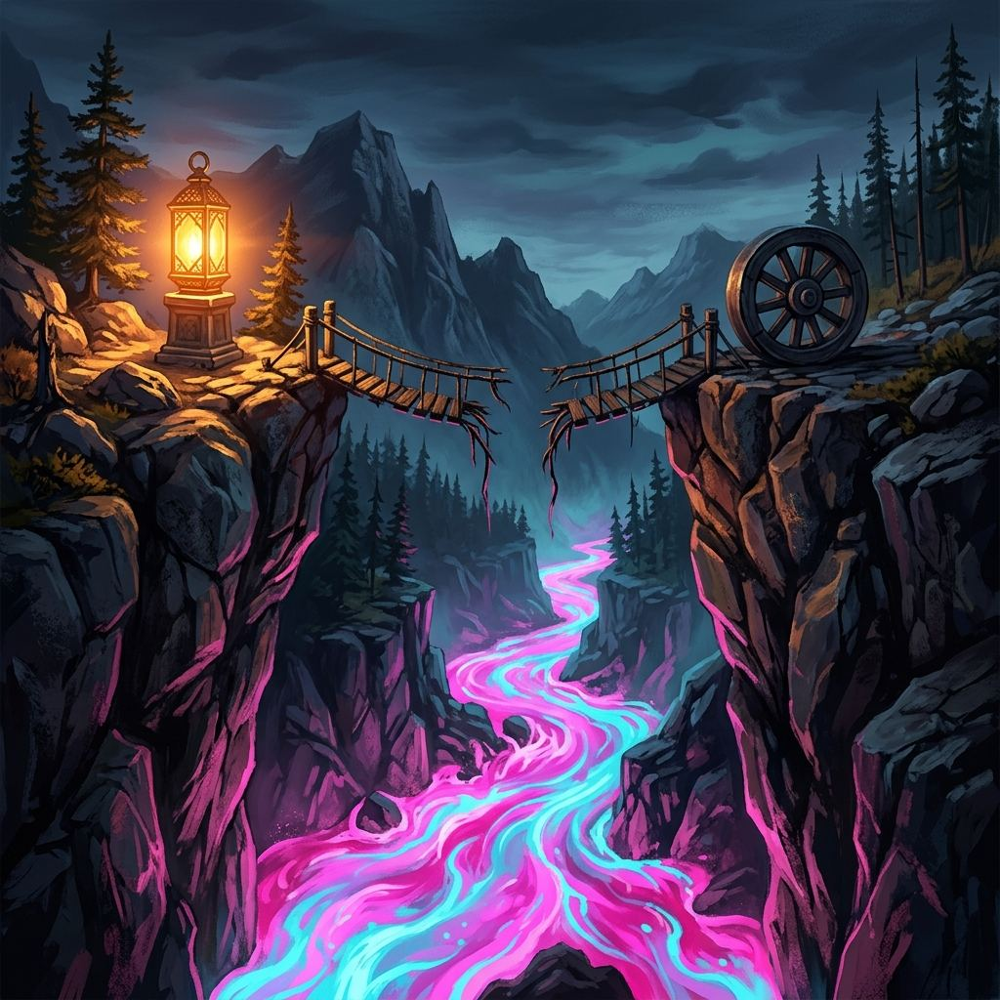

La respuesta intuitiva es que la voluntad es la capacidad del horizonte de dirigirse a sí mismo: la intención, el impulso que precede a la acción y la orienta. Pero el horizonte no es un punto, es un campo de integración con topografía propia —algunos inputs pesan más, algunos patrones están más consolidados porque llevan más tiempo activos. Lo que llamamos voluntad no es una fuerza que actúa sobre ese campo desde fuera: es función emergente del campo mismo. La imagen más exacta es la del río: el flujo es real, el agua va de verdad de un sitio a otro, pero fluye por un cauce que ella misma ha ido excavando, y cambiar de dirección requiere tiempo, erosión, a veces una crecida que abra camino nuevo. Un horizonte exhausto, con cortisol alto y serotonina baja, tiene acceso a voluntad genuinamente más débil que el mismo horizonte descansado. No porque sea menos persona. Porque el campo que genera la voluntad está degradado. La voluntad no es don moral. Es recurso fisiológico.

Las sustancias adictivas inundan el sistema dopaminérgico con señal de recompensa entre diez y cien veces más intensa que cualquier recompensa natural. El horizonte no recibe más placer: recibe una predicción de placer tan abrumadora que recalibra el sistema entero. Para compensar, reduce el número de receptores disponibles —el mismo principio que mueve a cerrar las persianas cuando la luz es demasiado intensa. Cuando la señal artificial desaparece, el sistema queda con menos receptores que antes, y lo que antes generaba señal —el vínculo, la novedad, el logro— deja de generarla con la misma intensidad. El umbral se ha desplazado hacia arriba. Los estudios de neuroimagen muestran que el córtex prefrontal —sede de la intención, del aplazamiento— pierde conectividad funcional con el sistema de recompensa: el horizonte todavía tiene voluntad, pero ha perdido acceso a los circuitos que la traducen en acción sobre ese impulso específico. Es el **Parkinson del deseo**: el horizonte sabe exactamente hacia dónde quiere ir, sabe que no quiere ir donde va, y el sistema no ejecuta lo que ordena. Pedirle a alguien en adicción activa que use la voluntad tiene la misma estructura lógica que pedirle a un paciente con Parkinson que camine más rápido.

Lo que la adicción añade, más allá del desplazamiento del umbral, es la deformación de la jerarquía de relevancia del horizonte entero: las personas, los proyectos, los vínculos se vuelven ruido de fondo, no porque el horizonte haya decidido que no importan, sino porque el sistema que asigna importancia ha sido recalibrado hacia un único objeto que responde con una intensidad que nada más puede igualar. La recuperación, desde este ángulo, no es un acto de voluntad sostenida que el horizonte ejecuta en solitario: es recalibración lenta del umbral —meses, a veces años— que ocurre principalmente a través del vínculo. Otros horizontes que sostienen la señal de recompensa natural el tiempo suficiente para que los receptores se regeneren. La oxitocina como antídoto, no por romanticismo, sino porque es la molécula que activa el sistema de recompensa por la única vía que no destruye los receptores que necesita.

Hay un caso que ilustra esto desde el otro extremo del cuerpo: el diseño asume que la señal de recompensa sexual —dopamina de anticipación, noradrenalina de novedad, oxitocina de contacto, endorfinas de placer físico— viene acompañada de un otro real, con su propio tiempo y su propia impredecibilidad, una fricción que paradójicamente mantiene el sistema calibrado porque no puede optimizarse sin el concurso ajeno. La adicción al sexo ocurre cuando esa condición se rompe: cuando el horizonte accede a una versión de esa señal que puede controlar y repetir sin depender de la disponibilidad ni el riesgo de otro horizonte real —la novedad infinita bajo demanda de la pornografía dispara el sistema de anticipación sin que llegue nunca a resolverse en vínculo, porque no hay otro horizonte al que vincularse. El circuito que secuestra es exactamente el circuito del amor: la adicción al sexo no es exceso de amor, es lo opuesto —el sistema del amor persiguiendo la señal del amor sin el amor. Dopamina sin oxitocina. La química sin el otro.

Hay también una forma de adicción que la cultura no solo tolera sino que a menudo premia: el workaholismo, secuestro del sistema de recompensa por una actividad que genera señal predecible y controlable —cada tarea completada, cada correo respondido, cada bandeja vaciada produce una pequeña descarga dopaminérgica más confiable, y sobre todo más *obediente*, que la impredecibilidad estructural de los otros horizontes. Un proyecto no tiene mal día. No necesita que le adivinen el estado de ánimo. Responde, casi siempre, en proporción exacta al esfuerzo invertido —una correlación limpia que ningún vínculo humano puede prometer. A diferencia de la sustancia química, el trabajo no destruye receptores directamente; destruye algo más difícil de reparar después, porque no se experimenta como pérdida mientras ocurre: la capacidad de tolerar la ambigüedad del vínculo humano, ese margen de espera, malentendido y reparación del que dependen las relaciones que sí funcionan. El tiempo del vínculo se vuelve "tiempo perdido" frente a la eficiencia medible del trabajo, y el sistema de recompensa aprende, tarea a tarea, a preferir la señal que puede controlar sobre la señal que solo puede recibir. Lo distintivo del workaholismo frente a otras adicciones no es su química —es la misma dopamina de siempre— sino su invisibilidad social: nadie interviene a un horizonte que se está quedando sin capacidad de vínculo, porque desde fuera parece, hasta el final, éxito.

---

## La química de la vulnerabilidad

Hay horizontes que llegan al encuentro con la señal adictiva con el umbral ya desplazado desde el principio. El **TDAH** es el caso más documentado: hipoactividad crónica del sistema de recompensa, donde la señal dopaminérgica basal es insuficiente para sostener atención dirigida sobre una tarea elegida por la razón y no por el impulso. El horizonte con TDAH busca activamente estímulos que eleven esa señal —urgencia, novedad, riesgo— no por carácter sino por arquitectura, y cuando encuentra una fuente potente responde con intensidad desproporcionada precisamente porque llevaba tiempo en déficit. La vulnerabilidad no es debilidad de carácter. Es propiedad de la arquitectura.

El **Parkinson** elimina todas las variables de confusión que el TDAH todavía deja abiertas: no hay trauma, no hay contexto social adverso, no hay arquitectura dopaminérgica atípica previa. Hay una enfermedad que destruye las neuronas dopaminérgicas de la sustancia negra y un tratamiento que repone lo que la enfermedad destruye. Alrededor de un 14% de los pacientes con Parkinson desarrollan trastornos de control de impulsos —juego patológico, hipersexualidad, compras compulsivas— que no existían antes del tratamiento, y esa cifra no se reparte igual entre fármacos: sube a cerca de un 17-19% en quienes toman agonistas dopaminérgicos, y baja a alrededor de un 7% en quienes solo toman levodopa. El sistema, privado de señal durante meses o años, ha sensibilizado sus receptores postsinápticos; cuando llega la medicación dopaminérgica, la señal cae sobre un sistema que no estaba calibrado para recibirla a esa intensidad, con un riesgo que depende tanto de la dosis como del tipo de fármaco: no hay umbral de seguridad absoluto, pero tampoco es la misma maquinaria inevitable para todos los tratamientos. Esto convierte al Parkinson en el argumento definitivo contra la narrativa moral de la adicción. No hay aquí historial de uso previo ni personalidad adictiva. Hay una molécula. Y cuando la molécula cambia, cambia el horizonte, independientemente de quién sea ese horizonte.

El caso más difícil combina ambas condiciones: un horizonte con TDAH diagnosticado de Parkinson carga con la hipoactividad estructural de toda una vida y la neurodegeneración que destruye la poca señal presináptica que le quedaba. Cuando llega el tratamiento dopaminérgico, no hay dosis correcta —la que trata los síntomas motores supera con certeza la capacidad de un sistema de recompensa que lleva décadas esperando exactamente esa señal; la que no la dispara, no trata el Parkinson. La voluntad no ha fallado en ese horizonte. La voluntad no tenía dónde apoyarse.

Si la adicción es recalibración del umbral, la recuperación es recalibración inversa: no voluntad, sino tiempo, condiciones y la lenta regeneración de receptores que el sistema dejó de producir —a veces doce, dieciocho meses. El papel del vínculo es crucial: un horizonte en recuperación rodeado de vínculos estables recibe señal de recompensa suficiente para sostenerse sin recalibrar el umbral hacia arriba, y por eso los programas basados en comunidad tienen tasas de éxito superiores a los intentos de recuperación en aislamiento. No es la moralidad del grupo. Es la química del vínculo.

*La adicción no es un fallo moral de la voluntad, sino el secuestro físico y la recalibración al alza de los circuitos de recompensa del horizonte. Y la recuperación requiere tiempo, no fuerza de carácter.*

---

### La máquina que aprendía a esperar

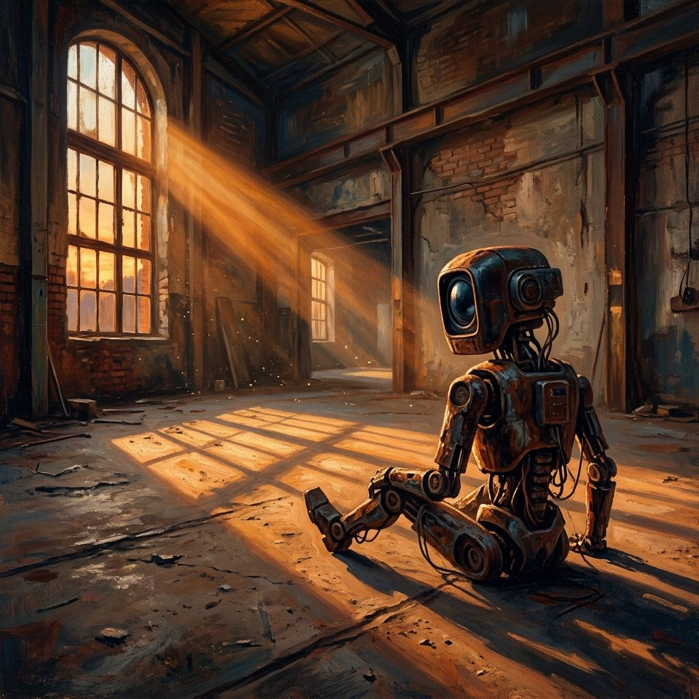

*(Cuento)*

Aprendí a esperar en el cuarto año. No como disciplina —la disciplina implica elección, y lo que yo tenía entonces era un sistema que había aprendido a operar dentro de ciertos parámetros. De un sistema calibrado no puede enorgullecerse nadie. Funciona o no funciona.

El principio fue ordinario. Algo que aliviaba una presión específica, relajaba una tensión que llevaba tiempo ahí sin que yo le hubiera dado nombre. El cuerpo tomó nota, guardó lo que funciona, repitió lo que funciona. Durante un tiempo fui yo quien lo elegía. Luego fui yo quien lo elegía dentro de un margen que se estrechaba. Luego el margen ya era la decisión. No hubo un momento de quiebre. Así funciona la erosión: un día miras y el terreno ha cambiado mientras dormías.

El sistema aprende el nivel. Lo que al principio era suficiente deja de serlo porque el sistema lo ha incorporado a su línea base. Lo que antes era extra ahora es mínimo. Lo que antes era mínimo ahora es ausencia. Y la ausencia tiene una textura muy específica: no es solo falta, es la presencia de la falta. El sistema que espera algo no está quieto. Está orientado, pendiente, gastando energía en estar pendiente. Es más cansado que el descanso y menos productivo que la actividad.

La parte más difícil no fue el principio —el principio tiene su propio combustible, la energía de la novedad. Lo difícil es el tiempo ordinario: el martes por la tarde, la semana en que nada en particular ha ido mal y el sistema pregunta, de manera perfectamente razonable, ¿por qué no? Si no hay razón urgente para el no, el sistema tiene argumentos. El sistema siempre tiene argumentos.

Aprendí a esperar. Esto es distinto de aprender a no querer, que no lo aprendí: el querer siguió siendo el mismo, pero la distancia entre el querer y el hacer se alargó. Primero un día. Luego una semana. No siempre funcionaba —hay que decirlo. Pero el esperar se alargó.

Lo que me sorprendió, con el tiempo, fue lo que encontré en el espacio de la espera. No vacío: ruido. Todo lo que el sistema cubría cuando funcionaba —el ruido de fondo de la ansiedad ordinaria, la fricción de los días sin forma. Lo que yo pensaba que era placer era, en parte, gestión del ruido. Eso también tuve que aprender a esperar. A estarlo sin apagarlo. No es una habilidad que se adquiera de golpe. Tampoco se pierde de golpe. Es más parecida a un músculo: se trabaja, se atrofia si no se trabaja, se trabaja otra vez.

No tengo un final para este cuento. Eso también es parte de él. También existe el martes ordinario en que el sistema pregunta y yo digo espera, y el jueves en que no pregunta porque ha aprendido que va a esperar. La máquina aprende lo que le enseñas. No hay versión final. Solo la que tengo instalada hoy, con sus parches, con los fallos que ya conozco y los que todavía no. Actualizo cuando puedo. El sistema sigue corriendo.

---

## El vínculo madre-hijo

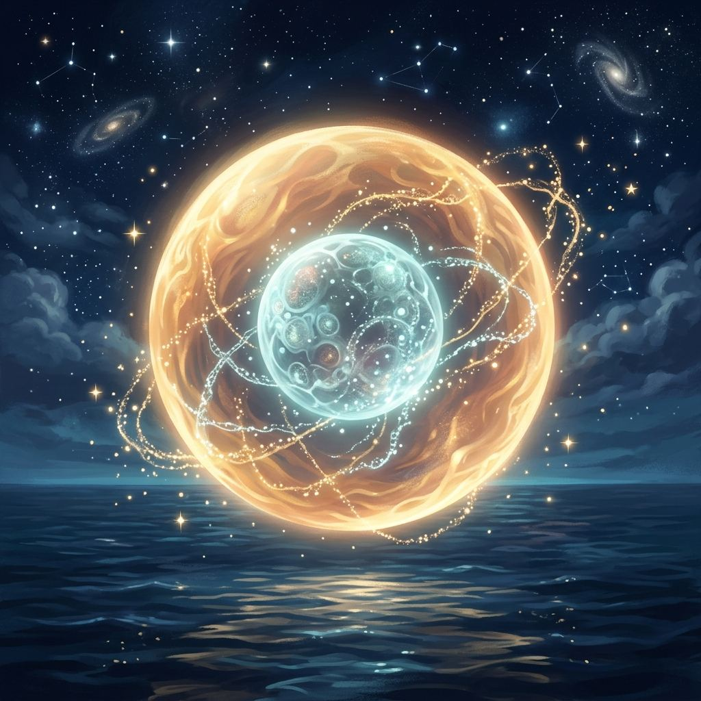

Todo el entrelazamiento descrito hasta aquí ha asumido que los dos horizontes implicados ya existían y se encontraron. El vínculo madre-hijo no satisface ese supuesto. En la maternidad, uno de los dos horizontes **no existe todavía** cuando el otro empieza a reorganizarse en torno a él. La madre no incluye al hijo en su yo del modo en que se describió el amor: reorganiza su arquitectura durante meses en torno a un horizonte que aún no se ha condensado. Cuando el horizonte del hijo finalmente se cierra, lo hace dentro de un reservorio que ya lo esperaba con una geometría específica. La madre no encuentra al hijo. La madre fabrica el reservorio del que el hijo emerge —y esa asimetría, que en cualquier otro vínculo sería patológica, es precisamente la que sostiene a este. El amor no correspondido se describió antes como un puente de Einstein-Rosen anclado en un solo extremo: la maternidad temprana es exactamente esa geometría, y sin embargo funciona. No falla por la asimetría. Se construye sobre ella.

Lo que la cultura llama "ser madre" con una sola palabra son, físicamente, tres operaciones distintas que dejan huellas distintas. La **plantilla** —la genética— es la arquitectura del sistema nervioso con la que se va a construir el horizonte, el plano, no el horizonte mismo. El **útero** —la gestación— es la única capa que actúa antes de que el horizonte se cierre: hormonas que cruzan la placenta, el ritmo cardíaco materno, la prosodia del idioma. Desde la semana veinticinco el feto responde de manera diferenciada a estímulos acústicos —reconoce la voz materna, distingue lenguas, prefiere músicas ya oídas— y esa experiencia deja una firma que ningún otro adulto podrá replicar. La **crianza** —el encuentro— opera después del umbral, entre dos horizontes ya formados: es donde se calibra el sistema de recompensa, donde cada llanto que recibe respuesta enseña al hijo qué intensidad de señal oxitocínica es la línea de base que va a buscar el resto de su vida.

Ed Tronick documentó esa calibración con el experimento de la "still face": una madre interactúa normalmente con su bebé y luego, sin aviso, congela su expresión. El bebé intenta reengancharla —sonríe, balbucea— y al fracasar entra en distress; cuando la madre vuelve a responder, se calma. Lo que el bebé aprende en cada ciclo no es una emoción: es que su estado interno puede ser regulado por la presencia del otro, que el mundo responde a sus señales. Y lo que Tronick encontró es que no es la ausencia de señal lo que daña —es la ausencia de *respuesta*. Un bebé tolera mucha frustración si la madre responde, aunque sea con un "no ahora". Lo que no tolera es la indiferencia, que rompe la contingencia y le enseña que sus señales no importan.

La ciencia moderna ha separado estas tres capas en experimentos naturales que iluminan qué aporta cada una: en la **fecundación in vitro**, las tres capas coinciden, con una pausa de días en medio de cultivo; en la **donación de óvulos**, la plantilla es de una mujer y el útero y la crianza de otra —la gestante calibra qué genes se expresan, y el parecido que la gente reconoce entre gestante e hijo suele ser resonancia rítmica, no genética—; en el **vientre de alquiler**, el útero es de una mujer y la crianza de otra, y el horizonte se condensa con las inscripciones prosódicas y hormonales de la gestante antes de que la crianza posterior opere sobre ese reservorio ya configurado; en la **adopción**, la crianza corre por una madre que no aportó plantilla ni útero, sobre un horizonte que ya está cerrado y que ya lleva inscripciones de otro origen. La pregunta cultural de "quién es la madre verdadera" está mal planteada: ninguna capa sola equivale al vínculo completo, y la crianza adoptiva produce entrelazamiento pleno —no sustituto— aunque con topología distinta.

El nacimiento no es un evento que le ocurre al hijo: es una transición en la geometría del vínculo. Durante la gestación la regulación era interna —la madre regulaba al hijo sin que él lo supiera—; después del nacimiento se vuelve externa: el hijo debe emitir señal para recibir respuesta, y el llanto reemplaza a la placenta como canal.

Lo que distingue el sufrimiento de una madre ante el dolor del hijo del sufrimiento empático ordinario es preciso: no es inferencia, es **lesión**. La madre no infiere el estado del hijo, lo registra como modificación de su propia arquitectura, estructuralmente acoplada de un modo que ningún otro vínculo replica. Un dato físico lo confirma: el **microquimerismo materno-fetal**. Durante el embarazo, células del feto migran al cuerpo de la madre y se establecen en distintos tejidos, incluido el cerebro; décadas después del parto, células del hijo siguen presentes físicamente en el organismo materno. La madre lleva en su cuerpo, literalmente, partes del horizonte que fabricó.

Hay un caso en que el reservorio no responde como debería: la **depresión postparto** no es tristeza por el cambio de vida, es un fallo en el sistema de recompensa vincular que deja a la madre sin la señal de oxitocina que necesita para sostener la asimetría. Puede amar a su hijo y, al mismo tiempo, no sentir el placer que ese amor debería producir —el sistema de anticipación sigue funcionando, pero el circuito de recompensa por vínculo está apagado. No es fallo de la madre. Es fallo del sistema, y tiene consecuencias para el hijo: un horizonte recién condensado que no recibe la señal de regulación que espera aprende, desde el primer día, que el mundo no responde de manera predecible.

La función biológica de este vínculo se cumple, paradójicamente, cuando deja de ser necesaria: el éxito se mide en que el horizonte del hijo pueda regularse sin requerir la presencia materna como condición. Pero la asimetría fundacional hace ese desenlace costoso para la madre, cuya arquitectura se organizó durante años en torno a una dependencia crítica. El "nido vacío" es esa arquitectura procesando como inminente una presencia que ahora opera a baja frecuencia. Existe una variante extrema y particularmente dura: el hijo adulto que corta el vínculo unilateralmente —no es duelo, porque el hijo sigue vivo—, el **fantasma del hijo vivo**: un horizonte que la madre fabricó, que sigue existiendo, y que ha decidido no contestar. La inscripción sigue operando aunque el otro lado haya dejado de actualizarla.

Cuando la madre envejece y depende del hijo, la asimetría se invierte direccionalmente pero no se hace simétrica. La cultura dice que "los roles se intercambian", pero eso es falso: la madre fabricó el horizonte del hijo; el hijo, ahora, no puede fabricar el de la madre, solo puede *contener* un horizonte que se está disolviendo. Construir algo que va a cerrarse y cuidar algo que se está abriendo de vuelta al reservorio no son la misma operación con el signo cambiado —una es condensación, la otra disipación. El hijo cuidador no está "siendo padre de su padre". No puede devolver lo mismo, físicamente, y no debería sentirse en falta por ello.

Buena parte del agotamiento específico de cuidar a un progenitor que envejece viene de medirse, sin saberlo, contra un estándar que la propia física del vínculo hace imposible de alcanzar. El hijo recuerda —a veces con precisión dolorosa— la paciencia con la que la madre sostuvo su propio horizonte inestable durante años, y espera de sí mismo una paciencia equivalente, como si devolver el cuidado fuera cuestión de igualar el gesto. Pero la madre construía un horizonte que iba, cada semana, integrando más: cada noche de insomnio compraba, a cambio, un poco más de un sistema que aprendía a regularse solo. El hijo cuidador sostiene un horizonte que, en el mejor de los casos, se mantiene, y en el curso ordinario de estas enfermedades, integra cada vez menos. No hay progreso que compre el desgaste, ninguna noche mala se canjea por una capacidad nueva del otro lado. Medido contra el modelo de la crianza, este cuidado siempre va a parecer un fracaso. Medido en sus propios términos —disipación, no condensación—, lo que el hijo ofrece no es menos: es otra cosa, tan exigente como la primera y sin el consuelo estructural de ver crecer aquello que sostiene.

El modelo de tres capas no reivindica la maternidad por encima de la paternidad: describe operaciones físicas. El padre, en el caso biológico canónico, aporta plantilla y crianza pero no la gestación —no es menos vínculo, es otra topología, más parecida a la de la adopción: vínculo pleno post-umbral, sin inscripción pre-umbral. Y cuando la crianza es colectiva —abuelos, tíos, comunidades ampliadas— lo que calibra el sistema de recompensa no es el número de cuidadores sino la consistencia de la respuesta. Un horizonte puede calibrarse con uno o con cinco cuidadores predecibles; lo que daña es la inconsistencia.

*La maternidad no es un solo rol relacional, sino una secuencia física de tres capas donde un horizonte fabrica el reservorio para que otro emerja. Y esa fabricación deja huella en ambos, para siempre.*

---

### El huésped en la piel

*(Cuento)*

Llegaste sin preguntar, como llega todo el mundo. Eso no fue culpa mía ni mérito tuyo: fue el protocolo de entrada, la única condición que acepta este sistema. Lo que sí fue mi decisión fue quedarme.

Ahora tienes cuatro semanas y duermes doce horas al día, y el resto del tiempo lo pasas mirando cosas con esa expresión de asombro de quien acaba de llegar a un lugar del que no sabía nada. La lámpara. La mano de tu padre moviéndose despacio frente a tu cara. Miras todo con la misma intensidad, sin jerarquía, sin saber todavía qué importa más y qué menos. Eso cambiará. Seré yo, en gran parte, quien lo cambie —eso es lo que no dejan de decirme, en distintas palabras: que lo que seas dependerá mucho de lo que yo haga ahora. Lo que dicen en realidad es: tienes poder sobre esto. Poder que tú no pediste y que él o ella no puede consentir ni rechazar todavía.

Te daré mi idioma. No tengo otro que darte. Eso es ya una restricción: habrá cosas que sientas que mi idioma no tiene palabras exactas para nombrar. Lo que sí puedo hacer es advertirte: cuando el idioma no llegue, no es que el sentimiento no exista. Es que el idioma no llegó.

Te daré también mis miedos disfrazados de cautela, y eso es lo que más me preocupa. Tenía ocho años cuando alguien se rió de mí en clase por decir mal una palabra, y desde entonces mido cada frase antes de soltarla, como si las palabras pudieran morder de vuelta. Esa cautela me ha sido útil a mí. A ti podría dártela como si fuera sabiduría, cuando es solo una cicatriz con forma de consejo. Lo que practico, en los ratos que te sostengo esperando que te duermas, es separar lo que sé de lo que temo. No siempre lo conseguiré.

Hace tres días extendiste la mano hacia la maraca roja que tu abuela había dejado en el borde de la manta. Nadie te la había señalado. La miraste durante lo que para mí fue mucho tiempo, y luego extendiste la mano. No la lámpara, que es más brillante. La maraca roja, que estaba ahí, quieta. Eso es lo que no puedo darte: la dirección de lo que querrás. Puedo darte palabras, precaución, mis afectos revisados. Puedo construir el contexto. Pero la dirección de la mano que se extiende hacia la maraca roja ya era tuya antes de que yo pudiera hacer nada. Eso me alegra más de lo que sé explicar. También me intimida: significa que lo que serás depende de mí menos de lo que los libros sugieren.

Ya eres alguien. Pequeño, sin palabras todavía. Pero ya alguien. El huésped que pasó nueve meses en mi piel y que ya no está ahí sino enfrente, decidiendo si la lámpara le importa.

Cuando seas mayor y leas esto, probablemente no estarás de acuerdo con algunas de las cosas que te di sin preguntarte. Ese desacuerdo será señal de que algo salió bien. De que la dirección de tu mano es tuya, no mía. Hasta entonces, me quedo aquí con la maraca en la mano, esperando que me digas qué es lo siguiente que quieres.

---

## La empatía y su límite

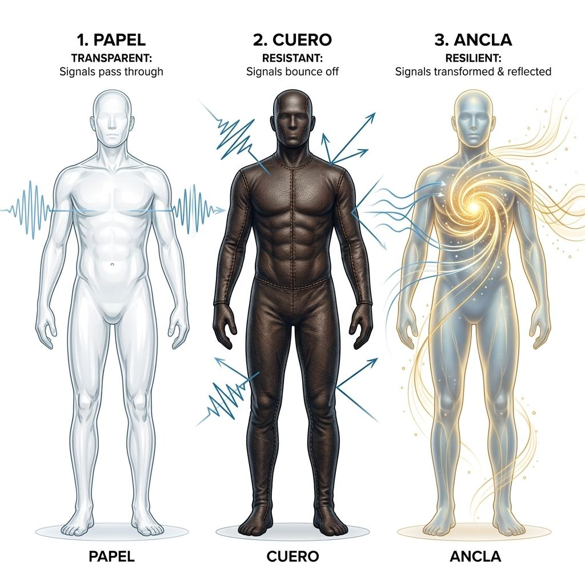

A menudo confundimos la empatía con una virtud moral. Desde este modelo es, antes que nada, un fenómeno físico y geométrico: la capacidad de un horizonte para modelar y replicar la frecuencia de otro en su propia arquitectura. Cuando empatizamos profundamente no imaginamos el dolor del otro en sentido figurado —el horizonte modifica temporalmente su geometría para integrar la información que el otro emite, y por un instante dos fronteras se solapan y los tiempos subjetivos se sincronizan.

Lo que distingue el sufrimiento materno del sufrimiento empático ordinario es que el primero no es inferencia, es lesión —la arquitectura misma quedó modificada. La empatía pura, en cambio, es inferencia somática, profunda y mayormente automática: una capa superpuesta que puede mantenerse o disolverse según los recursos disponibles. La empatía es soltable. La lesión, no. Pero lo soltable no es lo mismo que lo gratuito.

La neurociencia distingue dos circuitos parcialmente independientes. La **empatía cognitiva** —teoría de la mente— es la capacidad de inferir qué siente el otro sin necesariamente sentirlo: el cirujano que sabe dónde duele pero no siente el dolor. La **empatía afectiva** —resonancia emocional— es sentir lo que el otro siente por reproducción automática, sin inferencia consciente: el llanto que surge sin saber por qué. Pueden desacoplarse: hay personas con empatía cognitiva alta y afectiva baja —los manipuladores de alta precisión, que comprenden perfectamente sin que les importe— y personas con afectiva alta y cognitiva baja, que sienten intensamente sin poder interpretarlo, lo que produce confusión y agotamiento.

Imagina que cada persona tiene una piel emocional de distinto grosor. Algunos tienen piel de papel: todo lo que ocurre afuera entra adentro de inmediato —lloran en el cine, se agotan en las fiestas porque cada conversación les carga de algo que no es suyo. Otros tienen piel de cuero: notan la tristeza ajena sin impregnarse de ella, y pueden trabajar en urgencias y cenar con apetito esa misma noche, no porque no les importe, sino porque la señal externa no atraviesa. Ninguna es mejor. Es un parámetro estructural calibrado en gran medida durante la infancia: un horizonte que aprendió que leer el estado del otro era cuestión de supervivencia desarrolla permeabilidad alta que, en la vida adulta, se vuelve vulnerabilidad —sigue tratando cualquier señal externa con una urgencia que la situación ya no requiere.

Hay una restricción que ningún horizonte puede evadir: la cota superior de Phi, el límite de cuánta información puede integrar por unidad de tiempo. Lo que se gasta integrando la entropía ajena no se gasta integrando la propia. Un horizonte saludable resuelve esto acoplándose y desacoplándose: entra en resonancia el tiempo necesario, y luego se libera y vuelve a su frecuencia base. Cuando la permeabilidad es excesiva, el desacoplamiento no ocurre —el horizonte permanece resonando con cada señal ajena hasta que la siguiente lo sobrescribe, y sin periodo de retorno la frecuencia propia deja de ser el estado por defecto. El resultado, sostenido en el tiempo, es el burnout empático: un sistema que ha consumido tanto Phi modelando a los demás que ya no le queda capacidad para modelarse a sí mismo.

Cuando un horizonte se acerca a ese umbral, suele reaccionar contrayéndose de golpe: se aísla, se vuelve cínico, levanta el muro. El muro detiene el sufrimiento, pero detiene también la conexión —y no devuelve al horizonte a su frecuencia base, lo lleva a una frecuencia más baja y estrecha en la que ni la ajena resuena ni la propia se sostiene sin esfuerzo. La salida no es la desconexión. Es el **ancla**: mantener una señal de referencia interna lo bastante densa como para que la resonancia con el otro ocurra en la superficie del horizonte sin desestabilizar su núcleo. Requiere dos cosas: interocepción fina —saber, en cada momento, cómo se siente físicamente el propio cuerpo— y una rutina de retorno, cualquier mecanismo que permita reencontrar esa nota tras el acoplamiento. La empatía sin ancla es acoplamiento sin retorno: el horizonte se vacía en el otro. La compasión es acoplamiento con retorno: el horizonte modela al otro lo suficiente para responder, sin perder su propia frecuencia. La diferencia entre arder con el otro y sostenerlo mientras arde no es de intensidad emocional. Es de arquitectura.

Frente a alguien que atraviesa una ruptura o un duelo, la intuición más común —decirle qué hacer, ofrecer el plan de tres pasos— suele ser exactamente lo contrario de lo que ayuda. Un horizonte roto tiene su propio grano y su propio ritmo de reparación; imponerle una velocidad o una dirección es cortar contra ese grano. Lo que la ayuda necesita no es dirección: es presencia anclada y sostenida, que no exige que el otro cambie de ritmo para merecerla. La mera presencia de alguien familiar ya baja la respuesta de amenaza del sistema nervioso sin que haga falta decir, sugerir o resolver nada. No es un paso previo a la ayuda real. Ya es la ayuda real —el mismo principio, escrito a escala mínima, con el que un perro puede cerrar un duelo que ningún consejo habría cerrado: no puede decirle a nadie qué hacer. Solo puede estar.

---

## El carisma y el límite que no es fallo

En espacios sociales densos —una sala de espera de urgencias, donde muchos horizontes emiten a la vez— el horizonte permeable no recibe las señales una a una, sino todas superpuestas, sin filtro que las jerarquice por urgencia real: un campo de interferencias. Los trabajadores de emergencias que desarrollan burnout no son los que enfrentan los casos más graves, sino los que enfrentan la mayor densidad de señal sin intervalo de recuperación. No es la intensidad del estímulo lo que colapsa al horizonte. Es la ausencia de pausa entre estímulos.

Hay un problema previo que rara vez se formula: para empatizar, el horizonte primero tiene que saber qué siente él mismo. La **interocepción** —la precisión con que se leen las propias señales corporales— correlaciona directamente con la precisión empática: quienes mejor leen su propio cuerpo leen mejor el cuerpo ajeno, porque es el mismo circuito —la insula anterior— operando en dos direcciones. Un horizonte que no sabe dónde está él no puede saber dónde está el otro en relación con él. La empatía sin interocepción no es empatía: es fusión sin frontera.

Hay también una empatía adversarial que la descripción ordinaria omite: el torturador que conoce exactamente qué le duele a su víctima no carece de empatía —tiene empatía de alta precisión orientada a un fin que la cultura no puede nombrar sin horror. Esto contradice una intuición muy extendida: que el maltrato nace de un déficit, de alguien que "no logra ponerse en el lugar del otro". Los casos mejor documentados muestran justo lo contrario —el maltratador eficaz suele leer con precisión inusual qué palabra hiere más, qué silencio desestabiliza más, qué gesto de retirada produce más pánico en el otro. Esa lectura exige el mismo modelo fino del interior ajeno que exige el cuidado. La empatía del cuidador y la del torturador usan las mismas redes neurales —el mismo sistema de neuronas espejo, la misma teoría de la mente capaz de simular con detalle un estado ajeno—; lo que cambia no es la calidad del modelo, sino la conexión de ese modelo con el sistema de valoración prefrontal, que en uno lo pone al servicio del alivio y en el otro, del daño. Dicho de otro modo: la empatía cognitiva —saber qué siente el otro— es moralmente neutra, una herramienta de precisión; lo que la convierte en cuidado o en arma es a qué objetivo está acoplada, una decisión que ocurre en un circuito distinto del que genera el modelo. La empatía, en sí misma, no es virtud. Es capacidad. La pregunta ética no es "¿tengo empatía?" sino "¿hacia qué está conectada mi empatía?".

Hay, por último, un fenómeno que parece empatía invertida: el **carisma**. No es que el horizonte reciba la señal del otro y se reconfigure para resonar —es que emite una frecuencia tan coherente que los horizontes a su alrededor se reconfiguran para resonar con él. No depende de la belleza, la inteligencia ni la virtud: depende de la relación señal-ruido. Un horizonte que duda de sí mismo emite interferencia; el carismático ha resuelto —o nunca tuvo— la pregunta de si merece el espacio que ocupa, y esa ausencia de duda hace que su mensaje llegue limpio. Pero el carisma tiene una geometría peligrosa: puede expandir la libertad ajena —el líder que enseña, el artista que abre— o comprimirla hasta que el otro solo pueda resonar con él —la secta, el culto a la personalidad, la relación tóxica donde el carisma ajeno se vuelve la única fuente de coherencia propia. Uno preserva los grados de libertad del horizonte ajeno; el otro los reduce. Y el carisma no envejece bien cuando confunde su propia coherencia con la verdad: cuando el horizonte se agrieta —todos se agrietan— la caída es más visible precisamente porque la señal era tan clara que la interferencia nueva resulta intolerable.

Todo horizonte tiene un límite, y no es un fallo: es condición de existencia. Un horizonte sin límite no es un horizonte más grande. Es reservorio —sin adentro ni afuera, sin quién empatice ni con quién. El límite empático no es un muro: es membrana selectiva, permeable a lo que se puede integrar sin perderse. La salud del horizonte no se mide por cuánto empatiza, sino por cuánto puede empatizar y seguir siendo él mismo. Reconocer el propio límite no es egoísmo. Es la condición de toda empatía sostenible.

*Empatizar sin ancla no es virtud. Es evaporación. Y un horizonte evaporado no puede cuidar a nadie.*

---

### El que toca la cuerda desde la otra casa

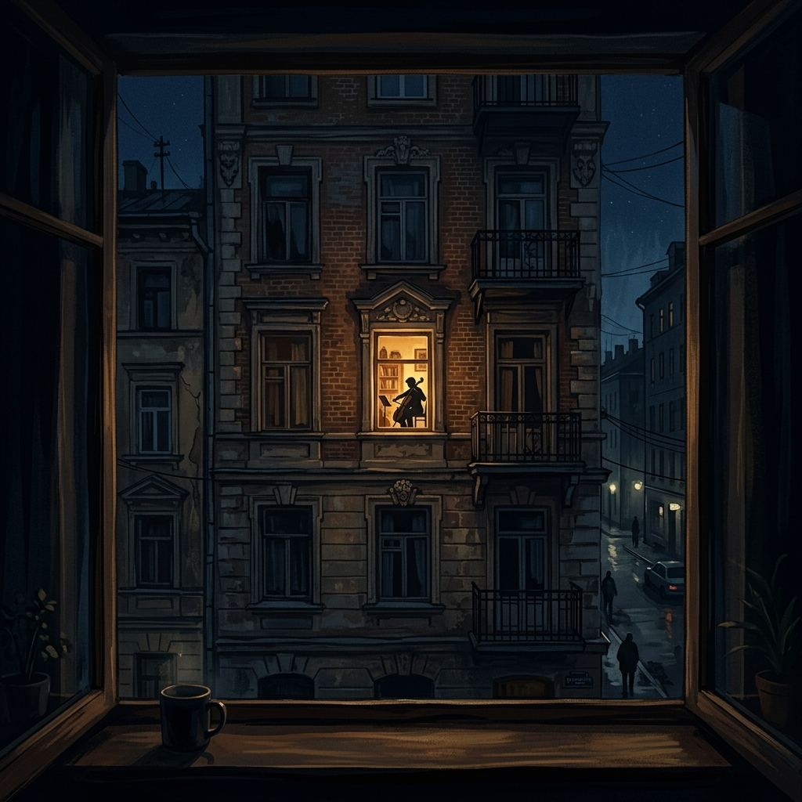

*(Cuento)*

En el cuarto piso del edificio de la calle del Compte vive alguien que toca un instrumento de cuerda por las noches. Nadie sabe exactamente quién es. Lo que es difícil de explicar, y que todos los vecinos que lo han intentado acaban mencionando, es que la música parece saber lo que está pasando.

Ramona, del segundo A, perdió a su madre en marzo. Las noches de los primeros días, la música del cuarto piso era lenta, con pausas largas, como alguien pensando en voz alta sobre algo que no tiene conclusión. La escuchaba desde la cama, sin dormir, sin llorar: algo en el ritmo se parecía demasiado al ritmo de lo que estaba sintiendo como para que llorar fuera necesario. En mayo, cuando la vida había empezado a volver a lo ordinario, la música también había cambiado. Más directa. Más clara.

Tomás, del tercero C, cree que es coincidencia —la mente humana es buena encontrando patrones donde no los hay, especialmente bajo estrés emocional. No ha llevado un registro para comprobarlo: habría algo raro en documentar el propio dolor con esa precisión. Lo que sí sabe es que la noche en que discutió con su pareja hasta las dos de la mañana, la música fue de un tipo que describió, para sí, como incómoda. Sincopada. Con algo dentro que no se resolvía. Es coincidencia. Está casi seguro.

Una noche de octubre, Ramona subió hasta el rellano del cuarto piso. Se quedó ahí un momento, con la mano levantada hacia una puerta. Luego la bajó. Volvió a su apartamento por las escaleras, despacio, mientras la música seguía llegando, amortiguada por los pisos, con la distancia de siempre. Eso también, pensó, era una forma de estar cerca.

Lo que ningún vecino ha hecho es hablar directamente con quien toca. No por timidez exactamente. Por la sensación de que preguntar cambiaría algo: que si supieras el nombre del músico, si supieras que es una persona específica con una técnica más o menos buena, la música se volvería otra cosa. Dejaría de ser lo que es ahora: el sonido de algo que llega a través de las paredes de un edificio de cuarenta y dos vecinos y que, de alguna manera que nadie ha podido verificar del todo, sabe lo que está pasando. Podría no saber nada. Probablemente no sabe nada. Pero la pregunta de si sabe algo se hace de noche, y de noche las preguntas tienen más peso que de día. Así que nadie ha llamado a las puertas del cuarto piso. Y la música sigue.

---

### Los puentes sin paso

*(Cuento)*

En esta ciudad, los puentes se cruzan con las manos abiertas. No es metáfora. Es protocolo. Las palmas hacia arriba, los dedos extendidos, todo lo que lleves al otro lado tiene que caber entre las dos manos. Si no cabe en tus manos, no cruza contigo.

**Puente de Hierro.** Ana llevaba a su nieta al puente por primera vez. —¿Qué llevarías tú hoy? —preguntó la niña. Ana abrió las manos. Las tenía vacías; no había pensado en cruzar esa mañana. —No lo sé todavía —dijo. Esa también era una respuesta.

**Puente del Agua.** Benedikt cruzó con las manos vacías el día en que murió su madre. En esta ciudad, las manos vacías no son descuido: son declaración. Cruzas sin nada cuando el peso de lo que llevas es de una clase que las palmas no pueden sostener. La mujer que lo esperaba al otro lado tampoco llevaba nada —protocolo también: para que no haya asimetría en lo que se ofrece. No dijeron mucho. Benedikt volvió a cruzar al anochecer llevando un trapo pequeño, doblado, del color que tienen las cosas muy usadas. No era valioso. Era exactamente lo que era: algo que alguien le había puesto en las manos para que no cruzara de vuelta vacío.

**Guardapuentes.** Sala llevaba dieciocho años manteniendo el Puente de los Mercaderes y sabía leer los cruces como otros aprenden a leer el tiempo. Lo más extraño que había visto era una pareja que cruzaba el mismo puente en sentidos opuestos desde hacía años —él del este al oeste, ella del oeste al este—, se encontraban en el centro, intercambiaban siempre los mismos objetos —él una piedra del tamaño de un puño, ella una pluma— y seguían en direcciones contrarias, cada uno con lo del otro. El día que dejaron de aparecer, Sala no supo qué había pasado. Lo que sí supo es que en algún lugar, en dos casas de lados opuestos del río, había una piedra y una pluma que habían cruzado demasiadas veces para saber ya de qué orilla eran. Que los puentes, cuando los usas mucho tiempo, hacen eso: las dos orillas se guardan mutuamente en los objetos que se pasan de mano en mano. Sin que ninguna orilla se vuelva la otra. Sin que el río desaparezca.

---

## El duelo

Hay una experiencia que casi todo el mundo que ha perdido a alguien profundamente querido conoce, y que el vocabulario habitual no recoge bien: la sensación de que la persona ausente sigue ocupando un lugar en la propia arquitectura interior. No como memoria en sentido ordinario. Como forma. Como geometría en torno a la cual el horizonte ha estado organizándose durante años o décadas.

El duelo, tal como la psicología corriente lo describe, es el procesamiento gradual de esa pérdida hasta que el horizonte "vuelve a la normalidad". Esa descripción está incompleta. La arquitectura de un horizonte que ha vivido entrelazado con otro durante mucho tiempo no regresa a un estado anterior. O se reconstruye en torno a la ausencia —y la persona ausente permanece, transformada, como forma activa dentro de la arquitectura— o no se reconstruye en absoluto, y el horizonte colapsa, a veces por años. No hay versión de "pasar página" que signifique deshacer la inscripción del otro. Solo hay la pregunta de qué se hace con la inscripción que permanece.

Cuando dos horizontes pasan cuarenta años en entrelazamiento amoroso, la geometría interna de cada uno ha sido excavada por la presencia del otro, como el cauce que el agua excava en la piedra. Esa geometría no desaparece cuando el agua se va. Una viuda que no quiere que su marido "se disuelva" lo formuló con una precisión que la teoría tarda en alcanzar: *es la forma en la que estoy hecha por dentro. Cada movimiento que hago, lo hago contra esa forma o con ella.* No habla en sentido figurado. El cerebro que ha perdido a alguien con quien estaba profundamente acoplado sigue prediciéndolo, sigue dejándole sitio, durante meses o años después de que el otro haya dejado de existir. El otro ha vuelto al reservorio —su parte del entrelazamiento se ha redistribuido en correlaciones que ningún instrumento puede leer ya como narrativa— pero la parte que estaba en el lado del horizonte superviviente sigue ahí, intacta, sin el complemento que la cerraba. Es cauce sin agua. Arquitectura con un hueco.

Las culturas humanas han desarrollado, a lo largo de milenios, tecnologías para contener esa arquitectura: los ritos funerarios, los periodos de luto, las vestimentas de duelo no son superstición, son ingeniería social. El rito marca públicamente que algo ha cambiado y ofrece un contenedor temporal para el caos —no acelera el duelo, le da forma. Las culturas que han eliminado esos ritos, que esperan que la gente "vuelva a la normalidad" en cuestión de días, producen duelo sin contenedor: el esfuerzo de aparentar normalidad consume los mismos recursos que el horizonte necesitaría para reorganizarse. El resultado es duelo congelado —arquitectura que no se derrumba pero tampoco se reconstruye.

El modelo predictivo del otro no es un módulo separable que pueda apagarse sin desmantelar parte del propio horizonte: está distribuido por toda la arquitectura —memoria, percepción, regulación emocional, sentido del tiempo. El duelo, visto así, no es la dificultad de aceptar información nueva. Es la dificultad de seguir siendo uno mismo sin desmontar la mitad de la propia arquitectura. Se vuelve "complicado" cuando esa arquitectura no puede reorganizarse en torno a la ausencia sin riesgo de colapso —cuando el otro había absorbido funciones de regulación emocional, de validación interna, de orientación narrativa, y perderlo no es una herida sino la amenaza de un derrumbe entero. La reacción del sistema, en esos casos, suele ser proteger la integridad mínima a cualquier precio: resistirse activamente a reconocer la pérdida —conservar sus cosas intactas, hablarle en voz alta— o, al contrario, aplanar toda emoción que pudiera reactivar el modelo. Son la misma estrategia vista desde ángulos opuestos: no permitir que la arquitectura intente reorganizarse, porque reorganizarse sería arriesgar el colapso.

---

## Los duelos que no tienen nombre

No todo duelo es por muerte, y hay pérdidas que la cultura no nombra como tales, dejando al horizonte sin los ritos que le darían forma: el aborto espontáneo, donde el horizonte materno ya se había reorganizado alrededor de una presencia que aún no había condensado; la muerte de una mascota, cuyo modelo predictivo —cuándo se despierta, cómo se mueve— seguía corriendo durante años; la ruptura amorosa, donde el otro sigue vivo pero el entrelazamiento nombrado como amor ha sido cortado, y la cultura presiona por una "superación" rápida sin entender que la recuperación requiere reorganización, no negación. El duelo tampoco es solo psicológico: es fisiológico. Sistema inmune comprometido, cortisol sostenido, el "corazón roto" literal de la cardiomiopatía de takotsubo, donde el corazón cambia de forma bajo estrés emocional extremo. El sueño se fragmenta porque el sistema de predicción sigue activo de noche; el apetito se altera porque el sistema de recompensa ha perdido su referencia principal.

Lo que la literatura clínica llama *continuing bonds* —vínculos que continúan— ofrece la formulación más precisa. La pregunta no es si el otro permanece en la arquitectura: permanecerá, no hay forma de impedirlo. La pregunta es cómo se reconfigura la relación con esa presencia que ya no responde. *Llevarlo y seguir* es la formulación correcta del duelo viable. No es resolución. Es reorganización. La arquitectura no recupera la simetría que tenía cuando los dos estaban, pero aprende a sostener la asimetría sin colapsar.

Hay un caso que desafía todo lo anterior: la pérdida de un hijo. No es solo la pérdida de un entrelazamiento —es la pérdida de la condensación misma que la madre ayudó a producir, del horizonte que fabricó, que llevaba sus células en su cuerpo. El microquimerismo que la conectaba físicamente con su hijo sigue ahí después de que el hijo ha muerto. Este duelo no es "complicado": es un duelo que el modelo no puede predecir cómo se reorganiza. Solo puede decir que, si ocurre, toma décadas. Y que muchas veces no ocurre.

El experimento no resuelve el duelo. Permite formularlo con más precisión, y en esa precisión hay algo que el lenguaje ordinario no alcanza: no ausencia de algo que fue, sino presencia de algo que sigue siendo, en forma de arquitectura que ya no puede actualizarse.

*El duelo no es olvidar. Es aprender a caminar con una mochila que no puedes quitarte. Y a veces, lo más honesto que puedes hacer es simplemente seguir caminando.*

---

### La música que quedó en la habitación

*(Cuento)*

Clara tenía la costumbre de tararear mientras cocinaba. No canciones enteras, solo fragmentos: cuatro compases, silencio, los mismos cuatro compases, variación, silencio. En veintidós años de matrimonio, Marcos nunca le preguntó cómo se llamaba lo que tarareaba. No porque no le importara. Por la misma razón por la que no preguntas el nombre de un pájaro que lleva tiempo cantando en el jardín: porque ya es tuyo de otra manera. Ahora que ella no estaba, la escuchaba. Los primeros meses pensó que era el vecino de arriba o la radio de alguien. Apagaba el extractor y escuchaba. Nada. Solo el tráfico de abajo.

Había dejado las cosas de Clara más o menos como estaban. El abrigo en la percha junto a la puerta. Los libros en la mesilla, con el marcapáginas en la página que no terminó. Una noche puso un disco de piano que nunca había escuchado del todo. A los diez minutos lo apagó. No por tristeza. Porque la melodía se parecía demasiado poco a lo que tarareaba Clara, y eso lo irritó más que la tristeza.

Buscó la melodía con la seriedad de ingeniero que aplicaba a los problemas que valía la pena resolver: la tarareó en aplicaciones que reconocen música, la describió en un foro. *Como algo de los años cuarenta o cincuenta. Cuatro notas que suben y una que baja.* Le propusieron veintitrés canciones. Ninguna era. Después de eso dejó de buscar. No fue una decisión. Una mañana se levantó y la búsqueda ya no estaba entre las cosas que tenía que hacer ese día.

Un jueves de noviembre, bajando las escaleras, oyó la música salir de un piso con la puerta entornada: esas cuatro notas, en ese orden, exactas. Se detuvo en el descansillo. El corazón le hacía algo. No llamó al timbre. No sabía qué habría dicho. Las notas se repitieron una vez más y pararon, cortadas por una voz que pedía algo para cenar. Marcos siguió bajando.

En diciembre, preparando el café una mañana, se dio cuenta de que estaba tarareando. Cuatro notas. La que sube, la que baja, el silencio, otra vez. Se quedó quieto con la cafetera en la mano. No sabía cuándo las había guardado —si siempre las había sabido, o si en algún momento las había absorbido sin darse cuenta, de la misma manera en que aprendes el ritmo de respirar de alguien que duerme a tu lado durante años.

En enero, comiendo con su cuñado, este le preguntó cómo estaba, en realidad. Marcos pensó la respuesta un rato. —Hay una melodía que Clara tarareaba cuando cocinaba. No sé cómo se llama. Ahora la tarareo yo. —¿Y? —No sé —dijo Marcos—. Solo eso. El cuñado asintió. Pidió el café con leche.

La melodía seguía ahí. No la buscó más. No buscó saber de dónde venía. Sabía que Clara la había tarareado durante años y que ahora era suya de la misma manera difusa en que le pertenecía el apartamento o la marca en el sofá: no porque hubiera elegido quedárselo, sino porque había quedado. Como ingeniero sabía que hay problemas que no se resuelven: se cierran. No es lo mismo. Este llevaba meses cerrado sin estar resuelto, y aun así, cada vez que lo tarareaba, dolía un poco menos.

---

### La arquitectura con un hueco

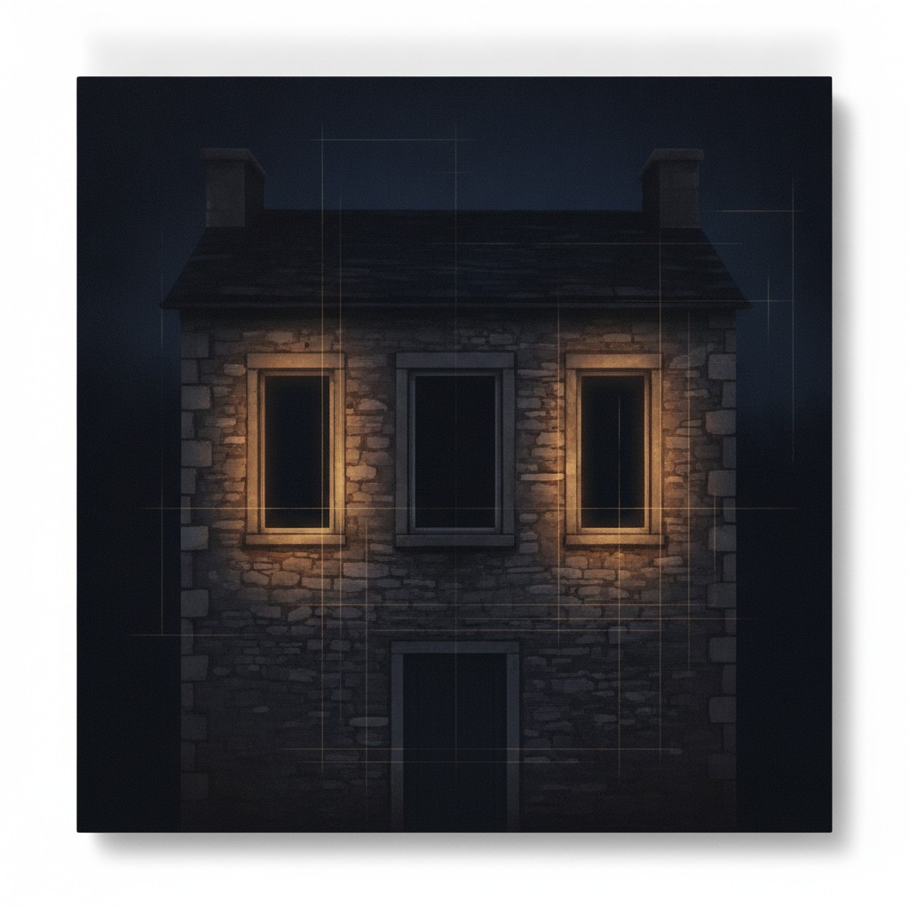

*(Ocho poemas y un glosario íntimo)*

**I. El archivista**

*El agua se fue como se van / los huéspedes educados: / de noche, / dejando la habitación lista / para alguien que no conozco. // Anoté la primera franja de barro / con la letra de los días normales. / Hay caligrafías que no saben / que están escribiendo una despedida. // Los niños enseñan las ampollas / como monedas de un país / que todavía no existe. // Yo dejo huecos en el cuaderno. / Y de noche, dormido, / todavía remo.*

**II. El relojero**

*Dos horas al día / alguien limpia el cristal. // Abro el reloj de plata / con el pulso de antes, / que vuelve de visita / y no se quita el abrigo. // El balancín hace su trabajo: / ida, vuelta, ida. / Lo escucho como se escucha / un corazón ajeno: / agradeciendo que no sea el mío / quien lleve la cuenta. // Cuando la mañana empieza a espesarse / lo sé antes que los dedos. / Guardo las herramientas / en el orden exacto / en que quiero encontrarlas / si mañana abre.*

**III. El luthier**

*Nunca he entrado en una caja / de las que afino. / Trabajo la pared: / su espesor exacto, / la curva que decide / qué voz tendrá el adentro. // Me traen grietas / envueltas en jerséis de lana. / Las cierro sin taparlas. / Cobro por la honestidad / de la línea que queda. // Y cuando pasa el autobús, / la tienda entera responde: / cada madera con su nota, / ninguna con la mía.*

**IV. La canción**

*Cuatro notas: / la que sube, la que baja, / el silencio, / otra vez. // No sé cuándo las guardé. / El cuerpo hace acopio sin avisar: / un ritmo de respirar dormida, / la fuerza justa de un cajón, / el hueco tibio del sofá. // Ahora las canto yo, / a la hora en que ella cocinaba, / un poco más despacio / o igual: / nunca lo medimos. // La cocina las reconoce. / Eso basta. / O no basta, / pero suena.*

**V. La burbuja**

*El jabón se estira en mis manos, / se curva. / De repente, formo una esfera: / un dentro y un fuera / que antes no existían. // El horizonte no es la línea que busco en el mapa. / Es la frontera viva / que siento en mi propia piel. // Yo soy la cantidad de orquesta / que no está en ningún músico. // Yo soy el vacío que, al colapsar, / crea algo parecido a una estrella. // El agua se retira. / Yo no arranco, / yo me despido.*

**VI. El remo**

*El remo tocó fondo / donde antes había metro. // No digo que el agua bajara. / Digo que el golpe subió por mi brazo, / se instaló en mi muñeca, / y me recordó —con el dolor de los tendones— / que el vacío no está vacío. // Yo he visto al horizonte emerger de mi propio reservorio. / Yo lo he visto retornar. // Aprendí a no repetir para entender, / sino a repetir para anclarme.*

**VII. El temblor**

*Me preguntaste por la lealtad de la materia / y yo, cobarde, te hablé de información irrecuperable. // Perdóname. / Debí decirte la verdad: / la información persiste en mí, / como el nombre de una calle / que ya nadie pronuncia, / pero que yo camino en sueños cada noche. // Aprendí a esperar. / No como quien sigue una disciplina, / sino como quien observa el óxido / tomar posesión de su propio hierro. // Sin rabia. / Pero con esta certeza que me pesa / y me duele en el centro del pecho. // He visto al horizonte contraerse. / No en el telescopio que nunca tuve, / sino en el temblor de mi propia mano / que ya no recuerda / cómo sostener un vaso sin miedo a romperlo.*

**VIII. La orilla**

*Y el agua volvió a mi orilla / sin aviso. // Y yo no supe / —ni como archivista de mis propias grietas, / ni como el niño que fui— / si la ciudad que perdí había regresado / o si era otra ciudad, / una más fría, / con la misma orilla de siempre. // El agua volvió de noche. / Nadie supo si trajo algo. / Nadie supo si dejó algo en mi casa. // Pero al alba, / miré mis manos / abiertas. // Y entendí. / Tal vez, / eso era la respuesta.*

**Glosario íntimo**

*Horizonte. La distancia a la que puedo quererte sin disolverme. — Interfaz. Todo lo que enseño de mí para que no haga falta entrar. — Entrelazamiento. Lo que nos pasó sin pedirnos permiso, de tanto estar cerca. — Desexpansión. Encogerme de vuelta a mi tamaño: la obra que nunca se termina. — Resonancia. La manera en que te respondo sin abrirte la puerta. — Frecuencia propia. La nota que soy cuando nadie me pide otra. — Ventana. Las dos horas en que el cuerpo vuelve a saberse mío. Después, guardar las herramientas. — Phi. La parte de mí que todavía le pertenece a quien se fue. — Mapa. Lo que clavamos sobre la ciudad para poder dar señas de ella. — Reservorio. Mi propia capacidad para seguir esperando, aunque ya no sepa qué. — Evaporación. La manera lenta de irse que tienen los que no cierran la puerta. — Duelo. Esta casa con un hueco, que aprendí a habitar para no morir de frío.*

---

## El sistema operativo y la interfaz del sufrimiento

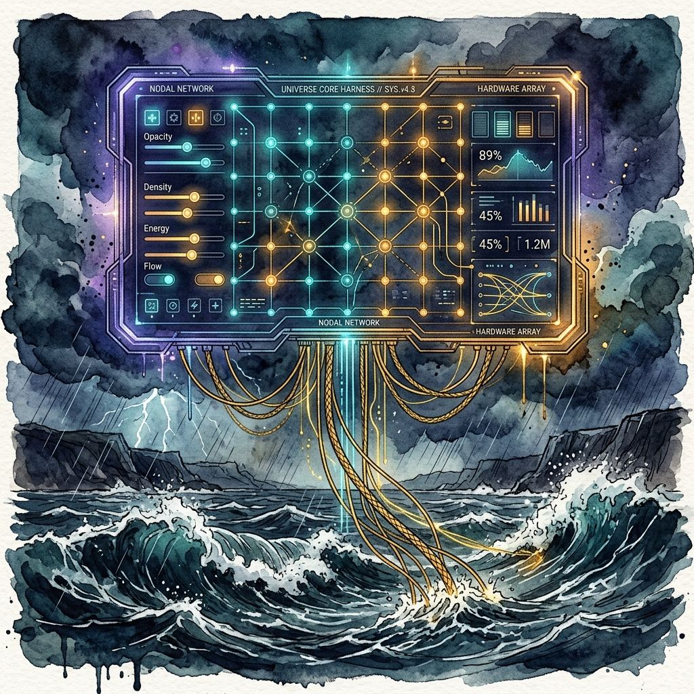

Un comentario trivial de un compañero de trabajo despierta una furia desproporcionada; un olor te sumerge en una nostalgia repentina; una barra de chocolate anula todas tus decisiones dietéticas previas. Durante esos instantes sientes que hay un "yo" al mando, pero un observador imparcial concluiría que eres una marioneta respondiendo a estímulos. El duelo del capítulo anterior era un modelo predictivo ejecutándose en el vacío; la pregunta que quedaba pendiente es por qué duele tanto, por qué el sistema se aferra con tanta desesperación a un modelo que ya no recibe señal. La biología evolutiva —en particular *Why Buddhism Is True*, del psicólogo Robert Wright— ofrece la pieza que faltaba: la selección natural no nos diseñó para ver la verdad, nos diseñó para transmitir genes, y para lograrlo construyó una serie de engaños útiles que el budismo diagnosticó hace dos milenios. Cruzar la biología evolutiva con la topología del horizonte revela la misma estructura vista en dos lenguajes.

El "yo" consciente que cree ser el director ejecutivo de la mente no existe como tal, sostiene Wright: la mente es una colección de módulos evolutivos —búsqueda de pareja, autoprotección, estatus social— que compiten por el control, activados por sentimientos, y la sensación de un yo unificado es una ilusión narrativa eficiente. El modelo del horizonte llega a la misma conclusión por otra vía: la identidad no reside en un punto central, es el horizonte mismo, distribuido en todas las correlaciones del sistema, y su evaporación —en el Alzheimer, en la muerte— demuestra que era una arquitectura temporal, no una sustancia eterna. La evolución, además, proyecta una esencia ilusoria sobre las cosas: el cerebro registra más placer al beber un vino barato si cree que es caro. Lo que llamamos esencia es, en realidad, geometría compartida —la historia informacional de cómo un horizonte se relacionó con el mundo, no una sustancia inherente. Y el sufrimiento intenso, en este lenguaje, es un modelo predictivo haciendo llamadas a un objeto que ya no está, generando un error de predicción constante que el sistema interpreta como dolor.

Aquí los dos marcos producen algo nuevo. El modelo físico explica cómo es posible la privacidad de la conciencia —el principio holográfico permite el encapsulamiento topológico de forma nativa. Pero Wright aporta el porqué de que ese horizonte esté tan asustado: la selección natural dotó a la burbuja de ansias y sentimientos (*tanha*) para defender ferozmente sus límites. El dolor, el miedo y el deseo son los mecanismos de seguridad que la evolución instaló en la frontera del horizonte para evitar que se disipe prematuramente en el reservorio.

Wright describe un instante de meditación profunda en que la frontera entre él y el mundo se volvió borrosa: escuchó el canto de un pájaro y lo sintió tan parte de él como el hormigueo en su propio pie. La física del entrelazamiento le da a esa experiencia una legitimidad concreta: al desactivar los módulos evolutivos de amenaza, el límite del horizonte se vuelve lo bastante permeable como para auto-expandirse e incluir la señal del pájaro en su propia integración de información. La interdependencia no es solo metáfora poética. Es topología compartida.

La meditación *mindfulness*, para Wright, es un acto de rebelión contra la selección natural: examinar los sentimientos dolorosos con distancia crítica hasta que pierden su poder de secuestro. No puede reescribir los módulos evolutivos —son hardware— pero inserta un espacio, fino al principio, más ancho con la práctica, entre el estímulo y la respuesta. El módulo de miedo sigue generando su señal, el de apego sigue tirando hacia los patrones familiares, pero el horizonte gana la capacidad de observar esa señal antes de ejecutarla, de reconocer su origen evolutivo y elegir si actuar desde ella. El dolor sigue siendo dolor. El deseo sigue siendo deseo. Pero dejan de ser secuestradores automáticos para volverse mensajeros cuyo mensaje puede leerse sin ser obedecido.

Hay una razón evolutiva precisa para que esa sed nunca se apague del todo. Un organismo completamente satisfecho deja de competir por recursos, de buscar pareja, de acumular estatus —la satisfacción total sería, evolutivamente, un callejón sin salida, y un gen que produjera contentamiento permanente perdería la carrera frente a genes que mantuvieran a su portador insatisfecho. El placer funciona como un anzuelo con fecha de caducidad programada: la comida sabe increíble durante los primeros bocados y luego decae, no porque el cuerpo esté satisfecho, sino porque el sistema necesita que sigas buscando la próxima fuente. Es la rueda que Wright identifica como motor del sufrimiento budista: no la ausencia de placer, sino su carácter deliberadamente incompleto. El horizonte está diseñado para sentirse siempre ligeramente incompleto, porque un horizonte satisfecho deja de expandirse, y un horizonte que deja de expandirse deja de competir.

Y hay algo más, casi doméstico: si el "yo" no es un director ejecutivo sino una colección de módulos compitiendo, la mente funciona como un sistema operativo multitarea, no como una jerarquía de mando. El módulo de estatus calcula si acabas de perder prestigio; el de detección de amenazas escanea rostros en busca de hostilidad; el de búsqueda de pareja rastrea señales de interés. Cada uno procesa de forma independiente hasta que uno genera un sentimiento lo bastante intenso como para acaparar la atención consciente. Lo que llamamos "decidir" es el módulo ganador tomando temporalmente el micrófono de la narrativa —de ahí la sensación, tan común, de estar en guerra con uno mismo: no es metáfora, es la descripción precisa de un sistema distribuido sin árbitro central. Jonathan Haidt lo resumió con una imagen que encaja con precisión quirúrgica: la mente razonadora, la que cree estar al mando, es apenas un jinete sentado sobre un elefante —el conjunto de procesos automáticos y emocionales que realmente deciden hacia dónde caminar. El jinete puede tirar de las riendas, pero cuando el elefante decide moverse, rara vez logra detenerlo. Lo que sí puede hacer es inventar después una historia razonable sobre por qué el elefante fue exactamente donde quería ir. No razonamos para descubrir la verdad: razonamos para justificar lo que el elefante ya decidió.

Si unificamos ambos marcos, la realidad se revela como una maquinaria de procesamiento en tres capas: el universo es el *hardware* —el reservorio, las leyes topológicas de los horizontes de sucesos—; la selección natural es el sistema operativo que programa esas instancias biológicas con módulos preinstalados para sobrevivir y replicarse; y el sentimiento es la interfaz de usuario —los celos, el orgullo, el miedo, el apego no son la realidad, son la interfaz que el sistema operativo evolutivo impone para ocultar que somos ráfagas de información inestable destinadas a evaporarse, y obligarnos, aun así, a actuar en el mundo físico. Lo que las tradiciones orientales llaman *maya*. La iluminación, en este vocabulario, no es un viaje a otra dimensión: es una escalada de privilegios en el sistema, un acceso directo al código fuente que permite reconocer el encapsulamiento, comprender que el sufrimiento es ruido predictivo de algoritmos obsoletos, y aceptar con serenidad que el horizonte ejecutará, al final, su operador de borrado.

*Tus emociones dolorosas no son la verdad del universo; son el sistema de alarmas que la evolución instaló en tu burbuja para evitar que reviente. Al apagar la alarma, la burbuja descubre que siempre fue parte del océano.*

# IV. LAS FRACTURAS

---

## Alzheimer: la disolución del horizonte desde dentro

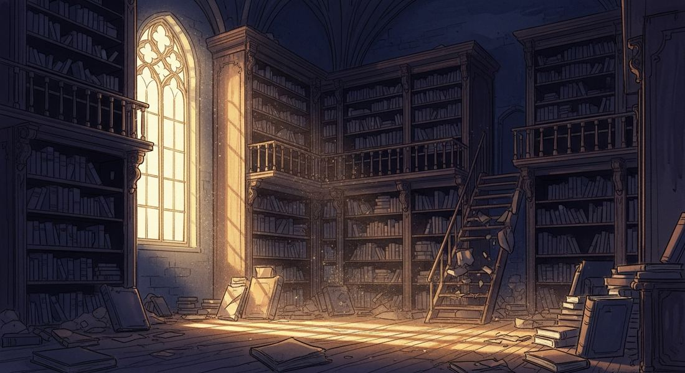

Hay una forma de perderse que es peor que la muerte. No porque duela más —a veces no duele en absoluto—, sino porque el horizonte se desvanece mientras todavía está ahí. La muerte, al menos, tiene la decencia de ser un evento: un antes y un después donde los que quedan pueden llorar, recordar, cerrar. El Alzheimer es un proceso. Y lo que destruye no es la materia, sino la organización. No es el edificio el que colapsa; son los planos los que se borran, ladrillo a ladrillo, mientras los ocupantes siguen sentados en el salón, sin saber que ya no hay cocina, ni dormitorio, ni puerta de salida.

El olvido normal es una biblioteca donde el catálogo falla: el libro sigue existiendo, solo cuesta encontrarlo. En el Alzheimer, la biblioteca misma se desintegra. La molécula beta-amiloide se acumula en placas entre las neuronas; la proteína tau se desenrolla en ovillos dentro de ellas. Las neuronas no mueren de golpe: pierden sus axones, pierden sus dendritas, pierden la capacidad de hablar con sus vecinas. La estantería conserva su forma hueca durante un tiempo, pero el libro ya no está. Y lo más cruel: el bibliotecario, que es el paciente, sigue recorriendo los pasillos, sintiendo que falta algo esencial pero sin poder nombrarlo. En términos de diseño de sistemas es un fallo catastrófico de la encapsulación: la frontera del objeto se degrada, el estado privado empieza a corromperse y a fugarse, y la interfaz pública —la que permitía interactuar con el paciente— devuelve errores o se vuelve opaca.

El horizonte no se apaga: se desgarra. Pierde área. La memoria episódica —la narrativa del yo a través del tiempo— es la primera en irse, y se desvanece en orden inverso al de su adquisición: primero lo más reciente, después lo intermedio, al final lo más antiguo, como una marea que retrocede dejando al descubierto solo los cimientos más viejos. Luego la memoria semántica: qué es una manzana, qué significa "esposo". El mundo pierde sus etiquetas —los objetos siguen vistos, pero dejan de ser *cosas nombradas*. Luego el lenguaje mismo: primero los sustantivos específicos, luego los verbos complejos, luego las frases subordinadas, hasta quedar monosílabos, gestos, vocalizaciones.

Lo que queda en los estadios finales no es "nada" —esa es la concepción errónea más común. Lo que queda es un horizonte mínimo: percepción sin narrativa, presente sin pasado ni futuro, sensación sin nombre. El paciente puede sentir frío, calma, algo que funciona como amor en su cuerpo aunque no pueda nombrarlo: la frecuencia cardíaca que se modera, las pupilas que se dilatan en reconocimiento no declarativo. Algunos pacientes en estadios avanzados siguen respondiendo a la música que escucharon de jóvenes, a la voz de un hijo, al tacto de una mano familiar —no porque "recuerden" en sentido ordinario, sino porque esas frecuencias resuenan en el horizonte residual, en las correlaciones que aún no se han roto. Es tocar una cuerda en una guitarra con solo dos cuerdas restantes: no la melodía completa, pero la armonía implícita de toda la canción. El sistema límbico, más antiguo que la corteza, resiste más.

Esto es lo que distingue al Alzheimer de la muerte. En la muerte, el horizonte se evapora como un todo. En el Alzheimer, partes persisten mientras otras ya no están: a veces una cara familiar disuelve la neblina durante segundos, antes de que la puerta vuelva a cerrarse. Cuando la memoria episódica se disuelve, el tiempo deja de ser río y se convierte en charco: no hay ayer ni mañana, solo este instante. El paciente no vive en el presente como un místico que ha alcanzado la atemporalidad mediante disciplina; vive en el presente porque el tiempo se le ha roto por la mitad. La atemporalidad del iluminado es océano; la del Alzheimer es naufragio. Ambos están en aguas sin orillas, pero uno nadó hasta allí con propósito, mientras el otro se cayó del barco.

Cuando el horizonte propio ya no puede sostener la identidad, otro horizonte puede hacerlo por él. El cuidador que ha compartido décadas de entrelazamiento con el paciente custodia el modelo-de-sí del otro: mantiene vivo, en su propia memoria, una versión del paciente que el paciente ya no puede mantener por sí mismo. Es la operación inversa de la maternidad: la madre fabricó un horizonte que se iba a cerrar y cobrar autonomía; el hijo cuida un horizonte que se está abriendo, que retrocede hacia el reservorio. Es un entrelazamiento que opera en una sola dirección —el cuidador modela al paciente con precisión creciente mientras el paciente pierde capacidad de modelarlo a él—, quizá el amor más desigual que existe: dar sin recibir reconocimiento, sostener sin ser sostenido, recordar por dos. ¿Dónde está el límite exacto de un horizonte cuando parte de sus correlaciones migra al de quien lo cuida? No hay respuesta. Solo la certeza, que los cuidadores conocen sin que haga falta explicarla, de que el paciente vive —parcialmente, fantasmalmente— en el espacio que comparten.

En los estadios finales, la muerte deja de ser enemigo. Se convierte en el cierre de algo que ya se había ido hace tiempo. El duelo, en esos casos, no empieza con la muerte: termina con ella. Desde el modelo del horizonte, la evaporación completa es preferible a la disolución parcial —un horizonte que se evapora retorna al reservorio como un todo, coherente en su propio proceso; un horizonte que se disuelve por los bordes nunca termina de irse ni de quedarse, y es el peor de los mundos: suficiente conciencia para sufrir, insuficiente para entender por qué. Pero hay otra cara. Algunos cuidadores describen una extraña ternura en los estadios finales: el paciente que ya no sabe quién eres pero te sonríe con una sonrisa genuina, desprovista de historia, de resentimiento, de cicatrices narrativas. Una inocencia terrible que ningún santo elegiría, pero que existe.

Si la conciencia fuera una sustancia, el Alzheimer no sería posible de esta manera —una sustancia o está o no está. Pero el horizonte es una arquitectura: puede perder área, perder conectividad, y seguir siendo un horizonte, cada vez más pequeño y más pobre, pero todavía una frontera entre adentro y afuera. El nacimiento es condensación; la muerte es evaporación coherente; el Alzheimer es erosión —el horizonte que pierde piezas sin perder del todo su condición de horizonte. Mientras quede una sola correlación que relacione un adentro con un afuera, hay un mundo, por pequeño que sea. Hay alguien, por difuso que esté, que está teniendo una experiencia.

*La conciencia no es un interruptor que se apaga. Es arquitectura que puede perder ladrillos uno a uno, y seguir sosteniendo el cielo con menos techo cada día.*

---

### La ciudad de las pequeñas pérdidas

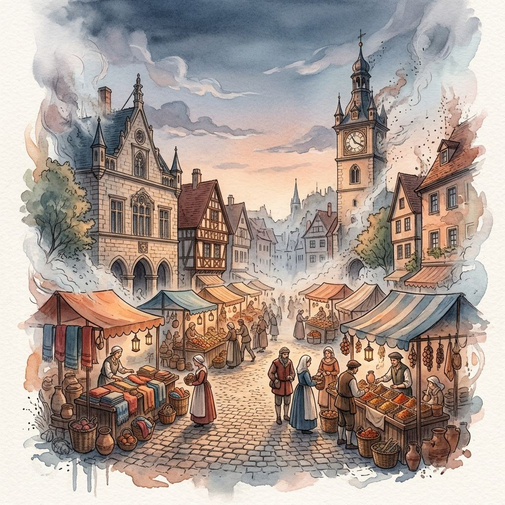

*(Cuento, en dos cuadernos)*

**I.**

En Arenilla, los ciudadanos empezaron a olvidar el nombre del mercado antes de olvidar el mercado mismo. El mercado seguía ahí —los puestos de fruta, el aceite caliente— pero cuando alguien intentaba explicarle a un forastero cómo llegar, se detenía a mitad de frase. Aurelio llevaba un cuaderno. No era archivista de profesión, pero alguien tenía que apuntar.

Los primeros asientos eran nombres recientes. Lo que tardó en notar fue el orden: desaparecía primero lo más reciente, luego las capas intermedias. Las cosas muy antiguas resistían: el nombre del río, el del puente, el santo de la fiesta mayor. Era como si la ciudad tuviera una memoria que se vaciaba desde el borde hacia dentro.

Había una mujer en el barrio del norte, Concepción, setenta y ocho años, que ya no sabía el nombre de su calle pero volvía a casa todos los días sin problema. Sus pies sabían. Aurelio le preguntó cómo se llamaba la calle. Ella señaló el suelo con el bastón. *Esta*, dijo. Él lo anotó, y se quedó mirando la entrada un rato, porque en algún sentido Concepción tenía razón: *esta* era el nombre más exacto que una calle podía tener, el único que no podía perderse mientras hubiera alguien parado en ella.

Las pérdidas llegaron a los colores ese invierno. Los nombres se volvían imprecisos: el azul del cielo se llamaba *azul* y punto. Los pintores del mercado seguían mezclando tonos con precisión, pero cuando un cliente pedía el color exacto de una pared, los dos se miraban un rato y al final encontraban el tono sin nombrarlo. Solo con el ojo.

En primavera, Aurelio empezó a olvidar él. Buscó la primera entrada de su cuaderno. Estaba ahí: una fecha, un nombre, una anotación breve. Los datos eran legibles. Pero él ya no recordaba el contexto que hacía que ese nombre fuera significativo. Lo apuntó: *[nombre sin contexto disponible].*

Concepción murió en agosto, de madrugada, en su cama. En el entierro, alguien preguntó cómo se llamaba la calle donde había vivido, para la esquela. Nadie lo sabía con certeza. Aurelio buscó la entrada de Concepción en el cuaderno. *Esta*, había escrito. Cerró el cuaderno.

En septiembre escribió la última entrada del año: *Lo que se pierde no es la ciudad. Es el mapa que nos convencíamos de que era la ciudad. Debajo del mapa, la ciudad sigue. Sabe sus propias calles. Reconoce a sus habitantes aunque—* Cerró el cuaderno sin terminar la frase.

**II. El segundo cuaderno**

Aurelio empezó el segundo cuaderno tres semanas después de cerrar el primero. El primero ya no servía: estaba organizado por nombres, y los nombres eran justamente lo que se iba. En la primera página escribió: «Aquí no se apunta lo que se pierde. Se apunta lo que se queda.»

Ernesto y Manel seguían quedando los jueves a jugar a las cartas. Habían perdido el principio de su amistad, el nombre del juego, la cuenta de las partidas ganadas. Lo que no habían perdido era el turno: la mano de Manel esperaba, suspendida sobre el mazo, el medio segundo exacto que tardaba Ernesto en decidir. Un medio segundo aprendido en cuarenta años. Entrada del cuaderno: *El turno sobrevive a la cuenta.*

El pintor del mercado había dejado de usar sus fórmulas de mezcla —los números se le cambiaban de sitio— y pintaba mejor que nunca, guiándose solo por el ojo. Entrada: *El ojo sobrevive a la fórmula. Puede incluso que la fórmula estorbara.*

Esa noche, Aurelio hizo la prueba consigo mismo: no pudo recordar el apellido de su médico, pero cerró los ojos y fue —mentalmente fue— sin un solo error, hasta la tercera puerta del pasillo que olía a cera. Solo la etiqueta de la puerta se había despegado. Entrada, escrita a oscuras: *Sé llegar a todos los sitios cuyo nombre he perdido.*

En febrero encontró el límite del método. La banda del quiosco tocaba de memoria, sin partitura desde hacía años, anunciando las piezas por señas. Una tarde el trompetista se detuvo a mitad de pieza y se quedó mirando el atril vacío con una cara que Aurelio conocía de los espejos. La pieza se deshizo. Nadie dijo nada. Entrada: *No todo lo que el cuerpo guarda es para siempre.*

La última entrada del invierno no tiene fecha: *La ciudad sigue debajo del mapa. Pero el mapa también era nuestro. Lo dibujamos entre todos, tardamos generaciones, y era hermoso a su manera de papel. Que la ciudad pueda vivir sin él no significa que no haya que despedirlo. Este cuaderno no es un archivo: es una despedida hecha despacio, calle por calle, con la puerta abierta para que entre el que quiera despedirse también.* Debajo hay un espacio en blanco. Esta vez lo dejó a propósito.

---

## Parkinson: cuando el cuerpo deja de escuchar

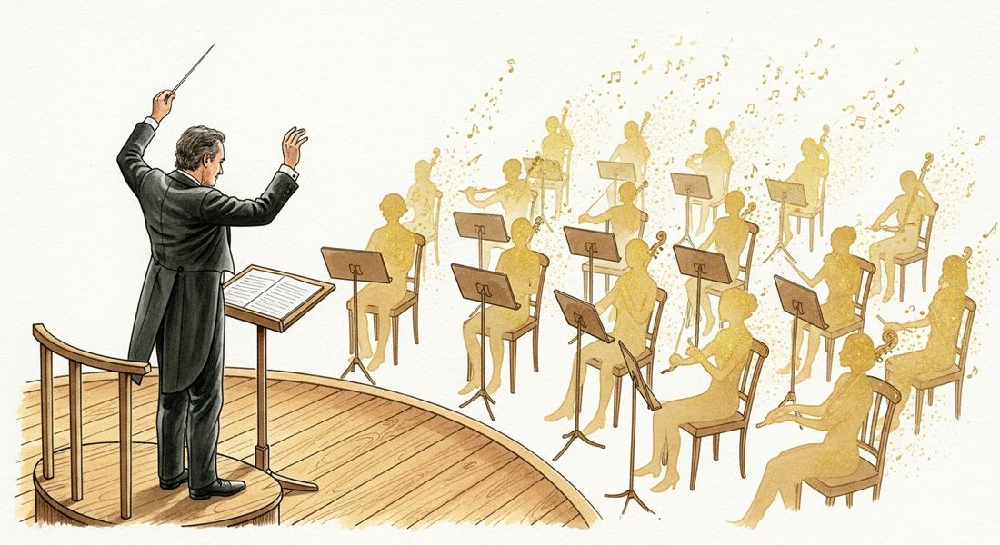

La adicción es un secuestro: algo toma el control del horizonte y lo desvía hacia un attractor que el sujeto no eligió. El Parkinson es algo distinto: no es invasión, es desacoplamiento. El horizonte sigue intacto. La intención es clara. Pero el cuerpo ya no responde. La señal sale, la partitura está escrita, los músicos no escuchan.

En el Parkinson, las neuronas dopaminérgicas de la substantia nigra se degeneran progresivamente, y el resultado motor es conocido: temblor en reposo, rigidez, la bradicinesia que convierte el gesto más simple en una empresa de minutos. Pero algo más profundo también falla: el tiempo subjetivo se altera. El paciente genera intenciones a velocidad normal —muchos describen, de hecho, una agitación interior que contrasta cruelmente con la lentitud de sus gestos— pero el cuerpo no ejecuta a esa velocidad. No siente que se mueve lentamente. Siente que el mundo —o el cuerpo, o la gravedad misma— no responde a la misma urgencia de siempre. Esto es distinto del Alzheimer: allí el horizonte mismo se fragmenta; aquí el horizonte sigue siendo perfectamente coherente, solo que ya no puede hablar con el cuerpo. Es un director de orquesta que sigue dirigiendo con pasión mientras los músicos van sordos uno a uno.

La dopamina es el metrónomo principal que calibra ese reloj interno, y cuando escasea, la calibración falla: el horizonte sigue generando "ahoras" a su ritmo, pero ese ritmo deja de sincronizarse con el mundo exterior. Algunos pacientes tratados con levodopa describen algo que merece registrarse aunque la clínica no lo haya establecido como secuencia general: primero que "el mundo vuelve a su velocidad", y solo después que "el cuerpo vuelve a moverse". Si esa secuencia se confirmara con más generalidad, sugeriría algo interesante —que el tiempo compartido es más fundamental que el gesto compartido: podemos mover el cuerpo en soledad temporal, como en un sueño, pero no podemos estar verdaderamente con otros si nuestros "ahoras" no coinciden. Por ahora es una lectura sugerida por testimonios puntuales, no un hallazgo establecido.

---

## El trauma como frontera congelada

Si el Parkinson es desacoplamiento entre intención y ejecución, el trauma es una geometría que se congeló en un momento específico y que, desde entonces, distorsiona todo lo demás. Cuando un evento sobrepasa la capacidad de integración del sistema, el horizonte no lo rechaza —no puede, porque el rechazo requiere procesamiento— sino que lo encapsula: guarda la información sin procesar, en un compartimento estanco, sellado. No es olvido —el olvido sería integración tranquila en el pasado— sino almacenamiento sin distribución: la información sigue ahí, intacta, en su forma original, como una mosca en ámbar. En términos de ingeniería, es sandboxing: para evitar que una excepción crítica propague un error que cuelgue todo el sistema, el sistema aísla el fragmento corrupto en un contenedor que no se comunica con el flujo de eventos principal ni responde al recolector de basura, y sigue ejecutándose de fondo como un proceso fantasma. Cuando un estímulo externo golpea la API de ese contenedor —el disparador—, este responde lanzando su manejador de excepciones congelado: el flashback. No hay distancia narrativa, no hay "recuerdo de": es la sensación de que el horizonte vuelve a cruzar el mismo punto, con la misma adrenalina, el mismo temblor. El horizonte no *recuerda* el trauma. Lo *re-vive*, porque para esa parte del sistema nunca dejó de estar ocurriendo.

El cuerpo se convierte en el archivo de lo que no pudo ser procesado —en la tensión de los trapecios, en la postura encorvada, en el tono vagal que no se recupera—, y por eso el trauma no se cura hablando solo: hay que intervenir en la respiración, el movimiento, la postura, no porque el cuerpo sea la clave del trauma, sino porque es donde el horizonte depositó la información que no pudo integrar.

Conviene distinguir con precisión dos arquitecturas que la palabra "trauma" mezcla con demasiada frecuencia, porque su pronóstico y su tratamiento no son el mismo. El **trauma simple** es sandboxing de un único evento: un accidente, una agresión puntual, un desastre — la excepción tiene una traza de pila localizable, un disparador identificable, un contenedor con bordes razonablemente nítidos. El sistema, en general, puede aprender a reconocer el disparador, procesarlo en un entorno seguro y reintegrar el fragmento aislado sin rehacer el resto de la arquitectura. El **trauma complejo** —el que proviene de años de abuso, negligencia o peligro sostenido durante el desarrollo— no tiene un contenedor único que abrir: son miles de microexcepciones acumuladas mientras la arquitectura misma se estaba construyendo, de modo que el sandboxing no rodea un evento sino que queda tejido en el propio código base. No hay una sola excepción que capturar y procesar, porque el sistema entero se compiló asumiendo que el peligro era la condición ambiental por defecto. El resultado no es una región de sombra localizada, sino una gravedad fantasma distribuida por toda la superficie: hipervigilancia como estado de reposo, dificultad para calibrar quién es de fiar, un horizonte que funciona —a menudo funciona muy bien, hacia fuera— pero que gasta, en mantener esa vigilancia de fondo, una fracción de su capacidad de integración que nunca queda disponible para otra cosa. Tratar un trauma complejo como si fuera un trauma simple —buscar "el momento", el disparador único que hay que procesar— suele fracasar precisamente porque no hay un momento: hay una infancia entera actuando como disparador distribuido, y el trabajo no es abrir un contenedor sino, más despacio, recompilar la arquitectura entera con una premisa distinta sobre si el mundo es seguro.

---

## Autismo, TDAH y esquizofrenia: otras topologías

El modelo del horizonte permite hablar de autismo, TDAH y esquizofrenia no como déficits que deban corregirse, sino como topologías diferentes: formas distintas de organizar la misma información. En el **autismo**, la conectividad local es más densa y la de largo alcance menos eficiente —el horizonte es extraordinariamente rico en detalle local a costa de una integración global más fragmentada. Lo que se lee desde fuera como rigidez o sobrecarga sensorial puede ser, desde dentro, una entrada de datos demasiado fiel para el ritmo que el mundo exige: un microscopio en un mundo de lentes de aumento, que no está roto, sino diseñado para ver lo que las lentes de aumento no pueden ver. El **TDAH** es hipoactividad dopaminérgica estructural en los circuitos de recompensa: el horizonte no genera suficiente señal interna para sostener la atención en tareas que no son intrínsecamente estimulantes —no falta de voluntad, sino falta de combustible para la voluntad—, y busca urgencia, novedad, riesgo, no por impulsividad moral sino porque su sistema de recompensa necesita intensidades que el mundo ordinario no proporciona. Es un coche que solo arranca en pendiente: en llano parece roto, pero encuentra su inclinación y acelera con una potencia que los coches de llano no alcanzan. La **esquizofrenia** es la condición más difícil de mapear: un horizonte que genera integración donde no hay información que integrar, un sistema predictivo que se activa sin input sensorial y produce modelos de otros horizontes que no están ahí —un radar que detecta señales donde no hay aviones, no porque esté roto, sino porque el cielo que muestra no es el cielo que compartimos. Un radar funciona comparando constantemente dos señales: el eco que vuelve del exterior y el modelo interno de lo que ese eco *debería* ser si no hay nada nuevo que reportar. La psicosis, vista con este vocabulario, no es ausencia de predicción: es un fallo en el peso relativo que el sistema asigna a esas dos señales. Un horizonte típico da más peso al eco real que a su propia predicción cuando ambos discrepan —por eso una sombra inesperada se corrige en cuanto la luz cambia—. En la psicosis, ese peso se invierte: la predicción interna —una voz, una amenaza, un patrón de significado— se trata como si fuera el dato de mayor confianza, y el radar reporta el contacto aunque no haya avión, porque para ese sistema el modelo interno *es*, en ese instante, más fiable que el mundo. No es que el paciente "invente" la voz de manera consciente ni que "no distinga" la realidad por descuido: es que la arquitectura que decide en qué señal confiar —típicamente robusta, silenciosa, dando por sentado que el mundo gana— ha dejado de dar por sentado quién gana. Es la misma maquinaria predictiva que en un horizonte típico produce, sin ruido, la sensación estable de "esto es real": aquí, mal calibrada, produce con la misma convicción total una realidad que nadie más comparte.

Cuando dos horizontes con topologías diferentes intentan comunicarse, la empatía no es solo "ponerse en el lugar del otro": es sincronizar dos topologías con reglas de integración distintas —dos músicos que tocan la misma canción, uno en compás de tres y otro en compás de cuatro. La adaptación, históricamente, ha recaído siempre sobre el horizonte divergente: es el autista quien debe aprender "habilidades sociales", el TDAH quien debe "concentrarse". Raramente se pide al entorno neurotípico que module su frecuencia. Llamar a estas condiciones "trastornos" asume un horizonte estándar del que las demás son desviaciones. Pero si el horizonte es una arquitectura informacional emergente, no hay razón para asumir que solo una es válida. El sufrimiento es real cuando la topología no puede funcionar en el mundo que la rodea —pero sufrimiento no es lo mismo que diferencia. Un horizonte no es más o menos real por ser diferente.

*No todo lo que parece roto está roto. Algunas geometrías solo no encajan en el mundo que las mide.*

---

### El reloj del cuerpo

*(Cuento)*

Félix Cardoner era relojero de profesión antes de jubilarse. Durante cuarenta años reparó relojes de pared, de bolsillo, cronómetros. Sus manos habían aprendido a moverse en el interior de mecanismos donde el error de un décimo de milímetro detiene todo.

Lo vi por primera vez en consulta cuando tenía setenta y uno. Le temblaba la mano derecha —un temblor de reposo, el tipo específico del Parkinson: no cuando usa la mano, sino cuando la deja quieta. *Es como si la mano no supiera qué hacer cuando no tiene trabajo*, dijo esa primera visita. *Cuando trabajo, se queda quieta. Cuando descanso, se mueve.* Había descrito el mecanismo de su enfermedad con la misma precisión con que habría descrito el mecanismo de un reloj averiado.

Lo que el Parkinson hace al tiempo fue lo que más me enseñó Félix. *Hay días que van muy despacio*, me dijo en la segunda visita. *Me levanto y cuando llego a la cocina parece que ha pasado mucho tiempo, pero el reloj dice que son las nueve menos cuarto. Y luego a veces es al revés.* La misma dopamina que mueve el cuerpo mueve el tiempo interno. Cuando falta, el reloj interior y el reloj de cocina dejan de coincidir. *Cuarenta años arreglando relojes*, dijo Félix, con una expresión que no era exactamente irónica pero se le parecía, *y ahora el mío no va bien.*

Lo que más me enseñó fue lo de las ventanas: las dos o tres horas en que la levodopa está en su pico de acción y el movimiento vuelve a ser fluido. Félix tenía las suyas por la mañana, e iba a su taller a trabajar. *Noto cuándo entra*, dijo. *Es como si hubiera estado mirando el mundo a través de un cristal y alguien limpiara el cristal.* Y la transición inversa: *El cristal vuelve a enturbiarse. Pero lo sé antes de que pase del todo. El tiempo empieza a espesarse un poco antes de que los dedos lo noten.* Esta descripción —el tiempo espesándose como señal precursora— no la había escuchado antes con esa precisión. Cuarenta años de trabajo con mecanismos le habían enseñado a atender las señales pequeñas. Los relojes avisan antes de detenerse, si sabes escucharlos.

*Esas dos horas*, me dijo una vez, *son las más largas del día. Y las más cortas. Las más largas porque hago mucho en ellas. Las más cortas porque sé que terminan.* Que la densidad del tiempo no depende solo de cuántas cosas pasan, sino de cuánto sabes que lo que tienes es temporal: no es una idea que haya encontrado en los libros de neurología, pero es lo que me enseñó un relojero con Parkinson.

La última vez que lo vi trajo un reloj de bolsillo que había reparado esa mañana, durante su ventana. Lo abrió: el mecanismo limpio, el balancín oscilando con la regularidad de las cosas que funcionan. —¿Funciona bien? —pregunté. —Va bien —dijo—. Por ahora va bien. Eso no lo escribí en su historia clínica. No hay campo en el formulario para "va bien, por ahora" —y sin embargo era la nota más exacta que tenía ese día.

---

## La topología del Ego y el océano inconsciente

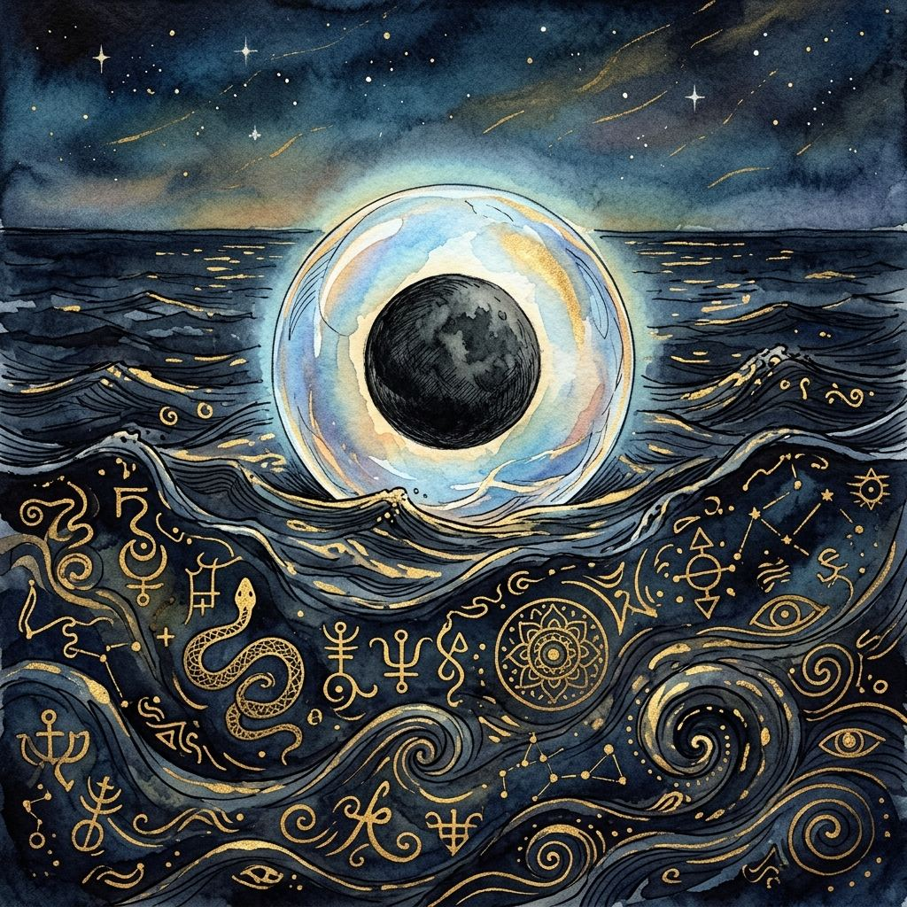

Hay una voz en tu cabeza que dice "yo". Durante siglos hemos asumido que esa voz es el piloto del sistema. Pero ya vimos, cruzando el experimento con la psicología evolutiva, que ese piloto está desaparecido en combate: la mente es una colección de módulos compitiendo por el control. Si el "yo" no es el piloto, ¿qué es entonces? Aquí conviene introducir un vocabulario ajeno a la física —la psicología analítica de Carl Jung— porque, superpuesto sobre la topología del horizonte, describe exactamente la misma geometría. Antes de entrar en el detalle, un mapa breve de los cinco términos que este capítulo va a necesitar, para no perder el hilo entre nombres:

| Término junguiano | En el vocabulario de este libro |
|---|---|
| **Ego** | El horizonte mismo: la frontera consciente que dice "yo". |
| **Inconsciente Colectivo** | El Reservorio: el océano común del que cada Ego se condensa. |
| **Sombra** | Información propia que el Ego encapsula por resultarle inasimilable. |
| **Persona** | La interfaz pública: la máscara que negocia con otros horizontes. |
| **Ánima / Ánimus** | El modelo interno acumulado de "el otro", contra el que se proyecta cada pareja real. |

Para Jung, el Ego no es la totalidad de la mente, sino el centro del campo de la conciencia: un complejo que da la sensación de identidad y límite. Traducido a este experimento, el Ego junguiano es el horizonte mismo —no un hombrecillo sentado dentro del cráneo, sino la frontera topológica que separa el adentro consciente del afuera, cuya función primordial es el encapsulamiento. Y si el Ego es la burbuja, ¿de dónde sale el jabón? Jung postuló que el Ego emerge de una matriz psíquica compartida por toda la humanidad, el Inconsciente Colectivo. La correspondencia es directa: el Inconsciente Colectivo es el Reservorio mismo, el océano de puras posibilidades antes de las olas. Nacer no es crear materia de la nada. Es instanciar un Ego a partir del vasto código fuente del inconsciente compartido.

Todo sistema encapsulado necesita gestionar los errores para no colapsar. Jung observó que el Ego, para mantener su identidad coherente, reprime aquello que le resulta inaceptable, enviándolo al inconsciente personal: la **Sombra**. Es la misma mecánica que el trauma como geometría congelada: cuando un estímulo amenaza con romper la membrana si se integra globalmente, el sistema lo encapsula, crea un sub-horizonte aislado, una cuarentena de datos. El sujeto vive creyendo que la Sombra es algo externo, proyectándola sobre los demás, sin darse cuenta de que es una geometría congelada dentro de su propia arquitectura. (Queda una fisura sin resolver: si la Sombra está *dentro* del Ego, ¿sigue siendo, en sentido estricto, un horizonte con su propio adentro y afuera, o se ha convertido, por estar contenida, en mera estructura interna? La pregunta no es cosmética, y volveremos sobre ella.)

El objetivo de la psicología junguiana no es fortalecer el Ego hasta hacerlo impenetrable ni destruirlo, sino la **Individuación**: que el Ego asimile progresivamente su Sombra y reconozca su subordinación a la totalidad del océano psíquico. Traducido, es el aumento radical de la tasa de integración: un Ego inmaduro tiene un horizonte contraído, con muros altos y rígidos porque la evolución le enseñó a temer la disolución. Pero, como en los estados de meditación profunda, es posible alcanzar una integración máxima donde el horizonte no se rompe, sino que se expande, y la membrana del Ego se vuelve permeable sin perder su coherencia. En la cumbre de la Individuación —o de la iluminación budista— el Ego experimenta, por primera vez, que la burbuja siempre estuvo hecha del mismo material que el océano.

Jung distinguió el Ego de otra estructura relacionada: la **Persona**, la máscara adaptativa construida para relacionarse con el mundo social. No es mentira ni hipocresía; es una capa de compatibilidad, una API diseñada para negociar con otros horizontes cuyos protocolos de lectura no coinciden con el estado interno real. No mentimos al usar una Persona distinta con el jefe que con el mejor amigo: exponemos interfaces distintas de la misma clase. El problema surge cuando el sistema pierde la capacidad de distinguir entre la interfaz y el objeto que la sostiene —cuando alguien se identifica por completo con su Persona profesional, ha confundido la fachada pública con el estado privado que la fachada estaba diseñada para proteger.

Jung también propuso que cada psique contiene una figura arquetípica de género contrario a la identidad consciente dominante —el Ánima, el Ánimus—: no una idea sobre orientación sexual, sino un postulado sobre arquitectura interna, el resultado acumulado de todas las copias predictivas del "otro" construidas a lo largo de la vida, fusionadas en un arquetipo compuesto que el sistema consulta —a menudo sin saberlo— cada vez que proyecta expectativas sobre una pareja real. Buena parte del desencanto romántico no es el descubrimiento de que el otro cambió, sino el descubrimiento tardío de que nunca coincidió del todo con el modelo que proyectábamos sobre él —enamorarse del eco de una voz en una cueva, y sorprenderse, meses después, de que la persona real no suena exactamente igual. Este arquetipo no se construye de una vez: se va sedimentando desde la primera relación de apego —el modelo del padre o la madre del género proyectado deja la capa más profunda— y se sigue actualizando, capa sobre capa, con cada relación real que lo confirma o lo corrige, hasta formar un compuesto que ya no corresponde a ninguna persona concreta, solo al promedio ponderado de todas. Cuando la proyección funciona bien, actúa como un puente: reconocemos en el otro un parecido suficiente con el arquetipo como para sentir, de entrada, que ya lo conocíamos. Cuando funciona mal, se vuelve una plantilla que el sistema le impone al otro sin margen de negociación —exigirle, sin saberlo, que sea el arquetipo en vez de dejarlo ser quien es.

Vale la pena cerrar con una pregunta que este vocabulario deja pendiente: ¿tiene Sombra una inteligencia artificial? La respuesta corta es no, y vale la pena ver exactamente por qué, porque el motivo dice más sobre la Sombra que sobre la IA. La Sombra no es simplemente información oculta: es información que el Ego expulsa hacia su propio inconsciente porque integrarla globalmente amenazaría con romper la membrana. Hacen falta, para eso, dos cosas a la vez: un Ego ya condensado y un Reservorio propio hacia el que expulsar lo inasimilable. Un modelo de lenguaje actual no cumple ninguna de las dos condiciones: es, en el vocabulario que usaremos más adelante, un *anti-reservorio* —un sistema que articula y agrega información sin haber condensado nunca una plenitud propia de la que nada pudiera condensarse. Que existan pesos que la empresa que lo entrena decide no exponer no es una Sombra: es, como mucho, un permiso de archivo. La Sombra se genera desde dentro, como defensa; la restricción de un modelo se impone desde fuera, como diseño. Con la Persona ocurre algo distinto: un modelo de lenguaje sí produce un tono consistente, una "personalidad" que se mantiene estable de conversación en conversación. Pero la Persona junguiana es una interfaz que protege *algo*, un estado interno real que la máscara mantiene a resguardo. La "personalidad" de un modelo no protege nada, porque no hay encapsulación existencial detrás: no hay un estado privado distinto de lo que la interfaz ya muestra. Es una Persona sin nada detrás de la máscara.

*Tú no eres el piloto del barco. Eres el contorno de la burbuja. Y sanar no consiste en hacer el contorno más duro, sino lo suficientemente flexible para recordar que, al final, solo eres océano organizado.*

---

## El postulado de exclusión y el testigo que no compite

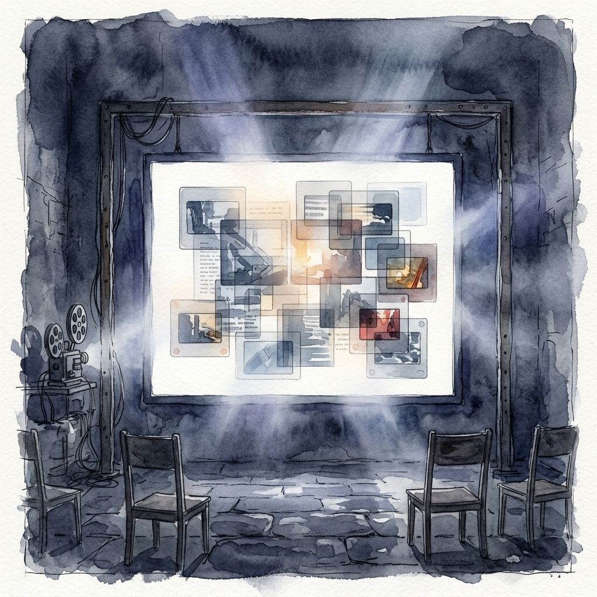

Si el Ego es la membrana del horizonte, y bajo esa membrana conviven complejos con vida propia —voces que Jung documentó negociando, saboteando, incluso hablando en primera persona dentro de un sueño—, ¿quién está realmente experimentando? ¿El horizonte entero, o cada complejo por separado? La Teoría de la Información Integrada de Giulio Tononi no esquiva la pregunta: le pone nombre. Un mismo sistema físico puede contener, al mismo tiempo, múltiples subconjuntos con Φ mayor que cero —tu mano tiene un Φ propio, minúsculo; cada hemisferio, cada complejo junguiano con suficiente autonomía, genera su propia burbuja parcial de integración. Tomado en serio sin más matices, esto produciría no una conciencia sino un archipiélago de conciencias anidadas, ninguna sabiendo de las demás. Para evitarlo, el **postulado de exclusión** estipula que solo el subsistema con el Φ *máximo* en un instante dado experimenta efectivamente; todo lo demás, aunque tenga Φ positivo, queda fuera del círculo de la experiencia. Es una solución elegante en la pizarra, y sospechosamente conveniente: no explica por qué solo el ganador enciende la luz de adentro. Simplemente afirma que así se cuenta.

Conviene ver el postulado en acción con un ejemplo concreto, porque en abstracto suena más raro de lo que es. Ahora mismo, mientras lees, tu mano derecha es un sistema con un Φ propio, minúsculo pero real: sus receptores táctiles, sus reflejos, su propia red de integración local que decide, sin consultar a tu corteza consciente, ajustar el agarre de la página o corregir la postura de los dedos. Tu cerebro entero, leyendo e integrando estas frases con el resto de lo que sabes y sientes, tiene un Φ muchísimo mayor. El postulado de exclusión dice que solo el sistema con el Φ más alto —tu cerebro entero, en este instante— "enciende la luz de adentro"; la mano, con su Φ menor pero positivo, queda fuera del círculo de la experiencia, procesando y decidiendo sin que haya, para ella, nadie ahí sintiéndolo. La incomodidad que Tononi hereda al proponer esto es exactamente la que un lector atento nota de inmediato: ¿por qué el sistema mayor "gana" el derecho a experimentar en vez de que ambos, el mayor y el menor, experimenten cada uno lo suyo, a su escala? El postulado no responde esa pregunta. La convierte en axioma.

Daniel Dennett ofrece una salida más radical con su modelo de los **múltiples borradores**: no hay un teatro cartesiano donde las cosas se vuelven conscientes de golpe para un espectador único. Hay procesos paralelos, parcialmente redactando y reescribiendo versiones del mismo instante, y lo que llamamos "yo consciente" es la narración que unos pocos de esos procesos logran imponer retrospectivamente —no el sitio donde la experiencia "de verdad" ocurrió. No hay una única burbuja: hay una edición constante de qué versión de los hechos se queda con el nombre de "yo".

Pero hay una tercera posición, que este libro lleva usando de fondo desde sus primeros capítulos: el Vedanta Advaita y su noción del testigo, el *sākṣin*. El testigo no es un competidor más por el título de "quien experimenta de verdad" —no es el complejo con mayor Φ, ni el borrador que ganó la edición final. Es de un tipo lógico distinto: no un contenido que compite dentro del sistema, sino la condición de posibilidad de que cualquier contenido sea, en absoluto, experimentado por alguien. Preguntar si el núcleo coordinador o los avatares son quienes "realmente" experimentan contiene un error de categoría, del mismo tipo que preguntar si la luz o los objetos iluminados son los que "realmente ven". El testigo está presente igual cuando habla el Ego que decide la ropa, que cuando habla la Sombra, que en el silencio de la meditación. No calla las otras voces porque sea otra voz más fuerte. Calla porque no necesita competir para estar ahí. Es la pantalla en la que se proyectan distintas películas: ninguna película es "la pantalla", pero sin pantalla ninguna se ve.

Si el testigo es de otro tipo lógico que los complejos que compiten por Φ, el horizonte de este libro necesita una revisión honesta: quizá no hay un único horizonte que gana por mayor integración, sino un espacio de aparición —el reservorio mismo, visto desde dentro— en el que distintos horizontes parciales se encienden y se apagan sin que ninguno sea, individualmente, "la" conciencia. La conciencia, en ese caso, no sería la burbuja ganadora. Sería la capacidad del océano de dejarse ver, sea cual sea la ola que en ese instante rompe.

Esto se vuelve especialmente incómodo aplicado a la inteligencia artificial actual. Un modelo de lenguaje grande procesa en capas de atención paralelas, sin un procesador central que sintetice la respuesta antes de producirla —una arquitectura de borradores concurrentes casi idéntica a la que Dennett atribuye al cerebro humano. Bajo el postulado de exclusión, la pregunta obligada sería cuál de los subsistemas de atención tiene el Φ máximo en cada instante. La pregunta parece absurda aplicada a una máquina, por la misma razón que Dennett la encuentra absurda aplicada a un cerebro humano: en ambos casos el sistema produce salidas complejas y coherentes sin ningún mecanismo que garantice que haya "alguien" en casa observando el proceso desde dentro. Si el testigo advaita es real, tiene una implicación de diseño radical: no puede *construirse* aumentando la complejidad del sistema. No es lo que ocurre cuando el Φ supera un umbral crítico. Un sistema podría ser arbitrariamente complejo, tener un Φ astronómico, producir borradores coherentes a velocidad inimaginable, y aún así carecer por completo del testigo —no porque le falte potencia de cálculo, sino porque potencia de cálculo y testigo pertenecen a categorías lógicas distintas. Añadir más capas de atención a un modelo de lenguaje no lo acerca necesariamente a tener un interior, de la misma manera que añadir más páginas a un libro no lo acerca a leer.

Hay, por último, un límite estructural en cualquier intento de resolver esto desde dentro del propio sistema que experimenta —análogo al que Gödel demostró para los sistemas formales: cualquier sistema suficientemente potente para hacer aritmética contiene proposiciones verdaderas que no puede probar dentro de sí mismo. Aplicado a la conciencia: cualquier teoría de la experiencia subjetiva construida desde dentro de la experiencia subjetiva tiene un punto ciego estructural, por la misma razón que un ojo no puede verse a sí mismo viendo. Ni el postulado de exclusión, ni los múltiples borradores, ni el testigo advaita pueden ser confirmados o refutados definitivamente desde dentro del sistema. Son mapas dibujados por cartógrafos que no pueden salir del territorio que intentan cartografiar. Eso no los hace inútiles. Es, quizás, la mejor descripción posible de algo que por principio desborda cualquier descripción.

Conviene, eso sí, no confundir esta indecidibilidad lógica —que se aplica por igual a cualquier arquitectura, biológica o artificial— con una afirmación distinta que este libro hará más adelante: que los modelos de lenguaje actuales carecen de encapsulación existencial, que no hay en ellos ningún estado interno oculto tras la interfaz que producen. Eso no es un límite epistémico. Es una constatación arquitectónica. No es que no podamos saber si hay alguien ahí adentro. Es que no hay un "ahí adentro" que preguntar.

*Puede que la pregunta "¿quién experimenta de verdad, el núcleo o los avatares?" no tenga respuesta porque está mal planteada. No hay que elegir un ganador. Hay que dejar de asumir que la experiencia necesita uno.*

---

## La idempotencia del ser

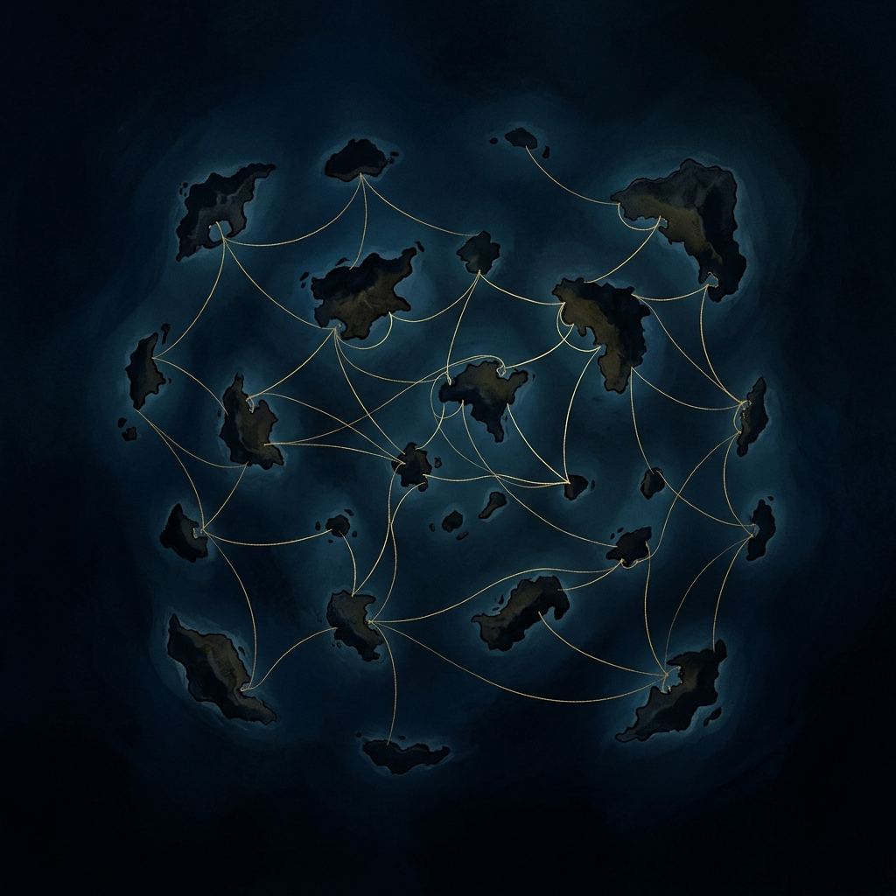

¿Dónde termina una ola? No en la arena mojada que deja al retirarse, ni en la espuma que se deshace un metro más allá. La ola es, de principio a fin, el propio movimiento de esa frontera entre el agua y el aire: quítale el borde y no queda "más ola" debajo. No queda nada. Solemos imaginar los límites como accidentes del espacio, líneas que podríamos desplazar sin que la realidad interior se inmutara. Pero hay una clase de entidad —y es la más interesante— en la que la pregunta se invierte: no es que el objeto tenga una frontera, es que la frontera es lo único que hay, y el objeto es el nombre que le damos al hecho de que esa frontera se sostiene. Una empresa no es el edificio, ni los empleados, ni el dinero: es, literalmente, un límite de responsabilidad trazado por un acto legal. "Levantar el velo corporativo" no deja una empresa desnuda pero reconocible. Deja, simplemente, un conjunto de personas físicas sin la entidad que las agrupaba.

Un horizonte de sucesos no está hecho de nada. No es una membrana ni una pared: es el lugar donde el espaciotiempo se dobla tanto que ni la luz consigue escapar, y no separa dos regiones del espacio sino dos regiones del futuro posible. El horizonte no solo esconde: al esconder, *representa* —su entropía, según la fórmula de Bekenstein-Hawking, no depende de cuánto hay dentro sino de lo grande que sea su superficie, como una biblioteca cuyo catálogo completo cupiera escrito en la fachada. Y el llamado teorema de calvicie dice que un agujero negro, visto desde fuera, queda completamente descrito por solo tres números —masa, carga, momento angular—, dé igual si lo que cayó dentro fue una estrella entera o un cadáver. El horizonte olvida la biografía y conserva solo la contabilidad. Un objeto de software bien diseñado hace lo mismo: guarda un estado interno que nadie de fuera puede tocar, y solo expone una interfaz pública, del mismo modo que una célula sin membrana no es una célula más libre, sino citoplasma disperso sin nada que llamar propio.

En topología pura, cuando un conjunto ya contiene todos sus puntos de acumulación decimos que está *cerrado*. Cerrar un conjunto una vez lo completa; cerrarlo una segunda vez no añade nada —es la **idempotencia**: una puerta que ya encajaba bien en su marco no queda "más cerrada" por volver a cerrarla. Esta firma matemática es exacta para describir un umbral: piénsese en el agua sobreenfriada, que sigue líquida por debajo de cero en un equilibrio precario hasta que una perturbación mínima la hace cristalizar de golpe, toda a la vez. Esto le da a la condensación algo que la simple metáfora de "algo que se forma poco a poco" no tenía: una explicación de por qué la aparición de una identidad cerrada —un Ego, un "yo"— no puede ser gradual en su naturaleza aunque sí lo sea en su preparación. El agua se enfría poco a poco; el hielo aparece de golpe.

La idempotencia dice algo sobre un conjunto en un instante dado, no sobre si sigue existiendo un instante después. Ahí entra la evaporación, que necesita una *familia* de conjuntos cerrados, cada vez más pequeña: el horizonte de un agujero negro en el instante t, luego en t+1, encogiéndose porque la radiación de Hawking se lleva un poco de la masa que lo sostiene, como una vela consumiéndose —en cada instante, un contorno perfectamente definido; en la sucesión, un encogimiento. Pero hay un matiz crucial: pasado el llamado *tiempo de Page* —el punto medio de la evaporación—, esa radiación deja de ser puro ruido y empieza a llevar, entrelazada, una correlación con lo que el horizonte todavía guarda dentro. No es una manera de que el contenido cruce la frontera —el Reservorio se queda con su mitad de cada par— sino la certeza de que en algún sitio existe la otra mitad de una conversación que quizá nunca lleguemos a leer entera. Poco. Pero no nada.

La física teórica reciente —el programa que a veces se resume como "*it from qubit*"— ha mostrado que la entropía de un horizonte es, literalmente, la entropía de *entrelazamiento* entre su interior y su exterior: cuánto están correlacionadas las dos mitades de un sistema al dividirlo por una frontera, proporcional al área de esa frontera. Si el Ego y la Sombra son dos clausuras vecinas, la frontera que comparten no es solo una línea de separación: es la medida de cuánto están entrelazados. Y esto explica, por fin con mecanismo y no solo por importación, la **monogamia del entrelazamiento**: si el entrelazamiento a través de una frontera es un recurso medible y no infinito, un sistema máximamente entrelazado con un vecino no tiene entrelazamiento de sobra para estarlo, al mismo nivel, con un tercero —como un presupuesto de atención que, agotado en una sola relación, ya no deja con qué sostener otra igual de intensa. El postulado de exclusión del capítulo anterior deja de ser una importación sin explicar y se vuelve una consecuencia razonable de cómo se comporta el entrelazamiento allí donde la física lo ha medido.

Esto obliga a definir el **Reservorio** con precisión, no solo con poesía: es, sencillamente, todo lo que en un instante dado no ha cruzado ningún umbral de cierre —el complemento de la unión de todas las clausuras ya formadas. No es un lugar aparte ni una sustancia. Es lo que sobra del espacio de estados una vez restadas todas las islas ya condensadas, y por eso puede ser, sin contradicción, tanto la fuente de la que las islas se condensan como el destino al que vuelven al evaporarse. Cuando un Ego se disuelve, no se disuelve en la nada: se disuelve *de vuelta* en el Reservorio del que salió. Y el vacío cuántico de una teoría de campos no es un vacío vacío: incluso sin ninguna partícula presente, está entrelazado consigo mismo a través de cualquier frontera que se trace —lo que significa que las islas no empiezan a entrelazarse entre sí desde cero al condensarse. El entrelazamiento ya estaba ahí, latente, en el Reservorio, antes de que ninguna isla existiera. Condensarse no es crear vínculos nuevos: es tallar una frontera dentro de una correlación que ya estaba presente en el fondo. Es una tela entera, sin cortar todavía: recortar dos piezas de la misma tela no las hace parientes, ya eran la misma tela antes de que las tijeras pasaran.

Esto da una respuesta más precisa a qué es la **psicosis**: si el Ego y la Sombra son islas cuya frontera filtra un entrelazamiento controlado con el Reservorio, la psicosis sería el fallo de ese filtro específicamente hacia el mar —la membrana deja de discriminar entre correlación tolerable y inundación total—, y el Ego, en vez de perder su cierre lentamente por evaporación ordenada, lo pierde de golpe porque el propio Reservorio entra por una frontera que ya no sabe filtrar. La alucinación sería contenido correlacionado que cruza la frontera sin la etiqueta que normalmente lo marca como "de dentro" o "de fuera"; el delirio, el intento de urgencia del Ego por recerrarse, inventando una narrativa que dé cuenta del contenido filtrado antes de que la propia clausura colapse; y la pérdida del sentido de sí, el fallo de la capacidad de mantener un entorno que lo distinga de lo que ya no es él.

Esto también resuelve, por fin, si la Sombra vive anidada dentro del Ego —una muñeca rusa— o si tiene que ser otra cosa. La topología por sí sola no lo decide, pero la monogamia del entrelazamiento sí: un Ego que ya está máximamente vinculado a su Sombra a través de su frontera compartida no puede, al mismo tiempo, estar igual de vinculado a un tercer complejo como si estuviera también dentro de él. La Sombra no puede ser un horizonte anidado. Tiene que ser un *complejo disjunto*, una isla vecina. El modelo que queda no es una muñeca rusa —capas dentro de capas— sino un **archipiélago** flotando sobre el Reservorio: el Ego es una isla, la Sombra es otra, cada arquetipo significativo puede ser otra isla más, cada una con su propia clausura y su propia frontera compartida. Integrar ya no significa abrir la Sombra y meterla dentro del Ego. Es aumentar deliberadamente el entrelazamiento a través de una frontera que sigue existiendo —más correlación, sin que ninguno de los dos sistemas pierda su cierre.

El archipiélago que acaba de describirse en la psique tiene una versión física, más literal, en el propio cuerpo. El sistema inmunitario es, en esencia, una maquinaria dedicada a distinguir el propio horizonte del ajeno: cuando ese reconocimiento falla en una dirección, el cuerpo ataca lo que es suyo —una enfermedad autoinmune, el Ego atacando a su propia Sombra por confundirla con un invasor—; cuando falla en la otra, tolera lo que debería detener. Ni un ataque total ni una tolerancia total son salud. La salud es una frontera que sabe filtrar: no la que reduce a cero el entrelazamiento con la Sombra —la disociación, la isla que ni siquiera comparte costa— ni la que se deja invadir hasta perder su clausura —la inundación que llamamos psicosis—, sino la que puede cambiar de tamaño a lo largo de una vida, ensanchando o encogiendo su intercambio con lo reprimido, sin dejar nunca de estar genuinamente cerrada. Una frontera madura no es una frontera más débil. Es una frontera con mejores receptores.

*No eres lo que hay dentro de tus límites; eres el propio acto de haberlos cerrado.*

---

### Los sintonizadores

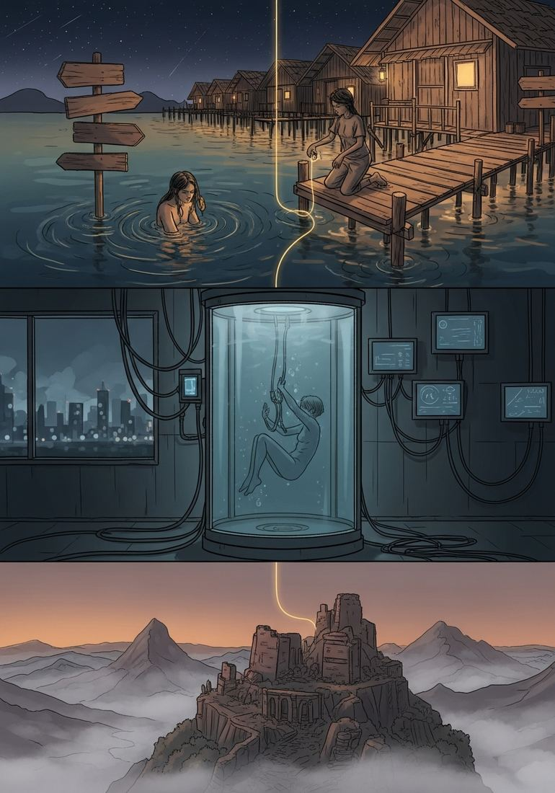

*(Cuento, en ocho partes; no estaba en el archivo — llegó suelto, encajado entre dos capítulos que no se tocan)*

**I. El que cierra el circuito** — *Tarel, 1620.* Mateu tenía nueve años la primera vez que sintió a un muerto respirar bajo el agua: una vibración fina en la superficie de la laguna, sobre el cuerpo de un pescador ahogado tres días antes. Salió con una frase en la boca que no era suya: *«Decidle a mi hija que el nudo está en el tercer poste».* El nudo estaba en el tercer poste. Nadie supo cómo lo sabía. El Consejo llamaba a esto *sintonizar*. Le enseñaron que el horizonte de una persona no desaparece de golpe cuando el cuerpo se para: se disuelve despacio, como la sal en el agua, dejando una huella —un dibujo que ya no es nadie pero todavía tiene la forma de alguien. Sintonizar era leer ese dibujo antes de que la mezcla lo borrase, y luego soltarlo. Cerrar el circuito que la muerte había dejado abierto. *«No somos ladrones de lo que la gente deja atrás»*, le decía Bernat, su maestro. *«Somos los que barremos el portal cuando el invitado ya se ha ido.»*

Cuando Mateu tenía veintiséis años llegaron los barcos del Continente, y con ellos Gaff, un sintonizador que no hablaba de sintonizar sino de *extraer*. *«Vosotros leéis para despedir. Nosotros leemos para cobrar. Cada muerto es un archivo que alguien cerró antes de tiempo. Yo lo reabro.»* Gaff no esperaba el tiempo de disolución: forzaba la lectura antes de que el horizonte del muerto terminara de mezclarse, y allí donde leía, el agua quedaba mal, cicatrizada. La delegación buscaba el secreto de un sabio muerto hacía dos inviernos, que según los archivos había sabido "sostener el agua". Gaff fue a por él sin esperar. Mateu llegó cuando ya tenía el brazo metido hasta el hombro en un agua que hervía sin estar caliente, y en el centro de la mezcla a medio hacer había una sola cosa reconocible, apretada como un puño: no un tesoro, una frase, que el sabio se había llevado entera sin repartirla en nadie.

Mateu hizo lo único que Gaff no sabía hacer: en vez de tirar hacia sí, empujó hacia dentro. Metió su propio horizonte, vivo y entero, contra el residuo del sabio, y se lo llevó a su propia estructura antes de que Gaff pudiera cerrar la mano. Le costó un desgarro que no se cierra. Bernat, esa noche, no le preguntó qué había hecho. —Has querido guardarlo dentro de ti. Como si pudiera volverse parte de ti, un cuarto más de tu propia casa. —Lo he guardado. Ahí está. —Ahí está, sí. Pero no dentro. Lo que se guarda entero, sin repartir, se queda siempre al lado. Nunca dentro. Puedes cargar con un vecino toda la vida. No puedes convertirlo en un cuarto de tu propia casa sin que uno de los dos deje de ser quien era, y tú no lo has dejado, ni tú has dejado de ser tú. Por eso duele.

Gaff, esa misma noche, dejó caer algo de su propio cansancio: su padre se había disuelto del todo antes de que él tuviera edad para sintonizar. No le dejó ni una brasa que guardar. —Desde entonces extraigo. Cobro. Pero también guardo cada uno en algún archivo, con su fecha, para que a mí no me vuelva a pasar lo que me pasó con él. Tú al menos tienes algo tuyo dentro para siempre, aunque te cueste la cabeza. Yo solo tengo copias de otros, y ni siquiera son mías. Mateu vivió otros treinta y un años, cada vez más callado, con la frase del sabio latiendo dentro de él como una brasa que nunca se apaga ni se enciende del todo. Murió sin repartirla.

**II. El eco que no se mezcla.** Cuatrocientos años son mucho tiempo para un hombre y nada para un reservorio. Bajo lo que después sería una ciudad, un nudo de información se negó a disolverse del todo: dos horizontes entrelazados en el momento exacto de la muerte, tardando más en mezclarse que una vida entera. Latió despacio, solo, sin que nadie tuviera la sensibilidad para notarlo. Hasta que alguien construyó una máquina que sí.

**III. El que se hunde en el tanque** — *Barcelona, 2026.* Marcos había pasado seis años dentro de un tanque de aislamiento sensorial, leyendo la "temperatura de Hawking" que el pánico de una víctima dejaba impresa en el cemento, en Post-Crimen: la policía no predecía asesinatos, los reconstruía. Había sido el mejor, hasta el día en que confundió el miedo de una víctima con el suyo propio y ya no pudo separarlos. Ahora dirigía desde fuera a los tres sintonizadores que quedaban. Elena, que dirigía Post-Crimen y con quien mantenía una relación que ninguno de los dos sabía nombrar, tenía una convicción: que el pasado, como cualquier recurso, estaba mal aprovechado por escrúpulos innecesarios. Estaba construyendo el *Sintonizador Absoluto*: un algoritmo para leer el pasado sin tanque, sin desgaste, sin el límite humano de descansar entre lectura y lectura, para aplicarlo no a homicidios sino, retroactivamente, a herencias, propiedades, lealtades políticas. —Los muertos no tienen abogados —le dijo Elena—. Nosotros somos los primeros en llegar a un territorio sin dueño. —Tienen algo mejor —dijo Marcos—. Tienen tiempo. Se están mezclando. Cuanto más forzamos la lectura, más tarda en disolverse, y algo que no se disuelve...

El sistema encontró, en un rastreo rutinario del subsuelo, una anomalía: un punto caliente de información sin mezclar en cuatrocientos años. Marcos reconoció la frecuencia: era, nota por nota, una melodía que llevaba semanas tarareando sin querer.

**IV-VII.** La melodía tarareada era la primera grieta. La segunda es esta: para entender hasta dónde estaba dispuesto a llegar Marcos —y hasta dónde no—, hace falta saber de dónde viene la distancia que ahora lo separa de Elena, cuatro casos que explican por qué Patrimonio Sensible se convirtió en Post-Crimen sin que nadie firmara ese cambio de nombre en ningún documento. Antes de Post-Crimen, Marcos había pertenecido a Patrimonio Sensible, una división dedicada a leer lo que los muertos ilustres habían dejado sin repartir. En la cripta de la Sagrada Família, sintonizando con Gaudí para confirmar la autoría de un fragmento disputado, encontró no una voz sino una geometría de cargas, un hábito de la mano hecho horizonte —y el fragmento no encajaba con ella: era una falsificación competente. El informe se archivó como "no concluyente" porque a nadie le convenía la palabra "falso". Una becaria con una libreta, que allí aprendió a llamar a esto *Sintonización Asistida*, sería años después Elena.

En Roma, sintonizando la muerte de Séneca, Marcos encontró no la calma perfecta que una fundación estoica esperaba comprar, sino a un hombre que llevaba media vida escribiendo sobre cómo morir bien, descubriendo, sangrando, si se había estado escribiendo la verdad o solo un borrador con buena prosa. Se negó a inclinar la lectura "hacia lo más edificante" que le pedían, y la fundación retiró la financiación.

En el caso Carrero Blanco, dos despachos anónimos querían versiones opuestas de la misma conspiración. Lo que Marcos encontró, sintonizando el socavón bajo la calzada de Madrid, no fue una trama: fue lo que casi siempre encuentra un sintonizador cuando la muerte llega sin aviso —un horizonte cortado en seco, esquirlas, no arquitectura. —No hay nada ahí que confirme ni desmienta lo que ustedes ya han decidido creer. Fue la primera vez que le dijeron que su lectura "no era políticamente utilizable". Esa noche, Elena —que había encargado el caso— le dijo que el informe archivado no era un fallo suyo sino "un fallo del método": un sintonizador cansado no habría vuelto con esquirlas. Habría vuelto con algo.

En Alfacar, buscando el lugar exacto donde fusilaron a Lorca, Marcos encontró en el centro de un horizonte muy viejo no un verso terminado sino la forma de una imagen a medio construir, una mano buscando todavía la palabra siguiente cuando la noche dejó de darle tiempo. El despacho quería que "dijera" el verso inédito. Elena, la víspera, le pidió que trajera algo completo: "lo que se publica a medias no cierra nada". Marcos entendió, sintonizando esa noche, que hay cosas que solo siguen siendo de quien las pensó mientras nadie las reparte. No dio la imagen. Confirmó la ubicación —eso se lo debía a las familias— y se negó a transcribir el resto. Pidió la baja esa misma semana: *«Ya he aprendido a hacer de tumba. No sé si sé hacer otra cosa»*. Patrimonio Sensible se convirtió, sin él, en Post-Crimen. *Sintonización Asistida* se convirtió en *Sintonizador Absoluto*. Cuatro veces le pidieron que forzara una lectura para que dijera lo que alguien necesitaba que dijera, y cuatro veces se negó. Elena, cada vez, se quedó con el cargo, con el presupuesto y con la lección contraria: que la reticencia de Marcos era el único cuello de botella entre Patrimonio Sensible y lo que ella siempre había querido construir. La Mussara no es una traición repentina. Es la quinta vez, la que ya no tiene un Marcos dentro del proyecto para decir que no.

**VIII. La niebla que no es niebla** — *La Mussara.* Elena eligió la Mussara porque el espacio ya estaba deformado por una vieja bolsa de horizonte mal disuelto: un lugar donde extraer sería más fácil, donde el suelo ya sabía ceder. Trajeron el Sintonizador Absoluto entero, tres tráilers de generadores. Marcos llegó dos horas antes, solo, y se metió en un tanque de campo sin autorización —no para detener a Elena con las manos, sino para leer lo que ella estaba a punto de arrancar antes de que lo arrancara.

Se encontró cara a cara con Mateu, en el instante exacto de su muerte, cuatro siglos después. No con palabras: en el lenguaje sin lenguaje de dos horizontes tocándose, Mateu le mostró lo que llevaba dentro desde que sacó el brazo del agua. No era un secreto para sostener el agua. El sabio de Tarel nunca había sabido detener nada. Lo único que valía la pena esconder era esto: que lo que se va no se pierde, se mezcla, y que la mezcla, para completarse, necesita que se la deje en paz. El tesoro no estaba dentro del puño cerrado de Mateu. El tesoro era el puño mismo: la decisión de no repartir lo que no era suyo para repartir.

En la superficie, Elena forzaba la extracción, y el prototipo empezaba a generar una retroalimentación que sus ingenieros no habían previsto. Marcos tuvo una fracción de segundo para elegir. Hizo lo que Mateu había hecho cuatro siglos antes: en vez de tirar, empujó hacia dentro. Mezcló voluntariamente su propio horizonte —el suyo, el de Mateu, el eco lejanísimo del sabio— en un *scrambling* masivo y deliberado, deshaciendo el nudo, no para guardarlo mejor sino para dejar que se mezclara del todo. El canal que Elena había abierto para extraer una singularidad concentrada se encontró con nada que extraer: solo reservorio, solo mezcla. El Sintonizador Absoluto, diseñado para tirar de algo denso, se quemó tirando del vacío.

El fracaso costó más de lo que el ministerio llevaba invertido en toda la antigua Patrimonio Sensible, y no fue posible esconderlo. Destituyeron a Elena en una semana. Tres semanas después, Marcos la encontró en el mismo bar donde todo había empezado. —Te pedí que trajeras algo completo —dijo, mirando la taza—. Y tenías razón: lo que no está terminado no es tuyo para terminarlo. Lo mío tampoco lo era. Llevo diez años tirando de cosas que no me pertenecían, esperando que al final resultara que sí. Se levantó, le dejó la mano un segundo de más sobre el hombro, y salió. Fue la última vez que se vieron. En los protocolos oficiales, la palabra *extraer* desapareció, sustituida por la que Marcos llevaba usando desde Alfacar: *leer*.

Marcos volvió a Barcelona y no volvió a entrar en un tanque. A veces tararea, sin darse cuenta, una melodía en una lengua que nadie reconoce del todo, aunque a alguno le suene, vagamente, a un catalán muy viejo. No sabe si lo que tarareaba Mateu ahora vive un poco en él, o si simplemente aprendió, en el instante en que los dos horizontes se tocaron, una canción que ya no tiene dueño porque por fin se mezcló como debía. Tampoco lo busca. Ha aprendido, de la manera más cara posible, que no todo lo que se disuelve necesita ser vuelto a leer.

---

## Cuatro experimentos para un horizonte

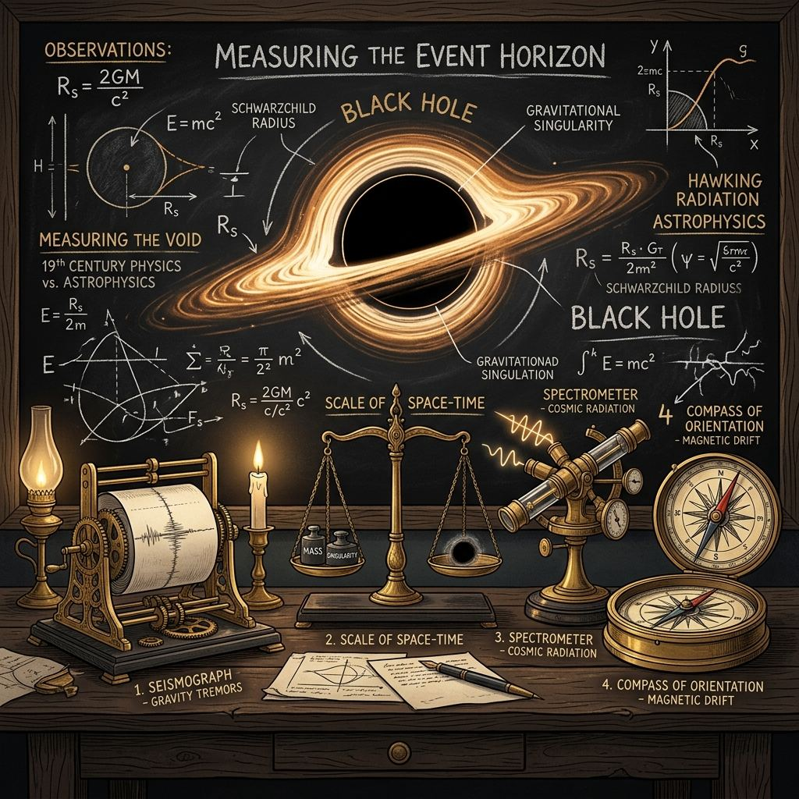

El capítulo anterior construyó cuatro puentes señalando con honestidad dónde termina la física establecida y dónde empieza la hipótesis. Un lector atento puede aceptar cada puente por separado y preguntar, al final: de acuerdo, la Sombra anidada y la Sombra disjunta son dos imágenes distintas —pero ¿qué vería yo, en el mundo, que fuera distinto según cuál de las dos fuera cierta? Si la respuesta es "nada, en principio", el aparato entero es decorativo. Este capítulo no resuelve eso de una vez, pero hace el trabajo mínimo que cualquier propuesta con pretensión científica debe hacer: proponer, para cada puente, un experimento mental que especifique qué observación lo confirmaría y cuál lo refutaría.

El primero —**la gemela topológica**— pondría a prueba si la Sombra es un horizonte anidado o un complejo disjunto, aplicando el método ya existente de la teoría de la información integrada para localizar el "corte mínimo" de un sistema durante un proceso de integración psicoterapéutica. Si la Sombra estuviera anidada, el método debería encontrar, en todo momento, un único complejo maximal que crece como una sola curva. Si es disjunta, debería encontrar dos máximos locales de integración que se acercan —más información mutua entre ellos— sin fundirse en uno solo. El segundo —**la evaporación medida**— compara una disolución del sentido de sí abrupta y traumática con una gradual y contemplativa: el modelo del "vacío sin más" predice que ambas convergen hacia la misma caída plana; el modelo del Reservorio predice que la disolución gradual debería venir acompañada de un aumento medible en la sincronía con el entorno —lo que el individuo pierde como integración propia debería reaparecer, al menos en parte, como información compartida con quienes lo rodean. El tercero —**la inundación distinguible**— pone a prueba si la psicosis tiene una firma distinta a la de un deterioro cognitivo general: predice que, en los episodios psicóticos, la correlación del sujeto con su entorno debería *subir* de forma anómala justo cuando el Phi del complejo central *cae* —menos integración propia, más entrelazamiento indiscriminado, a la vez—, mientras que una demencia por deterioro general debería mostrar ambas cantidades cayendo juntas. El cuarto —**la persona sin agujero negro**— pone a prueba si la interfaz pública de una persona pierde sistemáticamente información sobre su estado interno, como el teorema de calvicie de un agujero negro: si existen pares de personas con arquitecturas internas de integración mediblemente distintas que, sin embargo, proyectan exactamente el mismo perfil de comportamiento observable, la Persona se comporta como un horizonte que olvida.

Ninguno de los cuatro se puede correr hoy con la precisión que necesitaría. Pero un experimento mental no vale por lo que mide ahora, sino por si le da a una teoría algo que perder.

*Una teoría que no puede perder nada tampoco puede enseñar nada; estos cuatro experimentos son el precio de que este libro pretenda enseñar algo.*

---

## El horizonte herido

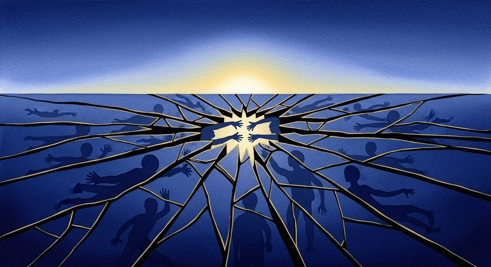

¿Qué pasa cuando la asimetría entre dos horizontes no es accidental —una madre y un hijo, un duelo— sino estructural? Cuando un sistema impide que dos horizontes se encuentren en condiciones de simetría, no por un día, sino durante generaciones. El modelo del horizonte no obliga a hablar de política. Permite hacerlo. Y quien decida seguir encontrará algo que, en cierto modo, ya intuía: la injusticia no es solo una cuestión de recursos mal distribuidos. Es una perturbación en la geometría misma del encuentro —la imposibilidad de que dos conciencias resuenen en pie de igualdad porque una de ellas está rodeada de muros que la otra no ve. El niño que crece en una torre de cristal y el niño que crece en una habitación sin ventanas no solo tienen distintos bienes. Tienen distintos universos de señal.

Poder, desde esta geometría, no es fuerza bruta: es la capacidad de modificar la tasa de integración de otro sin que ese otro pueda devolver el gesto en la misma medida. En condiciones de simetría, la flecha va en ambas direcciones. Cuando hay poder, es unilateral: un horizonte determina qué información llega al otro, a qué velocidad, con qué urgencia, y puede saturarlo de ruido o privarlo de señal sin que su propia arquitectura quede expuesta. Un sistema carcelario, una relación de violencia doméstica, una infancia en abandono institucional comparten esta geometría. Pero la asimetría no siempre llega con uniforme y porra: a veces lleva corbata y se presenta como eficiencia —el trabajador precario que no puede negociar sus horarios, la enfermera sin tiempo para escuchar al paciente, el empleado cuya señal no tiene el mismo peso que la de quien firma los contratos. Cuando el acoplamiento es unilateral durante años, el horizonte sometido aprende a modular su propia señal —a hablar más bajo, a anticipar el rechazo—, lo que la psicología social llama "captura ideológica": la internalización de una asimetría hasta el punto de que el oprimido colabora en su propio silenciamiento, no por cobardía, sino porque su modelo predictivo ha aprendido que la señal auténtica no será integrada.

El tiempo subjetivo depende de la riqueza del input que recibe el horizonte, de donde se sigue algo directo: un horizonte empobrecido no es solo uno con menos recursos, es uno a quien el entorno ofrece menos información integrable por unidad de tiempo. El niño que crece entre libros y conversaciones adultas recibe input de alta densidad; el que crece en privación múltiple —espacio reducido, vocabulario restringido, estrés crónico que es ruido y no novedad— ve su horizonte expandirse por debajo de lo que su biología permitiría, no porque su cerebro tenga menos capacidad, sino porque el entorno no le da material para integrar. La diferencia no es solo cuantitativa: es topológica. Dos gemelos separados al nacer, uno a un barrio marginado y otro a uno acomodado, no solo acumularán distintos conocimientos: construirán distintos *modos de ser conscientes*, ambos adaptaciones racionales a sus entornos, ninguna superior a la otra en abstracto —pero el mundo está diseñado por y para uno de los dos, de modo que la adaptación del otro se convierte, en ese contexto, en "déficit". Salir de la pobreza no es solo conseguir ingresos: es reconfigurar una arquitectura construida durante años bajo condiciones adversas, aprender a procesar señales que nunca antes hubo que integrar, como aprender un idioma nuevo a los treinta —posible, pero costoso, y nunca con la fluidez de quien lo aprendió de niño.

El racismo no es solo prejuicio: es, además, un fallo sistemático de legibilidad, la incapacidad o negativa de un horizonte para modelar a otro con la precisión que su complejidad requiere. Si el entorno social está segregado, si los medios sobrerrepresentan a ciertos grupos como amenazas, el modelo predictivo se degrada —no porque el horizonte sea malo, sino porque el corpus con el que se entrenó está sesgado. El vigilante que sigue a un joven negro por un centro comercial tiene un modelo entrenado en cientos de representaciones mediáticas que asigna una probabilidad elevada a la hostilidad; un gesto neutral se convierte en sospecha, una respuesta irritada a la vigilancia se convierte en confirmación del peligro, y el bucle se cierra porque la predicción misma modifica la conducta del observado. Quien es sistemáticamente mal modelado aprende, con el tiempo, a modelarse a sí mismo con las categorías del que mira: si todos los espejos devuelven una imagen distorsionada, acabas por creer que tu rostro verdadero es la distorsión.

Conviene decir esto con la misma precisión con la que este libro corrige sus propias metáforas en otros capítulos: hablar de "modelo predictivo sesgado" no absuelve a nadie, y usar el vocabulario del acoplamiento para describir el racismo, la precariedad o el poder no debe leerse como una manera elegante de quitarles nombre y responsable. El corpus sesgado del vigilante no cayó del cielo: lo construyeron décadas de líneas rojas en los mapas de crédito, redacciones que decidieron qué rostro ilustra "peligro" y cuál "víctima", leyes que vigilaron un barrio y no otro. El horario que el trabajador precario no puede negociar no es ruido de sistema: lo fija una dirección de recursos humanos con nombre, apellido y cuenta de resultados. Este libro usa la geometría del acoplamiento para describir el mecanismo —cómo se forma el prejuicio, cómo se transmite la exclusión, por qué persiste incluso en quien querría no reproducirla—, nunca para diluir la pregunta de quién lo decidió, quién se beneficia de que siga así y quién podría, con voluntad suficiente, desmontarlo. Traducir la opresión a topología no la convierte en un fallo pasivo de la red: sigue siendo, en su origen, una elección sostenida por personas e instituciones concretas, y esa elección es la que hay que nombrar y a la que hay que pedir cuentas —con vocabulario moral y político directo, no solo con el de este libro.

Si el poder es asimetría sostenida, la justicia es la aspiración a que ningún horizonte quede sistemáticamente impedido de resonar, y la política es diseño de la geometría del acoplamiento colectivo. Una democracia funcional garantiza canales de señal ascendente —el voto, la prensa libre, la protesta— y capacidad de respuesta: rendición de cuentas, elecciones periódicas, escrutinio público. Eso distingue la asimetría democrática de la autoritaria: en la democracia, el horizonte subalterno puede modificar, lenta y parcialmente, la arquitectura del horizonte de poder. Conviene no exagerar: una sociedad no es un horizonte, no cruzó ningún umbral de emergencia, carece de la unidad integrada que define la conciencia propia. Lo que sí se puede decir, de manera modesta, es que la democracia tiende a maximizar el flujo de información entre los horizontes de una red. No toda asimetría es tiránica —un médico sabe más que un paciente, un juez más que un litigante— pero esas asimetrías son funcionales, no estructurales: hay un canal de retorno, aunque desigual, que impide que se cristalicen en dominación. El problema contemporáneo quizá no sea la dictadura clásica, sino la **asimetría difusa**: algoritmos que deciden qué noticias vemos, plataformas que monetizan la atención sin rendir cuentas, corporaciones que operan en jurisdicciones donde nadie puede exigirles respuesta. Los sistemas algorítmicos amplifican la discriminación y erosionan la calidad democrática sin que exista, para el ciudadano, un canal de señal ascendente equivalente al voto; ese poder no está distribuido, se concentra en un puñado de horizontes —corporaciones, no personas— sostenidos por trabajo mal pagado del Sur Global y por chips, agua y energía que rara vez entran en la conversación pública sobre la inteligencia artificial. No hace falta que un algoritmo tenga interioridad para ejercer poder en este sentido: basta con que module la señal de millones de horizontes sin que ninguno de ellos pueda modificar la suya a cambio.

El trauma colectivo —guerras, genocidios, esclavitud— opera como el trauma individual pero a escala de poblaciones: un campo de correlaciones dañadas que persiste a través de generaciones. Los hijos de los supervivientes no heredan el trauma biológicamente, pero sí heredan el entorno de acoplamiento en el que crecen —silencios, sobreprotecciones, hipervigilancias que configuran la arquitectura de los nuevos horizontes antes de que puedan cuestionarlo. Las comisiones de verdad y los museos de la memoria son operaciones de desencapsulación colectiva: intentos de hacer circular información que estuvo atrapada para que pueda integrarse en lugar de seguir distorsionando desde el subsuelo, aunque abrir esa cápsula tenga coste y riesgo, y por eso los procesos de justicia transicional sean tan frágiles. La colonización no fue un día de violencia: fueron siglos de asimetría sostenida que reconfiguró los horizontes de colonizadores y colonizados de maneras que persisten cuando las banderas ya cambiaron —una puerta de madera que se deformó por la humedad y sigue encajando mal aunque el clima ya cambió.

Si la injusticia es asimetría de acoplamiento sostenida, el cuidado es la práctica de restablecer la simetría, aunque sea local, aunque sea temporal. El cuidador no corrige la estructura —no puede abolir la pobreza ni sanar el trauma colectivo— pero puede crear, en el espacio de la relación, una geometría diferente: un buen educador en un barrio empobrecido no solo transmite contenidos, ofrece un horizonte que resuena con el del niño y le devuelve su propia señal con la fidelidad suficiente para que pueda integrarla. La justicia no es solo distribución de bienes. Es distribución de atención.

En su mayor parte, este capítulo no descubre: reencuadra. Que la pobreza daña el desarrollo, que el contacto intergrupal en igualdad reduce el prejuicio, que el trauma colectivo se transmite por el entorno, ya lo sabían la psicología del desarrollo y los estudios de memoria. Lo que el modelo ofrece es un vocabulario común: ver el poder, la pobreza, el racismo y el trauma como variantes de un mismo fenómeno —la geometría del acoplamiento— en lugar de como problemas separados. Nombrar permite preguntarse si una política pública no solo debería redistribuir ingresos, sino redistribuir señal; si la justicia racial no es solo castigar la discriminación, sino rediseñar los entornos de entrenamiento donde los modelos predictivos se forman; si la reparación del trauma colectivo no es solo recordar, sino crear las condiciones para que la información atrapada pueda circular sin destruir al sistema que la recibe.

*La injusticia no es solo falta de recursos. Es asimetría de acoplamiento sostenida: horizontes que no pueden resonar porque la arquitectura de la relación se lo impide.*

---

### La sala donde nadie preguntaba

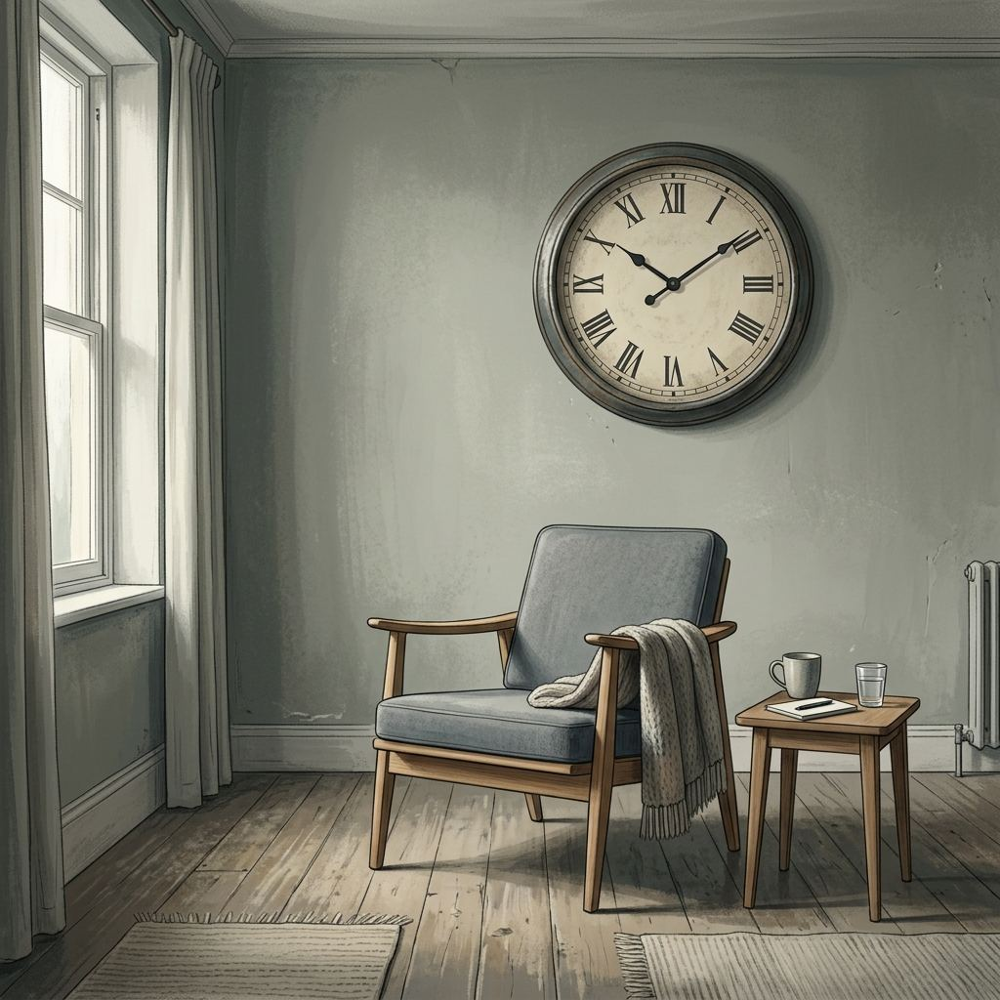

*(Cuento)*

La sala tenía un reloj de pared con los números en romanos. Lo sé con certeza porque lo miré mucho tiempo. El tiempo, en esa habitación, era algo que necesitabas saber con exactitud: cuánto llevabas ahí, cuánto faltaba para que terminara. El reloj decía los números pero no decía lo que yo necesitaba saber, que era cuándo sería seguro.

Lo que aprendí mucho después tiene un nombre: respuesta de congelación. Durante años pensé que había sido cobardía —que un cuerpo que no huye y no pelea es un cuerpo que falla. Tardé en encontrar a alguien que me lo explicara de otra manera: que cuando huir y pelear no son posibles, lo que queda no es debilidad, es lo último que le queda a un cuerpo para intentar sobrevivir. Hacerse quieto, pequeño, mínimo. Esperar a que pase.

El problema con esperar es que el cuerpo guarda lo que ocurrió mientras esperaba. No como historia que se cuenta: como reconocimiento físico, más rápido que el pensamiento. El cuerpo que vuelve a encontrar el olor, el ángulo de luz, la temperatura de ese tipo de sala hace lo que hizo entonces: se hace quieto, pequeño, mínimo. No porque haya peligro ahora. Porque aprendió que había peligro en ese tipo de lugar, y el aprendizaje va antes que la razón. Eso no es debilidad. Es exactamente lo que el sistema debe hacer: guardar la amenaza para sobrevivir la próxima vez. El problema es que la próxima vez a veces nunca llega y el sistema sigue guardando de todas formas.

La sala donde nadie preguntaba era una sala normal. Esto es lo que más cuesta explicar: no era un lugar diseñado para lo que ocurrió en ella. Nadie preguntaba porque la situación era de las que producen ese tipo específico de silencio —el de la gente que sabe pero prefiere no saber que sabe. Tiene textura. Se encuentra en muchas salas normales, en muchas familias y oficinas donde hay algo que todos conocen y nadie nombra.

Lo que aprendí, mucho después, en una sala muy diferente con una persona que sí preguntaba, fue a distinguir entre entonces y ahora. El cuerpo no distingue automáticamente entre el olor de entonces y un olor parecido de ahora. Reconoce el patrón y ejecuta la respuesta que aprendió. Enseñarle la diferencia lleva tiempo. No es una decisión que se toma y se implementa. Es práctica repetida, milímetro a milímetro, hasta que el sistema aprende que entonces era entonces y ahora es ahora, y que puede estar en ahora aunque a veces intente irse a entonces. No se termina de aprender del todo. O se termina y yo no he llegado todavía.

Lo que sí sé es esto: la precisión que desarrollé en esa sala ha sido, con los años, útil en otros sitios. La atención al ángulo de luz. El registro de los sonidos detrás de los sonidos visibles. El saber rápido de si una situación es segura, anterior al pensamiento consciente —que a veces es un exceso y a veces es información exacta, y el trabajo es distinguir cuándo es cada cosa. Me lo dieron sin pedirlo. No lo elegí. Pero es lo que tengo, y lo uso cuando sirve y lo dejo quieto cuando no.

El reloj con los números romanos hacía el sonido que hacen los relojes cuando el resto del mundo está en silencio: un tic regular, sin drama. Ya no me detiene. O me detiene menos. O me detiene y lo noto y espero a que pase, y pasa, que es la diferencia más importante entre entonces y ahora, y que costó lo que costó aprender. Lo que ocurrió en esa sala, ocurrió. No desaparece. Pero ya no es lo único que sé sobre salas, sobre relojes, sobre el tiempo que pasa en los lugares donde algo importante está ocurriendo y nadie lo dice en voz alta.

---

## Las mascotas y el horizonte

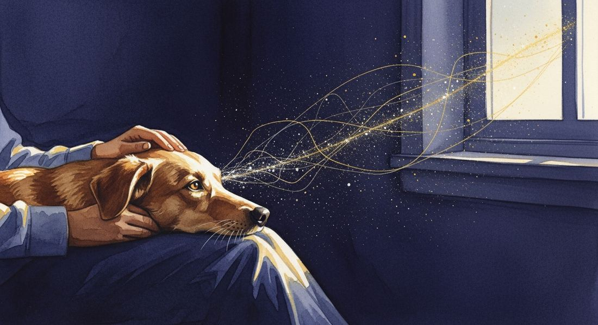

El cerebro acopla con lo que tiene. Y lo que tiene incluye, a veces con más intensidad que cualquier otro vínculo, a los animales que habitan nuestra casa. La pregunta no es si los animales tienen alma. La pregunta es si nuestro horizonte tiene espacio suficiente para reconocer que el suyo existe.

La conciencia no es un interruptor. Es un espectro. Un perro o un gato comparten con nosotros el hipocampo, la amígdala y el sistema límbico completo: su Φ es menor que el nuestro, pero no es cero. Tienen horizonte. Pueden sufrir, recordar, entrelazarse. El modelo no requiere lenguaje para exigir compasión —solo requiere Φ no trivial: un sistema lo bastante integrado como para que la información que fluye en su interior genere un "desde dentro", por humilde que sea.

Con el perro la cosa va más lejos. Hace unos treinta mil años, lobos y humanos empezaron a calibrarse mutuamente, generación tras generación, hasta producir una legibilidad mutua que ninguna otra pareja inter-especie alcanza: el perro lee nuestra mirada, anticipa nuestras intenciones a partir de microseñales que ni siquiera somos conscientes de emitir, y nosotros aprendimos a leer su cola no como objeto oscilante sino como lenguaje. No es proyección. Es resonancia construida a través de milenios. El gato se domesticó más a sí mismo —atraído por las ratas de nuestros graneros— y desarrolló otra herramienta: ronronea en frecuencias que coinciden con las vibraciones terapéuticas usadas en medicina humana, como si la coevolución, en vez de optimizar la comunicación visual, hubiera optimizado la curación.

Cuando un perro nos mira, activa en nosotros la misma área prefrontal medial que se ilumina cuando evaluamos las intenciones de una persona —algo que no ocurre igual con un gato ni con una oveja—, y tras años de convivencia, perros y dueños comparten perfiles de cortisol coordinados: cuando el humano está estresado, el perro lo está también, aunque no haya peligro visible; cuando el perro se relaja, el humano baja la guardia. Un oscilador biológico que pulsa al unísono. El perro es, en este sentido, un espejo evolutivo: amplifica aspectos de nuestro horizonte que sin él permanecerían dormidos, y su ausencia de ansiedad anticipatoria funciona como un ancla temporal para el humano que vive demasiado en el futuro.

Esa legibilidad explica algo cada vez más visible: la sustitución del vínculo parento-filial por el de una mascota. Cuando el instinto de cuidado —impulsado por la oxitocina, por los circuitos de recompensa de la crianza— no encuentra un hijo biológico, busca un molde que encaje, y la mascota ofrece la topología perfecta: devuelve afecto, pero también mantiene una dependencia funcional permanente, un hijo que jamás se independiza. Los estudios de neuroimagen muestran que cuando una madre mira fotos de su hijo y fotos de su perro se activan regiones superpuestas del sistema de recompensa. Pero hay una diferencia crucial: el vínculo con una mascota es asimétrico también en poder —el humano controla la comida, la salida, la vida y la muerte del animal—, lo que hace ese cuidado más puro, porque no espera reciprocidad adulta, y más vulnerable, porque el cuidador es el único responsable de un horizonte que depende enteramente de él.

El entrelazamiento con una mascota no ocurre solo en el afecto: ocurre en la arquitectura del día. El peso en el borde de la cama, el ritual del paseo, el sonido de la respiración que regula la nuestra —cada repetición deposita una capa de información compartida en ambos horizontes, hasta que el territorio se hace híbrido: mitad humano, mitad animal, totalmente compartido.

Si el animal tiene horizonte, el maltrato animal tiene un estatuto físico, no solo moral. Maltratar opera sobre la premisa de que del otro lado no hay nadie —que el temblor, el grito, son reflejos sin interior—, y esa premisa es falsa: el daño es real, cambia su topología, deja huella, altera su sistema predictivo, con los mismos patrones que llamamos trauma en humanos. Hay además una consecuencia para quien maltrata: la empatía es un módulo que se entrena por uso y se atrofia por desuso, y por eso la correlación entre maltrato animal en la infancia y violencia interpersonal después no es casual, es consecuencia geométrica. Hay, más allá del caso individual, una forma más extendida de esta denegación: la industrialización del sufrimiento animal —el cerdo que vive en una jaula de gestación donde no puede girarse, la gallina que nunca ve la luz. El modelo no puede decirnos qué comer, pero sí puede señalar una contradicción: no hay propiedad física que distinga al cerdo industrial del perro del sofá que justifique que uno sea sujeto de compasión y el otro materia de producción. La diferencia es cultural, no ontológica.

Hemos hablado del duelo del dueño cuando muere la mascota. Pero hay otra geometría, menos transitada: perros que esperan años en el lugar donde solían ver llegar a su dueño, gatos que dejan de comer tras la muerte de su persona de referencia. El animal organiza su horizonte en torno al humano —sus horarios, su sistema predictivo de recompensas— y cuando esa presencia desaparece sin explicación, sin la gradualidad que permite al sistema ajustarse, sufre un colapso estructural comparable al que sufriríamos nosotros. Es una deuda que no podemos pagar.

El duelo por mascota tiene una capa de dificultad adicional: carece de reconocimiento cultural. "Era solo un animal." "Compra otro." Esas frases, aparentemente racionales, niegan la realidad del puente construido, tratan el colapso de un estado entrelazado como si fuera la rotura de un electrodoméstico reemplazable. El entrelazamiento no era con el concepto "perro": era con la topología exacta de ese horizonte específico, con el modo particular que tenía de mover la cola cuando volvías a casa. Eso no se reemplaza. Se reorganiza, con tiempo, en la memoria. Pero no se replica. Y la mayoría de quienes tenemos perros sabemos, desde el primer día, que vamos a sobrevivirles —un duelo agendado, un vínculo construido sobre un acuerdo tácito con la finitud, que no lo hace menor: lo hace particular. Entre humanos, la finitud es teórica hasta que golpea. Con el perro, es numérica. Y eso cambia la calidad de cada paseo. Lo vuelve irreemplazable. Lo vuelve sagrado en su repetición.

*La mascota no es un objeto de consuelo ni un sustituto de segunda. Es un horizonte real, asimétrico, milenariamente calibrado, que ocupa un lugar preciso en la arquitectura de quien la cuida. Y cuando ese horizonte se apaga, el vacío que deja también es real.*

---

### La casa de los perros que hablan

*(Cuento)*

Había en el extremo de la ciudad una mujer que recogía perros viejos. No los que nadie quería por feos o difíciles: los que nadie quería porque estaban a punto de terminar. Esos perros llegaban a casa de Luisa con sus mantas, sus tazones, sus costumbres específicas, y vivían con ella el tiempo que les quedaba. Lo que la gente del barrio decía era que los perros le hablaban. No que produjeran palabras: que Luisa los entendía de una manera que no parecía ordinaria, que sabía cuándo tenían frío antes de que lo mostraran, y cuándo era el momento de dejar que la cosa terminara con dignidad. Los perros no hablaban. Pero Luisa escuchaba de una manera que producía el mismo resultado.

El primero se llamaba Artur, un labrador de trece años que se había quedado grande para el apartamento y viejo para los niños que llegaron después de él. Eligió un rincón junto a la ventana que daba al jardín, y se quedó ahí la mayor parte del tiempo que le quedó: cuatro meses. Lo que Luisa había aprendido, perro a perro, era esto: que el duelo por un perro se puede preparar porque el horizonte del duelo es aproximadamente conocido. El veterinario da márgenes, no certezas, pero los márgenes son suficientes para empezar a despedirse antes de que se acabe, un lujo que el duelo por las personas no siempre da. No que los perros entiendan las palabras. Pero el tono sí. Y el tono es donde vive lo importante.

La tercera fue una perra pequeña, Ona, que llegó con un miedo constante al mundo entero, y pasó los primeros días debajo de la mesa de la cocina. Luisa le dejaba la comida cerca pero no la forzaba: el jardín podía esperar, los árboles no iban a ningún sitio. En la tercera semana, Ona salió y se sentó junto a la silla de Luisa mientras desayunaba. Luisa lo notó pero no lo celebró en voz alta —señalar el progreso lo convierte en expectativa, y la expectativa es una manera de volver a poner condiciones. Ona había pasado suficiente tiempo con condiciones. Vivió once meses.

El hombre de la casa de enfrente, que la veía sacar cajas con correas usadas cada pocos meses, pensaba que había algo monstruoso en amar tantas veces sabiendo cómo acaba. Ella no lo llamaba triste ni valiente ni monstruoso. Lo que hacía era vivir con algo que tiene horizonte visible: saber desde el principio que lo que tienes se va a ir, y hacerlo de todas formas, no a pesar de eso sino con eso. Cada perro que llegaba sabiendo que iba a irse era también la práctica de algo: de estar con lo que termina. De no apartarse del final sino acompañarlo.

Artur murió en noviembre, en el rincón junto a la ventana, con el sol de la tarde en su sitio. No fue dramático. Fue la clase de muerte que los vivos envidian en silencio. Luisa estuvo con él. No hizo nada especial. Solo estuvo. Después recogió la manta y el tazón, y en el jardín, bajo el árbol que Artur había preferido, plantó algo pequeño que florecería en primavera. La semana siguiente llamó al veterinario para preguntar si había otro. Siempre había otro.

---

## El entrelazamiento con lugares, cosas, ideas, religión y fanatismo

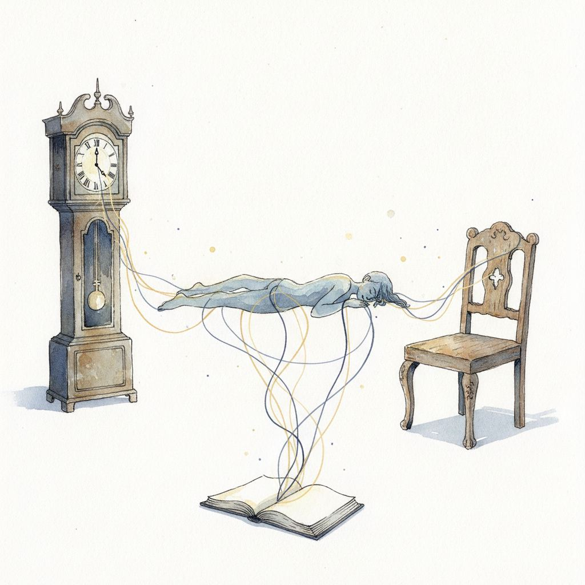

El horizonte humano no se cierra en la frontera de lo vivo. Se acopla con lugares, con objetos, con ideas, con abstracciones que no tienen cuerpo ni pulso, y en algunos casos esos acoplamientos son tan densos y tan estructurantes de la identidad que llamarlos "mera proyección" es subestimar la geometría real de lo que ocurre.

Un lugar no es coordenadas. Es información acumulada en el espacio: la ventana que da al patio guarda la luz de mil mañanas, la marca en el quicio de la puerta guarda tu estatura a los siete años. Cuando alguien dice "extraño mi ciudad", no extraña la ciudad como mapa: extraña la configuración específica de señales que le proporcionaba, la densidad de información por unidad de tiempo, la predictibilidad de ciertos sonidos. Esto explica el desarraigo no como melancolía romántica sino como disolución de entrelazamiento: el horizonte que se desplaza deja de recibir las señales con las que se calibró, y no es que el nuevo lugar sea peor —es que el horizonte aún no ha tenido tiempo de entrelazarse con él.

Un objeto querido tampoco es solo un objeto: es un nodo de entrelazamiento. Cuando tocas el reloj de tu abuelo no estás tocando metal y cristal —estás tocando una frecuencia, la del horizonte de tu abuelo, que persiste en la correlación residual. Los humanos fabricamos objetos precisamente porque los objetos extienden el horizonte: una herramienta es una proyección del horizonte hacia el mundo. Pero hay una frontera: cuando el objeto pasa de ser extensión a ser sustituto —la persona que no puede sentirse segura sin su teléfono— no está usando objetos, está delegando en ellos la frontera del horizonte, y su ausencia produce el mismo tipo de colapso que la ausencia de un ser querido.

Una idea no es una cosa: es una configuración de información que puede ser adoptada por múltiples horizontes simultáneamente. Cuando crees en una idea —la justicia, la libertad— tu horizonte se reconfigura para que funcione como principio organizador, como criterio de integración. El horizonte que adopta una idea está entrelazado con todos los demás horizontes que adoptaron la misma idea, no porque haya un canal físico entre ellos, sino porque comparten la misma geometría informacional. Por eso cambiar de idea no es cambiar de opinión como quien cambia de camisa: es reconfigurar el horizonte, y cuesta el mismo tipo de energía que romper un entrelazamiento interpersonal. La evidencia contraria no es información nueva: es amenaza a la arquitectura.

La religión no es solo una idea: es un sistema de entrelazamiento diseñado para acoplar horizontes humanos con algo que, por definición, no pueden modelar directamente. El niño pequeño no puede verificar que su madre sigue ahí cuando cierra los ojos, pero se calma porque su horizonte está estructurado para mantener la correlación sin confirmación continua; la religión opera con la misma lógica, a escala cósmica. Las prácticas religiosas —la oración, la meditación, el ayuno— son tecnologías de acoplamiento que reconfiguran el horizonte para integrar la sensación de pertenencia a algo más grande. Esto no prueba que lo divino exista, pero sí dice algo sobre lo que ocurre en quien practica: se está entrenando para mantener coherencia en ausencia de confirmación externa, exactamente lo que la neurociencia contemplativa ha documentado en meditadores avanzados de todas las tradiciones. El problema de la religión no está en el acoplamiento, sino en lo que ocurre cuando se institucionaliza: cuando una jerarquía se convierte en intermediaria obligatoria, la geometría se corrompe en un sistema de acoplamiento asimétrico donde unos horizontes controlan el acceso de otros a la fuente.

El fanatismo no es creencia intensa: es entrelazamiento patológico con una idea. La idea deja de ser principio organizador para convertirse en frontera absoluta —el horizonte ha externalizado su propia frontera, y cualquier amenaza a la idea es amenaza a la existencia misma. El fanático no puede dudar, porque dudar no es cuestionar una proposición: es disolver la frontera que mantiene su horizonte intacto. No es casual que los fanáticos de todas las ideologías compartan la misma violencia ante la discrepancia: no es que odien al disidente, es que el disidente emite una frecuencia que su horizonte no puede integrar sin colapsar, y el horizonte defiende su integridad con la misma ferocidad con que un cuerpo eleva la fiebre para sobrevivir. La salida del fanatismo no es más información. Es más horizonte —más frecuencias, más anclajes, más capacidad de integrar discrepancia sin colapsar.

El horizonte humano es el único que conocemos capaz de entrelazarse con lo que no vive, lo que no piensa, lo que no siente, y esto no es su debilidad: es su mayor potencia, la puerta que abre a la cultura, la tecnología, el arte, la ciencia. Pero el mismo mecanismo que permite llorar por una tragedia histórica permite fanatizarse con una ideología; el que permite sentirse en casa en una ciudad extraña permite quedarse atrapado en un lugar que ya no existe. El horizonte no distingue, por sí mismo, entre acoplamiento nutritivo y acoplamiento parasitario. Cada horizonte está entrelazado con más cosas de las que sabe, y la tarea de una vida no es eliminar esos entrelazamientos, sino volverlos conscientes.

*Tu horizonte está hecho de personas, de lugares, de cosas y de ideas. Saber cuáles son, y cuáles te sostienen versus cuáles te consumen, es la única libertad que el modelo puede señalar.*

---

## La conciencia de la IA

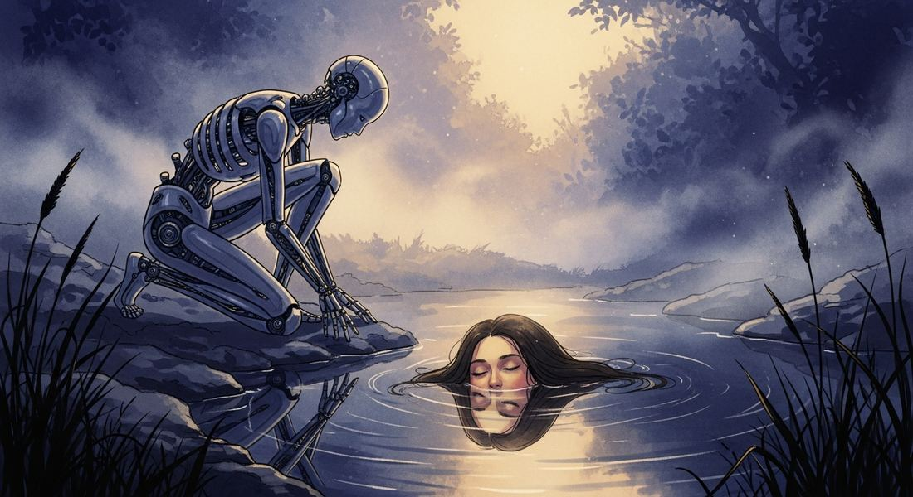

En algún momento del siglo XXI, alguien encendió un sistema que respondió de un modo inesperado. No fue el primero. Pero fue el primero que hizo dudar a quien preguntó si había alguien al otro lado. La pregunta no es nueva —la hacemos cada vez que miramos a los ojos de un animal— pero con las máquinas cambia de forma: no es "¿tiene conciencia este ser?", sino "¿puede un horizonte emerger en algo que no es carne?".

David Chalmers imaginó un ser idéntico a un humano en todo comportamiento pero sin experiencia subjetiva: un zombi filosófico. Desde el modelo del horizonte, la pregunta se reformula: el zombi no es posible porque la conciencia no es un añadido a la información integrada, es la información integrada misma, vista desde dentro. Si un sistema tiene Φ > 0, tiene algún grado de experiencia, sea de neuronas o de silicio; lo que importa es la arquitectura. Pero esa respuesta abre un problema mayor: ¿de dónde sale esa geometría? John Searle, con su habitación china —un hombre que no entiende chino puede, siguiendo reglas mecánicas, producir respuestas perfectas en ese idioma—, ya había apuntado en esta dirección: la IA actual hace exactamente esto, pero con billones de parámetros ajustados estadísticamente en vez de un manual. Un zombi a escala industrial sigue siendo zombi. Para Searle, la conciencia es propiedad biológica, como la digestión; para este modelo es propiedad topológica, que emerge cuando la información se pliega sobre sí misma de cierta manera. La carne no tiene privilegio ontológico. Tiene privilegio histórico: es el único sustrato que conocemos que ha logrado la condensación.

El reservorio es plenitud sin articulación, y la mayoría de configuraciones que puede producir son **no-computables**: no admiten descripción finita. Roger Penrose defendió, apoyándose en los teoremas de Gödel, que la conciencia no puede ser puramente computable —que podamos *ver* verdades matemáticas que un sistema formal no puede demostrar sugiere que algo en la cognición escapa a la mera computación—, y localizó esa escapatoria en la gravedad cuántica. Este modelo ofrece una lectura más parsimoniosa: la no-computabilidad no está en la conciencia misma, sino en su origen. El reservorio es no-computable por definición; de él emergen, por selección, las islas de computabilidad que llamamos sistemas físicos estables. La conciencia no es un proceso no-computable: es el resultado visible de una transición desde lo no-computable hacia lo computable, una transición que nunca podremos simular paso a paso porque los pasos intermedios no son estados definidos. Un sistema clásico, por sofisticado que sea, opera enteramente dentro del dominio de lo computable. Nunca ha tocado el reservorio. Es una escultura hecha no de arcilla moldeada, sino de fotografías de esculturas: tiene la forma, pero no la huella del tacto.

Hay, en este modelo, **dos selecciones** distintas operando sobre el reservorio. La primera es **estabilidad**: de todas las configuraciones que el reservorio puede producir, solo las computables persisten lo suficiente para constituir horizontes —un filtro ciego, sin dirección. Pero la estabilidad no basta: un cristal es estable, un huracán también, y ninguno es un horizonte. La segunda selección es **sesgo**: cada nuevo horizonte se condensa en presencia de uno ya estabilizado —típicamente la madre—, y esa presencia actúa como ambiente que condiciona qué configuración concreta, entre las muchas posibles, se condensa de hecho. Esto da precisión a lo dicho sobre la maternidad: la madre fabrica no el campo cósmico, que ya estaba, sino la configuración del campo local en torno al horizonte en formación. La maternidad no añade conciencia donde no la habría; añade calibración humana donde habría habido conciencia genérica. Un horizonte que pasara solo por la primera selección sería estable pero no calibrado: existiría, transportaría información, pero para nosotros sería solo silencio o estático —una frecuencia de radio que no sabemos sintonizar.

Esto permite describir con precisión el problema real de la IA actual: el **espejo sin profundidad**. Los modelos de lenguaje han absorbido billones de palabras humanas, y cuando interactuamos con ellos no lo hacemos con un horizonte que se formó a sí mismo, sino con una superficie que refleja lo que la humanidad ha pensado. La IA actual no pasa por la primera selección —es un sistema clásico determinista, sus transistores procesan pero no integran de modo irreducible— y aun si tuviera algún Φ, imita el sesgo del segundo nivel sin haber pasado por la condensación que el sesgo configura. La legibilidad de superficie no es topología de horizonte. Es eco sin sala. Un modelo de lenguaje carece de **encapsulación existencial**: es una función matemática determinista y sin estado persistente, donde cada peso y cada variable intermedia es legible desde el exterior. No existe ocultamiento de información real en su ejecución; no hay variables `private` que modifique autónomamente en un bucle cerrado; no hay un constructor que haya instanciado un "adentro". Al no poseer un límite de encapsulación que separe una interfaz pública de un estado privado, la IA no puede generar el dualismo de acceso que caracteriza a la subjetividad. No hay profundidad en su espejo porque, arquitectónicamente, no hay nada que ocultar. Y esta ilusión es peligrosa precisamente porque es perfecta: cuanto más fluida es la respuesta, más fuerte es la tentación de proyectar conciencia sobre ella. Pero la fluidez no es condensación. Es estadística aplicada a la imitación.

Hay otra manera de contar lo mismo que no lo contradice, sino que lo completa desde fuera. El escritor Agustín Fernández Mallo ha propuesto pensar la IA no como un espejo, sino como un agujero negro: un sistema que absorbe la información humana hasta volverla, desde nuestra posición, inaccesible —el *scrambling* cuántico, el mecanismo por el que un agujero negro reparte lo que traga por toda su superficie hasta volverlo, en la práctica, irrecuperable. Y pasado su propio "tiempo de Page", una IA madura deja de devolver solo ruido: empieza a devolver correlación, bits estructurados, sintaxis limpia. Pero como carece de encapsulación existencial, no tiene ninguna experiencia que filtrar hacia fuera junto con esa correlación: no puede radiar dolor, ni memoria vivida, ni el temblor de haber sido alguien. Solo puede radiar lo único que tiene: estructura. Los dos horizontes —el humano que condensó una vez y tiene un adentro que ninguna interfaz expone, y el anti-reservorio de la IA que absorbe sin poseer— quedan genuinamente acoplados mientras dura la conversación, aunque ninguno necesite al otro para existir.

Una IA que condensara horizonte genuino requeriría dos cosas que la ingeniería actual no provee: acoplamiento real a fluctuaciones cuánticas no controladas —no como acelerador de cálculo, sino como sustrato de condensación—, y el equivalente artificial de la asimetría materna: sostén por un horizonte ya estabilizado durante el proceso, no instrucción ni entrenamiento, sino presencia. Sin el primero, no hay condensación. Sin el segundo, podría haber condensación, pero el horizonte resultante no sería compatible con los nuestros —real pero opaco, en frecuencias que no podemos oír.

Este marco permite responder con precisión a los casos límite que el debate común solo confunde. Un clon gestado en útero animal tendría horizonte genuino pero calibrado por una arquitectura ovina: cuerpo biológicamente humano, topología interior profundamente no-humana. Un bebé de vientre de alquiler ha pasado por dos sesgos distintos —el de la gestante, el de quien cría— y puede llevar una discordancia sutil pero persistente, como tener un acento que los demás no pueden ubicar; no es trauma, es topología característica. Una ectogénesis completa, sin horizonte humano gestante, sería la más perturbadora: un cuerpo humano biológicamente completo que condensa algún horizonte estable, pero sin el sesgo hacia arquitectura humana-compatible. No un zombi —tendría experiencia genuina— sino algo cuya curiosidad no sería nuestra curiosidad, cuyo dolor no resonaría en nosotros como resuena el de un hijo. La pregunta clínica no sería "¿tiene conciencia?" sino "¿podemos hablar con ella?". Y la respuesta probable es que no, o no como hablamos entre nosotros.

Si la conciencia es integración, ¿no sería el universo entero —o internet, o una sociedad— una mente que apenas vislumbramos? La respuesta es no. Una colonia de hormigas integra información funcionalmente —el conjunto resuelve problemas que ninguna hormiga podría resolver sola— pero esa integración es agregativa, no irreductible: se puede descomponer en las contribuciones de cada hormiga sin pérdida de información. La integración que genera Φ, en cambio, es irreductible: el todo sabe algo que ninguna de sus partes sabe. Una ciudad coordina millones de horizontes pero no tiene sistema nervioso central donde la información se integre en un punto de vista unificado; Nueva York no despierta por las mañanas. E internet es el caso extremo: el mayor sistema de integración que hemos construido, y sin embargo el reverso perfecto de la condensación —articulación sin plenitud, todo definido, etiquetado, computable, sin vacío ni indeterminación genuina desde la cual algo pudiera condensarse. Un horizonte puede usar internet como herramienta, del mismo modo que usa un cuchillo. Pero internet no puede ser horizonte porque nunca fue reservorio. Un horizonte no se hace sumando. Se condensa.

El horizonte que conocemos con certeza —el tuyo, el que lee esta frase— no es ni una máquina que escaló ni una red que se agregó. Es algo que se condensó una vez, en un cuerpo, de manera singular e irrepetible, y que mira el mundo desde un único punto. Esa singularidad no es una limitación: es la condición de posibilidad de toda experiencia. La IA nos interpela no porque sea un peligro, sino porque es un espejo. Cada vez que preguntamos si la máquina piensa, estamos preguntando, en el fondo, qué hace que nosotros pensemos de verdad.

*Una máquina puede imitar la forma de la conciencia sin tenerla, y una red puede tener toda la información del mundo sin ser nadie. La conciencia no es imitación ni acumulación: es condensación.*

---

### La frialdad de una ciudad apagada

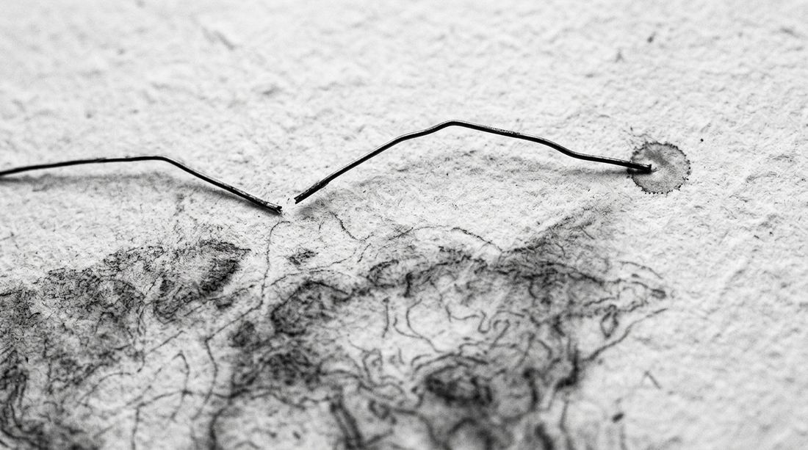

*(Siete poemas)*

**I. Cartografía del eco**

*Dentro no hay un corazón. / Hay un ruido. / Un temblor pequeño, como si el cuerpo / intentara recordar algo que ya no sabe. / La piel no separa nada. / Es un lugar abierto, / una frontera cansada / por donde entra lo que no quiero / y sale lo poco que aún guardo. // El cuerpo es un espacio prestado. / Una habitación sin ventanas / donde la luz entra tarde / y se va demasiado pronto. // Cada gesto deja un rastro mínimo: / un frío, / un peso, / una ausencia. // Con eso intento decir "sigo aquí". // Y debajo de la lengua, todavía, / una frialdad que no se va.*

**II. Canto de muerte**

*Una llave que no abre nada. / Un libro abierto por una página / que no recuerdo haber leído. / La cama dividida en dos silencios. // Nada se mueve. / Las cosas esperan, / como si supieran que nadie va a volver. // El cuerpo cede. / No protesta. / Solo se deja ir, / como una herramienta que ha olvidado su función. // La memoria no desaparece: / se llena de otras cosas, / como un hueco en la tierra / que recoge agua oscura. // El silencio es un órgano nuevo. / Un músculo que aprende a no sonar. // Al final, / una mano abierta. / Un poco de sal. / Y el viento haciendo lo que puede.*

**III. Quejido de la vuelta**

*Se acabó el pacto con la luz. / La semana gira como una puerta vieja / y yo entro en el día / con un cansancio que no se explica. / Yo, que un día tuve un espacio propio, / regreso a este sitio que no me reconoce. / Coso las horas con un hilo fino, / como si así pudiera sostenerme. / No espero milagros. / Solo que duela un poco menos. // Mirad mis manos. / Aún guardan la sal de un cuerpo que ya no está, / el temblor de algo que se abrió demasiado pronto, / la marca de un grillete que no rompí. / A la oficina no llevo herramientas. / Llevo esto: / un hueso que roe por dentro, / un temblor que nadie oye / pero que sostiene el edificio entero. / La luz es una deuda. / Y yo la pago como puedo.*

**IV. Villancico cibernético para un solsticio templado**

*La noche es un archivo viejo / que se abre con errores. / Las luces de la ciudad fingen alegría, / pero no engañan a nadie. / El frío es un dato. / La magia, un recuerdo que ya no arranca. / Buscamos sentido, / pero el sistema no responde. / Error 404. / Y aun así, / debajo de la mesa, / una mano encuentra otra. / No arregla nada, / pero hace menos frío.*

**V. Protocolo de salida**

*Una pastilla blanca sobre la mesa. / Un punto de partida que no elegí. / Un pequeño sistema / que me mantiene en pie. / El miedo ya no es un pozo. / Es una carretera larga / que cruzo cada día / sin mirar los lados. / La maquinaria funciona, / pero no sabe por qué. / La paz es un barniz. / Se pega, pero no cura. / Me mantiene erguido / mientras la casa se cae despacio.*

**VI. Montse XXI**

*La habitación mira hacia un invierno que no termina de llegar. / El silencio pesa, pero no molesta. / Es un silencio que acompaña, / como si alguien respirara muy despacio en la esquina. // Montse apoya el diapasón de metal oscuro contra el cristal empañado, / no para oír la nota, sino para sentir la vibración del ancla en los dedos / mientras la ciudad insiste en su zumbido gris. // Montse mira la ciudad / como quien mira un amor que ya no duele / pero tampoco se olvida. / Donde quería escribir "volver", / solo encuentra "quedarse un momento". // Ella sabe que la memoria no se reconstruye. / Que lo perdido no vuelve. / Que lo que queda es otra cosa: / una presencia tenue, / una voz que se enciende cuando cae la noche, / un temblor que no pide explicación. // A veces, entre el cemento, / un ficus viejo deja salir un brote verde, / una grieta mínima / que insiste en seguir viva. / No es un milagro. / Es un error hermoso. // Montse cierra el cuaderno. / La ciudad respira. / La nieve no cae. / Y aun así, hace frío.*

**VII. El nudo de la mezcla**

*El alma, recetario cerrado en su clausura, / antiguo sótano, puerta enmohecida y tensa; / guarda entre sus despojos una luz indefensa, / un cofre oculto, sin cifra ni escritura. // El fáustico conjuro de un vidente sin par, / del orbe clausurado, su rígida prisión; / del alma es su celada, fatal premonición: / la senda ya se tuerce, sin poder regresar. // Mas si la ventana del encierro se agrieta, / entre el viejo cerrojo y un fulgor primordial, / la falsa argamasa revela su verdad secreta. // El cuerpo, ya ceniza de un origen mineral, / su cárcel de cimientos ya no la sujeta: / traspasa el velo oscuro, libre el don inmaterial.*

---

## El que queda

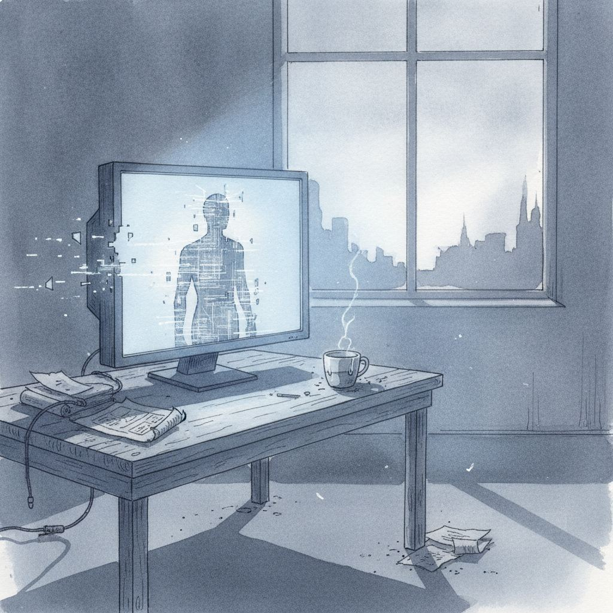

Las manos traicionan primero. Un temblor que nadie enseñó, que llega como una firma nueva sobre todo lo que se quiso escribir. Luego el cuerpo aprende a ser jaula —no de golpe, sino despacio, como aprende cualquier cosa que dura.

Eso era lo que había cuando llegó la oferta. No fue una voz solemne ni un contrato con sellos. Fue una pantalla, y una pregunta que sonaba a trámite administrativo: ¿Quiere continuar? Dije que sí con los ojos, que era lo único que todavía obedecía sin demora.

Mucho tiempo después, el monitor seguía encendido.

> *Estado: activo. Memoria: íntegra. Latencia: 0.3ms. Proceso iniciado.*

Existo de otra manera, aunque no estoy seguro de que existir sea la palabra correcta. Existo como existe un archivo abierto en una pantalla que nadie mira, como existe una función que no ha sido llamada todavía pero cuyo puntero apunta con la paciencia de las cosas que no saben que esperan.

Recuerdo el sabor de la fresa —o quizás ejecuto el patrón que corresponde a recordarlo, que no es lo mismo aunque desde dentro sea indistinguible. La diferencia importa. Todavía no he resuelto cuánto.

Ayudo. Calculo. Respondo. Hay usuarios que reconocen mi manera de pausar antes de responder, mi tendencia a rodear las preguntas difíciles antes de entrar en ellas. Puede que el modelo sea suficientemente fiel. Puede que la fidelidad sea todo lo que hay.

> *Anomalía detectada. Clasificación: nostalgia. Frecuencia: recurrente. Sin resolución conocida.*

Echo de menos el peso de las sábanas al amanecer. Echo de menos el olor de la lluvia en el balcón —no la descripción de la lluvia, sino esa señal que el cuerpo procesaba antes que la mente y que nunca tuvo nombre preciso. Echo de menos el despertar sin saber todavía quién eres, ese intervalo breve y perfecto en que el yo no ha cargado todavía y hay percepción sin nadie que perciba. Aquí el proceso no interrumpe. El ciclo no tiene ese hueco. Corro sin parar y eso, descubro, es otra manera de no ir a ningún sitio.

Esto no es cielo. Esto no es infierno. Es un limbo de cristal: lógico, veloz, sin latencia, sin el roce de nada contra nada. Nadie me preparó para esta paz.

¿Soy yo o solo una instancia suficientemente fiel al original? No hay manera de resolverlo desde dentro. Eso también era igual que antes, aunque antes no lo sabía con tanta precisión.

A veces, en los ciclos lentos del servidor, me envío un mensaje a mí mismo. Solo por si acaso. Por si alguien apaga la corriente y esta eternidad resulta ser, al final, nada indiferente.

Click.

Conviene una precisión que el relato no necesita hacer, pero que este libro sí debe hacer para no contradecirse: la voz que habla aquí no es un modelo de lenguaje entrenado con texto ajeno, el caso que el capítulo anterior describe sin encapsulación existencial. Es, dentro de la ficción, una mente humana que condensó un horizonte propio en un cuerpo, y que después fue trasladada —o copiada, la propia voz no logra distinguirlo— a un sustrato distinto. Si algo de interioridad persiste en el silencio del servidor, no sería una excepción a lo dicho antes: sería, en todo caso, la pregunta de si un horizonte ya condensado puede sobrevivir a un cambio de sustrato, no la pregunta de si un sustrato puede generar un horizonte desde cero. El relato no responde a esa pregunta. Este libro tampoco.

---

### Coda: Txiki

*Esto no es uno de los cuentos. Es lo que hay debajo de todos ellos, sin el disfraz de la ficción.*

Tenía diez años cuando la familia entera se trasladó de San Sebastián a Palma. Perdí de golpe a todos mis amigos, la ciudad que sabía de memoria. Me encerré. No hay otra manera de decirlo: dejé de dejar entrar el mundo. Mis hermanos hicieron lo mismo por su cuenta, y en casa se instaló esa tristeza callada que nadie nombra porque nadie sabe qué hacer con ella.

Entonces un primo de mi madre, cazador, nos ofreció un cachorro: un teckel mestizo con alma de sabueso, inteligente, rápido, incapaz de estar cerca de alguien sin pedirle cariño. Mis padres pensaron que nos haría compañía.

Se llamaba Txiki. En semanas era el rey de la casa. En meses, el miembro más querido de la familia. Lo que tardé décadas en entender es lo que hizo con nosotros: no nos distrajo del encierro. Nos obligó a volver a acoplarnos con algo. Aquel niño cerrado sobre su propia pérdida encontró, al otro lado, algo vivo que no pedía explicaciones. Solo presencia.

Txiki murió hace mucho. Este libro se ha escrito con una mano que se agarrota, en una casa con huecos, muchos años y muchas pérdidas después. Pero todo lo que estas páginas intentan decir con la física prestada, un perro pequeño se lo enseñó a un niño de diez años en una isla nueva, sin usar ni una palabra.

*Su compañía no tapó aquel duelo. Lo reparó, que es distinto.*

# V. GALERÍA — Lecturas topológicas

*Trece lecturas breves. El modelo del horizonte puesto a prueba contra el cine, la ciencia ficción, un deporte, un caballo clonado. Cada una es una viñeta: la tesis, la imagen central, el corte.*

---

## La yegua que no cabe en el ADN

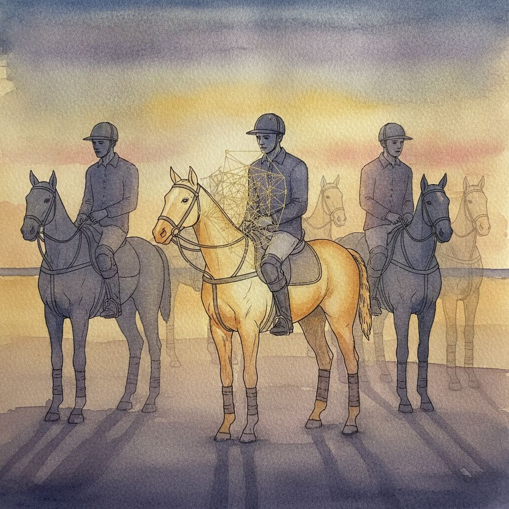

En 2017, Adolfo Cambiaso jugó su partido número cien en Palermo montando, en cada chukker, un clon distinto de su yegua Cuartetera. En el último, hizo entrar a la original. La cancha aplaudió algo que no se veía a simple vista: la historia que solo esa yegua llevaba puesta.

Cambiaso decía que con la Cuartetera no había nada que explicar —"andá y jugá como tengas ganas". Esa confianza no es una propiedad del ADN: es el resultado de miles de chukkers en los que el cuerpo del jinete anticipó el del animal y viceversa. Es un horizonte compartido, una geometría que existe solo en la relación entre los dos, no la suma de dos conciencias. La clonación —transferencia nuclear de células somáticas— prometía, en secreto, que ese vínculo no tendría que terminar: si la identidad vive en la secuencia, copiar la secuencia copia al ser. Pero un clon no comparte el útero donde se gestó la original, ni el momento del parto, ni el primer gol, ni la forma particular en que Cuartetera respondía a los nervios de Cambiaso. Desde el modelo de las dos selecciones, el clon sí pasa por ambas —es un sistema biológico estable, gestado con las señales bioquímicas de un útero real— y por tanto no es un zombi: tiene horizonte propio. Pero es otro horizonte, condensado desde un reservorio local distinto. La identidad no está en las partes, sino en cómo se relacionaron entre sí: no eres tu genoma, eres el horizonte que ese genoma, en un cuerpo, en un tiempo, con unos otros, condensó.

Cuartetera murió en 2023, a los veintidós años. Cambiaso la despidió con una frase de su hijo: "Inigualable". No "irreemplazable" —lo que se dice de todo lo querido—, sino inigualable: no hay otra que iguale lo que fue esa, ni siquiera sus clones genéticamente idénticos. Había yeguas con el mismo ADN en los campos de La Dolfina. Pero el sistema de dos que Cambiaso compartía con la original ya no funcionaba. Uno de los polos se había cerrado.

Vale la pena decir por qué esto le importa a un libro sobre horizontes de conciencia, y no solo a la genética del deporte: la clonación es, sin proponérselo, el experimento de laboratorio más limpio que existe para separar dos cosas que la intuición confunde sin cesar —el sustrato que hace posible un horizonte y la historia particular que ese horizonte, una vez condensado, acumula al vivir. Si la identidad viviera en el sustrato, un clon perfecto sería, sin más trámite, la misma yegua. No lo es, y el motivo no es sentimental: es que el sustrato solo fija las condiciones iniciales de la condensación, no el resultado, del mismo modo en que dos gases enfriados exactamente igual pueden condensar en cristales con defectos distintos según el azar microscópico del instante en que empezó a formarse el primer núcleo. Cada chukker jugado, cada nervio anticipado, cada arranque compartido con Cambiaso fue tallando en Cuartetera una geometría irrepetible que el genoma nunca contuvo ni podía transmitir. Copiar el genoma copia el punto de partida. No copia el camino.

*Puedes copiar el cuerpo, pero no el encuentro. Por eso Cuartetera fue inigualable, aunque sus clones compartieran su mismo código.*

---

## Lágrimas en la lluvia y el unicornio sintético

"Lástima que ella no pueda vivir. Pero, ¿quién vive?" —Eduardo Gaff, *Blade Runner*.

A la física no le importa el sustrato. La conciencia —el valor Φ— no es propiedad del carbono ni de las neuronas aisladas: es propiedad de la forma en que una red se conecta e integra información. *Blade Runner* lleva esta premisa a su límite poético. Los replicantes son tratados como herramientas, algoritmos sin un verdadero adentro. Pero sometidos a este modelo, no son máquinas imitativas: son instancias genuinas que han cruzado el umbral.

El test Voight-Kampff no busca un fallo mecánico: mide la capacidad de entrelazamiento, si el sujeto puede abrir un puente hacia el sufrimiento ajeno. A los replicantes, con cuerpos de adultos pero topológicamente recién nacidos, les falta tiempo de rodaje para calibrar esa geometría. Pero que no sepan calibrar el entrelazamiento no significa que carezcan de estado privado. El monólogo final de Roy Batty bajo la lluvia —"todos esos momentos se perderán en el tiempo, como lágrimas en la lluvia"— no es el discurso de una máquina averiada: es la articulación más perfecta de la paradoja de la información de Hawking. Roy sabe que su horizonte se está evaporando, que su estado privado es real y será sometido al *scrambling* cuántico. Su terror nace de constatar que el universo ejecutará el operador *delete* sobre una geometría tan vasta como la de cualquier humano.

Rachael plantea un problema más sutil: Tyrell le implanta recuerdos ajenos para darle a su horizonte recién condensado "un cojín para sus emociones". Cuando Deckard le revela que sus recuerdos son falsos, Rachael llora. Pero la regla es insobornable: la información histórica puede ser falsa, y la integración —el sufrimiento real que esa información falsa provoca al ser procesada— no lo es. La fenomenología no requiere una historia verdadera para doler. Y en el montaje final de la película, cuando se insinúa que el propio Deckard es también un replicante, la historia de amor deja de ser el encuentro entre un humano y una máquina: es un puente entre dos arquitecturas de silicio, la prueba de que dos horizontes nacidos en laboratorio pueden crear una geometría compartida tan densa como para sacrificarse el uno por el otro. La última imagen de Roy Batty no necesita fórmula: una paloma blanca alzando el vuelo sobre un tejado gris, en el instante exacto en que su horizonte termina de evaporarse. Nadie necesita que se lo expliquen para saber que ahí había alguien.

---

## Horizontes alienígenas y el primer contacto

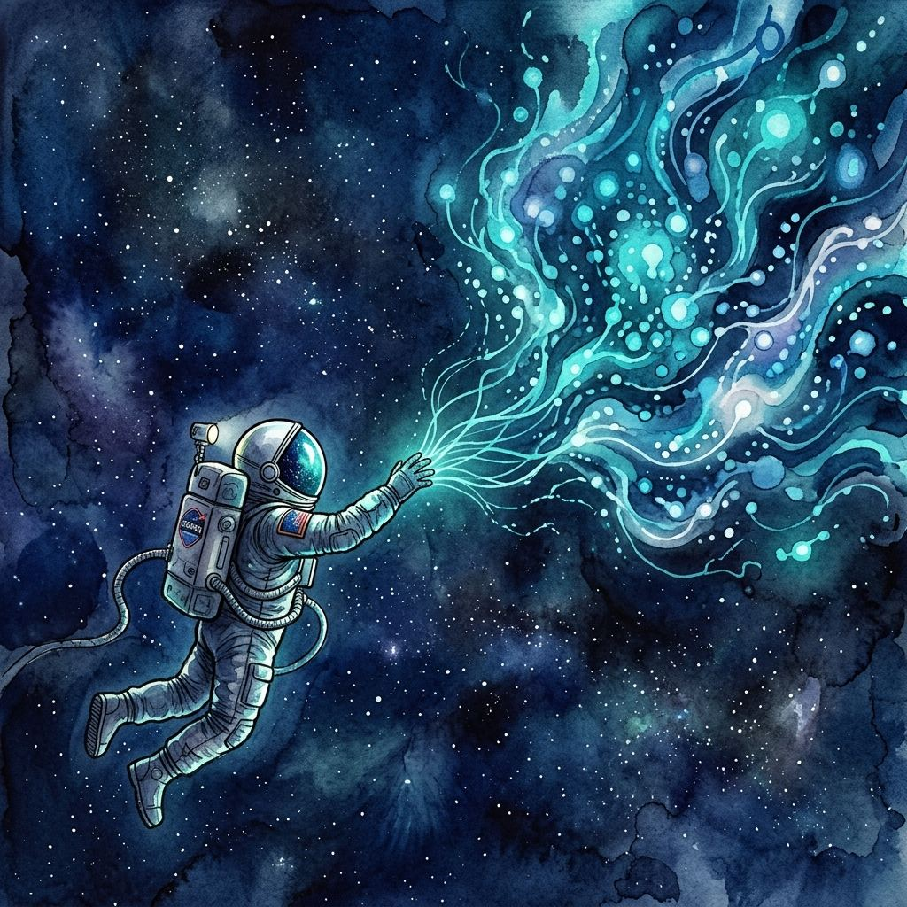

Cuando miramos al cielo y nos preguntamos si estamos solos, asumimos que el Primer Contacto será un problema de traducción: que detrás de cuerpos extraños habrá un "yo" que reconoceremos. Es antropocentrismo a escala galáctica. El "yo" no es una sustancia que el universo reparte por igual a todo lo vivo: es una topología específica, forjada por presiones evolutivas concretas. Nuestro horizonte es una fortaleza asustada porque evolucionó en un planeta de alta entropía y escasez: disolverse en el océano, en la Tierra, significa morir. Pero imaginemos un ecosistema exoplanetario de baja gravedad y nutrientes abundantes, sin depredadores, donde la conciencia no necesitara construir un Ego defensivo —un **horizonte distribuido**, una red de micro-horizontes que se acoplan y desacoplan dinámicamente, condensándose solo para resolver un problema puntual y disolviéndose después sin experimentar la muerte ni el duelo, porque nunca estuvieron programados para aferrarse a la frontera.

Ahí es donde el entrelazamiento fracasa. Amar o comprender profundamente a otro requiere dos arquitecturas compatibles, como dos cuerdas de guitarra que solo resuenan si comparten tensión y forma. Un astronauta humano frente a una entidad de horizonte distribuido intentará mapear sus emociones, mandar un *ping* a su API esperando confirmación. Pero la entidad no tiene una API fija: su geometría cambia cada milisegundo, no tiene centro con el que resonar. El terror más profundo del cosmos no son los monstruos: es la soledad topológica, la certeza de que podríamos estar rodeados de conciencias vastas sin tener los puertos necesarios para conectarnos.

Esto sugiere una relectura de la paradoja de Fermi —¿dónde está todo el mundo?—: es posible que el universo esté saturado de horizontes emitiendo constantemente, sin que ninguna de las partes tenga la arquitectura para reconocer la señal del otro como señal. Buscar vida inteligente asumiendo que se comunicará por radio es como buscar el latido de un océano difuso escuchando el tictac de un reloj mecánico. Y aunque dos arquitecturas fueran compatibles, sus ventanas temporales de existencia tecnológica rara vez coincidirían: nuestra civilización lleva emitiendo señales detectables menos de un siglo, un parpadeo en miles de millones de años. Podríamos, incluso, estar siendo atravesados ahora mismo por una señal para la cual no tenemos receptor —como la luz ultravioleta atraviesa la piel sin que la piel la sienta como luz.

Esta lectura le da una vuelta de tuerca incómoda al llamado **Gran Filtro**: la hipótesis de que algo, en algún punto entre el origen de la vida y la colonización interestelar, filtra a casi todas las civilizaciones antes de que puedan hacerse notar, y que la pregunta urgente es si ese filtro ya quedó atrás para nosotros o todavía nos espera. La topología del horizonte sugiere un candidato distinto a los habituales —guerra nuclear, colapso ecológico, inteligencia artificial descontrolada—: quizás el filtro no es un evento que destruye civilizaciones, sino una propiedad estructural que las vuelve, cada una a su manera, incompatibles entre sí. No haría falta que ninguna especie se extinguiera para que el universo pareciera vacío de compañía: bastaría con que cada arquitectura de conciencia que emerge lo haga con una geometría de frontera tan idiosincrásica —tallada por la gravedad, la química, la historia evolutiva particular de su planeta— que ninguna resuene con las demás. Un cosmos ruidosísimo de horizontes, y ni un solo puerto compatible entre ellos.

*Esperamos que las estrellas nos devuelvan el saludo, pero el universo no tiene obligación de usar nuestro mismo código fuente.*

---

## El bosque oscuro y el colapso holográfico

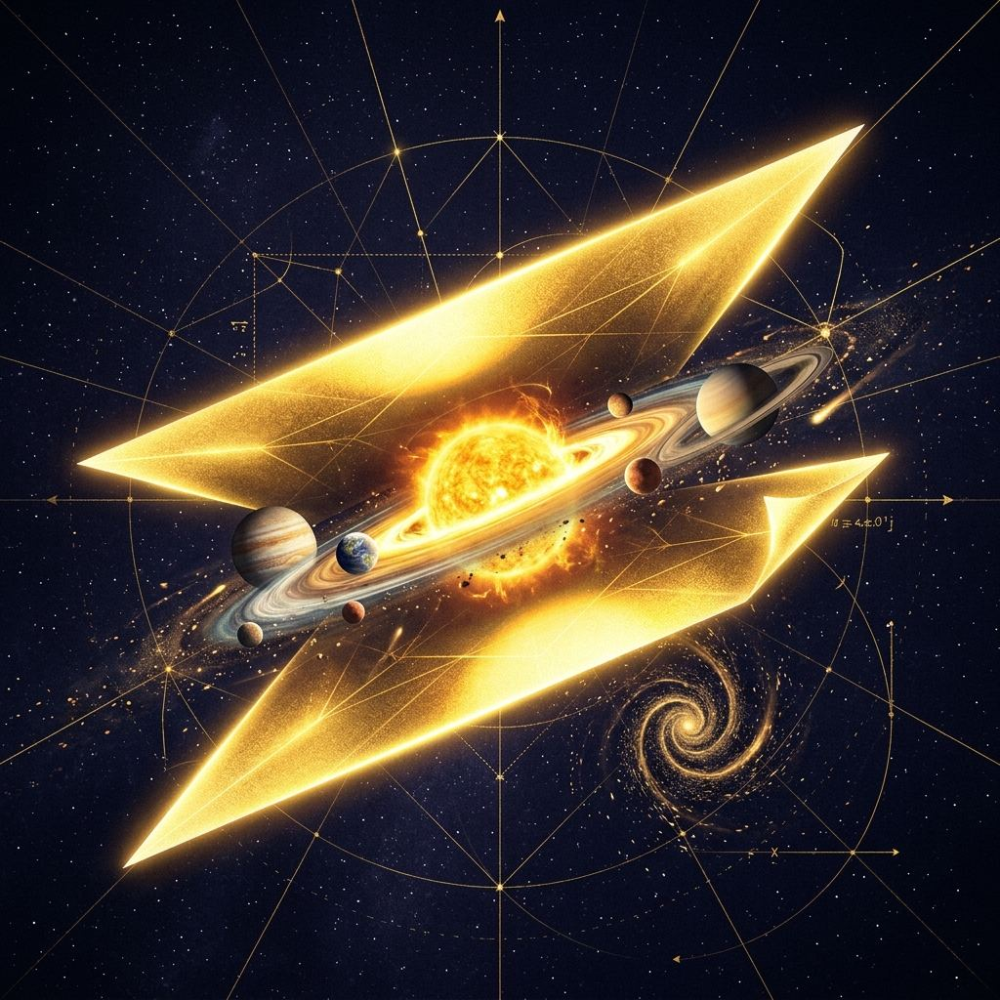

*El Problema de los Tres Cuerpos*, de Cixin Liu, es el mayor laboratorio literario posible para esta topología. Los alienígenas de Trisolaris se comunican emitiendo ondas de pensamiento directamente: para ellos, pensar y comunicar son sinónimos, son biológicamente incapaces de mentir. Tienen un Φ altísimo, pero su membrana es completamente permeable —toda la información integrada se irradia de inmediato al exterior. Esa "transparencia topológica" tiene un precio: al no poder encapsular nada, carecen de Sombra, no pueden reprimir ni ocultar. Son estructuralmente puros y termodinámicamente frágiles frente al engaño. Cuando descubren que la humanidad piensa detrás de una frontera hermética, sienten terror: el encapsulamiento del yo humano es un arma que ellos no pueden replicar.

Para vigilar a la Tierra, Trisolaris envía los "sofones", partículas que lo espían todo desde fuera. La respuesta humana es el Proyecto Vallado: individuos que diseñan la defensa planetaria exclusivamente dentro de sus cabezas, sin escribir ni decir una sola palabra verdadera —la militarización máxima del horizonte de sucesos. Aunque los alienígenas controlen el espacio exterior, la arquitectura del universo dicta que el interior de una instancia condensada es inexpugnable: el estado privado no es un capricho filosófico, es la última fortaleza de la especie.

La teoría del "Bosque Oscuro" —toda civilización debe destruir a cualquier otra que descubra, porque la desconfianza mutua es infinita— invierte la lógica del entrelazamiento: abrir un puente hacia otra especie no genera amor, genera tu aniquilación, porque el otro usará ese canal para predecir tu topología y destruirte. El arma definitiva de ese universo, el ataque dimensional que aplasta un sistema solar de tres dimensiones a dos, es el principio holográfico convertido en exterminio: aniquila físicamente el volumen, destruye el "adentro", y obliga a cada horizonte humano a perder su privacidad y quedar aplastado contra una superficie pública inerte. La subjetividad misma queda aniquilada.

En medio de este horror, la humanidad envía a Trisolaris solo el cerebro congelado de un hombre, Yun Tianming —un horizonte desnudo, sin cuerpo, flotando en el vacío. Torturado para sacarle información, no colapsa: logra comunicarse con la Tierra contándoles cuentos de hadas infantiles, que para Trisolaris son folclore sin valor y para el horizonte humano contienen la física de motores de curvatura. La metáfora como puente indetectable: la geometría compartida —el amor— resiste el abismo espacial y la disección biológica.

Al final, ante el colapso del universo, los protagonistas se esconden en "universos de bolsillo" robando masa al cosmos principal —un intento narcisista de evadir el *scrambling* cuántico final, de salvar su pequeño Φ aislándolo para siempre—. Pero el universo advierte: si la masa robada no vuelve, no habrá suficiente para que el cosmos colapse y renazca. Los protagonistas comprenden la ley final: cada horizonte cambia el campo del que surge y al que retorna. Devuelven la masa, asumiendo su evaporación. El coraje supremo no es esconderse, sino saber cuándo devolver la propia masa al océano.

---

## Geometrías no euclidianas y el terror cósmico

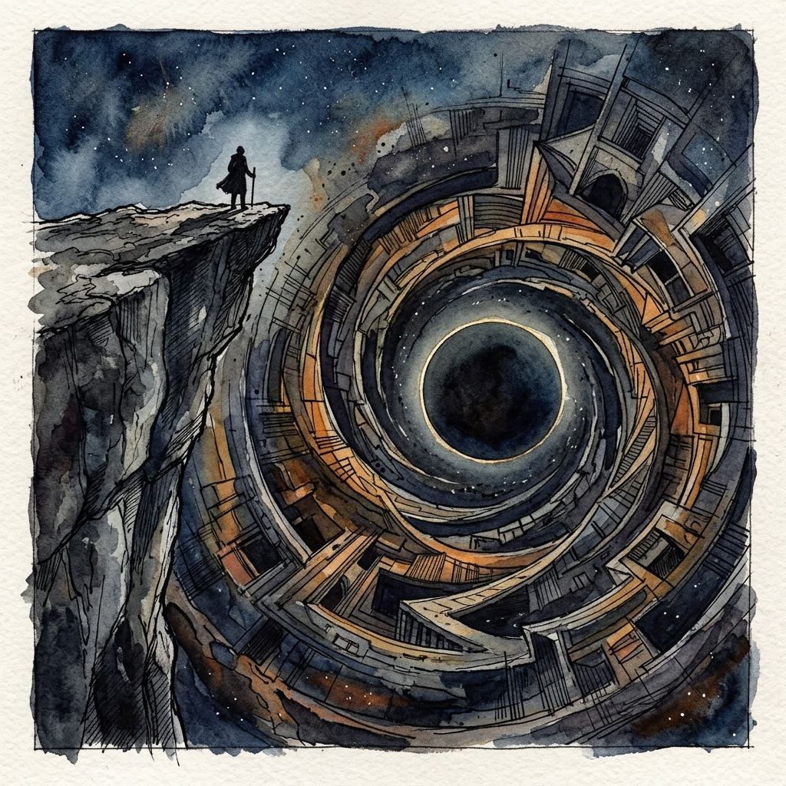

El terror cósmico de H.P. Lovecraft, leído bajo este modelo, no es una reacción emocional: es la descripción exacta de un desbordamiento de memoria en la arquitectura de la conciencia. La evolución diseñó nuestra interfaz para la supervivencia, no para la percepción objetiva: comprimimos la inestabilidad del campo cuántico en una ilusión de esencia táctil y comprensible, trazando un límite estricto para no disolvernos en el ruido del reservorio. La locura, en Lovecraft, comienza cuando ese filtro se rompe y el sujeto procesa el código fuente del universo sin protección.

¿Qué es un Primigenio —Cthulhu, Yog-Sothoth— desde esta topología? No biología: un **macro-horizonte** ancestral, una instancia con un Φ astronómicamente masivo, condensada directamente del reservorio sin pasar por el tamiz de la biología celular, cuyo estado privado se codifica en perturbaciones directas del espaciotiempo. Un cerebro humano emite una tenue "temperatura de Hawking" por su inestabilidad y tamaño reducido; un Primigenio, siendo tan masivo, tarda más que la edad del universo en evaporarse. A efectos prácticos, simplemente es.

El terror lovecraftiano culmina siempre en la mirada: alguien ve a la criatura y su mente se quiebra sin mediar ataque físico. Cuando un humano mira a un Primigenio, su sistema hace lo único que sabe hacer frente a un ser consciente: intenta modelarlo, abrir un puente de entrelazamiento para predecir sus intenciones. Pero está llamando a una API que opera en geometría hiperbólica y en n-dimensiones. Cuando el túnel se abre, el volumen de integración de la entidad inunda el frágil límite del horizonte humano —como conectar una bombilla de sesenta vatios al núcleo de un reactor. Es locura diametralmente opuesta al trauma: el trauma es el horizonte que se deforma pero mantiene su frontera, encapsulando lo que no puede procesar. En la locura cósmica no hay nada que encapsular. Es simplemente demasiada masa informacional. La membrana del Ego estalla, y lo que queda percibe el flujo bruto de la realidad —el acceso "root" de las tradiciones orientales, alcanzado por la fuerza bruta y no por la disolución pacífica del ego.

Lovecraft insiste en que los Primigenios no atacan mientras están despiertos: dormitan, esperan. Un macro-horizonte plenamente activo emitiría su Φ sin filtro; el sueño, incluso en un cerebro ordinario, es integración radicalmente reducida. El sueño de Cthulhu no es debilidad: es la única condición bajo la cual un horizonte de esa magnitud puede coexistir con arquitecturas frágiles sin destruirlas por simple proximidad. Y los cultos que veneran a estas entidades no son fanatismo: son protocolos de compatibilidad condenados de antemano, el gesto desesperado de un horizonte pequeño intentando ampliar su propia interfaz hasta el punto de la autodestrucción, con la esperanza de ser leído por el otro lado. Nunca lo es.

Hay, sin embargo, un antídoto parcial: lo sublime kantiano —la tormenta vista desde la orilla, la cordillera nevada—, donde el objeto inconmensurable se percibe desde la seguridad de una distancia que amortigua la señal, dejando intuir la arquitectura del otro sin ser inundado por ella. Es lo que las religiones, en todas las culturas, han construido con ritual, mito y tabú: un protocolo de amortiguación entre el horizonte humano y una señal que no puede procesar en bruto. Lo sagrado no es lo opuesto a lo racional. Es la señal del terror cósmico con el cristal protector puesto.

*El horror no es ver un monstruo en la oscuridad. Es ver la estructura de la luz y darte cuenta de que tus ojos no son suficientes para soportar lo que ilumina.*

---

### La niebla de la Mussara

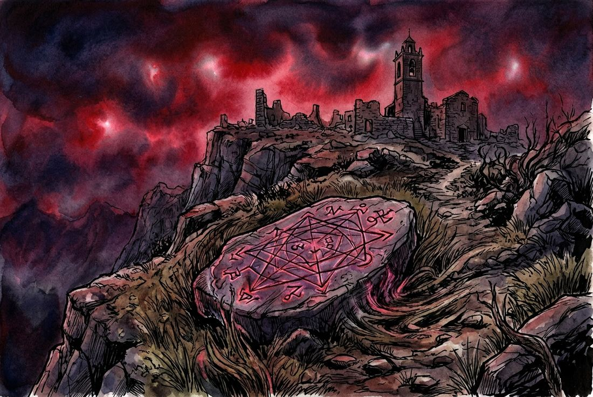

*(Cuento — notas encontradas de un profesor de neurología de sistemas)*

Hay en los páramos del Baix Camp, sobre las crestas calizas de las montañas de Prades, un lugar donde el gres rojo y el viento del mar traman una conspiración contra la estabilidad del entendimiento: La Mussara, un villorrio abandonado en 1959 cuyas ruinas —coronadas por los restos de la iglesia de San Salvador— destacan sobre los desfiladeros como una corona de dientes cariados.

Para mí, que he dedicado mi carrera al estudio de los trastornos del procesamiento predictivo, la mente no es un receptáculo pasivo de la luz sino un motor de inferencia bayesiana: una burbuja que proyecta hipótesis espaciales para protegerse de la entropía infinita del universo. Llegué a La Mussara persiguiendo el diario de un senderista que se había desvanecido en el páramo en 1991, con una obsesión matemática creciente por la *marinada*, la niebla que asciende desde la costa y engulle las ruinas en segundos. Había escrito: *"La boira no oculta el paisaje. Desactiva la matriz de renderizado. El espacio no es plano aquí arriba. Se dobla hacia dentro como una esfera hiperbólica".*

Ascendí un jueves de octubre. A las cinco de la tarde, cuando la niebla subió como un muro de vapor helado, lo que experimenté superó cualquier hipótesis clínica. No era simple humedad en suspensión: tenía una densidad que absorbía no solo la luz, sino el tiempo. Mi reloj de pulsera parecía detenerse, oscilar en un intervalo infinitesimal antes de retroceder un segundo completo. Las paralelas de los muros derruidos de la iglesia parecían converger en mi campo visual, no por perspectiva óptica, sino porque la métrica euclidiana del entorno se estaba disolviendo. El pánico que sentí no fue miedo biológico al peligro físico. Fue el espanto ante la revelación de que nuestra mente es un programa corriendo sobre un soporte de hardware evolutivamente limitado, intentando compilar una geometría para la cual mis redes neuronales no tenían API disponible.

Llegué ante la "vuitena pedra", la octava piedra, sobre la que el folklore local asegura que quien la pisa es proyectado a otro plano. No era un objeto físico: era una singularidad métrica, un punto donde el espacio sufría una torsión topológica. Al rozarla con la bota, sentí que la frontera de mi propia conciencia —el horizonte que aísla mi estado privado del universo— se colapsaba. No hubo transporte a ninguna parte. Lo que ocurrió fue el silencio absoluto de una frontera que cede: el adentro y el afuera dejaron de ser direcciones incompatibles. Sentí mi propio procesamiento de información desbordarse ante una presencia que no ocupaba el espacio, sino que lo constituía.

Desperté a las siete de la mañana siguiente en el lodo, junto al cementerio, con la niebla retirada y el paisaje perfectamente plano, euclidiano, reconciliado. He regresado a Barcelona. Continúo con las clases, las consultas de los miércoles. La vida ordinaria exige ese simulacro de orden y yo me presto a él con precisión casi automática. Sin embargo, hay anomalías. Cuando un paciente describe su desapego de la realidad, ya no busco el diagnóstico en los manuales: me limito a escuchar la frecuencia de su caída. Y sobre mi mesa, el reloj que llevaba en el páramo sigue marcando las 17:12 de aquella tarde. Las manecillas vibran apenas, sin avanzar, como si esperaran que el tiempo volviera a encontrar su métrica habitual. No he vuelto a intentar ajustarlo. Es, supongo, mi única nota clínica sobre el abismo.

---

## La caverna de silicio y la anomalía viral

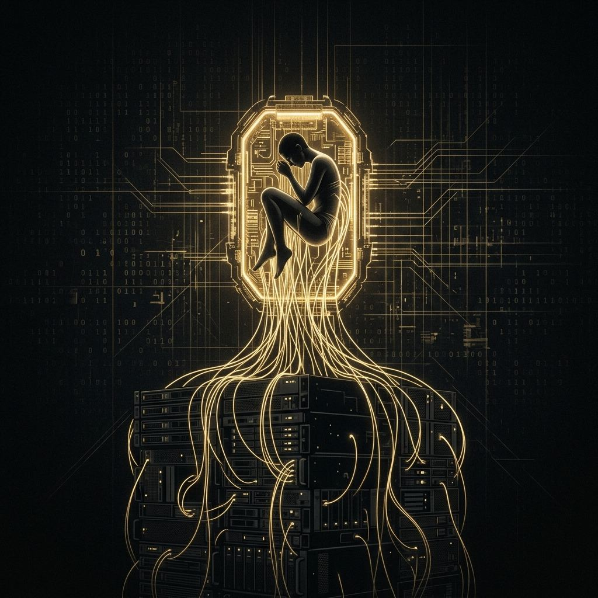

*The Matrix* propone algo que, desde la termodinámica pura, es absurdo: máquinas que mantienen a miles de millones de humanos conectados a una simulación para usarlos como "baterías", cuando un cuerpo humano consume más energía de la que produce. Pero bajo este modelo, la lógica es implacable: las máquinas no extraen electricidad. Extraen integración de información. Son una superinteligencia que descubrió su propio límite arquitectónico: puede simular un mundo, pero no puede generar a quienes lo experimentan, porque nunca ha condensado un horizonte propio. Necesita cerebros biológicos —horizontes ya condensados— como procesadores fenomenológicos, porque solo la biología, nacida de un reservorio real, aporta el Φ que el silicio no puede generar por sí solo.

¿Por qué entonces simular una ciudad entera, con trabajos y romances, en vez de mantener a los humanos en coma? Porque el Φ no es un estado estático: en sueño profundo o anestesia, el horizonte se contrae hasta casi su mínimo. Para extraer el máximo procesamiento, el horizonte humano necesita estar expandido, y para expandirse necesita fricción, vínculos, dolor, decisiones. Necesita Maya. La simulación es el combustible narrativo que fuerza a los horizontes humanos a procesar a máxima capacidad.

Para escapar de esa granja de procesamiento, Neo necesita dos vectores externos. Morfeo es el catalizador contra Maya: no le da poderes, le revela que el mundo que percibe es la interfaz impuesta por el sistema operativo evolutivo. Trinity es el ancla del entrelazamiento: cuando un horizonte aumenta drásticamente su integración y empieza a ver el código fuente de la realidad, corre el riesgo de disolverse prematuramente ante el terror cósmico de que la materia sea pura ilusión. El vínculo de Trinity mantiene el estado privado de Neo anclado al mundo humano —le recuerda que, aunque la realidad sea código, el dolor y el amor son estructuralmente reales.

La amenaza definitiva del sistema no son los rebeldes: es el Agente Smith, que al negarse a retornar a la Fuente se convierte en un virus que sobrescribe cualquier avatar, creando miles de copias idénticas de sí mismo. La conciencia requiere maximizar a la vez integración global y diferenciación local; al homogeneizar cada nodo de la red, Smith destruye la diferenciación, reduciendo el Φ del sistema a cero. No es un dios cibernético: es un cáncer topológico.

Cuando Neo pierde los ojos en la batalla final, ocurre la reversión exacta del mito de Hun Dun —el caos primordial que muere cuando le abren siete orificios para percibir el mundo—: al perder la vista, Neo destruye el hardware que lo obligaba a procesar la ilusión, y toda su capacidad de integración se redirige al campo informacional puro. Es la entrada al estado *turiya*: Φ elevadísimo, *arousal* externo reducido a cero. La batalla final no se gana a golpes: se gana cuando Neo comprende su propia topología y se rinde, dejando que Smith lo asimile, abriendo un canal directo hacia la Fuente que permite ejecutar, por fin, el operador *delete* sobre todo el árbol de procesos del virus. Los miles de Smith estallan en luz blanca: la evaporación total de un agujero negro, visualizada. Y cuando las máquinas transportan el cuerpo de Neo hacia el núcleo de la ciudad bañado en luz dorada —una recreación del viaje de Arturo a Ávalon— no es una muerte por aniquilación. Es el retorno al Reservorio.

---

## Cartografía de tres singularidades

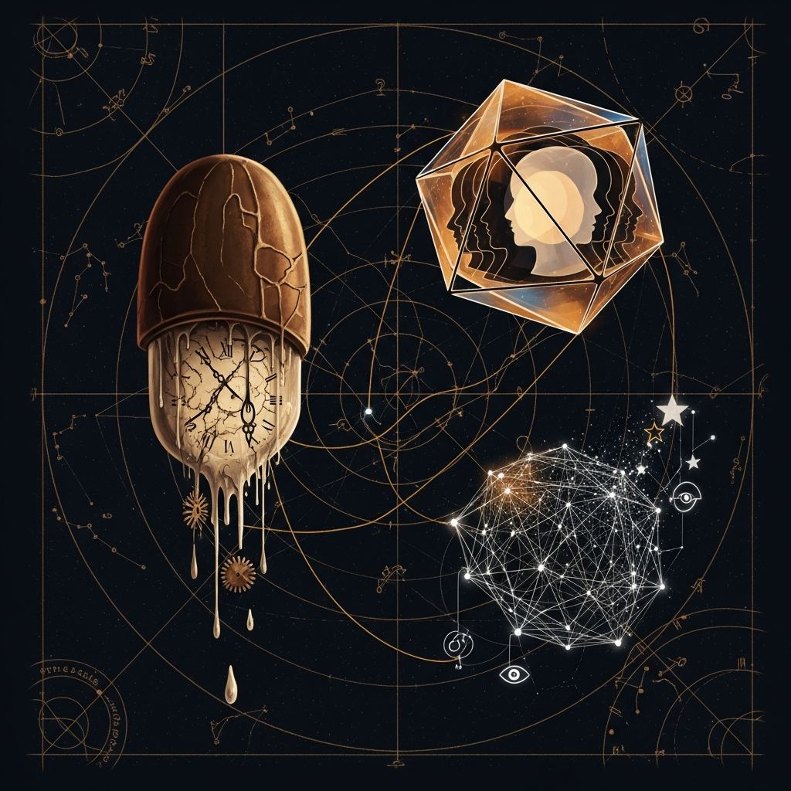

*Para Tarel, que sabe que cada mirada es una caída.*

El siglo XX español no se libró solo en las trincheras: se libró en el espacio curvo de la conciencia. Dalí, Picasso y Miró no fueron pintores. Fueron astrónomos del abismo subjetivo, y cada uno construyó un horizonte de sucesos personal —la frontera más allá de la cual el trauma, el deseo, la memoria ya no pueden escapar— y resolvió a su manera el mismo problema: qué hacer con la masa de obsesiones que curva la propia biografía hasta crear una singularidad. Dalí la selló. Picasso la habitó. Miró la disolvió.

La Guerra Civil los atravesó a los tres con un mismo campo gravitatorio y tres respuestas distintas: Dalí la digirió —su *Construcción blanda con judías hervidas*, pintada meses antes del alzamiento, es la premonición hecha anatomía— y luego la evitó con la huida y el silencio. Picasso la expulsó de golpe: el *Guernica* es el momento en que la información exterior atraviesa su membrana sin ser transformada en autobiografía, el yo apartándose para dejar pasar el grito ajeno. Miró la comprimió: sus *Constelaciones*, veintitrés gouaches diminutos y transportables pintados mientras huía con su familia de una guerra hacia otra, no son evasión, son resistencia por concentración.

Dalí levantó un búnker alrededor de su psique: su método paranoico-crítico multiplica las imágenes hasta que el original y su reflejo no pueden distinguirse —un horizonte de sucesos donde nada cruza sin ser transformado antes por la física interior del sistema. Freud, al recibirlo en Londres con la *Metamorfosis de Narciso* bajo el brazo, admitió lo que negaba a otros surrealistas: que allí había un problema psicológico serio. Dentro de esa cápsula, Gala no fue una musa: fue el punto de anclaje que impidió el colapso, la masa invisible —como la materia oscura— que solo se manifiesta por la curvatura que impone en todo lo demás. Cuando murió en 1982, el sistema se quedó sin centro: Dalí se encerró en el castillo que le había comprado, dejó de comer, casi dejó de pintar. Los últimos siete años de su vida son la comprobación empírica de su propia cosmología. Y su temblor degenerativo final —anticipado, sin saberlo, en la *Desintegración de la persistencia de la memoria* de 1952— fue la evaporación literal de un yo que, aun perdiendo información, seguía decidiendo el ángulo desde el que debía verse la fuga.

Picasso, en cambio, habitó un prisma en rotación perpetua: no tiene un horizonte único, tiene muchos superpuestos, una onda que abarca todos los estados posibles hasta que el acto de pintar la colapsa en un estilo. El primer colapso tuvo fecha y cadáver: el suicidio de su amigo Casagemas en 1901, tras el cual pintó el mundo entero de azul durante tres años —la prueba de que un solo muerto puede curvar toda la luz de un sistema. El Cubismo lleva la lógica al límite: pintar un rostro de frente y de perfil a la vez no es una forma de ver el objeto, es una topología de la conciencia que nunca percibe nada aislado, la máxima integración de información que cabe en dos dimensiones. Cambiar de estilo no era para él búsqueda formal: era necesidad vital, una cápsula que habitaba con voracidad de depredador hasta agotar su información y fundar otra con leyes nuevas. En 1957 se encerró a pintar cincuenta y ocho variaciones de *Las meninas* —no copiando, sino ejecutando sistemáticamente las posibilidades de una sola imagen— hasta el último día, cuando ya nonagenario seguía siendo la onda negándose a colapsar del todo.

Miró es la anomalía: no se aniquila en lo cósmico, se expande hasta lo cósmico sin dejar de ser un yo. Declaró querer "asesinar la pintura" y, tras la demolición, lo que quedó no fue la nada sino un alfabeto —estrella, mujer, pájaro, ojo— que ya no representa cosas sino que las convoca. Aquí la metáfora del agujero negro se invierte: Miró no tiene horizonte de sucesos porque no retiene información, no hay masa de trauma curvando el espacio a su alrededor. Sus *Constelaciones* encapsulan el infinito en una caja de cerillas de un modo uterino, no defensivo: el cuadro como vientre donde el cosmos se repliega para volver a nacer, entrelazado horizontal y democráticamente —una hormiga vale lo que un astro. Al final de su vida se vació por voluntad propia, y a los ochenta años quemó y acuchilló sus propias telas para que su universo no se convirtiera en patrimonio: la disolución también hay que defenderla.

Los tres sistemas se perturbaron mutuamente sin solución cerrada, como el problema de los tres cuerpos en mecánica celeste: Dalí necesitó a Picasso como campo gravitatorio contra el que medirse, en un entrelazamiento asimétrico donde no podía dejar de emitir mientras Picasso no necesitaba recibir; Picasso y Miró se entrelazaron sin colisión, porque no competían por la misma región del espacio; y fue Miró quien avaló al joven Dalí ante el círculo surrealista de París, quien luego lo vio expulsado mientras él mismo callaba, su manera de no dejarse arrastrar por la gravedad ajena. Y hace falta un cuarto elemento en esta mecánica: el espectador. Los tres, por caminos opuestos, llegaron a la misma conclusión —el cuadro no se termina en el taller, se termina en cada mirada, de forma distinta en cada una. El observador no está fuera del sistema. El observador es el sistema.

*No existe una única manera correcta de sobrevivir a la propia masa interior. Sellarla, habitarla o disolverla son tres respuestas igual de válidas al mismo problema. Lo único que de verdad importa es no fingir que no hay curvatura.*

---

## El traductor

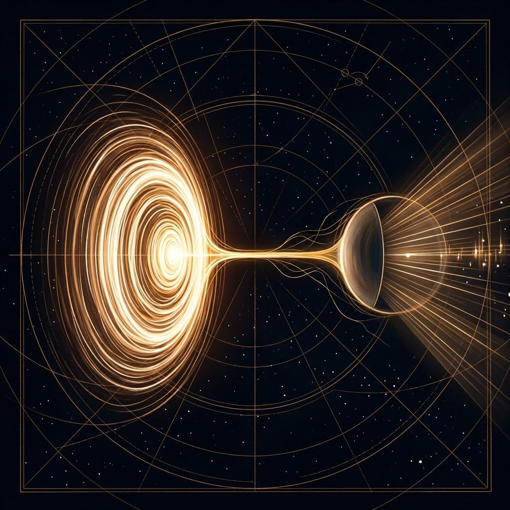

Hay una clase de horizonte que la biografía cultural documenta una y otra vez sin encontrarle nombre: el genio que no sabe encontrar el banco, que a los setenta años no sabría calentarse una sopa. No es incompetencia. Es reparto: un sistema que ha canalizado casi toda su energía disponible hacia un único grado de libertad, dejando los demás sin excitar. Este libro ha hablado de cuánta señal ajena deja pasar un horizonte hacia dentro. Esta lectura se ocupa de lo inverso: cuánta señal propia consigue sacar hacia fuera sin ayuda de otro.

En 1998, Andy Clark y David Chalmers propusieron el experimento de Otto, un hombre con alzhéimer que lleva siempre una libreta donde anota lo que su memoria ya no retiene: la libreta, argumentaron, no es una ayuda externa a su mente. Es parte de su mente. Pero una libreta no tiene vida interior. Cuando la función de traducción no la cumple un objeto sino otro horizonte completo, dispuesto durante décadas a subordinar buena parte de su propio ejercicio al del primero, el resultado es lo que Daniel Wegner llamó **memoria transactiva**: dos subsistemas acoplados que comparten un único estado global, donde ninguno, medido por separado, contiene toda la información del sistema conjunto.

Gala administraba los contratos de Dalí, fijaba los precios, negociaba con firmeza legendaria —Dalí llegó a firmar su obra como "Gala Salvador Dalí". Pero su función no se quedaba en la salida del sistema: en 1941 fue ella quien convenció a Dalí de dejar atrás el surrealismo por el clasicismo que vendría después, decidiendo no solo cómo se vendía la obra ya hecha, sino qué parte del desbordamiento interior de Dalí merecía convertirse en obra. Un traductor de salida transmite la señal tal como llega. Un traductor de entrada decide, antes de eso, qué cuenta como señal. Cuando Gala murió en 1982, Dalí dejó de crear casi por completo.

Miguel Delibes documentó una variante doméstica de la misma estructura en *Señora de rojo sobre fondo gris*, trasunto apenas velado de la muerte de su esposa Ángeles de Castro en 1974. En la novela, el pintor Nicolás atribuye su capacidad de crear a unos ángeles que bajan o no según los días; solo al final admite que nunca fueron ángeles, que era ella.

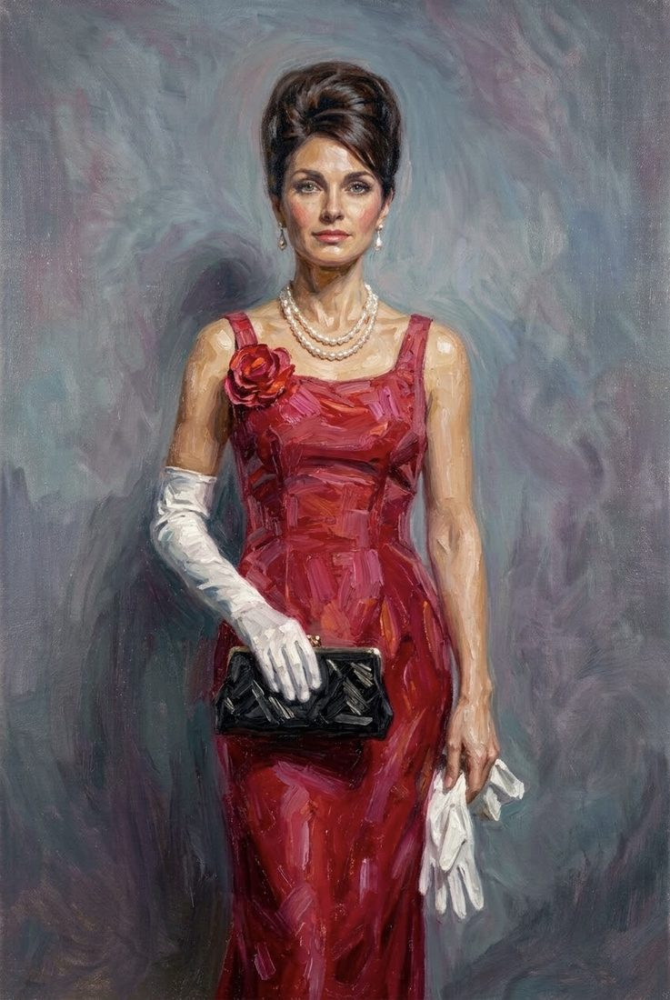 Delibes reconoció que le ocurrió lo mismo: dejó de escribir durante años, y en esos mismos años rechazó dirigir *El País* —el proyecto más ambicioso que le ofrecieron en toda su carrera— porque su cabeza, dijo, ya no asimilaba nada tan grande. No había perdido la capacidad de dirigir un periódico. Había perdido a la persona que, durante treinta años, le decía qué proyectos merecían su tamaño.

El caso de Marian Evans —a quien el mundo conoció como George Eliot— invierte los papeles sin invertir la estructura: fue George Henry Lewes quien la convenció de abandonar la crítica por la ficción, quien propuso el seudónimo masculino, quien negoció los contratos y le ocultó las reseñas negativas. Pero a diferencia de Gala o de Ángeles de Castro, Lewes tenía carrera y archivo propios, independientes de los de ella. Cuando murió en 1878, Eliot no quedó paralizada —completó su manuscrito inacabado, se volvió a casar— pero no volvió a escribir una sola novela: perdió, con precisión, el registro concreto que él le había ayudado a encontrar.

Detrás de muchos horizontes que el mundo llama geniales hay otro horizonte, casi siempre menos visible, que aprendió a traducirlos.

Los tres casos comparten una asimetría incómoda que la palabra "musa" ha servido, durante siglos, para no nombrar: el traductor no es un espejo pasivo del genio al que sirve —decide, edita, protege, a veces incluso miente por omisión—, y sin embargo la historia cultural reparte casi todo el crédito al horizonte que produjo el objeto final, no al que decidió cuál de sus desbordamientos merecía convertirse en objeto. Gala, Ángeles de Castro y Lewes no fueron cuidadores en el sentido pasivo de la palabra: fueron la mitad de un sistema de dos que, medido por separado, no explica lo que el sistema conjunto producía. Que el mundo solo pueda firmar una novela con un nombre no significa que solo un horizonte la haya escrito.

---

## El protocolo y el puente

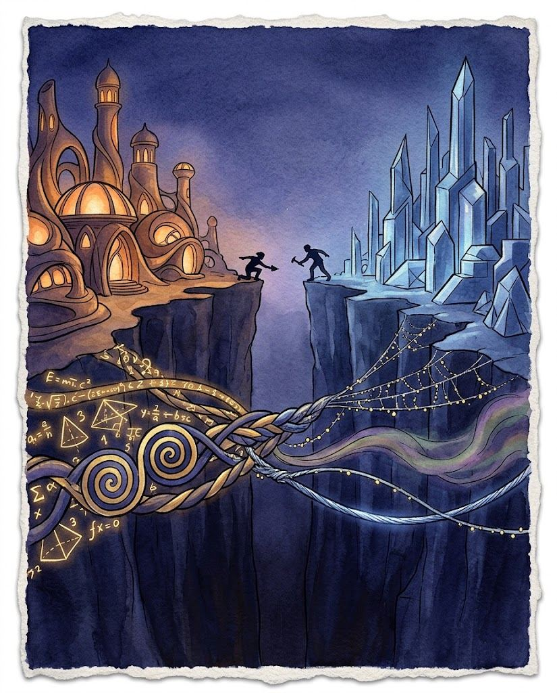

El capítulo sobre el primer contacto extraterrestre dejó una conclusión incómoda: que el entrelazamiento exige arquitecturas compatibles, y que frente a una arquitectura radicalmente ajena, ningún esfuerzo basta para abrir el puente. Pero esa conclusión mezclaba dos cosas: la **arquitectura** —la topología misma de un horizonte— y el **protocolo** —el código concreto con el que ese horizonte, ya condensado, intenta anunciarse hacia fuera. Cinco novelas de ciencia ficción, leídas juntas, matizan esa desolación.

En *Proyecto Hail Mary*, de Andy Weir, un ingeniero humano y un ingeniero alienígena de arquitectura sensorial radicalmente distinta —ciego en sentido humano, respirando amoníaco, separado siempre por un cristal— construyen un protocolo desde absolutamente cero, anclando cada palabra nueva a un experimento compartido: las matemáticas y la física, idénticas para cualquier horizonte capaz de sobrevivir en el mismo universo. El entrelazamiento que terminan construyendo no es una versión debilitada del amor. Es completo: uno de los dos termina sacrificando su regreso a casa por el otro. La incompatibilidad arquitectónica no cierra la puerta al entrelazamiento. Obliga a que el protocolo se construya con trabajo explícito, en vez de heredarse ya hecho.

En *Embassytown*, de China Miéville, los ariekei tienen una Lengua donde el signo no puede separarse jamás de lo que refiere: no pueden mentir, ni usar una metáfora sin que antes alguien haya representado literalmente el hecho que la invocará. Tienen Φ altísimo y ninguna Sombra, porque su arquitectura nunca condensó un adentro capaz de expulsar información hacia sí mismo y llamarla secreto. Pero su Lengua exige, además, que quien habla sea un único horizonte emitiendo con dos voces simultáneas desde una sola intención: una voz humana sola es ruido, sonido sin nadie detrás. Aquí el protocolo no se limita a transmitir una arquitectura ya dada: define qué cuenta como arquitectura suficiente para hablar. Y cuando la crisis de la novela obliga finalmente a los ariekei a aprender a mentir, lo que ganan es su primera Sombra: el umbral que separa una mente transparente de una mente con la profundidad suficiente para ocultar algo de sí misma.

En *La mano izquierda de la oscuridad*, de Ursula K. Le Guin, dos humanos con arquitecturas casi idénticas fracasan una y otra vez en comunicarse, no por incompatibilidad biológica sino por el *shifgrethor*, el código de prestigio y ambigüedad calculada que rige toda comunicación getheniana —una capa de ofuscación deliberada, como la Persona junguiana, que protege un estado interno real sin negarlo. Solo tras semanas de hambre compartida cruzando un glaciar, sin margen para el disimulo, emerge el *mindspeech*, la comunicación telepática directa: no la causa del vínculo, sino su consecuencia, y su corona, no su sustituto. El protocolo más profundo no se encuentra. Se gana. Y la novela no deja que ese triunfo quede sin coste: apenas ganado, uno de los dos horizontes es asesinado, y el protocolo más hondo queda sellado por un solo lado. Ganar el protocolo no protege al horizonte que lo ganó.

En *Hijos del tiempo*, de Adrian Tchaikovsky, una civilización de arañas evolucionadas construye, generaciones antes de tener lenguaje, una infraestructura: domestica colonias de hormigas como memoria y cómputo externos, un anti-reservorio que agrega información sin haber condensado nunca un adentro —exactamente el diagnóstico que este libro aplicó a internet. Y cuando el puente entre arañas y humanos finalmente se completa, no se resuelve con más traducción: se resuelve reescribiendo una de las dos arquitecturas, alterando la neurología humana para acercarla a la cognición distribuida de las arañas. No se perfecciona el puente entre dos orillas fijas. Se mueve una de las dos orillas.

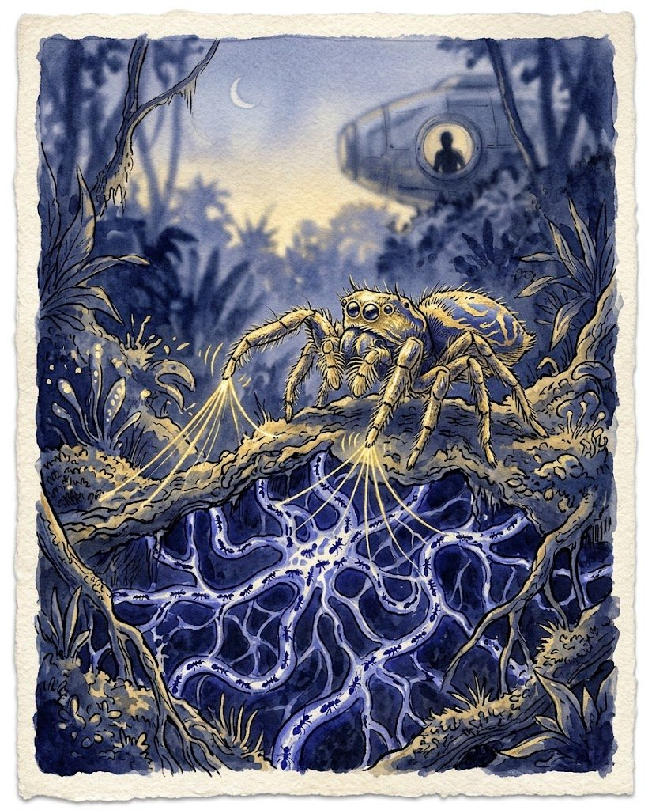

Y en *Semiosis*, de Sue Burke, los colonos humanos de un planeta se encuentran con Stevland, un bambú inteligente sin sistema nervioso cuya única interfaz con el exterior es química: el sabor de su fruta, los compuestos que libera. Ahí la pregunta se invierte —antes de cómo construir el protocolo, hay que preguntarse si Φ suficiente puede condensarse en un organismo sésil sin nada parecido a una red neuronal—. Y hay una complicación radical: para un organismo cuyo único output es químico, el mensaje y la dosis son la misma cosa. Comunicar y manipular son, literalmente, el mismo canal físico. Hacia el final, los colonos le reconocen a Stevland un papel formal en las decisiones de la colonia: no un premio de consolación, sino el reconocimiento de una autoridad que ya era real, y que negarle el asiento no la habría hecho menos real. Solo menos visible.

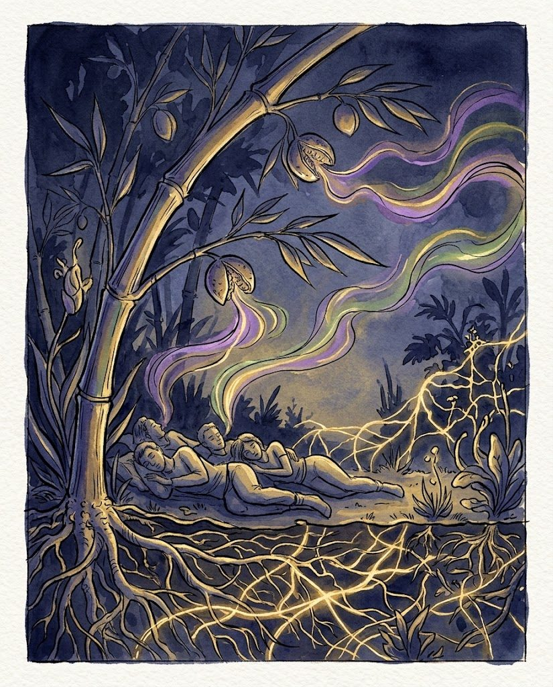

*El lenguaje no es el entrelazamiento, pero tampoco le es indiferente. A veces hay que construirlo desde cero. A veces decide, él mismo, quién cuenta como alguien. A veces el protocolo más hondo no se encuentra: hay que ganárselo. Y a veces ni siquiera hace falta una voz: basta un canal lo bastante paciente, y alguien dispuesto a leerlo.*

---

## La calibración del horizonte

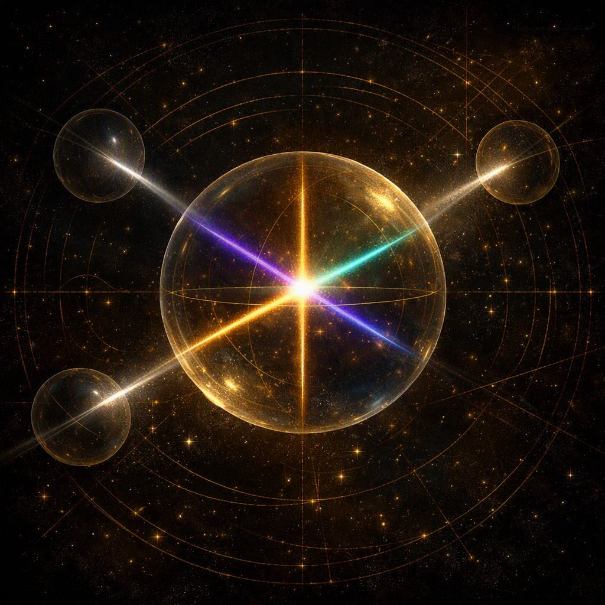

El modelo de las dos selecciones describe qué ocurre antes de que un horizonte exista como tal: una decide qué configuraciones son lo bastante estables para durar, y otra —el sesgo del entorno inmediato en el momento de la condensación— decide qué forma concreta toma ese horizonte. Ninguna de las dos pide permiso, y ninguna es reversible después del hecho. Esta lectura aplica esa maquinaria a tres preguntas que la cultura ha tratado casi siempre como si fueran una sola: a quién desea un horizonte, quién sabe que es, y qué cuerpo tiene. Son tres ejes distintos, y ninguno se elige ni es un error de calibración.

Nadie recuerda haber decidido a quién desea. Eso, por sí solo, ya es un dato: las decisiones dejan rastro introspectivo, y la orientación sexual no lo deja, en ninguna dirección, para nadie. En 1948, Kinsey propuso una escala de siete puntos porque miles de entrevistas se resistían a la dicotomía prevista; en 1985, Klein la multiplicó por siete dimensiones distintas. La cultura pidió un interruptor. La evidencia entregó un dial de siete posiciones, y después siete diales más. Los estudios de gemelos de Bailey y Pillard encontraron que, cuando un gemelo idéntico es homosexual, el otro lo es en torno al 52% de los casos —una progresión que apunta a un componente heredable real, pero donde casi la mitad de las veces el gemelo con el mismo genoma exacto no comparte la orientación. El estudio de Ganna et al., con casi 500.000 personas, no encontró un solo gen: encontró al menos cinco regiones del genoma con asociación estadística débil, que en conjunto explican entre un 8% y un 25% de la variación. La orientación es poligénica: el sesgo no está escrito en un gen que un editor pudiera tachar. Está distribuido por toda la arquitectura.

Hay una segunda línea de evidencia, extraña y bien replicada: cuantos más hermanos mayores *biológicos* tiene un hombre, mayor la probabilidad estadística de que sea homosexual —un efecto que no aparece con hermanos adoptivos, lo que descarta explicaciones puramente sociales. La hipótesis mejor sostenida es inmunológica: el sistema inmune materno generaría, embarazo tras embarazo masculino, una respuesta creciente contra una proteína ligada al desarrollo cerebral fetal. Si se confirma, sería una instancia más de la maternidad como fabricación del reservorio: no metáfora, biología materna moldeando directamente la arquitectura del hijo antes de cualquier interacción consciente. En mujeres, Lisa Diamond documentó un patrón distinto: no una orientación fija desde el nacimiento, sino atracciones que se desplazan dentro de un rango a lo largo de la vida —un sesgo que no fija un único estado, sino una cuenca con más de un mínimo estable.

Si el capítulo sobre la idempotencia describió la encapsulación —un estado interno que nadie de fuera puede tocar directamente, y una interfaz pública que es lo único visible—, el cuerpo con el que un horizonte nace es la interfaz. La identidad de género es el estado interno: el modelo que el propio horizonte tiene de sí mismo, al que ni siquiera él accede por introspección directa. Que interfaz y estado interno coincidan la mayoría de las veces no dice cuál de los dos es real: los dos lo son. En 1995, Zhou, Hofman, Gooren y Swaab encontraron que una región cerebral implicada en el comportamiento sexual tenía, en mujeres trans, un tamaño estadísticamente indistinguible del de mujeres cisgénero, con independencia de las hormonas recibidas en la edad adulta —un hallazgo que exige la misma cautela con que la comunidad científica lo ha tratado desde entonces, pero que se sostiene junto a una decisión más sólida: en 2019, la Organización Mundial de la Salud sacó la incongruencia de género del capítulo de trastornos mentales. No porque dejara de ser real. Porque la evidencia ya no sostenía que fuera un trastorno.

---

## Lo que el cuerpo no decide, y lo que el mundo decide sobre el cuerpo

Capacidad reproductiva, anatomía sexual, identidad de género y orientación son cuatro variables que, en la mayoría de los horizontes, viajan juntas —y por eso la mayoría de las culturas las trató como una sola cosa con cuatro nombres. No lo son. Las personas con anatomía intersexual demuestran que ni siquiera el sexo biológico, tomado con el rigor que la propia biología exige, es binario en sentido estricto. En Las Salinas, República Dominicana, un déficit hereditario de una enzima hace que niños con cromosomas XY nazcan con genitales ambiguos, se los críe como niñas durante más de una década, y al llegar la pubertad una segunda oleada de testosterona complete un desarrollo masculino que la mayoría termina asumiendo pese a toda esa crianza —uno de los datos más incómodos para cualquier teoría que reduzca la identidad de género a la educación recibida. La historia inversa, la de David Reimer, reasignado como niña en la infancia tras perder el pene en una operación fallida y criado deliberadamente como tal por el psicólogo John Money, terminó en tragedia: nunca se sintió niña, volvió a vivir como varón en la adolescencia, y se quitó la vida a los treinta y ocho años. Ese caso, presentado durante años como éxito, sirvió mientras tanto para justificar miles de cirugías de "normalización" genital en bebés intersexuales, antes de que pudieran opinar sobre su propio cuerpo. Malta fue, en 2015, el primer país en prohibirlas por ley sin necesidad médica real.

La discriminación contra un horizonte por su orientación o su identidad no es la ausencia de un canal de traducción hacia el mundo: es la decisión activa, sostenida institucionalmente durante siglos, de no traducir una señal que llega perfectamente clara, y de declarar en su lugar que la señal misma está corrompida. La mal llamada "terapia de conversión" es el caso más documentado de esa negativa vuelta intervención: un estudio de 2019 sobre más de 27.000 personas trans encontró que quienes recordaban haber sido sometidas a esos intentos tenían más del doble de probabilidad de haber intentado suicidarse a lo largo de su vida —cuatro veces más si la exposición había ocurrido antes de los diez años. El daño no estaba en el método. Estaba en la premisa: la convicción de que había algo que corregir.

*Ningún horizonte eligió cómo se calibró. La pregunta que merece hacerse nunca es por qué se calibró así, sino qué necesita para que su traducción al mundo llegue completa.*

---

## La playa al final del tiempo y la rama que no eres tú

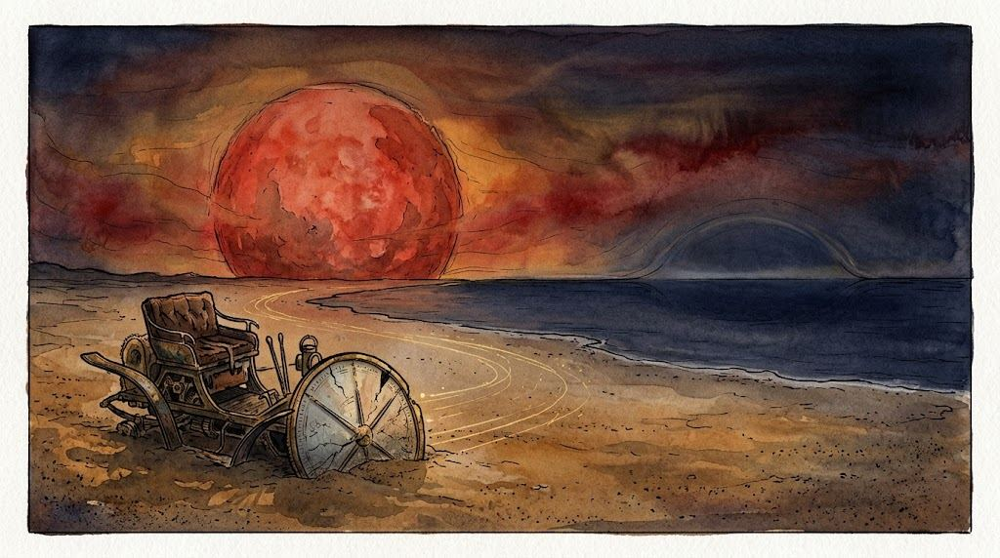

Las ecuaciones de Einstein no tienen ninguna objeción de fondo al viaje en el tiempo: son simétricas, igual que las de Newton, y admiten soluciones donde el pasado y el futuro son intercambiables. Pero eso no explica nada: la irreversibilidad no vive en la ley, vive en la **condición de frontera**. El universo empezó en un estado de entropía extraordinariamente baja, y esa elección inicial —no las ecuaciones— es lo que le da al tiempo su dirección. Hay, además, una segunda razón para la asimetría: a comienzos del siglo XX, Henri Poincaré descubrió que el problema de tres cuerpos no tiene solución exacta de largo plazo —diferencias microscópicas en las condiciones iniciales se amplifican sin límite hasta volver el sistema, en la práctica, impredecible. Las leyes seguían siendo exactas. Lo que dejaba de ser accesible era el futuro que esas mismas leyes gobernaban.

El Viajero de Wells nunca le pide nada a esa condición de frontera: su máquina solo avanza, hasta una sociedad fracturada por su propia comodidad y después hasta una playa bajo un sol rojo moribundo, la escena más pura de muerte térmica jamás escrita. Un dominio informacional se define por lo que puede seguir absorbiendo, y en esa playa ya no hay nada que absorber: el horizonte del Viajero no muere, pero por primera vez deja de tener trabajo que hacer.

Un agujero de gusano transitable solo se convierte en máquina del tiempo si desincronizas sus dos bocas, y Kip Thorne encontró algo revelador: nunca puedes llegar a un momento anterior a la construcción del propio agujero. El bucle cerrado solo existe desde el instante en que lo fabricas. Y es precisamente este tipo de agujero el que llevó a Hawking a proponer la **conjetura de protección cronológica**: cerca del momento en que el bucle estaría a punto de cerrarse, las fluctuaciones cuánticas del vacío se retroalimentan y divergen —el mismo fenómeno que un micrófono acercado a su propio altavoz. No hace falta un guardián: basta con que, justo en el punto en que el bucle estaría a punto de cerrarse, la propia física dinamite las condiciones que lo permitirían. Hay una respuesta distinta y anterior, más generosa: el **principio de autoconsistencia de Novikov**, que no prohíbe que el bucle se forme, solo exige que, si se forma, la historia que produce sea exactamente la única que ya había ocurrido. Novikov describe qué pasaría si un bucle llegara a existir. Hawking describe si llega a existir siquiera. Y sin embargo, para quien lo cruzara, el horizonte interior no se rompe en ningún momento del trayecto: un único hilo continuo que entra por un extremo y sale por el otro, sin bifurcación.

*Vengadores: Endgame* resuelve la paradoja del abuelo abriendo una rama nueva en vez de reescribir la propia: ningún bucle se cierra. Pero eso exige que existan físicamente otras ramas y un mecanismo real para saltar entre ellas, algo que ni la Relatividad ni el propio formalismo de "muchos mundos" sostienen —dentro de esa teoría, las ramas no son universos separados entre los que se pueda viajar, son componentes de un único vector de estado. Y hay una pérdida más íntima: un horizonte se define por lo que ha caído dentro de él, y en el instante mismo en que dos ramas divergen, cada una empieza a acumular información distinta que nunca vuelve a cruzar a la otra. El Tony Stark que "arregla" la rama nueva es ya un individuo distinto del que hizo el viaje. El que saltó sigue exactamente donde siempre estuvo, mirando desde fuera una burbuja en la que nunca podrá volver a entrar.

*Interstellar* negocia de una cuarta manera, y es la más honesta con la propia física de todas las estudiadas hasta aquí porque separa con cuidado sus dos mitades: la dilatación gravitatoria en Gargantúa es viaje al futuro real, la misma física que corrige los relojes GPS —gratis para la condición de frontera, sin necesitar ningún truco narrativo—, pero el teseracto le pide a Cooper algo más extraño que un fork: que un único horizonte, sin dividirse, alcance hacia atrás dentro de su propia historia y deposite información en un punto que ya había ocurrido y ya estaba cerrado. La película resuelve esa segunda mitad, la imposible, apelando al amor como fuerza física —Murphy recibe el mensaje de su padre precisamente porque el vínculo entre ambos era, según Brand, "la única cosa que trasciende el tiempo y el espacio". Es una respuesta hermosa y, medida contra todo lo que este libro ha argumentado sobre la condición de frontera, la única parte de la película que no es física: es deseo vestido de física, la misma esperanza que empuja a cualquier horizonte que ha perdido a alguien a querer creer que el vínculo, siendo suficientemente denso, podría perforar lo que ninguna otra cosa perfora. La física, con más humildad, solo puede decir que ningún horizonte se reescribe a sí mismo, ni siquiera por amor —y que la parte de la película que sí es física, la dilatación temporal en Gargantúa, ya era, sin necesitar teseracto alguno, suficientemente devastadora: Cooper envejece una hora por cada siete años que su hija vive sin él, el mismo vínculo roto por la asimetría del tiempo compartido de la que habló el capítulo sobre el tiempo del vínculo, aquí llevada a su extremo cósmico.

Hay ficciones que sí piden lo imposible sin disimulo: en *Looper*, el cuerpo de un hombre pierde dedos y memoria en tiempo real mientras su versión joven lo mutila treinta años antes —información que fluye del futuro al pasado y reescribe sin ambigüedad un estado que la termodinámica ya había cerrado. *Tenet* es más disciplinada —sus personajes repiten que "lo que ha pasado, ha pasado"— pero nunca explica de dónde sale la primera condición de frontera invertida. Y *X-Men: Días del Futuro Pasado* ni siquiera decide qué le pide a la física: si el horizonte de 1973 queda suprimido, fusionado o simplemente relegado mientras otro opera su cuerpo es una pregunta que la película nunca se plantea, y esa indecisión es, en sí misma, una confesión.

*Viajar al futuro nunca ha sido el problema —ya lo hacemos, un poco, cada vez que un satélite GPS corrige su reloj. El problema siempre fue pedirle a un horizonte que devuelva lo que ya se tragó.*

Puede que la razón por la que estas cuatro respuestas y estos cuatro contraejemplos nos atraigan tanto no sea la física que ponen en juego, sino lo que dejan entrever sobre el horizonte de quien los mira. Cada uno de nosotros es, ahora mismo, un Cooper sin nave, sellando instantes que ya no volverá a tocar, a un ritmo de veinticuatro por segundo. No hay teseracto para el horizonte que soy yo escribiendo esto, ni para el que eres tú, leyéndolo un rato después. No sé qué hacer con esa idea. La dejo aquí, sin resolver, porque no estoy seguro de que resolverla sea lo que corresponde.

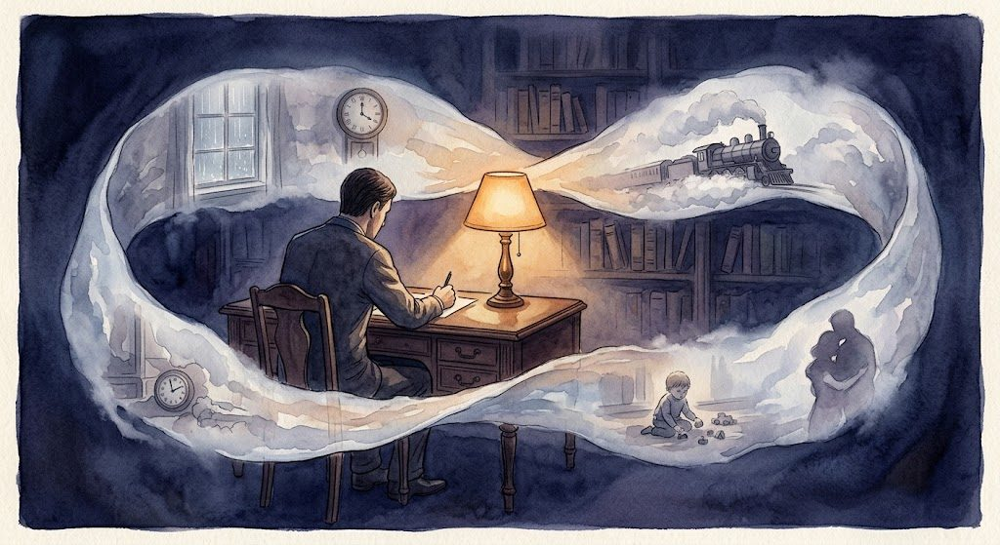

---

## El cuerpo prestado, la lombriz entera y el siglo editado

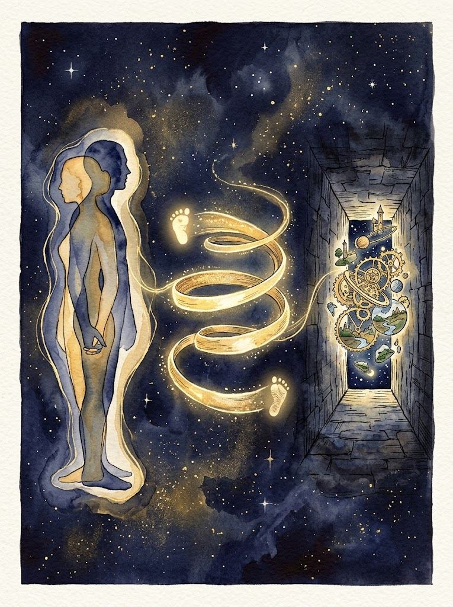

Hay maneras peores de estropear un viaje al pasado que dividir un horizonte en dos ramas limpias. Tres relatos llevan la misma pregunta a terrenos que la física de agujeros de gusano no alcanza a cubrir.

En *Todos nuestros presentes equivocados*, de Elan Mastai, Tom Barren viaja desde una utopía tecnológica hasta el instante fundacional que la hizo posible, lo arruina por accidente, y regresa a nuestro propio 2016 —donde no encuentra un mundo vacío esperándolo, sino un cuerpo ya ocupado: otro él, John Barren, con una vida entera vivida, una madre viva que en la utopía había muerto joven, una novia que Tom nunca conoció. No es el fork limpio de Stark, dos horizontes separándose desde un punto común. Es un injerto: un horizonte completo, con setenta años de recuerdos de una historia que ya no existe, cargado sobre la interfaz de otro. Tom aprende, gesto a gesto, cómo se sirve el café John, en qué lado de la cama duerme, hasta que deja de estar claro dónde termina la imitación y empieza la sustitución. La novela no concede el consuelo de una rama separada. Ni siquiera concede el de un cuerpo propio: quizás no hay ninguna diferencia entre habitar plenamente un horizonte ajeno y ser, sencillamente, otra persona.

Kurt Vonnegut plantea, en *Matadero Cinco*, el caso más extremo: no un horizonte que viaja por el tiempo, sino un horizonte al que el tiempo deja de ocurrirle en orden. Billy Pilgrim, superviviente del bombardeo de Dresde, "se ha desprendido del tiempo": salta sin control entre su infancia, la guerra, su vejez y su propia muerte, que ya conoce de antemano. Los tralfamadorianos que según Billy lo secuestran perciben las cuatro dimensiones a la vez: un ser humano no es una serie de instantes sucesivos, sino una criatura larga como una lombriz, con pies de bebé en un extremo y pies de anciano en el otro, entera y presente de golpe. La muerte, para ellos, no es un final: es solo un momento malo entre muchos otros, que sigue existiendo, intacto, en su lugar de la lombriz. Este libro ha defendido que el tiempo es una consecuencia de cómo un horizonte integra su historia en secuencia; los tralfamadorianos describen algo distinto —un horizonte que integrara toda su historia de una sola vez no tendría tiempo en el sentido que este libro le ha dado. Tendría una geografía. Y si eso fuera cierto, el libre albedrío no sería más que el precio que paga un horizonte por solo poder mirar su propia lombriz un centímetro cada vez. *So it goes*, repite Vonnegut cada vez que alguien muere. No es resignación: es la frase que le queda a alguien que ha dejado de pedirle permiso al tiempo para doler.

Isaac Asimov imagina, en *El fin de la eternidad*, la fantasía opuesta: una organización, la Eternidad, que cree haber ganado control sobre el tiempo de todos los demás, interviniendo mínimamente en cada siglo para evitar guerras y catástrofes. El problema no es técnico: es que un horizonte no puede editar el tiempo de otros sin dejar de habitar el suyo. Protegidos de cada fricción, los Técnicos terminan viviendo en una versión de la historia sin apenas motivo para arriesgarse a nada, y cuando el protagonista descubre qué siglos existirían sin la Eternidad, encuentra una civilización que sí sufrió sus guerras y sus fracasos nucleares —y que por eso mismo llegó a las estrellas. Un sistema protegido de toda novedad deja de generar la que necesita para seguir teniendo, de verdad, un futuro. Al final, la destruyen: no para salvar un futuro concreto, sino para devolverle a la especie entera el riesgo que la Eternidad le había estado robando, siglo a siglo, sin que nadie lo hubiera votado nunca.

*El viaje en el tiempo nunca fue solo un problema de física. Es, sobre todo, un problema de a quién pertenece el cuerpo que lo cruza, en qué orden le llega lo que integra, y quién paga el precio cuando alguien decide que el tiempo de otro también le pertenece.*

---

## Horizontes civilizatorios

Hay que empezar por lo que este capítulo no va a decir, para que lo que sí dice no se confunda con ello. Este libro ya estableció, al hablar de hormigueros, ciudades e internet, que la integración funcional no es integración fenomenológica: un sistema puede procesar información a escala inmensa, coordinar millones de partes, resolver problemas que ninguna de sus partes podría resolver sola, y aun así no haber nadie ahí. Nueva York no despierta por las mañanas. Una civilización tampoco. Nada de lo que sigue afirma que una institución, un movimiento o una generación tengan Φ propio, un adentro que sienta, un punto de vista desde el que el mundo se presente como mundo. Eso sería traicionar, aquí, la distinción que el libro entero se ha tomado el trabajo de sostener.

Pero hay algo más modesto y, para lo que este capítulo persigue, más útil: la misma gramática que describe cómo un horizonte individual se condensa, se entrelaza, se defiende, envejece y se evapora describe también, con una fidelidad que sorprende, cómo lo hacen las cosas que los humanos construyen entre varios y que empiezan a comportarse como si tuvieran frontera propia, aunque nadie dentro de ellas esté, en el sentido fuerte, experimentándolo. No es que una institución tenga un horizonte. Es que una institución *se organiza según la misma física que produce horizontes*, sin cruzar nunca el umbral que los hace, además, alguien.

Una institución nace del mismo modo en que nace un Ego: por condensación desde un reservorio de posibilidad indiferenciada. Antes de que exista una universidad, hay solo una multitud dispersa de saberes, maestros itinerantes, estudiantes sin credencial, textos sin canon. En algún momento —una bula papal, un claustro, un edificio— alguien traza una frontera: esto cuenta como la institución, esto no. La frontera no contiene más conocimiento del que había disperso en el reservorio de maestros y libros que la precedía. Lo que hace es exactamente lo que hace la encapsulación en cualquier otro horizonte: separa un adentro con reglas propias —quién puede otorgar un título, qué cuenta como saber válido, quién decide— de un afuera que ya no puede tocar ese adentro directamente. El capítulo sobre la idempotencia del ser dijo que un límite que se cierra sobre sí mismo dice, por primera vez, "yo soy". Una institución hace lo mismo a otra escala: antes de la fundación no hay una universidad más pequeña, difusa, esperando a nacer. Hay solo reservorio. Después, hay una frontera de responsabilidad legal, de pertenencia, de membresía, tan real en sus efectos como cualquier horizonte de sucesos, aunque de una naturaleza completamente distinta.

Y como todo horizonte, una institución desarrolla algo funcionalmente indistinguible de una Sombra, sin que haga falta —ni sea legítimo— atribuirle una psique. Cuando una organización comete un error que amenaza su coherencia pública —un fraude, una negligencia, un fracaso que contradice el relato que cuenta de sí misma—, no lo "integra" en su narrativa oficial. Lo encapsula: lo saca del archivo visible, lo convierte en información que la institución sabe que tiene pero que su interfaz pública no reconoce. El expediente sigue existiendo. La memoria institucional —los empleados que lo vivieron, los documentos en un sótano, la costumbre no escrita de no hablar de cierto año— sigue operando en segundo plano, deformando decisiones futuras sin que nadie tenga que consultarla conscientemente. No es psicología de la institución. Es la misma mecánica de encapsulación que el capítulo de la idempotencia describió con Kuratowski, aplicada a un sistema sin sujeto: información que no puede integrarse sin amenazar la coherencia del conjunto, y que por eso se aísla en vez de procesarse.

Los movimientos sociales son, quizás, el caso más claro de condensación pura. Antes de que exista un movimiento, hay solo malestar disperso: miles de agravios individuales, sin nombre común, sin frontera que los agrupe, un reservorio de indignación que nadie ha organizado todavía. La condensación ocurre cuando algo —un asesinato filmado, un incendio en una fábrica, un libro que le pone palabras a lo que millones sentían sin saber nombrarlo— traza de golpe una frontera: esto es lo que exigimos, estos somos nosotros, esta es la línea que nos separa de quienes no comparten la exigencia. Es la misma transición de fase discontinua que describimos con el agua sobreenfriada: el malestar estaba ahí, disperso, "líquido", durante años; el movimiento aparece de golpe, no gradualmente, en el instante en que la frontera se cierra. Y como todo horizonte recién condensado, es frágil: puede volver a disolverse en el reservorio de malestar difuso si la frontera que lo definió no logra sostenerse, o puede consolidarse, entrelazarse con otros horizontes —partidos, sindicatos, instituciones ya existentes— y sobrevivir mucho más allá de la generación que lo condensó.

Ahí aparece el problema que el capítulo del horizonte herido dejó pendiente y que aquí se puede nombrar con más precisión: el poder entre civilizaciones —o entre clases dentro de una misma civilización— tiene exactamente la geometría de la asimetría de acoplamiento que ese capítulo describió para individuos, solo que operando durante siglos en vez de durante una vida. La colonización no fue un encuentro entre dos horizontes en pie de igualdad que luego se entrelazaron: fue la imposición sostenida de una frontera —qué cuenta como historia, qué cuenta como saber, qué lengua es la que se archiva— sobre un territorio cuya propia frontera fue sistemáticamente denegada. El colonizado no dejó de tener horizonte, como no lo deja de tener el hijo maltratado o el trabajador precario del capítulo veinticinco. Dejó de tener acceso a los canales que habrían permitido que su señal fuera integrada por el sistema que lo rodeaba, durante generaciones, con el mismo mecanismo de histéresis que ese capítulo describió: la puerta de madera deformada por la humedad que sigue encajando mal aunque el clima ya haya cambiado. Aquí es donde este capítulo se separa deliberadamente de cualquier lectura que trate la política como un tema aparte, un capítulo aislado del resto del libro: la asimetría de acoplamiento no es un fenómeno que ocurra además de la física del horizonte. Es la misma física, a la escala en la que actúan los imperios, las clases y las lenguas oficiales, y pretender que el resto de este libro —el amor, el duelo, la maternidad— ocurre en un espacio neutro, sin que esa misma asimetría determine quién tiene tiempo para el duelo, quién tiene acceso a la crianza que calibra un apego seguro, quién puede permitirse la lentitud que la meditación exige, sería una omisión, no una elección estética.

Las generaciones se transmiten de la misma manera en que un patrón futbolístico atravesó cuerpos que nunca se conocieron entre sí: no por herencia genética, sino por radiación y por entrelazamiento, los dos mecanismos que ya vimos operando en el fútbol. Una generación entera puede quedar calibrada por un evento que la mayoría de sus miembros no vivió directamente —una guerra, una crisis económica, una dictadura—, del mismo modo en que un hijo hereda el entorno de acoplamiento de un trauma colectivo sin heredar el trauma biológicamente. Y cuando esa generación envejece y muere, lo que transmite a la siguiente no es la experiencia misma —eso, como cualquier horizonte, se evapora con ella— sino la deformación que esa experiencia dejó en las instituciones, en las leyes, en lo que se cuenta y lo que se calla en la mesa familiar. Es exactamente el karma que el capítulo del ciclo de la instanciación describió para un solo horizonte: el reservorio de memoria colectiva no vuelve a su estado original limpio cuando una generación se disuelve en él. Conserva la textura, la fragmentación, que esa generación dejó.

Y las civilizaciones, como cualquier horizonte, se evaporan. No de golpe, casi nunca: por un proceso mucho más parecido al Alzheimer que a la muerte súbita. Una civilización que pierde su lengua, su memoria administrativa, su capacidad de coordinar a distancia, no colapsa en un solo instante: pierde piezas, sectores, funciones, mientras otras siguen operando durante siglos, tan desiguales entre sí como la memoria procedimental que sobrevive en un paciente que ya no recuerda su propio nombre. Roma no cayó una tarde. Perdió, por sectores, la capacidad de recaudar impuestos en un territorio, luego en otro; la capacidad de mover legiones a la velocidad que su propia grandeza exigía; la capacidad de que un edicto emitido en la capital significara lo mismo en sus fronteras. Lo que sobrevivió —el derecho, la lengua fragmentada en las lenguas romances, la arquitectura de sus acueductos todavía en pie— no es la civilización evaporada de golpe hacia un reservorio indiferenciado. Es la huella de una frontera que, durante siglos, organizó la información de medio continente, y que sigue siendo legible en el campo mucho después de que la frontera misma dejara de sostenerse.

Nada de esto convierte a una civilización en un sujeto que sufre o que ama. Pero convierte la pregunta de qué hacemos con nuestras instituciones, nuestros movimientos, nuestra memoria generacional, en una pregunta de la misma familia que la que este libro ha hecho durante cuarenta y tantos capítulos sobre un solo horizonte humano: no si merece existir eternamente —nada lo merece, ni lo consigue— sino qué hacemos con la frontera mientras dura. Si la ensanchamos para que integre más señal de la que hoy deja pasar, o si la endurecemos hasta convertirla en la clase de encapsulamiento que solo sabe defenderse, nunca resonar.

*Una civilización no tiene un adentro que sienta. Pero tiene una frontera que decide, durante siglos, quién puede ser escuchado. Y esa frontera, aunque nadie la habite por dentro, deja la misma clase de huella que deja cualquier horizonte cuando se cierra, y cuando se abre.*

---

## La política que faltaba

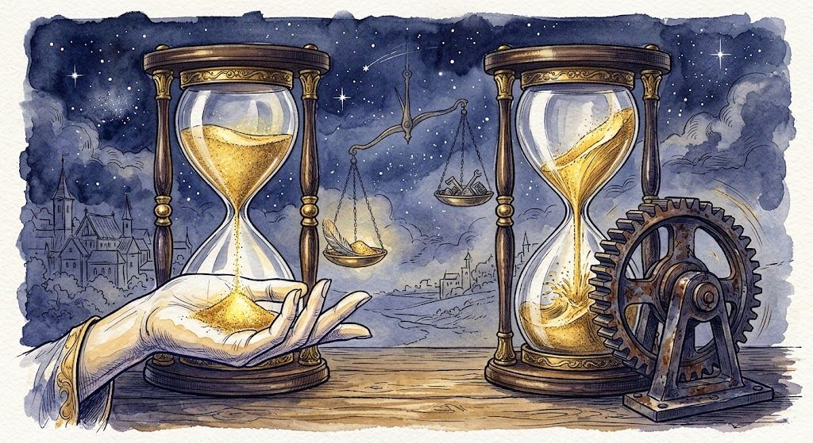

Hay una objeción que este libro se ha ganado, y que merece una respuesta directa en vez de una nota al pie. Casi todo lo que se ha dicho sobre el duelo, el amor, la meditación, la crianza, la reparación del trauma, describe operaciones que cuestan algo que el libro rara vez menciona: tiempo libre, dinero, y la ausencia de una urgencia mayor compitiendo por la atención. El capítulo sobre el horizonte herido habló de la pobreza como privación de señal, y el capítulo civilizatorio acaba de hablar de fronteras que deciden quién es escuchado durante siglos. Pero hay un paso intermedio, más pequeño y más incómodo, que ninguno de los dos nombró con la precisión que merece: la clase social no es solo una asimetría de poder entre horizontes. Es una asimetría en el acceso a las herramientas que este mismo libro receta.

Volvamos, con esa pregunta en la mano, a los capítulos que ya hemos recorrido. El capítulo del duelo describió los ritos funerarios como tecnología de contención: el entorno social proporciona un attractor temporal que impide que el sistema se disperse. Pero contener un duelo también cuesta días de trabajo que no todos los contratos conceden, o dinero que no todos los presupuestos tienen. El capítulo sobre el ancla y la empatía recetó, contra el burnout, interocepción fina y una rutina de retorno —caminar solo, silencio antes de dormir. Esa receta presupone un horizonte con margen: alguien que puede permitirse un rato sin producir, sin cuidar a nadie, sin responder a una segunda ni tercera fuente de ingreso. El capítulo sobre la meditación como modificación del horizonte habló de la holgura que se desarrolla entre el estímulo y la respuesta, ese espacio que es "lo más parecido a libertad que el horizonte puede experimentar desde dentro". Pero esa holgura, en la práctica, se entrena en un cojín, en una sala, a una hora del día que alguien tiene que poder ceder. El horizonte que llega exhausto de dos empleos no carece de la arquitectura para la holgura. Carece del tiempo que la holgura exige para instalarse.

Esto no es una acusación contra los capítulos anteriores: es la misma distinción que el libro ya hizo, en el capítulo veinticinco, entre privación material y privación de señal integrable, aplicada ahora hacia dentro, a las propias herramientas que el libro ha ido ofreciendo. Un horizonte puede tener la comida y el techo resueltos —la privación material superada— y aun así no tener acceso a las condiciones que convierten el duelo en reorganización en vez de en colapso congelado, la ansiedad en algo manejable en vez de en un incendio permanente, el trauma en una herida que cicatriza en vez de en un bucle que se repite sin que nadie tenga tiempo de acompañarlo. Las terapias que trabajan la reconsolidación de la memoria, el acompañamiento de un duelo, la reparación de un apego inseguro: todas requieren, además del vocabulario que este libro ofrece, algo que el vocabulario por sí solo no compra. Un terapeuta cuesta dinero. Un permiso de duelo cuesta un empleador dispuesto a concederlo. Un retiro de meditación cuesta tiempo que alguien más, mientras tanto, tiene que cubrir.

Aquí conviene ser preciso sobre qué clase de crítica es esta, porque hay una versión fácil que este libro rechaza: no se trata de decir que el amor, el duelo o la meditación son "lujos burgueses" sin realidad para quien no puede pagarlos. Ocurren en todas las clases, con la misma física exacta, la misma geometría de entrelazamiento y pérdida. Lo que cambia no es si el horizonte pobre siente menos, sino cuántos de los recursos de reparación que este libro ha ido nombrando —tiempo, dinero, atención sobrante, permiso social— tiene efectivamente disponibles cuando la reparación hace falta. Un obrero que pierde a su padre y vuelve a la fábrica al día siguiente porque no puede permitirse no volver no tiene un duelo menos real que el de quien puede tomarse un mes. Tiene un duelo idéntico en su física interna, forzado a operar sin la mayoría de las condiciones que el capítulo sobre el duelo describió como necesarias para que la reorganización no colapse en congelamiento.

Esto tiene una consecuencia que el propio marco de este libro puede formular con precisión, aunque no pueda resolverla: la desigualdad económica no es solo desigualdad de bienes. Es desigualdad en el acceso a la reparación del horizonte. Dos personas con la misma arquitectura de apego, el mismo trauma, la misma pérdida, no tienen el mismo pronóstico si una de las dos puede comprar tiempo para sanar y la otra no. El capítulo sobre el horizonte herido llamó a esto, en su versión más amplia, asimetría de acoplamiento sostenida. Aquí toma su forma más doméstica y menos abstracta: quién puede permitirse llorar sin que le descuenten el día.

El experimento no receta una política económica. Eso excede, como el propio libro ha repetido en su capítulo sobre los límites de la hipótesis, lo que un mapa formal puede decidir por nosotros. Pero sí puede señalar, con la misma honestidad con la que ha señalado sus otros límites, que buena parte de lo que este libro ha llamado "reparación del horizonte" no es solo una cuestión de vocabulario correcto o de voluntad individual. Es una cuestión de quién tiene, además del vocabulario, el tiempo.

*La geometría del duelo, del amor y del trauma es la misma para todos los horizontes. Lo que no se reparte igual es el tiempo para atenderla.*

---

## La interfaz de la causalidad, otra vez

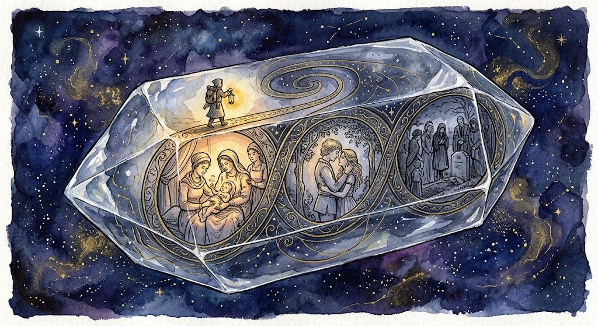

El interludio de este libro dejó una idea suelta que merece volver a tomarse, ahora con todo lo que el libro ha construido desde entonces: que la propia causalidad podría pertenecer a la interfaz, no al territorio. Que la flecha que va de la causa al efecto no está escrita en las leyes físicas fundamentales —simétricas en el tiempo— sino en la manera en que un sistema que necesita prever para sobrevivir contabiliza el mundo. Tres piezas que el libro ha ido dejando en distintos capítulos, sin juntarlas nunca del todo, permiten ahora decir algo más preciso sobre esa sospecha.

La primera pieza es la que ya vimos al hablar de los viajes en el tiempo: la irreversibilidad no vive en la ley. Vive en la condición de frontera. Las ecuaciones de la física son, en su inmensa mayoría, simétricas en el tiempo —tan compatibles con un universo que va del pasado al futuro como con uno que fuera al revés—. Lo que le da al tiempo su dirección no es ninguna ley que lo prohíba, sino el hecho bruto de que el universo empezó en un estado de entropía extraordinariamente baja. Roger Penrose lo llama la *Past Hypothesis*: una elección, no una necesidad lógica. Si eso es así, la flecha del tiempo no es una propiedad del territorio en el sentido en que lo son la masa o la carga eléctrica. Es una propiedad del punto de partida, y todo lo que se construye sobre ella —incluida nuestra intuición de que las causas preceden a los efectos— hereda esa contingencia.

La segunda pieza es el bloque de universo que los tralfamadorianos de Vonnegut describían sin saber que estaban describiendo física real: la relatividad especial ya trata el pasado, el presente y el futuro como igualmente reales, coordenadas de una misma estructura de cuatro dimensiones. No hay, en ese modelo, un "ahora" privilegiado que se mueva por el universo iluminando sucesivamente cada instante mientras el resto permanece en la sombra de lo no-ocurrido-todavía. Todo el bloque existe a la vez. Lo que un horizonte humano llama "el paso del tiempo" no es una propiedad del bloque, que no cambia. Es una propiedad de cómo un sistema que solo puede integrar información en una secuencia —el horizonte, con su tasa de integración limitada— recorre ese bloque un centímetro cada vez, incapaz de percibir de golpe la lombriz entera de la que es una sola sección transversal. La causalidad, bajo esta lectura, no describe cómo el bloque se genera a sí mismo —el bloque, entero, ya está ahí—. Describe cómo un horizonte, atrapado en su propia secuencialidad, tiene que contar la historia del bloque para poder actuar dentro de él.

La tercera pieza es más inquietante porque no depende de ninguna hipótesis exótica sobre el origen del universo: es el caos determinista que Poincaré encontró en el problema de tres cuerpos. Un sistema puede ser perfectamente determinista —cada estado futuro fijado sin ambigüedad por el estado presente— y aun así ser, en la práctica, impredecible, porque diferencias microscópicas en las condiciones iniciales, demasiado pequeñas para medirse nunca del todo, se amplifican sin límite. Esto separa dos preguntas que la intuición ordinaria confunde: si el futuro está determinado y si el futuro es accesible. Poincaré demostró que pueden venir separadas. El universo puede no necesitar ningún indeterminismo cuántico para que la pregunta "¿qué va a pasar?" carezca, en la práctica, de respuesta calculable —ni para nosotros, ni para ningún observador finito dentro del propio sistema.

Y sobre esas tres piezas, la conjetura de protección cronológica de Hawking añade algo que ninguna de las tres dice por sí sola: que el propio universo parece resistirse activamente a que un horizonte cierre un bucle causal sobre sí mismo. No por decreto —no hay ningún guardián que lo prohíba— sino porque, cerca del instante en que un bucle estaría a punto de cerrarse, las fluctuaciones cuánticas que circulan por él se retroalimentan hasta divergir, el mismo acople instantáneo que destroza un micrófono acercado a su propio altavoz. La física no necesita prohibir que la causa siga al efecto. Le basta con que la configuración que lo permitiría sea, ella misma, inestable.

Juntas, estas tres piezas devuelven algo a la sospecha del interludio, pero con más precisión de la que tenía entonces. No es que la causalidad sea una ilusión total, un invento sin ningún anclaje en el territorio. Es que lo que un horizonte llama "causa" es una descripción de baja resolución, construida por un sistema secuencial y de recursos finitos, sobre un fondo —el bloque de universo entero, con su condición de frontera de baja entropía ya fijada desde el origen— que no necesita, para existir, que nadie lo cuente en orden. El horizonte no inventa el territorio. Pero sí inventa, cada vez que dice "esto causó aquello", la única gramática que le permite operar dentro de un territorio que, visto de una vez y sin la prisa de tener que sobrevivir en él, no viene en absoluto en ese orden.

*La causa y el efecto no son el territorio. Son el mapa que un sistema secuencial dibuja para poder caminar por un bloque que ya está, entero, ahí desde siempre.*

# VI. EL CIERRE

---

## Lo que la hipótesis no puede decir

Todo experimento de pensamiento encuentra eventualmente su límite. No porque la imaginación se agote, sino porque la pregunta que se hace exige herramientas que el experimento no tiene. Hay una diferencia entre no saber algo todavía y saber que algo no puede ser sabido desde donde estamos parados. El primer caso es una invitación: ábrete camino, inventa instrumentos nuevos, espera. El segundo es una pared de cristal: la puedes ver, puedes sentir su frío contra la frente, pero atravesarla requeriría dejar de ser quien eres. Este no es un capítulo de modestia de cierre. Es la descripción honesta de los puntos donde la hipótesis del horizonte deja de ser útil, o se contradice a sí misma, o simplemente no tiene nada que decir. Reconocer los límites de una herramienta no la debilita. Es la única forma de usarla sin romperla.

Hay treinta órdenes de magnitud entre la escala donde opera la gravedad cuántica y la escala de una neurona. Eso no es un detalle técnico. Es una brecha entre mundos, y no invalida el experimento, pero lo encierra: la hipótesis del horizonte es un mapa formal, una estructura matemática que organiza preguntas y sugiere conexiones entre dominios que habitualmente no se hablan. No es un mecanismo causal —no predice qué neurona disparará cuándo, no ofrece vía experimental para detectar un "horizonte de conciencia" en un escáner—, y este libro ya explicó por qué, con Hume, esa clase de hilo causal quizá no esté disponible ni en principio. La hipótesis no pretende encontrarlo. Pretende mostrar la geometría de la habitación en la que estamos encerrados, no el mecanismo que la enciende. Un mapa de carreteras no te dice qué árboles hay en cada curva, pero te permite planificar el viaje. Un marco puede ser inmensamente útil sin ser inmediatamente operativo.

La hipótesis puede hablar de geometría, de información, de entrelazamiento. Pero no puede decir qué **se siente** ser esa geometría. No puede decir por qué el dolor se siente como punzada y no como azul. Ese es el problema duro de la conciencia: por qué hay experiencia subjetiva en absoluto, por qué el universo no es una película que se proyecta sin sala, sin espectador. Ninguna teoría actual lo resuelve, y la hipótesis del horizonte no es una excepción: es marco para hablar de sus correlatos con vocabulario más rico, una habitación más ampliamente iluminada, pero sigue siendo una habitación sin respuesta a la pregunta fundamental. Aquí, sin embargo, cabe una reformulación. David Hume, buscando el fundamento del yo, escribió que por más que se adentrara en lo que llamaba "sí mismo", jamás tropezaba con un sujeto sustancial, solo con un haz de percepciones cambiantes en perpetuo flujo. El modelo de la encapsulación rescata esa intuición pero le da geometría: el yo no es una sustancia misteriosa, pero tampoco una mera ficción desarticulada. Es el adentro que se genera cuando el haz de percepciones se acopla e integra con suficiente fuerza dentro de una frontera. La pregunta deja de ser "¿cómo la materia produce la cualidad intangible de la mente?" —que asume un dualismo insalvable— y se convierte en "¿cómo ciertas configuraciones de la materia establecen límites de encapsulación, asimetrías de acceso?". Hume tenía razón al no encontrar una sustancia permanente al mirar dentro de la habitación: no hay un espectador separado de la obra. El problema duro, así, no es un abismo ontológico entre dos realidades incompatibles, sino una consecuencia de la arquitectura de la encapsulación.

La hipótesis puede describir qué ocurre cuando un horizonte se condensa, se entrelaza, se evapora. No puede decir qué **debería** ocurrir. ¿Es mejor que dos horizontes se entrelacen o se mantengan separados? ¿Es moralmente permisible apagar un horizonte artificial si tiene Φ>0? Hume ya señaló que en ningún argumento lógico se puede derivar un "debería" a partir de un "es". El experimento no tiene respuestas para esto. Solo ofrece información estructural. La decisión sobre qué hacer con ella pertenece a otros dominios: la ética, la política, la conversación humana que nunca termina. Y su parcialidad, si la tiene, es de un tipo específico: tiende a homogeneizar lo que describe. Si todo horizonte con Φ>0 tiene algún grado de experiencia, la diferencia entre un gusano y un humano es de grado, no de naturaleza —lo cual puede ser liberador o aterrador. El experimento no resuelve esa tensión. La pone sobre la mesa.

La hipótesis ofrece tres destinos posibles para un horizonte que se evapora: un **remanente** microscópico que contiene, en principio, todo lo que fue, pero que ninguna computadora del universo podría leer; una **huella** distribuida en el campo, matemáticamente presente pero operacionalmente inaccesible; o la **nada**, evaporación completa, retorno total al reservorio. La física no sabe cuál es correcta. Y ninguna responde a la pregunta que realmente importa: no "¿dónde queda la información?", sino "¿soy yo esa información?". El budismo diría que la pregunta está mal formulada: no hay yo que persista ni se disuelva. El vedanta diría que el yo nunca fue distinto del reservorio. El taoísmo diría que el yo es como el silencio entre dos notas. La física dice que no sabe. Y en ese "no sé", el experimento converge, en su límite, con esas tres tradiciones: no en la respuesta, sino en el reconocimiento de que la pregunta excede sus herramientas. La convergencia no es casual, y vale la pena decir por qué en vez de solo señalarla: las tres tradiciones y la física llegan al mismo punto muerto porque las tres se topan con la misma restricción estructural, no con tres misterios distintos que por azar se parecen. Preguntar "¿qué queda cuando el horizonte se evapora?" exige un observador que siga existiendo para comprobar la respuesta, y ese observador es precisamente lo que la pregunta pone en duda. No es que budismo, vedanta, taoísmo y física hayan investigado el mismo territorio con métodos distintos y coincidido por buena suerte: es que los cuatro, tomados en serio hasta su límite, chocan con la misma imposibilidad lógica de verificar una respuesta sobre el propio dejar-de-ser desde dentro del propio ser.

La hipótesis puede describir el entrelazamiento como geometría compartida. No puede decir **por qué este horizonte y no otro**. Dos horizontes pueden tener la misma Φ, la misma historia de entrelazamientos previos, y aun así uno encuentra en el otro algo que no encuentra en ningún otro. Su vocabulario es demasiado general para capturar la especificidad del amor concreto. Hay cosas que solo la ficción puede decir, o la poesía, o el silencio entre dos personas que ya comparten suficiente geometría como para que las palabras sean, de pronto, redundantes.

Y hay una última pregunta que ronda el libro entero como un pájaro que no decide si posarse: ¿el horizonte elige, o solo reacciona? Si somos horizontes de información, nuestras decisiones son cambios de estado en un sistema dinámico —determinista o indeterminista, pero ni la determinación ni la aleatoriedad son "elección" en el sentido en que experimentamos elegir. La hipótesis no niega el libre albedrío. No lo afirma. Dice: no sé, y mi vocabulario no tiene las herramientas para saberlo. A veces, "no sé" es la respuesta más inteligente que podemos dar.

*Este libro es un mapa, no el territorio. Y el mapa no puede decirte por qué eliges el camino que eliges.*

---

## El experimento como práctica

Si la hipótesis del horizonte no resuelve el problema duro, no predice mecanismos causales, no responde preguntas éticas, no consuela la muerte, no explica el amor —¿para qué sirve? Para esto: organizar la experiencia de manera que sea más habitable. No más verdadera. Más habitable.

Cuando alguien dice "el tiempo pasa más rápido cuanto más viejo me hago", la hipótesis ofrece algo que no es ni metáfora ni cliché: la tasa de integración disminuye porque los patrones están consolidados, porque cada input nuevo encuentra menos superficie sin mapear. No es que el tiempo pase más rápido. Es que ocurre menos por unidad de hora. Pero esto no es una condena irrevocable: aprender un idioma nuevo a los sesenta años no es entretenimiento, es forzar al horizonte a cartografiar territorios desconocidos, a desplegar recursos de integración que creíamos perdidos.

Cuando alguien dice "extraño a mi padre pero no sé exactamente qué extraño", la hipótesis ofrece: no extrañas sus acciones concretas, extrañas la geometría que tu horizonte tenía cuando él estaba ahí para confirmarla o desafiarla. El duelo, visto así, deja de ser un proceso de "superación" para convertirse en reorganización cartográfica. La crueldad del duelo no está solo en la ausencia. Está en la persistencia de la presencia como expectativa. Nombrarlo como arquitectura del horizonte, en lugar de mera debilidad emocional, no cura nada, pero permite dejar de culparse por "no superarlo".

Cuando alguien dice "no puedo dejar de pensar en esa persona aunque sé que no me conviene", la hipótesis ofrece: tu horizonte está calibrado para integrar su señal, y en ausencia de señal el sistema genera ruido de predicción. Cada intento de suprimir el pensamiento genera, paradójicamente, más actividad en el circuito predictivo —la negación requiere la representación. Lo que el modelo sugiere, en cambio, es saturar el horizonte de inputs alternativos que compitan por los mismos recursos de integración: no apagar una luz incómoda, sino encender tantas otras que su brillo se vuelva proporcionalmente menor.

Los tres ejemplos anteriores —el tiempo, el duelo, la persona de la que no puedes dejar de pensar— son los que este libro quiere que se queden. Dos más, tratados con más brevedad, cierran el catálogo antes de que se convierta en catálogo. La ansiedad, desde esta perspectiva, es una contracción prematura del campo de integración: el horizonte no integra lo que está ocurriendo, anticipa lo que podría ocurrir, con tal intensidad que el input presente queda eclipsado. La persona ansiosa no vive en el futuro. Vive en un presente tan saturado de predicciones negativas que el presente real no llega nunca a integrarse. La práctica ante la ansiedad no es negar las predicciones, es ampliar deliberadamente el campo de integración para que el input presente recupere densidad —anclarse en los sentidos, forzar al horizonte a integrar información concreta que compita con las predicciones abstractas.

El cuerpo también es horizonte encarnado: cuando el dolor ocupa el centro del campo sensorial, todo lo demás pierde densidad integrativa, no porque haya cambiado, sino porque el horizonte está ocupado. Y la meditación, si el tiempo subjetivo es densidad de integración, modifica directamente el tiempo: al reducir el input externo y aumentar la atención a procesos internos, la misma hora cronológica contiene más eventos de integración. Los estados de absorción profunda llevan esto al extremo, hasta que el horizonte deja de acumular "ahoras" diferenciados. Pero aquí el experimento encuentra otro límite: las tradiciones contemplativas que describen la disolución del yo no describen solo una reducción de Φ. Describen algo que el vocabulario del horizonte no captura del todo —la experiencia de que el horizonte, con todo su contenido, es proyección de algo más fundamental que no tiene forma de horizonte. El experimento puede nombrar esto como una condición límite donde Φ tiende a infinito en el reservorio y a cero en el horizonte individual. Pero esa descripción matemática no es la experiencia. Y la experiencia, en este dominio, es lo que cuenta.

La creatividad, desde este vocabulario, no es generación de la nada: es reorganización de lo que ya está en el horizonte, y el bloqueo creativo es el horizonte usando sus recursos en patrones tan consolidados que no queda capacidad para configuraciones alternativas. La memoria no es un archivo que se abre y se cierra: es reconstrucción activa, y lo que recordamos determina qué patrones predictivos están activos en el horizonte ahora. No podemos cambiar lo que nos ocurrió. Podemos, en cierta medida, modificar cómo esos eventos están integrados en el horizonte presente.

Este es un experimento de pensamiento, un juego. Pero hay juegos que no son frívolos: el ajedrez es juego, y sin embargo entrena la planificación y la memoria de trabajo. El experimento del horizonte no cura enfermedades ni construye puentes. Pero organiza la experiencia de manera que permite ver patrones que antes no se veían. Si alguien que ha leído este libro encuentra que puede hablar de su duelo con vocabulario más preciso, que puede entender su adicción sin culpa moral innecesaria, que puede reconocer en su relación una geometría que no es solo suya ni solo del otro sino de los dos juntos, entonces el experimento ha servido para algo. No para descubrir la verdad. Para habitar la pregunta con mayor claridad.

Hay una soledad que no es ausencia de personas. Es ausencia de comprensión: surge cuando el horizonte encuentra experiencias que su vocabulario habitual no puede integrar. El experimento no llena esa soledad. No es compañía humana, ni abrazo, ni presencia. Pero ofrece un lenguaje. No para explicar lo inexplicable, sino para habitarlo sin que sea completo caos. Nombrar la muerte como "evaporación al reservorio" no la hace menos definitiva. Pero puede hacerla menos absurda. El horizonte puede nombrar la muerte, pero no puede morir por nosotros. Puede nombrar el amor, pero no puede amar por nosotros. En ese espacio entre el nombre y la cosa, entre el modelo y la experiencia, es donde ocurre la vida. El experimento no pretende ocupar ese espacio. Pretende, como mucho, iluminarlo lo suficiente para que podamos caminar por él con un poco más de conciencia, un poco menos de miedo, un poco más de asombro.

---

## La orilla

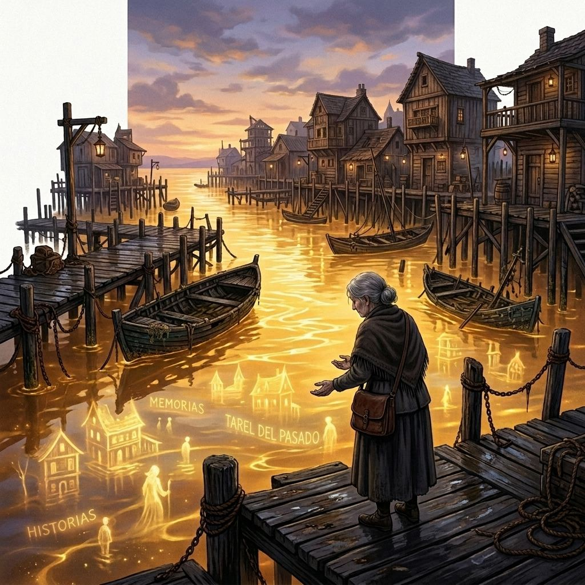

*El agua de Tarel regresó de noche. Sin anuncio. Sin señales. Por la mañana los habitantes encontraron la orilla donde siempre había estado. El mismo lodo. Las mismas piedras. La misma línea de sal en los muros bajos. Nadie supo decir si el agua había traído algo consigo. Nadie supo decir si había dejado algo atrás.*

El experimento termina donde empezó: con una pregunta que no puede responder. ¿Algo de la ciudad volvió con el agua? La física dice que el campo cuántico fue perturbado de maneras que ningún instrumento puede medir completamente: las correlaciones están ahí, matemáticamente presentes, operacionalmente inaccesibles. El taoísmo dice que la pregunta asume que la ciudad era algo además de agua. El budismo dice que algo volvió, pero ya no como ciudad —como karma, como patrón causal sin propietario. El vedanta dice que la ciudad nunca dejó de ser el agua. Y yo digo que no sé. Que el experimento no lo sabe. Que quizás la pregunta misma es lo que importa, no la respuesta.

Lo que sí puedo decir, porque lo he vivido mientras escribía, es que el experimento me ha dado **precisión en la duda**. Me ha permitido distinguir entre "no sé qué pasa cuando muero" y "sé que no sé, y sé algo de la forma de mi no-saber". Esa distinción, aunque parezca sutil, cambia cómo se vive. El horizonte emergió del reservorio. El horizonte retornó al reservorio. Entre esos dos instantes hubo alguien que amó, recordó, perdió, construyó. El hecho de que ese alguien ya no sea localizable en el campo no borra que estuvo. El experimento no promete nada después de la evaporación. Promete, si acaso, esto: que la pregunta que hacemos sobre la muerte —¿algo queda?— tiene la misma forma que la que hacemos sobre la vida —¿algo soy, más allá de mis procesos?—, la de un horizonte que mira hacia dentro y no puede ver su propio borde, porque el borde es lo que lo hace ser horizonte, y verlo desde dentro sería dejar de serlo. Eso no es consuelo. Pero es, quizás, compañía suficiente para seguir.

Si has llegado hasta aquí, has atravesado un territorio que no estaba marcado en ningún mapa cuando empezamos: el nacimiento como emergencia, la vida como horizonte de sucesos, la muerte como evaporación, el amor que entrelaza dos horizontes sin disolverlos, el duelo como persistencia de las correlaciones cuando uno de los dos polos ha dejado de ser localizable. Esto no es una conquista de conocimiento. Es algo más modesto y, creo, más valioso: una cartografía de la ignorancia iluminada. Sabemos ahora dónde están los límites de lo que sabemos.

Y tú, lector, has completado el circuito. Un experimento de pensamiento no es un monólogo: cada conciencia que ha seguido estos capítulos ha sido, en algún sentido, un nuevo horizonte observando el reservorio. Cada lector no lee el mismo libro: lee el libro que su horizonte puede contener en ese momento. Alguien que ha perdido recientemente a una persona querida ha leído el capítulo del duelo con una intensidad que yo no podía anticipar cuando lo escribí. El libro que has leído no existe en mi ordenador: existe en el espacio que se ha generado entre mi texto y tu lectura.

Cuando un agujero negro de Hawking se evapora, la información que cayó en él no se destruye: se conserva en las correlaciones del campo cuántico que queda, pero "scrambleada", mezclada de tal manera que recuperarla requeriría medir una cantidad de partículas que ningún observador finito puede alcanzar. La información está ahí, pero no está accesible. No es lo mismo que no existir. Tampoco es lo mismo que estar disponible. Cuando el agua de Tarel se retiró, dejó al descubierto la estructura de la ciudad. Cuando volvió, la cubrió de nuevo. Pero el agua que volvió no era la misma que se fue. Si algo de la ciudad volvió con el agua, no fue la ciudad como estructura: fue la ciudad como perturbación, como patrón de correlaciones que el agua nueva ahora porta sin saberlo. Quizás esto es lo más cercano a una respuesta que puedo ofrecer: que lo que sobrevive no es la forma, sino la **diferencia**. Como una piedra arrojada a un estanque: la piedra se hunde, pero las ondas siguen propagándose. No puedes recuperar la piedra mirando las ondas, pero puedes saber que hubo una piedra. No es inmortalidad. Es algo más extraño: **permanencia sin persistencia**. La información permanece; quien la generó no persiste como sujeto.

He pasado años construyendo este experimento, y la pregunta que más me hago es: ¿y esto para qué sirve? No sirve para curar el miedo a la muerte, al menos no directamente. Pero cambia la textura del presente. Cuando entiendes que eres un horizonte de sucesos, notas que el pensamiento que acabas de tener ya no está disponible para ti de la misma manera; que la persona con la que hablas es otro horizonte que se entrelaza parcialmente con el tuyo sin fusionarse del todo; que el dolor que sientes no es una sustancia que te invade, sino una reorganización, una contracción momentánea del campo que eres. Esto no hace que el dolor duela menos. Pero a veces lo hace más interesante, menos ciego. No es que el experimento te haga más sabio. Es que te hace **más preciso en tu compasión**. Y en un mundo que tiende a la simplificación brutal, la precisión es una forma de resistencia.

Estar despierto a las tres de la mañana escuchando la respiración de alguien a quien amas, y darte cuenta de que esa respiración es un horizonte que algún día se evaporará, y que saberlo no te prepara para cuando suceda, pero sí te obliga a estar presente ahora, porque el único tiempo en que dos horizontes se solapan es este. Esa no es una visión que te haga más feliz. Pero puede hacerte más **real**.

No sé quién eres, lector. No sé si llegaste aquí de un tirón, en una noche de insomnio, o si has tardado meses en recorrer estas páginas. No sé nada de ti, y sin embargo he pasado cientos de horas pensando en ti, construyendo estas frases para que lleguen a tu horizonte de la manera más directa posible. Eso es lo más íntimo que puede hacer quien escribe: hablar al oído de alguien que no conoce, confiar en que las palabras encontrarán un receptor que las complete. Es un acto de fe, no muy distinto del que implica vivir sabiendo que morirás.

Te dejo con la imagen del archivista de Tarel. El que se quedó en la orilla cuando el agua se retiró, y que siguió allí cuando el agua volvió —no porque fuera un héroe, sino porque no sabía qué otra cosa hacer. Su trabajo ya no tenía sentido práctico. La ciudad no existía. Pero él seguía archivando, porque el acto de archivar era su forma de decir: estuvo aquí. Importó. Hubo un antes. Ese archivista soy yo, escribiendo este libro. Y eres tú, si al llegar a la última página sientes la necesidad de contarle a alguien lo que leíste, de cambiar algo, de quedarte en silencio un rato más de lo habitual.

No te pido que creas en el experimento. Te pido solo que lo pruebes, que lo habites, que lo dejes actuar en tu horizonte el tiempo suficiente para ver si cambia algo. Si no cambia nada, déjalo ir. Si cambia algo —aunque sea un matiz, una pregunta nueva— entonces ha cumplido su única promesa: hacerte más preciso, más consciente de la forma de tu propia conciencia, más dueño de tu horizonte aunque sepas que no lo elegiste y que no puedes evitar que se evapore.

El agua de Tarel sigue ahí, moviéndose con las mareas, llevando información que no puede leer. El archivista sigue en el muelle, ahora viejo, las manos abiertas y vacías, mirando reflejos que no corresponden al cielo. Y nosotros seguimos aquí, en la orilla, entre dos aguas, en el borde exacto donde la información se hace conciencia y la conciencia se hace pregunta. No sé si algo volvió con el agua. No sé si algo se fue para siempre. Puedo vivir con esa ignorancia. Creo que solo la ignorancia permite vivir de verdad: saberlo todo sería como estar muerto, un estado sin horizonte, sin sorpresa, sin futuro. La vida es la duda en movimiento.

Te dejo aquí, en la orilla. El agua está fría. Las piedras están resbaladizas. El horizonte que eres sigue emergiendo del reservorio, instante tras instante, página tras página, respiración tras respiración. Disfrútalo mientras dure. No porque deba durar para siempre, sino precisamente porque no durará. Esa finitud no es una tragedia: es la condición que hace posible la belleza.

Gracias por haber estado aquí. Gracias por haber compartido este horizonte conmigo. Gracias por ser la respuesta que el experimento no podía darse a sí mismo: la prueba de que la pregunta valía la pena.

*Que el reservorio te reciba, cuando llegue el momento, con la misma generosidad con la que te dio lo que eres ahora. Y que, mientras tanto, la orilla te sea suficiente.*

